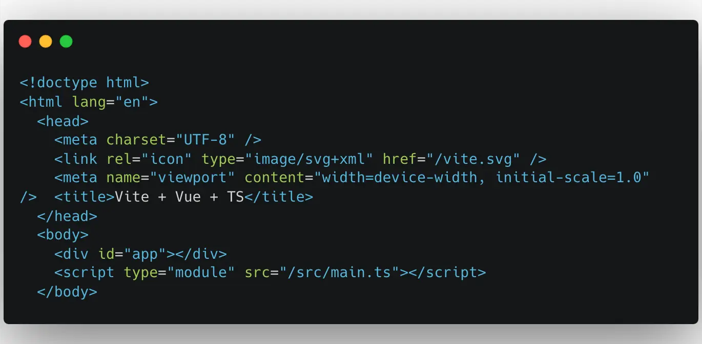
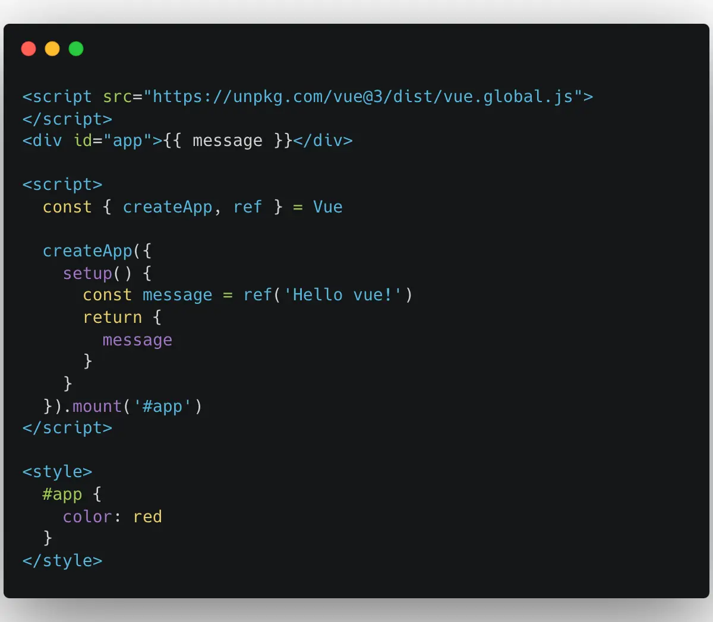

# 前言

发现不少同学还分不清楚什么是编译时？什么是运行时？这篇文章我们来让你彻底搞清楚编译时和运行时的区别。

# 编译时

我将 `编译` 这个词语理解为 `翻译`，这句话是什么意思呢？

比如你要和一个老外沟通，你的英文超级烂。所以你说的是中文，老外却只理解英文。那你们两个人怎么沟通呢？所以你需要一个翻译器来将你说的中文转换为英文，这样老外就能理解你说的话了，**这个翻译过程就是我们常说的编译时**。

{data-zoomable}

看完上一个例子如果你还没理解的话，我们再来看一个 Vue 的例子。我们平时写 Vue 代码时一般都是写在文件后缀名为 `.vue` 文件中，也就是官方说的单文件组件 (SFC)。

但是浏览器认识后缀为 `.vue` 的单文件组件 (SFC) 吗？

很明显浏览器是不认识的，所以这个时候需要将后缀为 `.vue` 的单文件组件 (SFC) 编译（翻译）为浏览器认识的 js 文件，**这一过程就是我们常说的编译时**。

在前端中，一般来说 `编译时` 就是代码跑在 `node.js` 的阶段。

大家都知道前端主要分为两个环境：生产环境和开发环境。
对于生产环境来说，`编译时` 就是在执行类似 `yarn build` 之类的命令，将源代码打包成浏览器可直接执行的代码这一过程。打包生成的代码文件是存在磁盘中，这一过程是在 Node.js 中完成的。
对于开发环境来说，`编译时` 就是在执行类型 `yarn dev` 这种启动命令，同样将源代码编译成浏览器可直接执行的代码这一过程。和生产环境不同的是生成的代码文件是存在内存中，并不会写到磁盘中，同样这一过程是在 Node.js 中完成的。

# 运行时

还是以 Vue 举例，大家都知道浏览器的渲染过程是将一个 HTML 文件渲染到页面上的。在 SPA 单页面中浏览器接收到的 `index.html` 一般是下面这样的，如下图：

{data-zoomable}

从上图中可以看到接收到的 HTML 文件中只有一个 `

`，那么浏览器又是怎么从这个空 `div` 渲染成丰富多彩的页面呢？

熟悉 Vue 源码的同学应该比较清楚，首先是生成一个 `app` 对象，然后调用 `app` 对象的 `mount` 方法将经过编译时处理后拿到的 Vue 组件对象挂载到 `

` 上面。**这一过程就是所谓的运行时。**

对于前端来说，运行时就是代码执行在浏览器的阶段。
# 在浏览器中编译

看到这里有的小伙伴会有疑惑了，Vue 好像还提供了一种全局构建的版本。在这个版本中我们可以直接在 HTML 文件中使用 Vue，无需使用 Webpack 或者 Vite 这种打包工具打包。比如下面这样：

{data-zoomable}

从上图中可以看到，这种用法中除了将 `*.vue` 文件名替换为 `*.html` 文件名之外，其他的写法基本是一模一样的。在这种用法中由于没有使用到构建工具 Webpack 或者 Vite，当然就没有在 Node.js 中执行的编译时。那么在这种用法中，浏览器又是如何识别 HTML 文件上面的指令以及编译生成 `render` 函数的呢？

答案是在这种全局构建版本的 Vue 中会内置一个编译器。在浏览器中运行时如果发现了 HTML 文件对应的 `template` 模块的内容，就会使用内置的编译器将这些模块编译成浏览器可执行的代码，也就是 `render` 函数。

所以我们前面才会讲：一般来说 `编译时` 就是代码跑在 Node.js 的阶段。不一般的情况就是现在这种情况，Vue 直接内置了一个编译器，在浏览器中进行编译。但是话说回来，这种在浏览器中编译的模式，性能肯定不如使用构建工具 Webpack 或者 Vite 提前将资源进行打包。
# 总结

一般情况下 `编译时` 就是代码跑在 Node.js 的阶段，比如执行 `yarn dev` 或者 `yarn build` 时代码在 Node.js 中执行的阶段。后面我们又讲了运行时实际就是代码在浏览器中执行的阶段。

最后我们又讲了还有一种特殊的情况，像全局构建版本的 Vue 中会内置一个编译器。让我们可以脱离 Webpack 或者 Vite 使用 Vue，这种情况就是在浏览器中进行编译的模式，当然这种模式的性能肯定不如使用构建工具 Webpack 或者 Vite 提前将资源进行打包。

[加入本书对应的「源码交流群」](/guide/contact)
