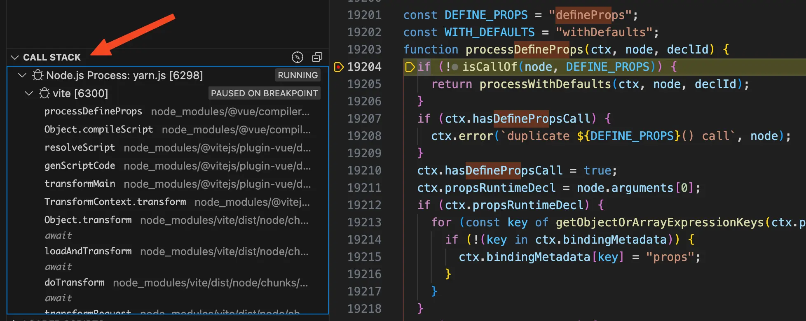
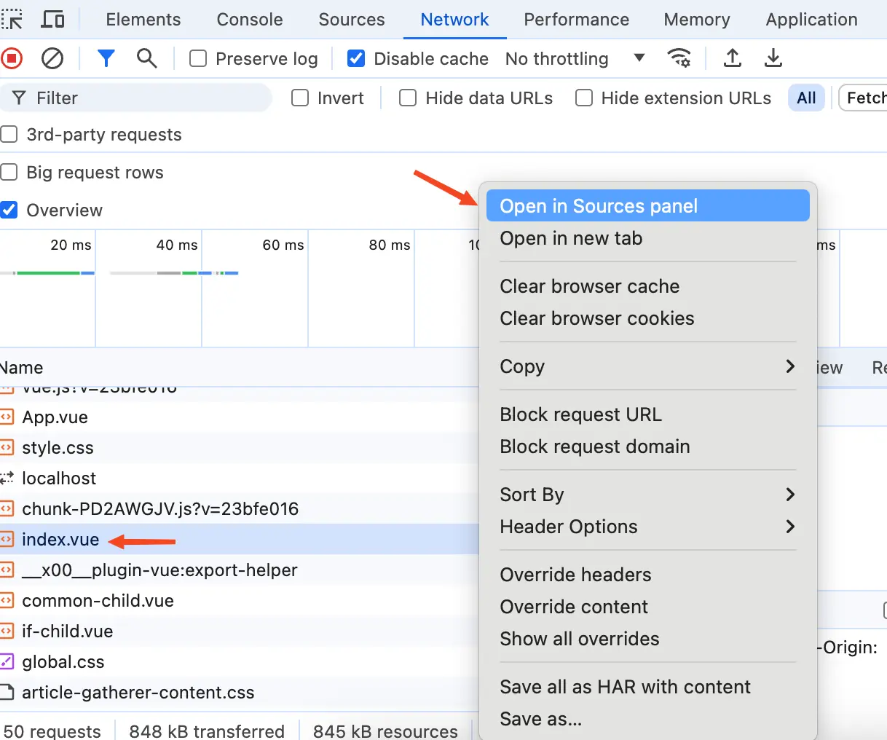

# 前言

相信不少同学都有欧阳这种情况，年初的时候给自己制定了一份关于学习**英语**和**源码**的详细年度计划。但是到了实际执行的时候因为各种情况制定的计划基本都没有完成，年底回顾时发现年初制定的计划基本都没完成。痛定思痛，第二年年初决定再次制定一份学习**英语**和**源码**的详细年度计划，毫无疑问又失败了。

经过多年的摸索，对于如何查看源码欧阳终于有了一些自己的心得。

# 一看源码就头晕

网上有一种说法是从头开始看，假如源码是一个线团，那么找到线团的头子，顺着头子向下捋就能将源码了解的七七八八了。

这种方法对于查看小项目的源码是没有问题，因为小项目的分支逻辑不多，复杂度也不高，顺着线团的头子向下捋确实能够搞清楚整个项目。

但是对于 Vue 这种大型项目就不适用了，大型项目里面的分支逻辑特别多，而且每个分支的复杂度也很高。大型项目的源码就像是一棵树，那么我们找的线团的头子只是这棵树的根节点。

看源码的时候你从树的根节点向下走，下面有多个子节点。选了一个子节点接着向下走，结果发现这个子节点下面又有多个子节点。再次选了一个子节点向下走，结果发现还是有很多子节点，重复几次后你可能就把自己给搞的头晕了。

出现这个问题的原因是你查看源码的时候没有一个明确的目标，因为大型项目的源码分支流程是超级多的。没有明确的目标一头扎进源码中就会迷失在源码的海洋中，这个明确的目标就是我们查看 Vue 源码要搞清楚的问题。

# 如何接手一个复杂的新项目

想想你平时接手一个不熟悉并且很复杂的新项目你会怎么办？

我的做法是先查看项目的 `README.md`，了解项目是如何运行起来的。

然后再查看项目的目录，对整个项目的结构有一点了解。

接着就是找到了解项目的测试或者产品，让他给我讲讲项目的大体流程和重要概念，这个时候可能听不懂或者听了就忘了，没关系，有个印象就可以了。

最后就是接到项目的迭代需求，从需求对应的代码出发开始了解项目。等需求做得足够多时，基本就将整个项目的代码过了一遍，此时我们已经完全接手这个项目了。

# 像接手新项目一样搞清楚源码

我们这里以 Vue 举例，Vue 其实也是一个普通的 JavaScript 项目。本质上和我们的工作中接手的新项目没什么区别，对于查看 Vue 源码我们也可以复用上面这个套路。
## 第一步：查看 `contributing.md` 文件

查看源码的 `contributing.md` 文件，这个文件就像是我们项目中的 `README.md` 。开源项目希望更多的人参与进来所以一般都会有个 `contributing.md` 文件。这个文件里面会教你源码项目是如何跑起来，项目结构是什么样的，怎么参与进来开发。

## 第二步：查看源码结构

第二步和接手新项目是一样的，查看 Vue 源码的目录，让你对整个 Vue 源码的结构有一些了解。

## 第三步：对源码大体流程和重要概念有初步印象

到了第三步就有问题了，不可能叫尤大充当测试或者产品的角色过来给我讲 Vue 的大体流程和重要概念吧？此时我们可以换个思路，网上有很多讲解 Vue 源码的文章或者书籍。可以让这些源码文章或者书籍充当测试和产品的角色。通过阅读这些 Vue 源码文章或者书籍，你就能对 Vue 的大体流程和重要概念有了初步的印象。

网上的文章都参差不齐，如何挑选出优质文章呢？

以掘金为例，你就在掘金上面去搜索 Vue 源码。然后找出时间最近的，点赞和收藏最多的文章，这样找出来的文章基本都是优质且未过时文章（墙裂推荐欧阳的 Vue 源码文章）。

当然如果你在之前没有接触过 Vue 源码，第一次看 Vue 源码文章或者书籍可能看不懂或者比较吃力。没关系，我们这一步只是让你对 Vue 源码有个初步的印象就可以了。

## 第四步：带着问题去 debug 源码

直到这一步之前我们所做的事情都是让自己对源码有个大致的印象，最终想要看得懂源码还是得要自己上手去 debug。

做项目时我们是通过不断的做业务需求，从而了解整个项目。在 Vue 源码这里就是从一个你想要了解的具体问题出发，通过 debug 调试 Vue 源码将这个问题搞清楚。这个问题就是我们在查看源码时的目标，和这个问题不相关的源码全部都忽略。

这种情况你带着问题去 debug 查看源码，此时的源码对于你来说就不是一棵树了，而是围绕着这个问题的一条线。我们的目标也很单纯，只是将这条线上面的源码搞清楚就行了。当你把这个问题搞清楚了后，在你的脑子里面关于 Vue 源码就有一条线了。

还有一个进阶玩法，将“**通过 debug 源码把某个问题搞清楚的过程**”用自己的话说出来，这就形成了一篇优秀的源码文章，**欧阳的所有源码文章都是这样写出来的**。

每个问题在我们脑子里都是一条关于 Vue 源码的一条线，当我们搞清楚足够多问题时，这些线连到一起就形成了一棵 Vue 源码树。

看到这里有的小伙伴就有疑问了，那么问题又从哪里来啊？

我们每天写代码就在用 Vue，Vue 提供了很多黑魔法，难道你对这些黑魔法不感兴趣吗？

举个例子，在 Vue 的文档中有写 `defineProps` 是一个宏函数。所以我们使用他的时候不需要从 Vue 中 `import` 导入，那么你有没有好奇过为什么他不需要从 Vue 中 `import` 导入呢？

为了搞清楚这个问题，我们需要先找到线团的线头子。而这个线头子毫无疑问就是 `@vitejs/plugin-vue` 插件，Vue 文件就是由这个插件处理的。给这个线头子打上断点，顺着断点向下走，只关心和 `defineProps` 相关的代码。最终我们就找到在一个 `compileScript` 函数中，会将源代码中的 `defineProps` 宏函数给 remove 掉，并且同时会生成一个 `props` 属性，由于 `defineProps` 宏函数经过编译后已经被 remove 掉了，所以就不需要从 Vue 中 `import` 导入。

我们知道 Vue 是一个编译时和运行时同时存在的框架，编译时说白了就是代码运行在 Node.js 阶段，运行时代码跑在在浏览器中。所以在 debug 源码的时候有时是在编译时进行，有时是在运行时进行。

在接下来的文章中我们会给你讲一些编译时和运行时 debug 源码的小技巧，如果你有更好用的技巧欢迎在评论区留言。

# 编译时 debug 源码小技巧

想要在编译时 debug 源码，首先我们需要启动一个 debug 终端。这里以 VSCode 举例，打开终端然后点击终端中的 `+` 号旁边的下拉箭头，在下拉中点击`Javascript Debug Terminal` 就可以启动一个 `debug` 终端。

{data-zoomable}

在 debug 终端执行对应的启动命令，比如 `yarn dev`，断点将会停留在我们打断点的代码处。此时会有这样一排操作按钮，如下图：

{data-zoomable}

上面的一排操作按钮欧阳平时 debug 源码时一般就使用了前四个，分别是：Continue（继续）、Step Over（单步跳过）、Step Into（单步调试）、Step Out（单步跳出）。

- 第一个按钮 Continue（继续）：点击这个按钮后会让代码执行到下一个断点。

- 第二个按钮 Step Over（单步跳过）：执行到下一条语句，如果下一条语句是函数，**不会走进**函数内部。

- 第三个按钮 Step Into（单步调试）：执行到下一条语句，如果下一条语句是函数，**将会走进**函数内部。

- 第四个按钮 Step Out（单步跳出）：跳出当前函数内部，断点将会走到外部调用当前函数的地方。

不一定每个问题你都能找到对应的线头子，这时你就不知道从哪里开始打断点了。比如还是 `defineProps` 宏函数，假如你不知道应该从 `@vitejs/plugin-vue` 插件开始打断点，那这种情况我们应该怎么办呢？

答案很简单，在源码中去搜索 `defineProps` 关键字，将搜索到的结果都打上断点。然后启动项目，发现代码走进了我们打的断点中，如下图：

{data-zoomable}

此时左侧的 Call Stack 调用栈就能派上用场了，他里面存了当前函数的所有调用栈。比如当前断点是停留在 `processDefineProps` 函数中，从 Call Stack 调用栈我们就能知道这个函数就是由 `compileScript` 调用的，而 `compileScript` 函数又是由 `resolveScript` 函数调用的。并且可以通过点击函数名就可以跳转到对应的函数中，并且恢复当时的上下文。

整个 Call Stack 调用栈是一条线，我们要找的问题的线头子就在这条线中。我们带着问题去 debug 源码的时候只需要将在 Call Stack 调用栈中，线头子后面的一系列函数逻辑搞清楚就行了。

# 运行时 debug 源码小技巧

大家都知道 Vue 文件经过编译后会变成 JavaScript 文件，那么如何找到编译后的 JavaScript 文件给他打上断点呢？

{data-zoomable}

很简单在 Network 面板中找到对应的请求，这里我想找的是 `index.vue` 文件。然后右键，在弹出的菜单中选择第一个 Open In Sources Panel。浏览器将会切换到 Source 面板中，并且自动打开编译后的 `index.vue` 文件，然后我们就可以在这个文件中给对应的代码打断点。

还有就是我们需要在设置里面的Ignore List看看node_modules文件夹是否被忽略。新版谷歌浏览器中会默认排除掉node_modules文件夹，所以我们需要将这个取消勾选。如果忽略了node_modules文件夹，那么debug的时候断点就不会走到node_modules中vue的源码中去了。
{data-zoomable}

关于 Continue、Step Over 这几个按钮，还有 Call Stack 调用栈都是和编译时是一样的，在这里我们就不赘述了，欢迎补充其他小技巧。

# 总结

大型项目的源码可以理解为是一棵树，如果我们直接从树的根节点开始去看源码肯定会被源码的各种分支逻辑搞的头晕。此时我们可以换个思路，按照以下四步去查看源码：

- 查看源码的 `contributing.md` 文件，这个文件里面会教你源码项目是如何跑起来，项目结构是什么样的，怎么参与进来开发。

- 通过查看源码目录让你对源码结构有个初步的印象。

- 通过查看源码文章或者书籍让你对源码大体流程和重要概念有初步印象。

- 带着你想要了解的问题去 debug 调试源码，和问题不相关的源码全部忽略掉。此时的源码就不再是一棵树，而是一条线，我们只需要将这条线的源码搞清楚就行了。当我们搞清楚足够多问题时，这些线将会汇聚成一棵树。

[加入本书对应的「源码交流群」](/guide/contact)
