# 前言

我们每天写的 Vue 代码都是写在 Vue 文件中，但是浏览器却只认识 HTML、CSS、JavaScript 等文件类型。所以这个时候就需要一个工具将 Vue 文件转换为浏览器能够认识的 JavaScript 文件，想必你第一时间就想到了 Webpack 或者 Vite。但是 Webpack 和 Vite 本身是没有能力处理 Vue 文件的，其实实际背后生效的是[vue-loader](https://link.juejin.cn/?target=https%3A%2F%2Fvue-loader.vuejs.org%2F)和[@vitejs/plugin-vue](https://link.juejin.cn/?target=https%3A%2F%2Fgithub.com%2Fvitejs%2Fvite-plugin-vue%2Ftree%2Fmain%2Fpackages%2Fplugin-vue)。本文以 `@vitejs/plugin-vue` 举例，通过 debug 的方式带你一步一步的搞清楚 Vue 文件是如何编译为 JavaScript 文件的。

# 举个例子

这个是我的源代码 `App.vue` 文件：

```vue
<template>
  <h1 class="msg">{{ msg }}</h1>
</template>

<script setup lang="ts">
import { ref } from "vue";

const msg = ref("hello word");
</script>

<style scoped>
.msg {
  color: red;
  font-weight: bold;
}
</style>
```

这个例子很简单，在 `setup` 中定义了 `msg` 变量，然后在 `template` 中将 `msg` 渲染出来。

下面这个是我从 Network 中找到的编译后的 JavaScript 文件，已经精简过了：

```js
import {
  createElementBlock as _createElementBlock,
  defineComponent as _defineComponent,
  openBlock as _openBlock,
  toDisplayString as _toDisplayString,
  ref,
} from "/node_modules/.vite/deps/vue.js?v=23bfe016";
import "/src/App.vue?vue&type=style&index=0&scoped=7a7a37b1&lang.css";

const _sfc_main = _defineComponent({
  __name: "App",
  setup(__props, { expose: __expose }) {
    __expose();
    const msg = ref("hello word");
    const __returned__ = { msg };
    return __returned__;
  },
});

const _hoisted_1 = { class: "msg" };
function _sfc_render(_ctx, _cache, $props, $setup, $data, $options) {
  return (
    _openBlock(),
    _createElementBlock(
      "h1",
      _hoisted_1,
      _toDisplayString($setup.msg),
      1
      /* TEXT */
    )
  );
}

_sfc_main.render = _sfc_render;
export default _sfc_main;
```

编译后的 JavaScript 代码中我们可以看到主要有三部分，想必你也猜到了这三部分刚好对应 Vue 文件的那三块。

- `_sfc_main` 对象的 `setup` 方法对应 vue 文件中的 `<script setup lang="ts">` 模块。
- `_sfc_render` 函数对应 Vue 文件中的 `<template>` 模块。
- `import "/src/App.vue?vue&type=style&index=0&scoped=7a7a37b1&lang.css";` 对应 Vue 文件中的 `<style scoped>` 模块。

# debug 搞清楚如何将 Vue 文件编译为 JavaScript 文件

大家应该都知道，前端代码运行环境主要有两个，Node.js 端和浏览器端，分别对应我们熟悉的编译时和运行时。浏览器明显是不认识 Vue 文件的，所以 Vue 文件编译成 JavaScript 这一过程肯定不是在运行时的浏览器端。很明显这一过程是在编译时的 Node.js 端。

要在 Node.js 端打断点，我们需要启动一个 debug 终端。这里以 VSCode 举例，首先我们需要打开终端，然后点击终端中的 `+` 号旁边的下拉箭头，在下拉中点击`Javascript Debug Terminal` 就可以启动一个 debug 终端。

{data-zoomable}

假如 Vue 文件编译为 JavaScript 文件是一个毛线团，那么他的线头一定是 `vite.config.ts` 文件中使用 `@vitejs/plugin-vue` 的地方。通过这个线头开始 debug 我们就能够梳理清楚完整的工作流程。

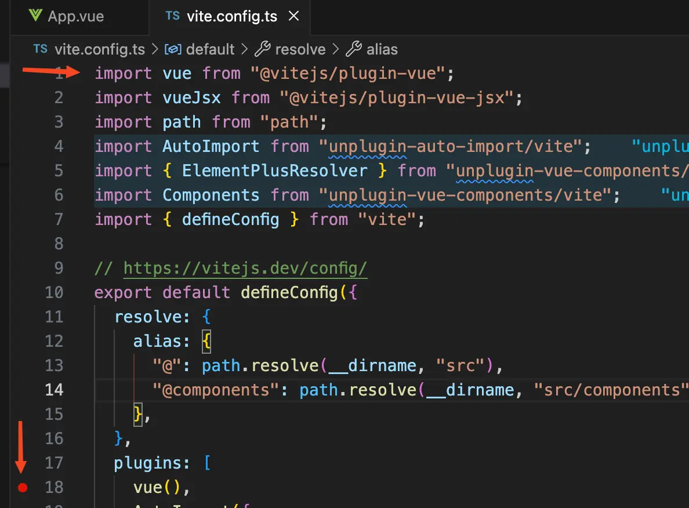{data-zoomable}


## vuePlugin 函数

我们给上方图片的 `vue` 函数打了一个断点，然后在 debug 终端上面执行 `yarn dev`，我们看到断点已经停留在了 `vue` 函数这里。然后点击 `step into`，断点走到了 `@vitejs/plugin-vue` 库中的一个 `vuePlugin` 函数中。我们看到 `vuePlugin` 函数中的内容代码大概是这样的：

```js
function vuePlugin(rawOptions = {}) {
const options = shallowRef({
    compiler: null,
    // 省略...
  });

  return {
    name: "vite:vue",
    handleHotUpdate(ctx) {
      // ...
    },
    config(config) {
      // ..
    },
    configResolved(config) {
      // ..
    },
    configureServer(server) {
      // ..
    },
    buildStart() {
      // ..
    },
    async resolveId(id) {
      // ..
    },
    load(id, opt) {
      // ..
    },
    transform(code, id, opt) {
      // ..
    }
  };
}
```

`@vitejs/plugin-vue` 是作为一个 `plugins` 插件在 Vite 中使用，`vuePlugin` 函数返回的对象中的 `buildStart`、 `transform` 方法就是对应的插件钩子函数。Vite 会在对应的时候调用这些插件的钩子函数，比如当 Vite 服务器启动时就会调用插件里面的 `buildStart` 等函数，当 Vite 解析每个模块时就会调用 `transform` 等函数。更多 Vite 钩子相关内容[查看官网](https://cn.vitejs.dev/guide/api-plugin#universal-hooks)。

我们这里主要看 `buildStart`和`transform` 两个钩子函数，分别是服务器启动时调用和解析每个模块时调用。给这两个钩子函数打上断点。

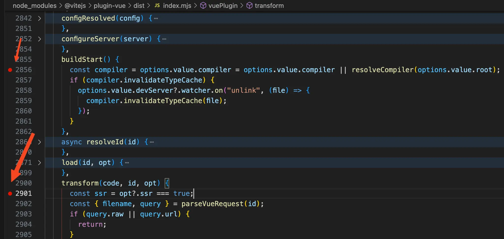{data-zoomable}

然后点击 Continue(F5)，Vite 服务启动后就会走到 `buildStart` 钩子函数中打的断点。我们可以看到 `buildStart` 钩子函数的代码是这样的：

```js
buildStart() {
  const compiler = options.value.compiler = options.value.compiler || resolveCompiler(options.value.root);
}
```

将鼠标放到 `options.value.compiler` 上面我们看到此时 `options.value.compiler` 的值为 `null`，所以代码会走到 `resolveCompiler` 函数中，点击 Step Into(F11) 走到 `resolveCompiler` 函数中。看到 `resolveCompiler` 函数代码如下：

```js
function resolveCompiler(root) {
  const compiler = tryResolveCompiler(root) || tryResolveCompiler();
  return compiler;
}

function tryResolveCompiler(root) {
  const vueMeta = tryRequire("vue/package.json", root);
  if (vueMeta && vueMeta.version.split(".")[0] >= 3) {
    return tryRequire("vue/compiler-sfc", root);
  }
}
```

在 `resolveCompiler` 函数中调用了 `tryResolveCompiler` 函数，在 `tryResolveCompiler` 函数中判断当前项目是否是 Vue3.x 版本，然后将 `vue/compiler-sfc` 包返回。**所以经过初始化后 `options.value.compiler` 的值就是 Vue 的底层库 `vue/compiler-sfc`，记住这个后面会用**。

然后点击 Continue(F5) 放掉断点，在浏览器中打开对应的页面，比如：[http://localhost:5173/](http://localhost:5173/)。此时 Vite 将会编译这个页面要用到的所有文件，就会走到 `transform` 钩子函数断点中了。


经过 debug 我们发现解析 `App.vue` 文件时 `transform` 函数实际就是执行了 `transformMain` 函数，至于 `transformStyle` 函数后面讲解析 Style 的时候会讲：

```js
transform(code, id, opt) {
  const { filename, query } = parseVueRequest(id);
  if (!query.vue) {
    return transformMain(
      code,
      filename,
      options.value,
      this,
      ssr,
      customElementFilter.value(filename)
    );
  } else {
    const descriptor = query.src ? getSrcDescriptor(filename, query) || getTempSrcDescriptor(filename, query) : getDescriptor(filename, options.value);
    if (query.type === "style") {
      return transformStyle(
        code,
        descriptor,
        Number(query.index || 0),
        options.value,
        this,
        filename
      );
    }
  }
}
```
## `transformMain` 函数

继续 debug 断点走进 `transformMain` 函数，发现 `transformMain` 函数中代码逻辑很清晰。按照顺序分别是：

- 根据源代码 code 字符串调用 `createDescriptor` 函数生成一个 `descriptor` 对象。
- 调用 `genScriptCode` 函数传入第一步生成的 `descriptor` 对象将 `<script setup>` 模块编译为浏览器可执行的 JavaScript 代码。
- 调用 `genTemplateCode` 函数传入第一步生成的 `descriptor` 对象将 `<template>` 模块编译为 `render` 函数。
- 调用 `genStyleCode` 函数传入第一步生成的 `descriptor` 对象将 `<style scoped>` 模块编译为类似这样的 import 语句，`import "/src/App.vue?vue&type=style&index=0&scoped=7a7a37b1&lang.css";`。

### `createDescriptor` 函数

我们先来看看 `createDescriptor` 函数，将断点走到 `createDescriptor(filename, code, options)` 这一行代码，可以看到传入的 `filename` 就是 `App.vue` 的文件路径，`code` 就是 `App.vue` 中我们写的源代码。

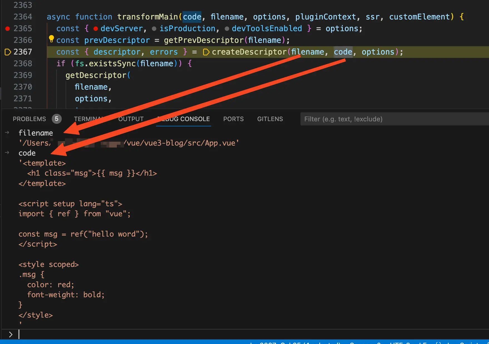{data-zoomable}

debug 走进 `createDescriptor` 函数，看到 `createDescriptor` 函数的代码如下：

```js
function createDescriptor(filename, source, { root, isProduction, sourceMap, compiler, template }, hmr = false) {
  const { descriptor, errors } = compiler.parse(source, {
    filename,
    sourceMap,
    templateParseOptions: template?.compilerOptions
  });
  const normalizedPath = slash(path.normalize(path.relative(root, filename)));
  descriptor.id = getHash(normalizedPath + (isProduction ? source : ""));
  return { descriptor, errors };
}
```

这个 `compiler` 是不是觉得有点熟悉？`compiler` 是调用 `createDescriptor` 函数时传入的第三个参数解构而来，而第三个参数就是 `options`。还记得我们之前在 Vite 启动时调用了 `buildStart` 钩子函数，然后将 Vue 底层包 `vue/compiler-sfc` 赋值给 `options` 的 `compiler` 属性。

那这里的 `compiler.parse` 其实就是调用的 `vue/compiler-sfc` 包暴露出来的 `parse` 函数，这是一个 Vue 暴露出来的底层的 API，这篇文章我们不会对底层 API 进行源码解析，通过查看 `parse` 函数的输入和输出基本就可以搞清楚 `parse` 函数的作用。下面这个是 `parse` 函数的类型定义：

```js
export function parse(
source: string,
options: SFCParseOptions = {},
): SFCParseResult {}
```

从上面我们可以看到 `parse` 函数接收两个参数，第一个参数为 Vue 文件的源代码，在我们这里就是 `App.vue` 中的 `code` 字符串，第二个参数是一些  `options` 选项。

我们再来看看 `parse` 函数的返回值 `SFCParseResult`，主要有类型为 `SFCDescriptor` 的 `descriptor` 属性需要关注。

```js
export interface SFCParseResult {
  descriptor: SFCDescriptor
  errors: (CompilerError | SyntaxError)[]
}

export interface SFCDescriptor {
  filename: string
  source: string
  template: SFCTemplateBlock | null
  script: SFCScriptBlock | null
  scriptSetup: SFCScriptBlock | null
  styles: SFCStyleBlock[]
  customBlocks: SFCBlock[]
  cssVars: string[]
  slotted: boolean
  shouldForceReload: (prevImports: Record<string, ImportBinding>) => boolean
}
```

仔细看看 `SFCDescriptor` 类型，其中的 `template` 属性就是 `App.vue` 文件对应的 `template` 标签中的内容，里面包含了由 `App.vue`  文件中的`template` 模块编译成的 AST 抽象语法树和原始的 `template` 中的代码。
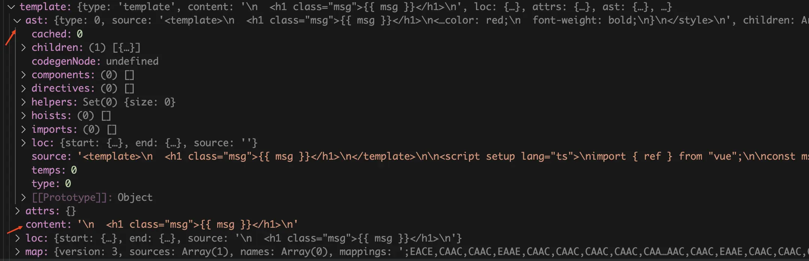{data-zoomable}


我们再来看 script 和 `scriptSetup` 属性，由于 Vue 文件中可以写多个 script 标签，`scriptSetup` 对应的就是有 `setup` 的 script 标签，script 对应的就是没有 `setup` 对应的 script 标签。我们这个场景中只有 `scriptSetup` 属性，里面同样包含了 `App.vue` 中的 script 模块中的内容。

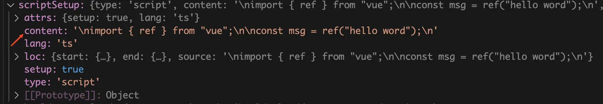{data-zoomable}

我们再来看看 styles 属性，这里的 styles 属性是一个数组，是因为我们可以在 Vue 文件中写多个 style 模块，里面同样包含了 `App.vue` 中的 style 模块中的内容。

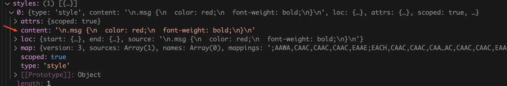{data-zoomable}

所以这一步执行 `createDescriptor` 函数生成的 `descriptor` 对象中主要有三个属性，`template` 属性包含了 `App.vue` 文件中的 `template` 模块 `code` 字符串和 AST 抽象语法树，`scriptSetup` 属性包含了 `App.vue` 文件中的 `<script setup>` 模块的 `code` 字符串，styles 属性包含了 `App.vue` 文件中 `<style>` 模块中的 `code` 字符串。`createDescriptor` 函数的执行流程图如下：

{data-zoomable}

### `genScriptCode` 函数

我们再来看 `genScriptCode` 函数是如何将 `<script setup>` 模块编译成可执行的 JavaScript 代码，同样将断点走到调用 `genScriptCode` 函数的地方，`genScriptCode` 函数主要接收我们上一步生成的 `descriptor` 对象，调用 `genScriptCode` 函数后会将编译后的 script 模块代码赋值给 `scriptCode` 变量。

```js
const { code: scriptCode, map: scriptMap } = await genScriptCode(
  descriptor,
  options,
  pluginContext,
  ssr,
  customElement
);
```

将断点走到 `genScriptCode` 函数内部，在 `genScriptCode` 函数中主要就是这行代码：`const script = resolveScript(descriptor, options, ssr, customElement);`。将第一步生成的 `descriptor` 对象作为参数传给 `resolveScript` 函数，返回值就是编译后的 JavaScript 代码，`genScriptCode` 函数的代码简化后如下：

```js
async function genScriptCode(descriptor, options, pluginContext, ssr, customElement) {
  let scriptCode = `const ${scriptIdentifier} = {}`;
  const script = resolveScript(descriptor, options, ssr, customElement);
  if (script) {
    scriptCode = script.content;
    map = script.map;
  }
  return {
    code: scriptCode,
    map
  };
}
```

我们继续将断点走到 `resolveScript` 函数内部，发现 `resolveScript` 中的代码其实也很简单，简化后的代码如下：

```js
function resolveScript(descriptor, options, ssr, customElement) {
  let resolved = null;
  resolved = options.compiler.compileScript(descriptor, {
    ...options.script,
    id: descriptor.id,
    isProd: options.isProduction,
    inlineTemplate: isUseInlineTemplate(descriptor, !options.devServer),
    templateOptions: resolveTemplateCompilerOptions(descriptor, options, ssr),
    sourceMap: options.sourceMap,
    genDefaultAs: canInlineMain(descriptor, options) ? scriptIdentifier : void 0,
    customElement
  });
  return resolved;
}
```

这里的 `options.compiler` 我们前面第一步的时候已经解释过了，`options.compiler` 对象实际就是 Vue 底层包 `vue/compiler-sfc` 暴露的对象，这里的 `options.compiler.compileScript()` 其实就是调用的 `vue/compiler-sfc` 包暴露出来的 `compileScript` 函数，同样也是一个 Vue 暴露出来的底层的 API。

后面我们的分析 `defineProps` 等文章时会去深入分析 `compileScript` 函数，这篇文章我们不会去读 `compileScript` 函数的源码。通过查看 `compileScript` 函数的输入和输出基本就可以搞清楚 `compileScript` 函数的作用。下面这个是 `compileScript` 函数的类型定义：

```js
export function compileScript(
  sfc: SFCDescriptor,
  options: SFCScriptCompileOptions,
): SFCScriptBlock{}
```

这个函数的入参是一个 `SFCDescriptor` 对象，就是我们第一步调用生成 `createDescriptor` 函数生成的 `descriptor` 对象，第二个参数是一些 `options` 选项。我们再来看返回值 `SFCScriptBlock` 类型：

```js
export interface SFCScriptBlock extends SFCBlock {
  type: 'script'
  setup?: string | boolean
  bindings?: BindingMetadata
  imports?: Record<string, ImportBinding>
  scriptAst?: import('@babel/types').Statement[]
  scriptSetupAst?: import('@babel/types').Statement[]
  warnings?: string[]
  /**
   * Fully resolved dependency file paths (unix slashes) with imported types
   * used in macros, used for HMR cache busting in @vitejs/plugin-vue and
   * vue-loader.
   */
  deps?: string[]
}

export interface SFCBlock {
  type: string
  content: string
  attrs: Record<string, string | true>
  loc: SourceLocation
  map?: RawSourceMap
  lang?: string
  src?: string
}
```

返回值类型中主要有 `scriptAst`、`scriptSetupAst`、`content` 这三个属性，`scriptAst` 为编译不带 `setup` 属性的 script 标签生成的 AST 抽象语法树。`scriptSetupAst` 为编译带 `setup` 属性的 script 标签生成的 AST 抽象语法树，`content` 为 Vue 文件中的 script 模块编译后生成的浏览器可执行的 JavaScript 代码。下面这个是执行 `vue/compiler-sfc` 的 `compileScript` 函数返回结果：
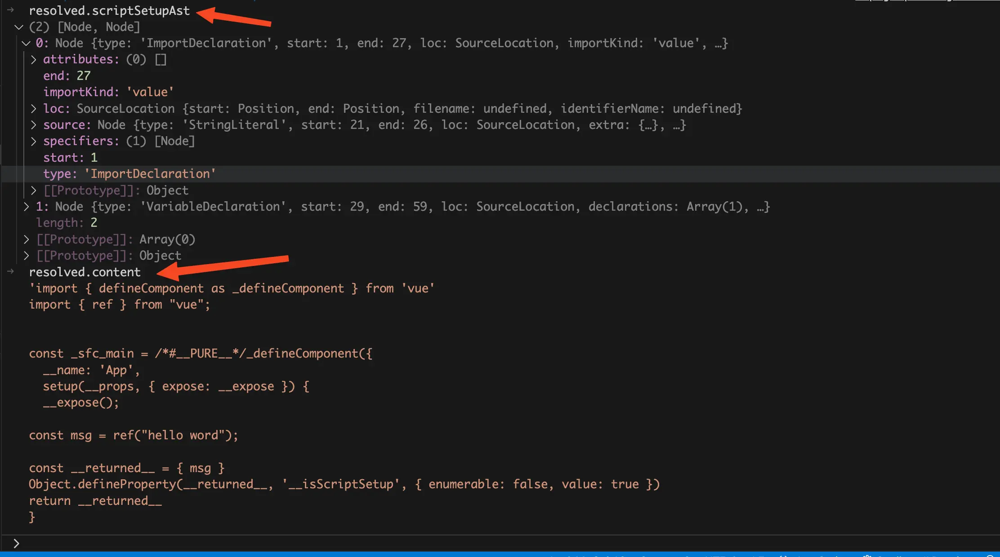{data-zoomable}


继续将断点走回 `genScriptCode` 函数，现在逻辑就很清晰了。这里的 script 对象就是调用 `vue/compiler-sfc` 的 `compileScript` 函数返回对象，`scriptCode` 就是 script 对象的 `content` 属性，也就是将 Vue 文件中的 script 模块经过编译后生成浏览器可直接执行的 JavaScript 代码 `code` 字符串。

```js
async function genScriptCode(descriptor, options, pluginContext, ssr, customElement) {
  let scriptCode = `const ${scriptIdentifier} = {}`;
  const script = resolveScript(descriptor, options, ssr, customElement);
  if (script) {
    scriptCode = script.content;
    map = script.map;
  }
  return {
    code: scriptCode,
    map
  };
}
```

`genScriptCode` 函数的执行流程图如下：

{data-zoomable}

### `genTemplateCode` 函数

我们再来看 `genTemplateCode` 函数是如何将 `template` 模块编译成 `render` 函数的，同样将断点走到调用 `genTemplateCode` 函数的地方，`genTemplateCode` 函数主要接收我们上一步生成的 `descriptor` 对象，调用 `genTemplateCode` 函数后会将编译后的 `template` 模块代码赋值给 `templateCode` 变量。

```js
({ code: templateCode, map: templateMap } = await genTemplateCode(
  descriptor,
  options,
  pluginContext,
  ssr,
  customElement
))
```

同样将断点走到 `genTemplateCode` 函数内部，在 `genTemplateCode` 函数中主要就是返回 `transformTemplateInMain` 函数的返回值，`genTemplateCode` 函数的代码简化后如下：

```js
async function genTemplateCode(descriptor, options, pluginContext, ssr, customElement) {
  const template = descriptor.template;
  return transformTemplateInMain(
    template.content,
    descriptor,
    options,
    pluginContext,
    ssr,
    customElement
  );
}
```

我们继续将断点走进 `transformTemplateInMain` 函数，发现这里也主要是调用 `compile` 函数，代码如下：

```js
function transformTemplateInMain(code, descriptor, options, pluginContext, ssr, customElement) {
  const result = compile(
    code,
    descriptor,
    options,
    pluginContext,
    ssr,
    customElement
  );
  return {
    ...result,
    code: result.code.replace(
      /\nexport (function|const) (render|ssrRender)/,
      "\n$1 _sfc_$2"
    )
  };
}
```

同理将断点走进到 `compile` 函数内部，我们看到 `compile` 函数的代码是下面这样的：

```js
function compile(code, descriptor, options, pluginContext, ssr, customElement) {
  const result = options.compiler.compileTemplate({
    ...resolveTemplateCompilerOptions(descriptor, options, ssr),
    source: code
  });
  return result;
}
```

同样这里也用到了 `options.compiler`，调用 `options.compiler.compileTemplate()` 其实就是调用的 `vue/compiler-sfc` 包暴露出来的 `compileTemplate` 函数，这也是一个 Vue 暴露出来的底层的 API。

不过这里和前面不同的是 `compileTemplate` 接收的不是 `descriptor` 对象，而是一个 `SFCTemplateCompileOptions` 类型的对象，所以这里需要调用 `resolveTemplateCompilerOptions` 函数将参数转换成 `SFCTemplateCompileOptions` 类型的对象。

这篇文章我们不会对底层 API 进行解析。通过查看 `compileTemplate` 函数的输入和输出基本就可以搞清楚 `compileTemplate` 函数的作用。下面这个是 `compileTemplate` 函数的类型定义：

```js
export function compileTemplate(
  options: SFCTemplateCompileOptions,
): SFCTemplateCompileResults {}
```

入参 `options` 主要就是需要编译的 `template` 中的源代码和对应的 AST 抽象语法树。我们来看看返回值 `SFCTemplateCompileResults`，这里面的 `code` 就是编译后的 `render` 函数字符串。

```js
export interface SFCTemplateCompileResults {
  code: string
  ast?: RootNode
  preamble?: string
  source: string
  tips: string[]
  errors: (string | CompilerError)[]
  map?: RawSourceMap
}
```

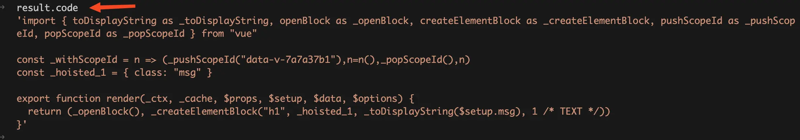{data-zoomable}

`genTemplateCode` 函数的执行流程图如下：

{data-zoomable}

### `genStyleCode` 函数

我们再来看最后一个 `genStyleCode` 函数，同样将断点走到调用 `genStyleCode` 的地方。一样的接收 `descriptor` 对象。代码如下：

```js
const stylesCode = await genStyleCode(
  descriptor,
  pluginContext,
  customElement,
  attachedProps
);
```

我们将断点走进 `genStyleCode` 函数内部，发现和前面 `genScriptCode` 和 `genTemplateCode` 函数有点不一样，下面这个是我简化后的 `genStyleCode` 函数代码：

```js
async function genStyleCode(descriptor, pluginContext, customElement, attachedProps) {
  let stylesCode = ``;
  if (descriptor.styles.length) {
    for (let i = 0; i < descriptor.styles.length; i++) {
      const style = descriptor.styles[i];
      const src = style.src || descriptor.filename;
      const attrsQuery = attrsToQuery(style.attrs, "css");
      const srcQuery = style.src ? style.scoped ? `&src=${descriptor.id}` : "&src=true" : "";
      const directQuery = customElement ? `&inline` : ``;
      const scopedQuery = style.scoped ? `&scoped=${descriptor.id}` : ``;
      const query = `?vue&type=style&index=${i}${srcQuery}${directQuery}${scopedQuery}`;
      const styleRequest = src + query + attrsQuery;
      stylesCode += `
import ${JSON.stringify(styleRequest)}`;
    }
  }
  return stylesCode;
}
```

我们前面讲过因为 Vue 文件中可能会有多个 style 标签，所以 `descriptor` 对象的 styles 属性是一个数组。遍历 `descriptor.styles` 数组，我们发现 for 循环内全部都是一堆赋值操作，没有调用 `vue/compiler-sfc` 包暴露出来的任何 API。将断点走到 `return stylesCode;`，看看 `stylesCode` 到底是什么东西？

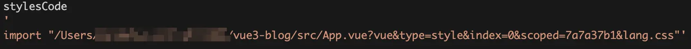{data-zoomable}

通过打印我们发现 `stylesCode` 竟然变成了一条 import 语句，并且 import 的还是当前 `App.vue` 文件，只是多了几个 `query` 分别是：`vue`、`type`、`index`、`scoped`、`lang`。

再来回忆一下前面讲的 `@vitejs/plugin-vue` 的 `transform` 钩子函数，当 Vite 解析每个模块时就会调用 `transform` 等函数。所以当代码运行到这行 import 语句的时候会再次走到 `transform` 钩子函数中。我们再来看看 `transform` 钩子函数的代码：

```js
transform(code, id, opt) {
  const { filename, query } = parseVueRequest(id);
  if (!query.vue) {
    // 省略
  } else {
    const descriptor = query.src ? getSrcDescriptor(filename, query) || getTempSrcDescriptor(filename, query) : getDescriptor(filename, options.value);
    if (query.type === "style") {
      return transformStyle(
        code,
        descriptor,
        Number(query.index || 0),
        options.value,
        this,
        filename
      );
    }
  }
}
```

当 `query` 中有 `vue` 字段，并且 `query` 中 `type` 字段值为 style 时就会执行 `transformStyle` 函数，我们给 `transformStyle` 函数打个断点。当执行上面那条 import 语句时就会走到断点中，我们进到 `transformStyle` 中看看。

```js
async function transformStyle(code, descriptor, index, options, pluginContext, filename) {
  const block = descriptor.styles[index];
  const result = await options.compiler.compileStyleAsync({
    ...options.style,
    filename: descriptor.filename,
    id: `data-v-${descriptor.id}`,
    isProd: options.isProduction,
    source: code,
    scoped: block.scoped,
    ...options.cssDevSourcemap ? {
      postcssOptions: {
        map: {
          from: filename,
          inline: false,
          annotation: false
        }
      }
    } : {}
  });
  return {
    code: result.code,
    map
  };
}
```

`transformStyle` 函数的实现我们看着就很熟悉了，和前面处理 `template` 和 script 一样都是调用的 `vue/compiler-sfc` 包暴露出来的 `compileStyleAsync` 函数，这也是一个 Vue 暴露出来的底层的 API。同样我们不会对底层 API 进行解析。通过查看 `compileStyleAsync` 函数的输入和输出基本就可以搞清楚 `compileStyleAsync` 函数的作用。

```js
export function compileStyleAsync(
  options: SFCAsyncStyleCompileOptions,
): Promise<SFCStyleCompileResults> {}
```

我们先来看看 `SFCAsyncStyleCompileOptions` 入参：

```ts
interface SFCAsyncStyleCompileOptions extends SFCStyleCompileOptions {
  isAsync?: boolean
  modules?: boolean
  modulesOptions?: CSSModulesOptions
}

interface SFCStyleCompileOptions {
  source: string
  filename: string
  id: string
  scoped?: boolean
  trim?: boolean
  isProd?: boolean
  inMap?: RawSourceMap
  preprocessLang?: PreprocessLang
  preprocessOptions?: any
  preprocessCustomRequire?: (id: string) => any
  postcssOptions?: any
  postcssPlugins?: any[]
  map?: RawSourceMap
}
```

入参主要关注几个字段，`source` 字段为 style 标签中的 CSS 原始代码。`scoped` 字段为 style 标签中是否有 `scoped` attribute。`id` 字段为我们在观察 DOM 结构时看到的 `data-v-xxxxx`。这个是 debug 时入参截图：

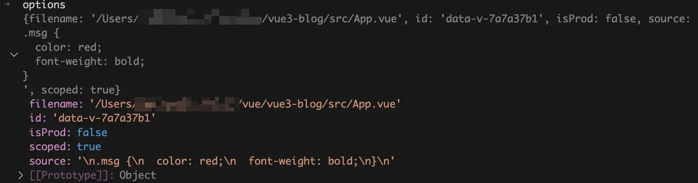{data-zoomable}

再来看看返回值 `SFCStyleCompileResults` 对象，主要就是 `code` 属性，这个是经过编译后的 CSS 字符串，已经加上了 `data-v-xxxxx`。

```ts
interface SFCStyleCompileResults {
  code: string
  map: RawSourceMap | undefined
  rawResult: Result | LazyResult | undefined
  errors: Error[]
  modules?: Record<string, string>
  dependencies: Set<string>
}
```

这个是 debug 时 `compileStyleAsync` 函数返回值的截图：

{data-zoomable}


`genStyleCode` 函数的执行流程图如下：

{data-zoomable}

### `transformMain` 函数简化后的代码

现在我们可以来看 `transformMain` 函数简化后的代码：

```js
async function transformMain(code, filename, options, pluginContext, ssr, customElement) {
  const { descriptor, errors } = createDescriptor(filename, code, options);

  const { code: scriptCode, map: scriptMap } = await genScriptCode(
    descriptor,
    options,
    pluginContext,
    ssr,
    customElement
  );

  let templateCode = "";
  ({ code: templateCode, map: templateMap } = await genTemplateCode(
    descriptor,
    options,
    pluginContext,
    ssr,
    customElement
  ));

  const stylesCode = await genStyleCode(
    descriptor,
    pluginContext,
    customElement,
    attachedProps
  );

  const output = [
    scriptCode,
    templateCode,
    stylesCode
  ];
  let resolvedCode = output.join("\n");
  return {
    code: resolvedCode,
    map: resolvedMap || {
      mappings: ""
    },
    meta: {
      vite: {
        lang: descriptor.script?.lang || descriptor.scriptSetup?.lang || "js"
      }
    }
  };
}
```

`transformMain` 函数中的代码执行主流程，其实就是对应了一个 Vue 文件编译成 JavaScript 文件的流程。

首先调用 `createDescriptor` 函数将一个 Vue 文件解析为一个 `descriptor` 对象。

然后以 `descriptor` 对象为参数调用 `genScriptCode` 函数，将 Vue 文件中的 `<script>` 模块代码编译成浏览器可执行的 JavaScript 代码 `code` 字符串，赋值给 `scriptCode` 变量。

接着以 `descriptor` 对象为参数调用 `genTemplateCode` 函数，将 Vue 文件中的`<template>`模块代码编译成 `render` 函数 `code` 字符串，赋值给 `templateCode` 变量。

然后以 `descriptor` 对象为参数调用 `genStyleCode` 函数，将 Vue 文件中的 `<style>` 模块代码编译成了 import 语句 `code` 字符串，比如：`import "/src/App.vue?vue&type=style&index=0&scoped=7a7a37b1&lang.css";`，赋值给 `stylesCode` 变量。

然后将 `scriptCode`、`templateCode`、`stylesCode` 使用换行符 `\n` 拼接起来得到 `resolvedCode`，这个 `resolvedCode` 就是一个 Vue 文件编译成 JavaScript 文件的代码 `code` 字符串。这个是 debug 时 `resolvedCode` 变量值的截图：

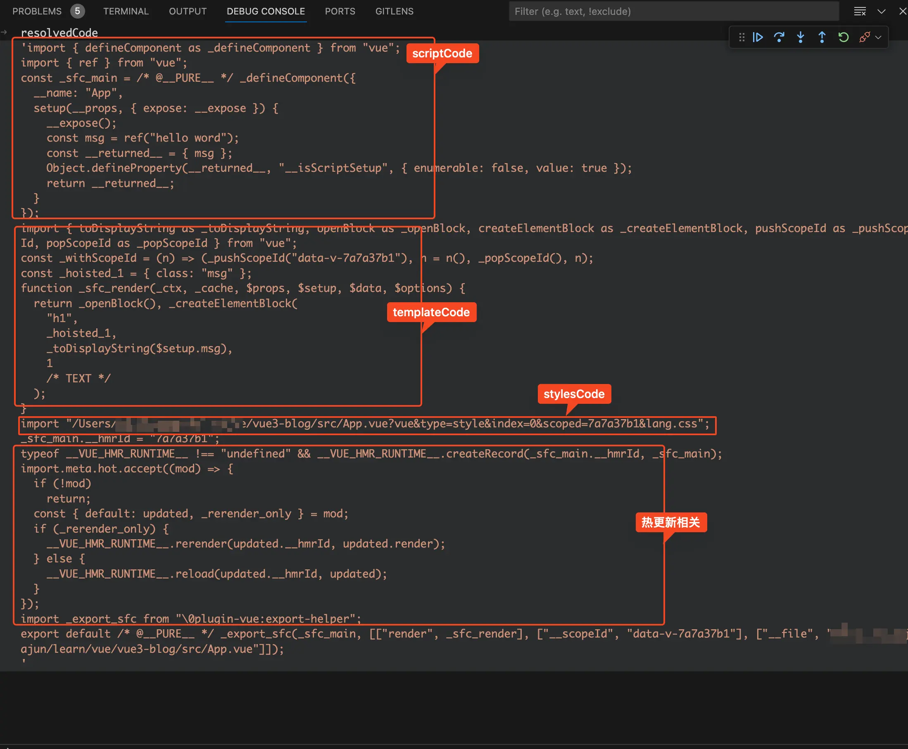{data-zoomable}

# 总结

这篇文章通过 debug 的方式一步一步的带你了解 Vue 文件编译成 JavaScript 文件的完整流程，下面是一个完整的流程图。如果文字太小看不清，可以将图片保存下来或者放大看：

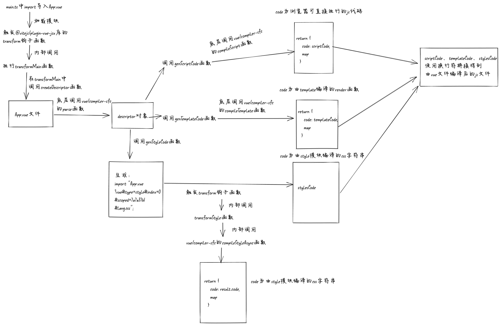{data-zoomable}


`@vitejs/plugin-vue` 库中有个叫 `transform` 的钩子函数，每当 Vite 加载模块的时候就会触发这个钩子函数。所以当 import 一个 Vue 文件的时候，就会走到 `@vitejs/plugin-vue` 中的 `transform` 钩子函数中，在 `transform` 钩子函数中主要调用了 `transformMain` 函数。

第一次解析这个 vue 文件时，在`transform`钩子函数中主要调用了`transformMain`函数。在`transformMain`函数中主要调用了 4 个函数，分别是：`createDescriptor`、`genScriptCode`、`genTemplateCode`、`genStyleCode`。

`createDescriptor` 接收的参数为当前 Vue 文件代码 `code` 字符串，返回值为一个 `descriptor` 对象。对象中主要有四个属性 `template`、`scriptSetup`、`script`、`styles`。
- `descriptor.template.ast` 就是由 Vue 文件中的 `template` 模块生成的 AST 抽象语法树。
- `descriptor.template.content` 就是 Vue 文件中的 `template` 模块的代码字符串。
- `scriptSetup` 和 script 的区别是分别对应的是 Vue 文件中有 `setup` 属性的 `<script>` 模块和无 `setup` 属性的 `<script>` 模块。`descriptor.scriptSetup.content` 就是 Vue 文件中的 `<script setup>` 模块的代码字符串。

`genScriptCode` 函数为底层调用 `vue/compiler-sfc` 的 `compileScript` 函数，根据第一步的 `descriptor` 对象将 Vue 文件的 `<script setup>` 模块转换为浏览器可直接执行的 JavaScript 代码。

`genTemplateCode` 函数为底层调用 `vue/compiler-sfc` 的 `compileTemplate` 函数，根据第一步的 `descriptor` 对象将 Vue 文件的 `<template>` 模块转换为 `render` 函数。

`genStyleCode` 函数为将 Vue 文件的 style 模块转换为 `import "/src/App.vue?vue&type=style&index=0&scoped=7a7a37b1&lang.css";` 样子的 import 语句。

然后使用换行符 `\n` 将 `genScriptCode` 函数、`genTemplateCode` 函数、`genStyleCode` 函数的返回值拼接起来赋值给变量 `resolvedCode`，这个 `resolvedCode` 就是 Vue 文件编译成 JavaScript 文件的 `code` 字符串。

当浏览器执行到 `import "/src/App.vue?vue&type=style&index=0&scoped=7a7a37b1&lang.css";` 语句时，触发了加载模块操作，再次触发了 `@vitejs/plugin-vue` 中的 `transform` 钩子函数。此时由于有了 `type=style` 的 `query`，所以在 `transform` 函数中会执行 `transformStyle` 函数，在 `transformStyle` 函数中同样也是调用 `vue/compiler-sfc` 的 `compileStyleAsync` 函数，根据第一步的 `descriptor` 对象将 Vue 文件的 `<style>` 模块转换为编译后的 CSS 代码 `code` 字符串，至此编译 style 部分也讲完了。


[加入本书对应的「源码交流群」](/guide/contact)
