# 前言
我们每天都在使用 `defineEmits` 宏函数，但是你知道`defineEmits` 宏函数经过编译后其实就是vue2的选项式API吗？通过回答下面两个问题，我将逐步为你揭秘`defineEmits` 宏函数的神秘面纱。为什么 Vue 的 `defineEmits` 宏函数不需要 import 导入就可用？为什么`defineEmits`的返回值等同于`$emit` 方法用于在组件中抛出事件？
# 举两个例子
要回答上面提的几个问题我们先来看两个例子是如何声明事件和抛出事件，分别是vue2的选项式语法和vue3的组合式语法。

我们先来看vue2的选项式语法的例子，`options-child.vue`文件代码如下：
```vue
<template>
  <button @click="handleClick">放大文字</button>
</template>

<script>
export default {
  name: "options-child",
  emits: ["enlarge-text"],
  methods: {
    handleClick() {
      this.$emit("enlarge-text");
    },
  },
};
</script>
```
使用`emits`选项声明了要抛出的事件"enlarge-text"，然后在点击按钮后调用`this.$emit`方法抛出`"enlarge-text"`事件。这里的this大家都知道是指向的当前组件的vue实例，所以`this.$emit`是调用的当前vue实例的`$emit`方法。**大家先记住vue2的选项式语法例子，后面我们讲`defineEmits`宏函数编译原理时会用。**

我们再来看看vue3的组合式语法的例子，`composition-child.vue`代码如下：
```vue
<template>
  <button @click="handleClick">放大文字</button>
</template>

<script setup lang="ts">
const emits = defineEmits(["enlarge-text"]);
function handleClick() {
  emits("enlarge-text");
}
</script>
```
在这个例子中我们使用了`defineEmits`宏函数声明了要抛出的事件"enlarge-text"，`defineEmits`宏函数执行后返回了一个`emits`函数，然后在点击按钮后使用 ` emits("enlarge-text")`抛出`"enlarge-text"`事件。
# 通过debug搞清楚上面几个问题
首先我们要搞清楚应该在哪里打断点，在我之前的文章 [vue文件编译成js文件](/guide/vue-to-js) 中已经带你搞清楚了将vue文件中的`<script>`模块编译成浏览器可直接运行的js代码，底层就是调用`vue/compiler-sfc`包的`compileScript`函数。

所以我们将断点打在`vue/compiler-sfc`包的`compileScript`函数中，一样的套路，首先我们在vscode的打开一个debug终端。
{data-zoomable}

然后在node_modules中找到`vue/compiler-sfc`包的`compileScript`函数打上断点，`compileScript`函数位置在`/node_modules/@vue/compiler-sfc/dist/compiler-sfc.cjs.js`。

在debug终端上面执行`yarn dev`后在浏览器中打开对应的页面，比如：[http://localhost:5173/](http://localhost:5173/) ，此时断点就会走到`compileScript`函数中。

## `compileScript` 函数
我们再来回忆一下`composition-child.vue`文件中的`script`模块代码如下：
```vue
<script setup lang="ts">
const emits = defineEmits(["enlarge-text"]);

function handleClick() {
  emits("enlarge-text");
}
</script>
```
`compileScript`函数内包含了编译`script`模块的所有的逻辑，代码很复杂，光是源代码就接近1000行。这篇文章我们同样不会去通读`compileScript`函数的所有功能，只讲涉及到`defineEmits`流程的代码。这个是根据我们这个场景将`compileScript`函数简化后的代码：
```js
function compileScript(sfc, options) {
  const ctx = new ScriptCompileContext(sfc, options);
  const startOffset = ctx.startOffset;
  const endOffset = ctx.endOffset;
  const scriptSetupAst = ctx.scriptSetupAst;

  for (const node of scriptSetupAst.body) {
    if (node.type === "ExpressionStatement") {
      // ...
    }

    if (node.type === "VariableDeclaration" && !node.declare) {
      const total = node.declarations.length;
      for (let i = 0; i < total; i++) {
        const decl = node.declarations[i];
        const init = decl.init;
        if (init) {
          const isDefineEmits = processDefineEmits(ctx, init, decl.id);
          if (isDefineEmits) {
            ctx.s.overwrite(
              startOffset + init.start,
              startOffset + init.end,
              "__emit"
            );
          }
        }
      }
    }

    if (
      (node.type === "VariableDeclaration" && !node.declare) ||
      node.type.endsWith("Statement")
    ) {
      // ....
    }
  }

  ctx.s.remove(0, startOffset);
  ctx.s.remove(endOffset, source.length);

  let runtimeOptions = ``;
  const emitsDecl = genRuntimeEmits(ctx);
  if (emitsDecl) runtimeOptions += `\n  emits: ${emitsDecl},`;

  const def =
    (defaultExport ? `\n  ...${normalScriptDefaultVar},` : ``) +
    (definedOptions ? `\n  ...${definedOptions},` : "");
  ctx.s.prependLeft(
    startOffset,
    `\n${genDefaultAs} /*#__PURE__*/${ctx.helper(
      `defineComponent`
    )}({${def}${runtimeOptions}\n  ${
      hasAwait ? `async ` : ``
    }setup(${args}) {\n${exposeCall}`
  );
  ctx.s.appendRight(endOffset, `})`);

  return {
    //....
    content: ctx.s.toString(),
  };
}
```
`compileScript`函数内处理`defineProps`和`defineEmits`大体流程其实很相似的。
### ScriptCompileContext类
我们将断点走到`compileScript`函数中的第一部分代码。
```js
function compileScript(sfc, options) {
  const ctx = new ScriptCompileContext(sfc, options);
  const startOffset = ctx.startOffset;
  const endOffset = ctx.endOffset;
  const scriptSetupAst = ctx.scriptSetupAst;
  // ...省略
  return {
    //....
    content: ctx.s.toString(),
  };
}
```
这部分代码主要使用`ScriptCompileContext`类new了一个`ctx`上下文对象，并且读取了上下文对象中的`startOffset`、`endOffset`、`scriptSetupAst`、`s`四个属性。我们将断点走进`ScriptCompileContext`类，看看他的`constructor`构造函数。下面这个是我简化后的`ScriptCompileContext`类的代码：
```js
import MagicString from 'magic-string'

class ScriptCompileContext {
  source = this.descriptor.source
  s = new MagicString(this.source)
  startOffset = this.descriptor.scriptSetup?.loc.start.offset
  endOffset = this.descriptor.scriptSetup?.loc.end.offset

  constructor(descriptor, options) {
    this.descriptor = descriptor;
    this.s = new MagicString(this.source);
    this.scriptSetupAst = descriptor.scriptSetup && parse(descriptor.scriptSetup.content, this.startOffset);
  }
}
```
在`compileScript`函数中`new ScriptCompileContext`时传入的第一个参数是`sfc`变量，然后在`ScriptCompileContext`类的构造函数中是使用`descriptor`变量来接收，接着赋值给`descriptor`属性。

在之前的[vue文件编译成js文件](/guide/vue-to-js) 文章中我们已经讲过了传入给`compileScript`函数的`sfc`变量是一个`descriptor`对象，`descriptor`对象是由vue文件编译来的。`descriptor`对象拥有template属性、scriptSetup属性、style属性、source属性，分别对应vue文件的`<template>`模块、`<script setup>`模块、`<style>`模块、源代码code字符串。

在我们这个场景只关注`scriptSetup`和`source`属性就行了，其中`sfc.scriptSetup.content`的值就是`<script setup>`模块中code代码字符串。详情查看下图：
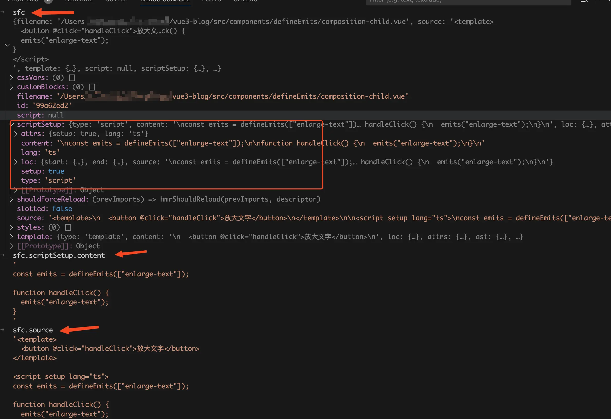{data-zoomable}


现在我想你已经搞清楚了`ctx`上下文对象4个属性中的`startOffset`属性和`endOffset`属性了，`startOffset`和`endOffset`分别对应的就是`descriptor.scriptSetup?.loc.start.offset`和`descriptor.scriptSetup?.loc.end.offset`。`startOffset`为`<script setup>`模块中的内容开始的位置。`endOffset`为`<script setup>`模块中的内容结束的位置。

我们接着来看构造函数中的`this.s = new MagicString(this.source)`这段话，`this.source`是vue文件中的源代码code字符串，以这个字符串new了一个`MagicString`对象赋值给`s`属性。`magic-string`是一个用于高效操作字符串的 JavaScript 库。

它提供丰富的 API，可以轻松地对字符串进行插入、删除、替换等操作。我们这里主要用到`toString`、`remove`、`overwrite`、`prependLeft`、`appendRight`五个方法。`toString`方法用于生成经过处理后返回的字符串，其余几个方法我举几个例子你应该就明白了。

`s.remove( start, end )`用于删除从开始到结束的字符串：
```js
const s = new MagicString('hello word');
s.remove(0, 6);
s.toString(); // 'word'
```
`s.overwrite( start, end, content )`，使用`content`的内容替换开始位置到结束位置的内容。
```js
const s = new MagicString('hello word');
s.overwrite(0, 5, "你好");
s.toString(); // '你好 word'
```
`s.prependLeft( index, content )`用于在指定`index`的前面插入字符串：
```js
const s = new MagicString('hello word');
s.prependLeft(5, 'xx');
s.toString(); // 'helloxx word'
```
`s.appendRight( index, content )`用于在指定`index`的后面插入字符串：
```js
const s = new MagicString('hello word');
s.appendRight(5, 'xx');
s.toString(); // 'helloxx word'
```
现在你应该已经明白了`ctx`上下文对象中的`s`属性了，我们接着来看最后一个属性`scriptSetupAst`。在构造函数中是由`parse`函数的返回值赋值的：    `this.scriptSetupAst = descriptor.scriptSetup && parse(descriptor.scriptSetup.content, this.startOffset)`。`parse`函数的代码如下：
```js
import { parse as babelParse } from '@babel/parser'

function parse(input: string, offset: number): Program {
  try {
    return babelParse(input, {
      plugins,
      sourceType: 'module',
    }).program
  } catch (e: any) {
  }
}
```
我们在前面已经讲过了`descriptor.scriptSetup.content`的值就是`vue`文件中的`<script setup>`模块的代码`code`字符串，`parse`函数中调用了`babel`提供的`parser`函数，将`vue`文件中的`<script setup>`模块的代码`code`字符串转换成`AST抽象语法树`。

在`ScriptCompileContext`构造函数中主要做了下面这些事情：
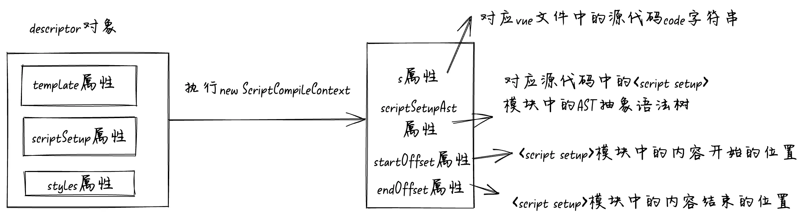{data-zoomable}

### processDefineEmits函数
我们接着将断点走到`compileScript`函数中的第二部分，`for`循环遍历AST抽象语法树的地方，代码如下：
```js
function compileScript(sfc, options) {
  // ...省略
  for (const node of scriptSetupAst.body) {
    if (node.type === "ExpressionStatement") {
      // ...
    }

    if (node.type === "VariableDeclaration" && !node.declare) {
      const total = node.declarations.length;
      for (let i = 0; i < total; i++) {
        const decl = node.declarations[i];
        const init = decl.init;
        if (init) {
          const isDefineEmits = processDefineEmits(ctx, init, decl.id);
          if (isDefineEmits) {
            ctx.s.overwrite(
              startOffset + init.start,
              startOffset + init.end,
              "__emit"
            );
          }
        }
      }
    }

    if (
      (node.type === "VariableDeclaration" && !node.declare) ||
      node.type.endsWith("Statement")
    ) {
      // ....
    }
  }
  // ...省略
}
```
看过我上一篇 [defineProps](/script/defineProps)可能会疑惑了，为什么这里不列出满足`node.type === "ExpressionStatement"`条件的代码呢。

原因是在上一篇文章中我们没有将`defineProps`函数的返回值赋值给一个变量，他是一条表达式语句，所以满足`node.type === "ExpressionStatement"`的条件。

在这篇文章中我们将`defineEmits`函数的返回值赋值给一个`emits`变量，他是一条变量声明语句，所以他满足`node.type === "VariableDeclaration" `的条件。
```js
// 表达式语句
defineProps({
  content: String,
});

// 变量声明语句
const emits = defineEmits(["enlarge-text"]);
```
将断点走进for循环里面，我们知道在script模块中第一行代码是变量声明语句`const emits = defineEmits(["enlarge-text"]);`。在console中看看由这条变量声明语句编译成的node节点长什么样子，如下图：
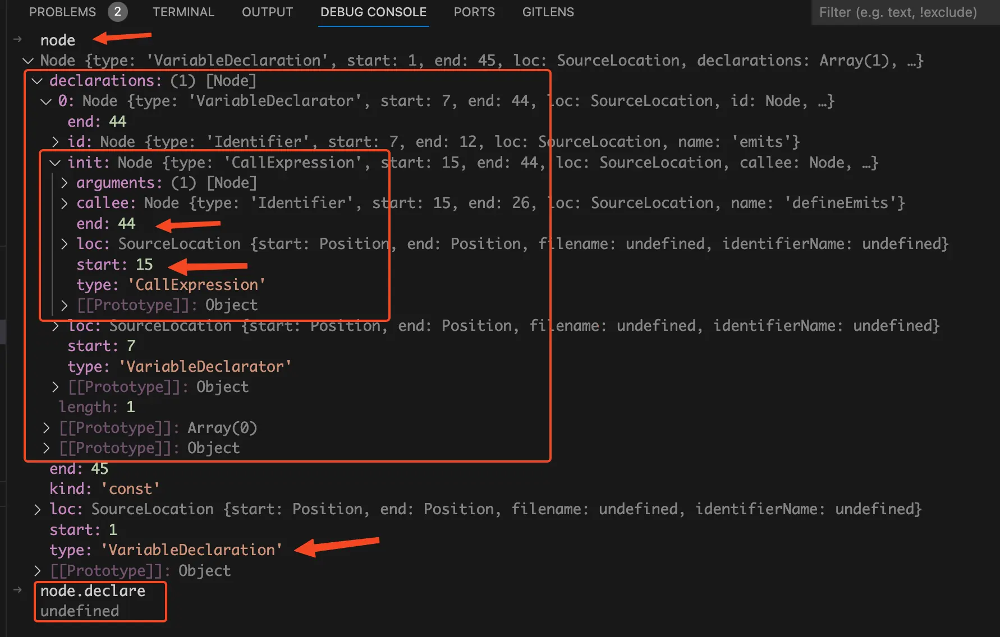{data-zoomable}


从上图中我们可以看到当前的`node`节点类型为变量声明语句，并且`node.declare`的值为`undefined`。我们再来看看`node.declarations`字段，他表示该节点的所有声明子节点。这句话是什么意思呢？说人话就是表示const右边的语句。

那为什么`declarations`是一个数组呢？那是因为const右边可以有多条语句，比如`const a = 2, b = 4;`。在我们这个场景`node.declarations`字段就是表示`emits = defineEmits(["enlarge-text"]);`。

接着来看`declarations`数组下的`init`字段，从名字我想你应该已经猜到了他的作用是表示变量的初始化值，在我们这个场景`init`字段就是表示`defineEmits(["enlarge-text"])`。

而`init.start`表示`defineEmits(["enlarge-text"]);`中的开始位置，也就是字符串'd'的位置，`init.end`表示`defineEmits(["enlarge-text"]);`中的结束位置，也就是字符串';'的位置。

现在我们将断点走到if语句内，下面的这些代码我想你应该能够很轻松的理解了：
```js
if (node.type === "VariableDeclaration" && !node.declare) {
  const total = node.declarations.length;
  for (let i = 0; i < total; i++) {
    const decl = node.declarations[i];
    const init = decl.init;
    if (init) {
      const isDefineEmits = processDefineEmits(ctx, init, decl.id);
      // 省略...
    }
  }
}
```
我们在控制台中已经看到了`node.declare`的值是`undefined`，并且这也是一条变量声明语句，所以断点会走到if里面。由于我们这里只声明了一个变量，所以`node.declarations`数组中只有一个值，这个值就是对应的`emits = defineEmits(["enlarge-text"]);`。

接着遍历`node.declarations`数组，将数组中的item赋值给`decl`变量，然后使用`decl.init`读取到变量声明语句中的初始化值，在我们这里初始化值就是`defineEmits(["enlarge-text"]);`。

如果有初始化值，那就将他传入给`processDefineEmits`函数判断是否在调用`defineEmits`函数。我们来看看`processDefineEmits`函数是什么样的：
```js
const DEFINE_EMITS = "defineEmits";
function processDefineEmits(ctx, node, declId) {
  if (!isCallOf(node, DEFINE_EMITS)) {
    return false;
  }
  ctx.emitsRuntimeDecl = node.arguments[0];
  return true;
}
```
在 `processDefineEmits` 函数中，我们首先使用 `isCallOf` 函数判断当前的 AST 语法树节点 node 是否在调用 `defineEmits` 函数。`isCallOf` 函数的第一个参数是 node 节点，第二个参数在这里是写死的字符串 "defineEmits"。isCallOf的代码如下：
```js
export function isCallOf(node, test) {
  return !!(
    node &&
    test &&
    node.type === "CallExpression" &&
    node.callee.type === "Identifier" &&
    (typeof test === "string"
      ? node.callee.name === test
      : test(node.callee.name))
  );
}
```
我们在debug console中将`node.type`、`node.callee.type`、`node.callee.name`的值打印出来看看。
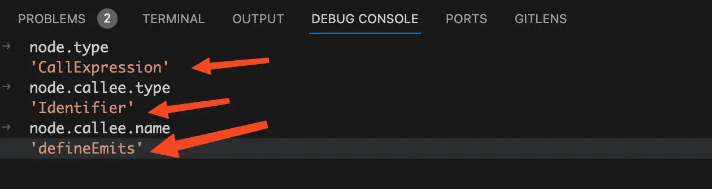{data-zoomable}


从图上看到`node.type`、`node.callee.type`、`node.callee.name`的值后，我们知道了当前节点确实是在调用 `defineEmits` 函数。所以`isCallOf(node, DEFINE_EMITS)` 的执行结果为 true，在 `processDefineEmits` 函数中我们是对 `isCallOf` 函数的执行结果取反，所以 `!isCallOf(node, DEFINE_EMITS) `的执行结果为 false。

我们接着来看`processDefineEmits`函数：
```js
const DEFINE_EMITS = "defineEmits";
function processDefineEmits(ctx, node, declId) {
  if (!isCallOf(node, DEFINE_EMITS)) {
    return false;
  }
  ctx.emitsRuntimeDecl = node.arguments[0];
  return true;
}
```
如果是在执行`defineEmits`函数，就会执行接下来的代码`ctx.emitsRuntimeDecl = node.arguments[0];`。将传入的`node`节点第一个参数赋值给`ctx`上下文对象的`emitsRuntimeDecl`属性，这里的第一个参数其实就是调用`defineEmits`函数时给传入的第一个参数。为什么写死成取`arguments[0]`呢？是因为`defineEmits`函数只接收一个参数，传入的参数可以是一个对象或者数组。比如：
```js
const props = defineEmits({
  'enlarge-text': null
})

const emits = defineEmits(['enlarge-text'])
```
**记住这个在`ctx`上下文上面塞的`emitsRuntimeDecl`属性，后面会用到。**

至此我们已经了解到了`processDefineEmits`中主要做了两件事：判断当前执行的表达式语句是否是`defineEmits`函数，如果是那么就将调用`defineEmits`函数时传入的参数转换成的node节点塞到`ctx`上下文的`emitsRuntimeDecl`属性中。

我们接着来看`compileScript`函数中的代码：
```js
if (node.type === "VariableDeclaration" && !node.declare) {
  const total = node.declarations.length;
  for (let i = 0; i < total; i++) {
    const decl = node.declarations[i];
    const init = decl.init;
    if (init) {
      const isDefineEmits = processDefineEmits(ctx, init, decl.id);
      if (isDefineEmits) {
        ctx.s.overwrite(
          startOffset + init.start,
          startOffset + init.end,
          "__emit"
        );
      }
    }
  }
}
```
将`processDefineEmits`函数的执行结果赋值赋值给`isDefineEmits`变量，在我们这个场景当然是在调用`defineEmits`函数，所以会执行if语句内的`ctx.s.overwrite`方法。

`ctx.s.overwrite`方法我们前面已经讲过了，作用是使用指定的内容替换开始位置到结束位置的内容。在执行`ctx.s.overwrite`前我们先在debug console中执行`ctx.s.toString()`看看当前的code代码字符串是什么样的。
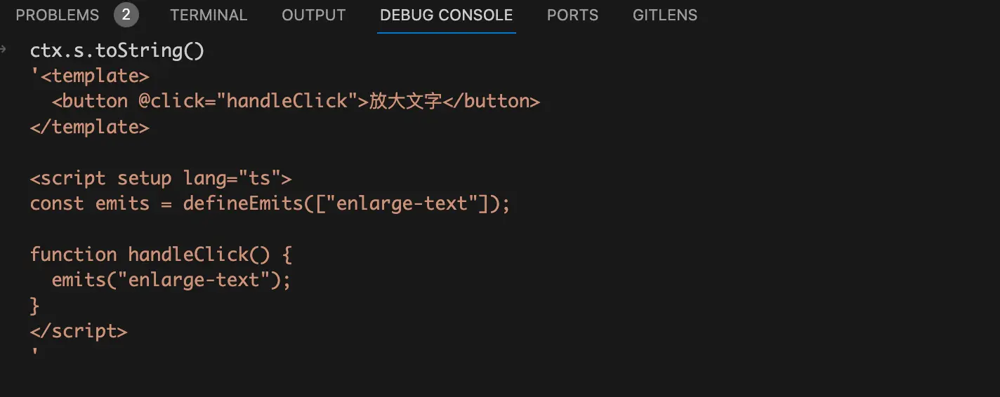{data-zoomable}

从上图我们可以看到此时的code代码字符串还是和我们的源代码是一样的，我们接着来看`ctx.s.overwrite`方法接收的参数。第一个参数为`startOffset + init.start`，`startOffset`我们前面已经讲过了他的值为`script`模块的内容开始的位置。

`init`我们前面也讲过了，他表示`emits`变量的初始化值对应的node节点，在我们这个场景`init`字段就是表示`defineEmits(["enlarge-text"])`。所以`init.start`为`emits`变量的初始化值在`script`模块中开始的位置。

而`ctx.s.`为操纵整个vue文件的code代码字符串，所以`startOffset + init.start`的值为`emits`变量的初始化值的起点在整个vue文件的code代码字符串所在位置。同理第二个参数`startOffset + init.end`的值为`emits`变量的初始化值的终点在整个vue文件的code代码字符串所在位置，而第三个参数是一个写死的字符串"__emit"。

所以`ctx.s.overwrite`方法的作用是将`const emits = defineEmits(["enlarge-text"]);`替换为`const emits = __emit;`。

关于`startOffset`、`init.start`、 `init.end`请看下图：
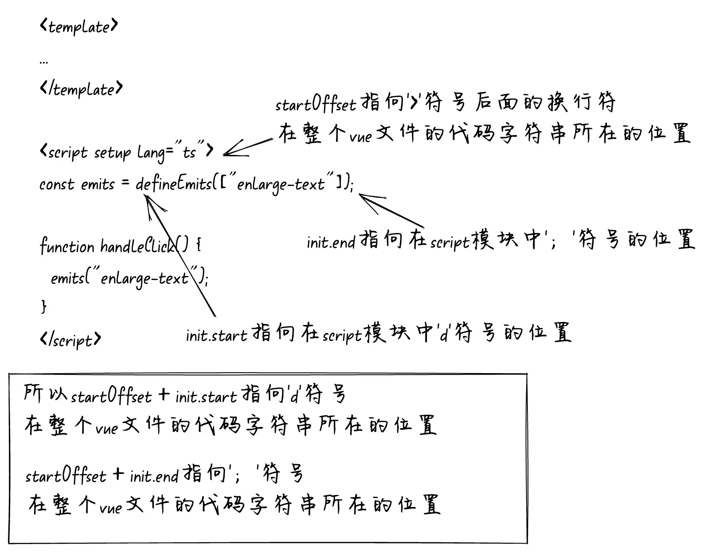{data-zoomable}


在执行`ctx.s.overwrite`方法后我们在debug console中再次执行`ctx.s.toString()`看看这会儿的code代码字符串是什么样的。
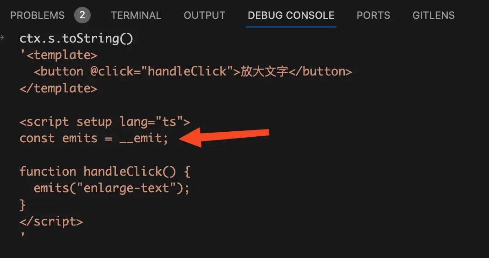{data-zoomable}

从上图中我们可以看到此时代码中已经没有了`defineEmits`函数，已经变成了一个`__emit`变量。
{data-zoomable}

### genRuntimeEmits函数
我们接着将断点走到`compileScript`函数中的第三部分，生成运行时的“声明事件”。我们在上一步将`defineEmits`声明事件的代码替换为`__emit`，那么总得有一个地方去生成“声明事件”。

没错，就是在`genRuntimeEmits`函数这里生成的。`compileScript`函数中执行`genRuntimeEmits`函数的代码如下：
```js
ctx.s.remove(0, startOffset);
ctx.s.remove(endOffset, source.length);

let runtimeOptions = ``;
const emitsDecl = genRuntimeEmits(ctx);
if (emitsDecl) runtimeOptions += `\n  emits: ${emitsDecl},`;
```
从上面的代码中我们看到首先执行了两次`remove`方法，在前面已经讲过了`startOffset`为`script`模块中的内容开始的位置。

所以`ctx.s.remove(0, startOffset);`的意思是删除掉`template`模块的内容和`<script setup>`开始标签。这行代码执行完后我们再看看`ctx.s.toString()`的值：
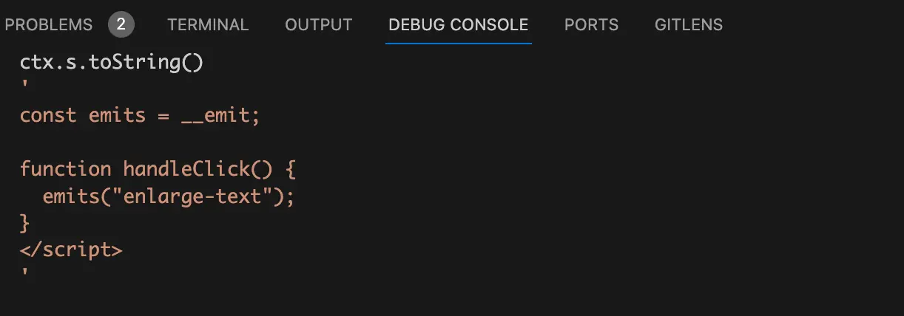{data-zoomable}


从上图我们可以看到此时`template`模块和`<script setup>`开始标签已经没有了，接着执行`ctx.s.remove(endOffset, source.length);`，这行代码的意思是删除`</script >`结束标签和`<style>`模块。这行代码执行完后我们再来看看`ctx.s.toString()`的值：
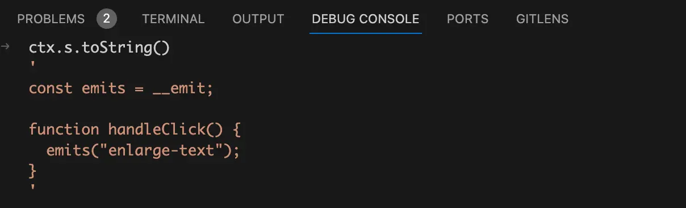{data-zoomable}

从上图我们可以看到，此时只有script模块中的内容了。

我们接着将`compileScript`函数中的断点走到调用`genRuntimeEmits`函数处，简化后代码如下：
```js
function genRuntimeEmits(ctx) {
  let emitsDecl = "";
  if (ctx.emitsRuntimeDecl) {
    emitsDecl = ctx.getString(ctx.emitsRuntimeDecl).trim();
  }
  return emitsDecl;
}
```
看到上面的代码是不是觉得和上一篇`defineProps`文章中讲的`genRuntimeProps`函数很相似。这里的上下文`ctx`上面的`emitsRuntimeDecl`属性我们前面讲过了，他就是调用`defineEmits`函数时传入的参数转换成的node节点。我们将断点走进`ctx.getString`函数，代码如下：
```js
getString(node, scriptSetup = true) {
  const block = scriptSetup ? this.descriptor.scriptSetup : this.descriptor.script;
  return block.content.slice(node.start, node.end);
}
```
我们前面已经讲过了`descriptor`对象是由`vue`文件编译而来，其中的`scriptSetup`属性就是对应的`<script setup>`模块。我们这里没有传入`scriptSetup`，所以`block`的值为`this.descriptor.scriptSetup`。同样我们前面也讲过`scriptSetup.content`的值是`<script setup>`模块`code`代码字符串。请看下图：
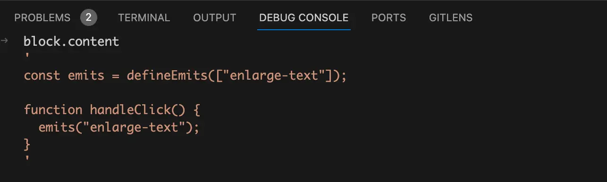{data-zoomable}


这里传入的`node`节点就是我们前面存在上下文中`ctx.emitsRuntimeDecl`，也就是在调用`defineEmits`函数时传入的参数节点，`node.start`就是参数节点开始的位置，`node.end`就是参数节点的结束位置。所以使用`content.slice`方法就可以截取出来调用`defineEmits`函数时传入的参数。请看下图：
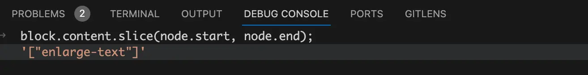{data-zoomable}


现在我们再回过头来看`compileScript`函数中的调用`genRuntimeEmits`函数的代码你就能很容易理解了：
```js
let runtimeOptions = ``;
const emitsDecl = genRuntimeEmits(ctx);
if (emitsDecl) runtimeOptions += `\n  emits: ${emitsDecl},`;
```
这里的`emitsDecl`在我们这个场景中就是使用`slice`截取出来的`emits`定义，再使用字符串拼接 `emits:`，就得到了`runtimeOptions`的值。如图：
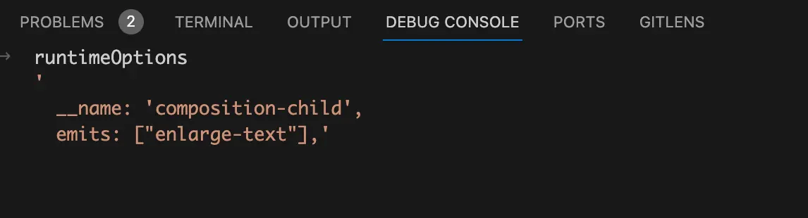{data-zoomable}


看到`runtimeOptions`的值是不是就觉得很熟悉了，又有`name`属性，又有`emits`属性，和我们前面举的两个例子中的vue2的选项式语法的例子比较相似。
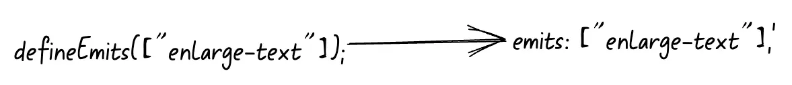{data-zoomable}

### 拼接成完整的浏览器运行时 `js` 代码
我们接着将断点走到`compileScript`函数中的最后一部分：
```js
const def =
  (defaultExport ? `\n  ...${normalScriptDefaultVar},` : ``) +
  (definedOptions ? `\n  ...${definedOptions},` : "");
ctx.s.prependLeft(
  startOffset,
  `\n${genDefaultAs} /*#__PURE__*/${ctx.helper(
    `defineComponent`
  )}({${def}${runtimeOptions}\n  ${
    hasAwait ? `async ` : ``
  }setup(${args}) {\n${exposeCall}`
);
ctx.s.appendRight(endOffset, `})`);

return {
  //....
  content: ctx.s.toString(),
};
```
这块代码和我们讲`defineProps`文章中是一样的，先调用了`ctx.s.prependLeft`方法给字符串开始的地方插入了一串字符串，这串拼接的字符串看着很麻烦的样子，我们直接在debug console上面看看要拼接的字符串是什么样的：
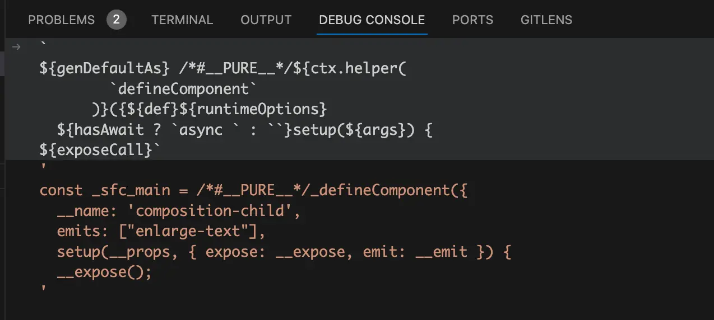{data-zoomable}

看到这串你应该很熟悉，除了前面我们拼接的`name`和`emits`之外还有部分`setup`编译后的代码，但是这里的`setup`代码还不完整，剩余部分还在`ctx.s.toString()`里面。

将断点执行完`ctx.s.prependLeft`后，我们在debug console上面通过`ctx.s.toString()`看此时操作的字符串变成什么样了：
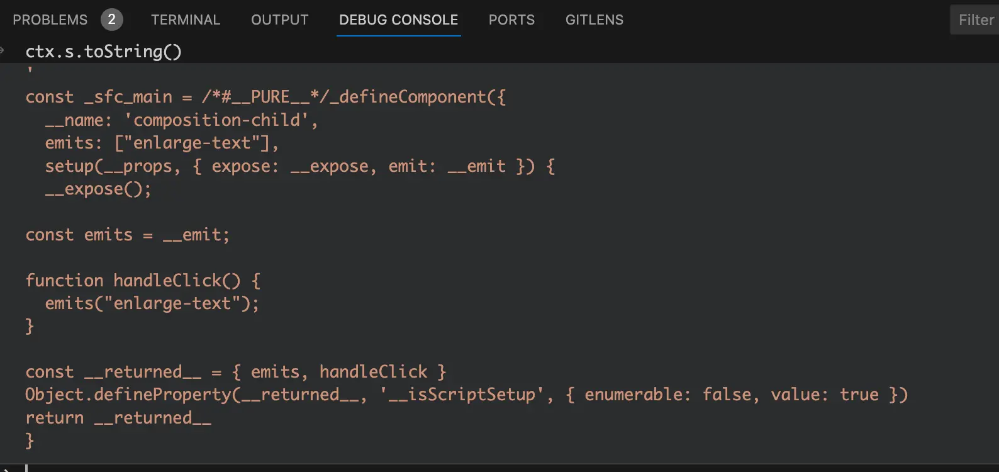{data-zoomable}

从上图可以看到此时的setup函数已经拼接完整了，已经是一个编译后的`vue`组件对象的代码字符串了，只差一个`})`结束符号，所以执行`ctx.s.appendRight`方法将结束符号插入进去。

我们最后再来看看经过`compileScript`函数处理后的浏览器可执行的`js`代码字符串，也就是`ctx.s.toString()`
{data-zoomable}


**从上图中我们可以看到编译后的代码中`声明事件`还是通过vue组件对象上面的`emits`选项声明的，和我们前面举的vue2的选项式语法的例子一模一样。**
## 为什么`defineEmits`的返回值等同于`$emit` 方法用于在组件中抛出事件？
在上一节中我们知道了`defineEmits`函数在编译时就被替换为了`__emit`变量，然后将`__emit`赋值给我们定义的`emits`变量。在需要抛出事件时我们是调用的`emits("enlarge-text");`，实际就是在调用`__emit("enlarge-text");`。那我们现在通过debug看看这个`__emit`到底是什么东西？

首先我们需要在浏览器的source面板中找到由vue文件编译而来的js文件，然后给setup函数打上断点。在我们前面的 [setup函数](/script/what-setup)文章中已经手把手的教你了怎么在浏览器中找到编译后的js文件，所以在这篇文章中就不再赘述了。

给`setup`函数打上断点，刷新浏览器页面后，我们看到断点已经走进来了。如图：
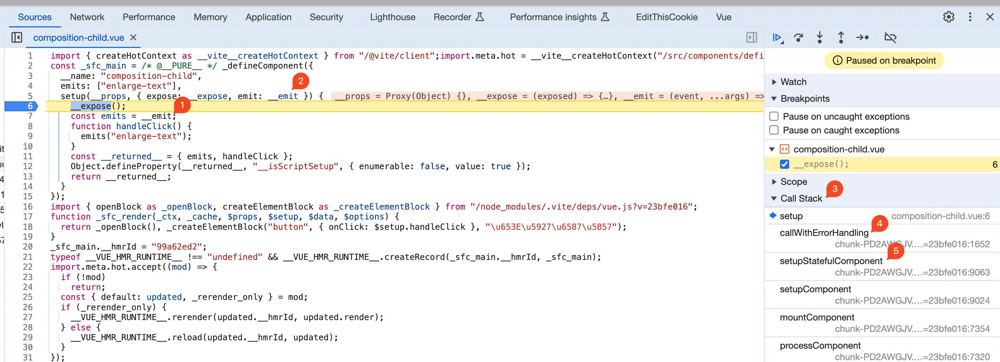{data-zoomable}


从上图中我们可以看见`defineEmits`的返回值也就是`__emit`变量，实际就是`setup`函数的第二个参数对象中的`emit`属性。右边的Call Stack有的小伙伴可能不常用，他的作用是追踪函数的执行流。

比如在这里`setup`函数是由`callWithErrorHandling`函数内调用的，在Call Stack中`setup`下面就是`callWithErrorHandling`。而`callWithErrorHandling`函数是由`setupStatefulComponent`函数内调用的，所以在Call Stack中`callWithErrorHandling`下面就是`setupStatefulComponent`。并且还可以通过点击函数名称跳转到对应的函数中。

为了搞清楚`setup`函数的第二个参数到底是什么，所以我们点击右边的Call Stack中的`callWithErrorHandling`函数，看看在`callWithErrorHandling`函数中是怎么调用`setup`函数的。代码如下：
```js
function callWithErrorHandling(fn, instance, type, args) {
  try {
    return args ? fn(...args) : fn();
  } catch (err) {
    handleError(err, instance, type);
  }
}
```
从上面的代码中可以看到这个`callWithErrorHandling`函数实际就是用于错误处理的，如果有参数`args`，那就调用`fn`时将参数以`...args`的形式传入给`fn`。

在我们这里`fn`就是`setup`函数，我们现在要看传递给`setup`的第二个参数，就对应的这里的是`args`数组中的第二项。现在我们知道了调用`callWithErrorHandling`函数时传入的第四个参数是一个数组，数组的第二项就是调用`setup`函数时传入的第二个参数对象。

我们接着来看在`setupStatefulComponent`函数中是如何调用`callWithErrorHandling`函数的，简化后代码如下：
```js
function setupStatefulComponent(instance, isSSR) {
  const setupContext = (instance.setupContext =
    setup.length > 1 ? createSetupContext(instance) : null);
  const setupResult = callWithErrorHandling(setup, instance, 0, [
    true ? shallowReadonly(instance.props) : instance.props,
    setupContext,
  ]);
}
```
从上面的代码中可以看到调用`callWithErrorHandling`函数时传入的第四个参数确实是一个数组，数组的第二项是`setupContext`，这个`setupContext`就是调用`setup`函数时传入的第二个参数对象。

而`setupContext`的值是由`createSetupContext`函数返回的，在调用`createSetupContext`函数时传入了当前的vue实例。我们接着来看简化后的`createSetupContext`函数是什么样的：
```js
function createSetupContext(instance) {
  return Object.freeze({
    get attrs() {
      return getAttrsProxy(instance);
    },
    get slots() {
      return getSlotsProxy(instance);
    },
    get emit() {
      return (event, ...args) => instance.emit(event, ...args);
    },
    expose,
  });
}
```
这里出现了一个我们平时不常用的`Object.freeze`方法，在mdn上面查了一下他的作用:
> `Object.freeze()` 静态方法可以使一个对象被*冻结*。冻结对象可以[防止扩展](https://developer.mozilla.org/zh-CN/docs/Web/JavaScript/Reference/Global_Objects/Object/preventExtensions)，并使现有的属性不可写入和不可配置。被冻结的对象不能再被更改：不能添加新的属性，不能移除现有的属性，不能更改它们的可枚举性、可配置性、可写性或值，对象的原型也不能被重新指定。`freeze()` 返回与传入的对象相同的对象。

从前面我们已经知道了`createSetupContext`函数的返回值就是调用`setup`函数时传入的第二个参数对象，我们要找的`__emit`就是第二个参数对象中的`emit`属性。当读取`emit`属性时就会走到上面的冻结对象的`get emit() `中，当我们调用`emit`函数抛出事件时实际就是调用的是`instance.emit`方法，也就是`vue`实例上面的`emit`方法。

现在我想你应该已经反应过来了，调用`defineEmits`函数的返回值实际就是在调用vue实例上面的emit方法，其实在运行时抛出事件的做法还是和vue2的选项式语法一样的，只是在编译时就将看着高大上的`defineEmits`函数编译成vue2的选项式语法的样子。
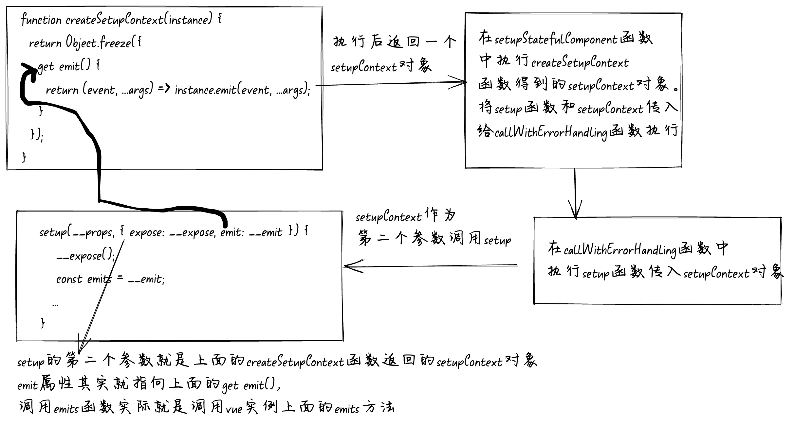{data-zoomable}

# 总结
现在我们能够回答前面提的两个问题了：
- 为什么 Vue 的 `defineEmits` 宏函数不需要 import 导入就可用？
  在遍历script模块转换成的AST抽象语法树时，如果当前的node节点是在调用`defineEmits`函数，就继续去找这个node节点下面的参数节点，也就是调用`defineEmits`函数传入的参数对应的node节点。

  然后将参数节点对象赋值给当前的`ctx`上下文的`emitsRuntimeDecl`属性中，接着根据`defineEmits`函数对应的node节点中记录的start和end位置对vue文件的code代码字符串进行替换。将`defineEmits(["enlarge-text"])`替换为`__emit`，此时在代码中已经就没有了 `defineEmits` 宏函数了，自然也不需要从vue中import导入。

  当遍历完AST抽象语法树后调用`genRuntimeEmits`函数，从前面存的`ctx`上下文中的`emitsRuntimeDecl`属性中取出来调用`defineEmits`函数时传入的参数节点信息。根据参数节点中记录的start和end位置，对script模块中的code代码字符串执行slice方法，截取出调用`defineEmits`函数时传入的参数。然后通过字符串拼接的方式将调用`defineEmits`函数时传入的参数拼接到vue组件对象的emits属性上。

- 为什么`defineEmits`的返回值等同于`$emit` 方法用于在组件中抛出事件？
  `defineEmits` 宏函数在上个问题中我们已经讲过了会被替换为`__emit`，而这个`__emit`是调用`setup`函数时传入的第二个参数对象上的`emit`属性。

  而第二个参数对象是在`setupStatefulComponent`函数中调用`createSetupContext`函数生成的`setupContext`对象。在`createSetupContext`函数中我们看到返回的`emit`属性其实就是一个箭头函数，当调用`defineEmits`函数返回的`emit`函数时就会调用这个箭头函数，在箭头函数中其实是调用vue实例上的`emit`方法。

搞明白了上面两个问题我想你现在应该明白了为什么说**vue3的defineEmits 宏函数编译后其实就是vue2的选项式API**，`defineEmits`宏函数声明的事件经过编译后就变成了vue组件对象上的`emits`属性。

`defineEmits`函数的返回值`emit`函数，其实就是在调用vue实例上的`emit`方法，这不就是我们在vue2的选项式API中声明事件和触发事件的样子吗。

大部分看着高大上的黑魔法其实都是编译时做的事情，**vue3中的像`defineEmits`这样的宏函数经过编译后其实还是我们熟悉的vue2的选项式API。**


[加入本书对应的「源码交流群」](/guide/contact)
