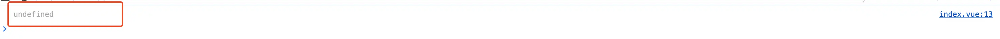
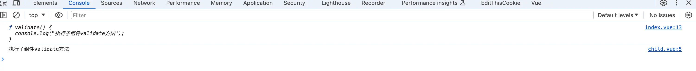
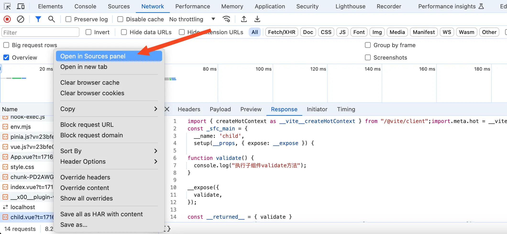
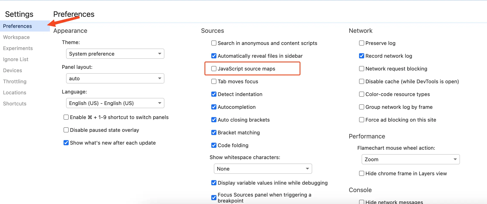
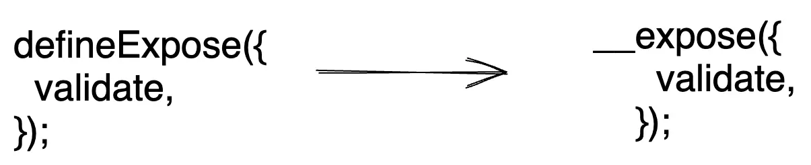
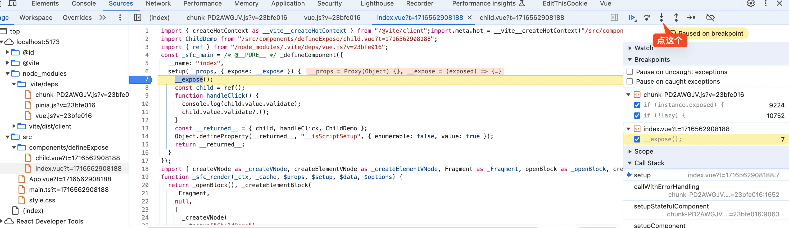
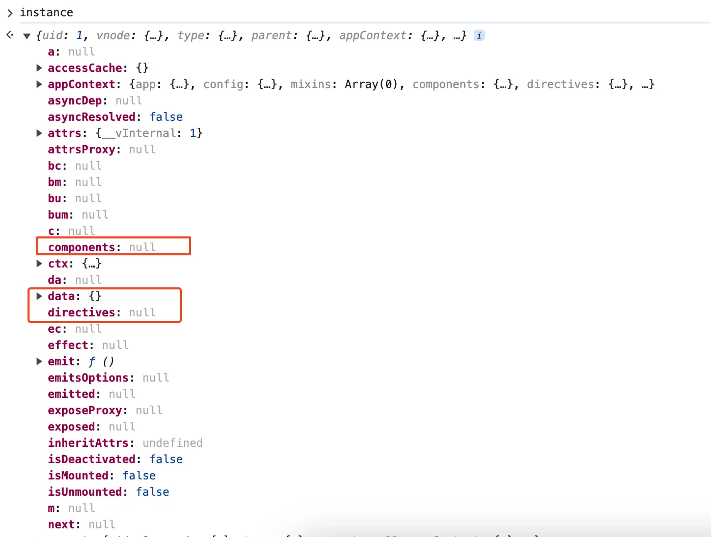
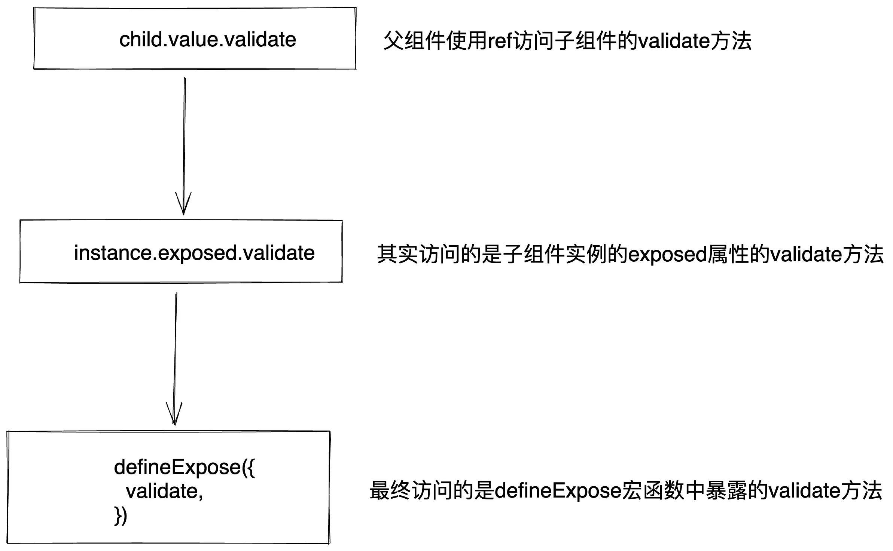

# 前言
众所周知，当子组件使用setup后，父组件就不能像vue2那样直接就可以访问子组件内的属性和方法。这个时候就需要在子组件内使用`defineExpose`宏函数来指定想要暴露出去的属性和方法。这篇文章来讲讲`defineExpose`宏函数是如何暴露出去这些属性和方法给父组件使用。

# 看个demo
父组件`index.vue`的代码如下：
```vue
<template>
  <ChildDemo ref="child" />
  <button @click="handleClick">调用子组件的validate方法</button>
</template>

<script setup lang="ts">
import ChildDemo from "./child.vue";
import { ref } from "vue";

const child = ref();

function handleClick() {
  console.log(child.value.validate);
  child.value.validate?.();
}
</script>
```
上面的代码很简单，通过`ref`拿到子组件的实例赋值给`child`变量。然后在按钮的click事件中打印出子组件的`validate`方法和执行`validate`方法。

再来看看子组件`child.vue`不使用`defineExpose`宏的例子，代码如下：
```vue
<template></template>

<script setup>
function validate() {
  console.log("执行子组件validate方法");
}
</script>
```
在浏览器中点击父组件的button按钮，可以看到控制台中打印的是`undefined`，并且子组件内的`validate`方法也没有执行。因为子组件使用了setup，默认是不会暴露setup中定义的属性和方法。如下图：
{data-zoomable}


我们再来看看子组件`child.vue`使用`defineExpose`宏的例子，代码如下：
```vue
<template></template>

<script setup>
function validate() {
  console.log("执行子组件validate方法");
}

defineExpose({
  validate,
});
</script>
```
在浏览器中点击父组件的button按钮，可以看到控制台中打印的不再是`undefined`，子组件内的`validate`方法也执行了。如下图：
{data-zoomable}

# 编译后的代码
首先需要在浏览器中找到编译后的使用`defineExpose`宏的`child.vue`文件，在network面板中找到`child.vue`，然后右键点击Open in Sources panel就可以在source面板中找到编译后的`child.vue`。如下图：
{data-zoomable}


为了要在浏览器中debug，我们还需要在设置中关闭浏览器的javascript source map，如下图：
{data-zoomable}


现在我们来看看编译后的`child.vue`文件，代码如下：
```js
const _sfc_main = {
  __name: "child",
  setup(__props, { expose: __expose }) {
    function validate() {
      console.log("执行子组件validate方法");
    }
    __expose({
      validate,
    });
    const __returned__ = { validate };
    return __returned__;
  },
};

function _sfc_render(_ctx, _cache, $props, $setup, $data, $options) {
  return null;
}
_sfc_main.render = _sfc_render;
export default _sfc_main;
```
从上面可以看到`_sfc_main`对象中的`setup`对应的就是我们源代码`<script setup>`中的内容，并且`defineExpose`宏函数也不在了，变成了一个`__expose`方法。如下图：
{data-zoomable}

# `expose`方法
给`__expose`方法打个断点，刷新页面此时断点停留在`__expose`方法上面。点击`step into`进入到`__expose`方法内部，如下图：
{data-zoomable}


进入到`__expose`方法内部，我们发现`__expose`方法是在一个`createSetupContext`函数中定义的。在我们这个场景中`createSetupContext`函数简化后的代码如下：
```js
function createSetupContext(instance) {
  const expose = (exposed) => {
    instance.exposed = exposed || {};
  };

  return Object.freeze({
    // ...省略
    expose,
  });
}
```
我们先来看看函数中的`instance`变量，我想你通过名字应该已经猜到了他就是当前vue实例对象。如下图：
{data-zoomable}

在vue实例对象中有我们熟悉的data方法、directives和componens属性等。

在`expose`函数内部做的事情也很简单，**将子组件需要暴露的属性或者方法组成的对象赋值给vue实例上的`exposed`属性。**
# 父组件访问子组件的`validate`方法
在vue3中想要访问子组件需要使用特殊的 `ref` attribute，在我们这个例子中就是使用`<ChildDemo ref="child" />`。这样使用后就可以使用`child`变量访问子组件，其实在这里`child`变量的值就是一个名为`getExposeProxy`函数的返回值（后面的文章中会去详细讲解`ref` attribute是如何访问子组件）。

`getExposeProxy`函数的代码如下：
```js
function getExposeProxy(instance) {
  if (instance.exposed) {
    return (
      instance.exposeProxy ||
      (instance.exposeProxy = new Proxy(proxyRefs(markRaw(instance.exposed)), {
        get(target, key) {
          if (key in target) {
            return target[key];
          } else if (key in publicPropertiesMap) {
            return publicPropertiesMap[key](instance);
          }
        },
        has(target, key) {
          // ...省略
        },
      }))
    );
  }
}
```
前面我们讲过了`defineExpose`宏函数中定义了想要暴露出来的属性和方法，经过编译后`defineExpose`宏函数变成了`__expose`方法。执行`__expose`方法后会将子组件想要暴露的属性或者方法组成的对象赋值给vue实例上的`exposed`属性，也就是`instance.exposed`。

在上面的`getExposeProxy`函数中就是返回了`instance.exposed`的`Proxy`对象，当我们使用`child.value.validate`访问子组件的`validate`方法，其实就是访问的是`instance.exposed`对象中的`validate`方法，而`instance.exposed`中的`validate`方法就是`defineExpose`宏函数暴露的`validate`方法。如下图：
{data-zoomable}

# 总结
父组件想要访问子组件暴露的`validate`方法主要分为下面四步：

- 子组件使用`defineExpose`宏函数声明想要暴露`validate`方法。

- `defineExpose`宏函数经过编译后变成`__expose`方法。

- 执行`__expose`方法将子组件需要暴露的属性或者方法组成的对象赋值给子组件vue实例上的`exposed`属性，也就是`instance.exposed`。

- 父组件使用ref访问子组件的`validate`方法，也就是访问`child.value.validate`。其实访问的就是上一步的`instance.exposed.validate`方法，最终访问的就是`defineExpose`宏函数中暴露的`validate`方法。


[加入本书对应的「源码交流群」](/guide/contact)
