# 前言
在Vue3.5版本中`响应式 Props 解构`终于正式转正了，这个功能之前一直是`试验性`的。这篇文章来带你搞清楚，一个String类型的props经过解构后明明应该是一个常量了，为什么还没丢失响应式呢？本文中使用的Vue版本为欧阳写文章时的最新版`Vue3.5.5`
# 看个demo
我们先来看个解构props的例子。

父组件代码如下：
```javascript
<template>
  <ChildDemo name="ouyang" />
</template>

<script setup lang="ts">
import ChildDemo from "./child.vue";
</script>
```
父组件代码很简单，给子组件传了一个名为`name`的prop，`name`的值为字符串“ouyang”。

子组件的代码如下：
```javascript
<template>
  {{ localName }}
</template>

<script setup lang="ts">
const { name: localName } = defineProps(["name"]);
console.log(localName);
</script>
```
在子组件中我们将`name`给解构出来了并且赋值给了`localName`，讲道理解构出来的`localName`应该是个常量会丢失响应式的，其实不会丢失。

我们在浏览器中来看一下编译后的子组件代码，很简单，直接在network中过滤子组件的名称即可，如下图：
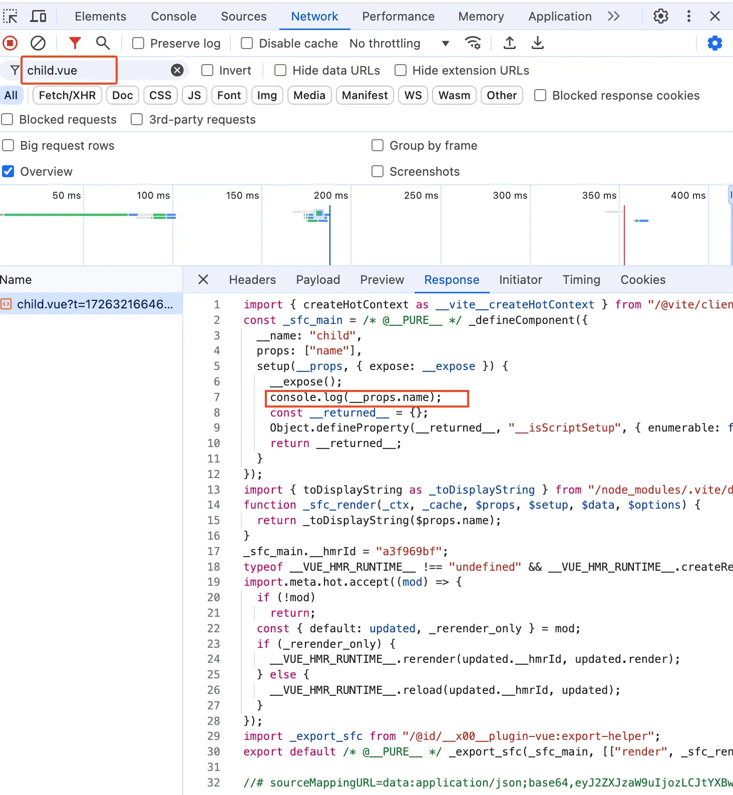{data-zoomable}

从上面可以看到原本的`console.log(localName)`经过编译后就变成了`console.log(__props.name)`，这样当然就不会丢失响应式了。

我们再来看一个另外一种方式解构的例子，这种例子解构后就会丢失响应式，子组件代码如下：
```javascript
<template>
  {{ localName }}
</template>

<script setup lang="ts">
const props = defineProps(["name"]);
const { name: localName } = props;
console.log(localName);
</script>
```
在上面的例子中我们不是直接解构`defineProps`的返回值，而是将返回值赋值给`props`对象，然后再去解构`props`对象拿到`localName`。
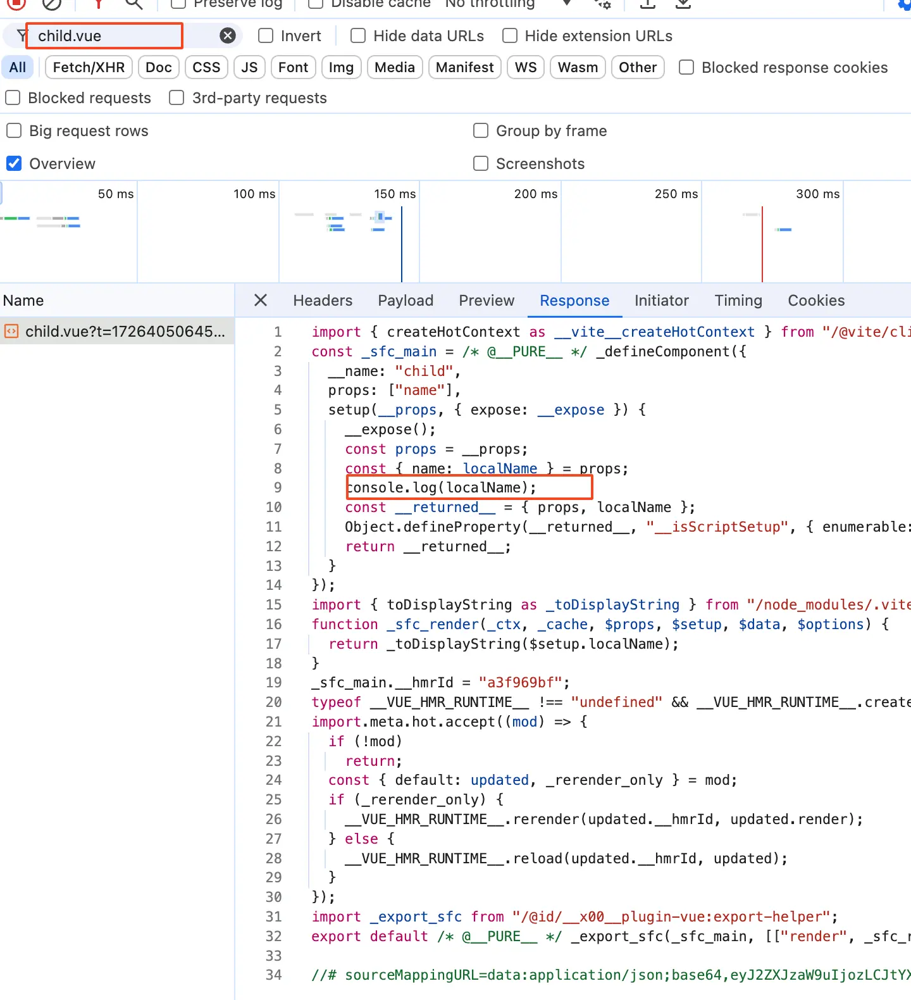{data-zoomable}

从上图中可以看到这种写法使用解构的`localName`时，就不会在编译阶段将其替换为`__props.name`，这样的话`localName`就确实是一个普通的常量了，当然会丢失响应式。

这是为什么呢？为什么这种解构写法就会丢失响应式呢？别着急，我接下来的文章会讲。
# 从哪里开下手？
既然这个是在编译时将`localName`处理成`__props.name`，那我们当然是在编译时debug了。

还是一样的套路，我们在vscode中启动一个`debug`终端。
{data-zoomable}

在之前的 [通过debug搞清楚.vue文件怎么变成.js文件](https://mp.weixin.qq.com/s/0QfalimbwontX3UhSHMZng)文章中我们已经知道了`vue`文件中的`<script>`模块实际是由`vue/compiler-sfc`包的`compileScript`函数处理的。

`compileScript`函数位置在`/node_modules/@vue/compiler-sfc/dist/compiler-sfc.cjs.js`

找到`compileScript`函数就可以给他打一个断点了。
# compileScript函数
在`debug`终端上面执行`yarn dev`后在浏览器中打开对应的页面，比如： [http://localhost:5173/ ](http://localhost:5173/ ) 。此时断点就会走到`compileScript`函数中。

在我们这个场景中简化后的`compileScript`函数代码如下：
```javascript
function compileScript(sfc, options) {
  const ctx = new ScriptCompileContext(sfc, options);
  const scriptSetupAst = ctx.scriptSetupAst;

  // 2.2 process <script setup> body
  for (const node of scriptSetupAst.body) {
    if (node.type === "VariableDeclaration" && !node.declare) {
      const total = node.declarations.length;
      for (let i = 0; i < total; i++) {
        const decl = node.declarations[i];
        const init = decl.init;
        if (init) {
          // defineProps
          const isDefineProps = processDefineProps(ctx, init, decl.id);
        }
      }
    }
  }

  // 3 props destructure transform
  if (ctx.propsDestructureDecl) {
    transformDestructuredProps(ctx);
  }

  return {
    //....
    content: ctx.s.toString(),
  };
}
```
在之前的 [为什么defineProps宏函数不需要从vue中import导入？](https://mp.weixin.qq.com/s/iZ16rACWcWpbZeT4bgheRA)文章中我们已经详细讲解过了`compileScript`函数中的入参`sfc`、如何使用`ScriptCompileContext`类new一个`ctx`上下文对象。所以这篇文章我们就只简单说一下他们的作用即可。

- 入参`sfc`对象：是一个`descriptor`对象，`descriptor`对象是由vue文件编译来的。`descriptor`对象拥有template属性、scriptSetup属性、style属性，分别对应vue文件的`<template>`模块、`<script setup>`模块、`<style>`模块。

- `ctx`上下文对象：这个`ctx`对象贯穿了整个script模块的处理过程，他是根据vue文件的源代码初始化出来的。在`compileScript`函数中处理script模块中的内容，实际就是对`ctx`对象进行操作。最终`ctx.s.toString()`就是返回script模块经过编译后返回的js代码。

搞清楚了入参`sfc`对象和`ctx`上下文对象，我们接着来看`ctx.scriptSetupAst`。从名字我想你也能猜到，他就是script模块中的代码对应的AST抽象语法树。如下图：
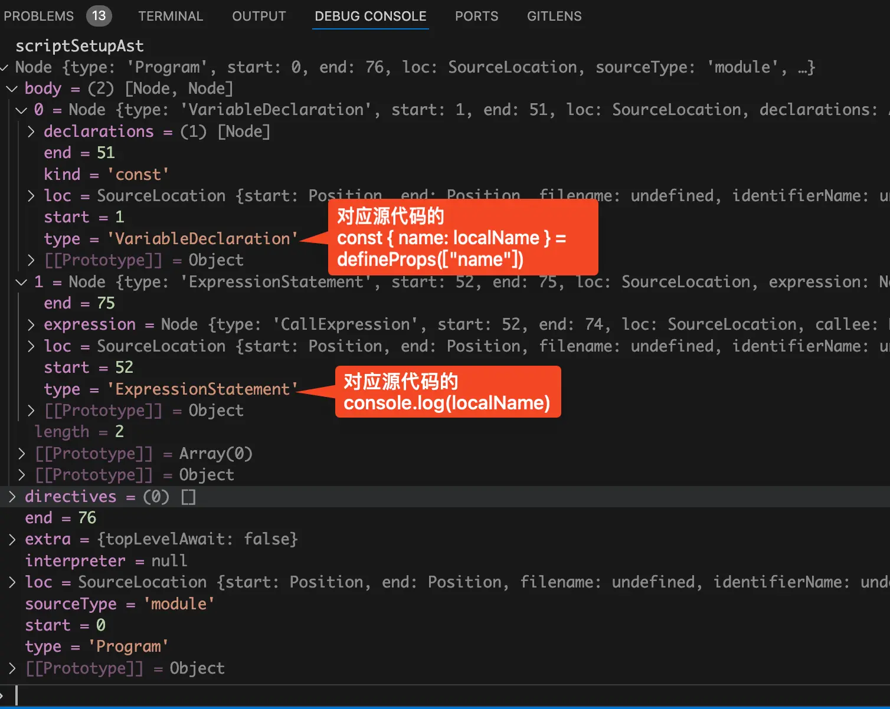{data-zoomable}

从上图中可以看到`body`属性是一个数组，分别对应的是源代码中的两行代码。

数组的第一项对应的Node节点类型是`VariableDeclaration`，他是一个变量声明类型的节点。对应的就是源代码中的第一行：`const { name: localName } = defineProps(["name"])`

数组中的第二项对应的Node节点类型是`ExpressionStatement`，他是一个表达式类型的节点。对应的就是源代码中的第二行：`console.log(localName)`

我们接着来看`compileScript`函数中的外层for循环，也就是遍历前面讲的body数组，代码如下：
```javascript
function compileScript(sfc, options) {
  // ...省略
  // 2.2 process <script setup> body
  for (const node of scriptSetupAst.body) {
    if (node.type === "VariableDeclaration" && !node.declare) {
      const total = node.declarations.length;
      for (let i = 0; i < total; i++) {
        const decl = node.declarations[i];
        const init = decl.init;
        if (init) {
          // defineProps
          const isDefineProps = processDefineProps(ctx, init, decl.id);
        }
      }
    }
  }
  // ...省略
}
```
我们接着来看外层for循环里面的第一个if语句：
```javascript
if (node.type === "VariableDeclaration" && !node.declare)
```
这个if语句的意思是判断当前的节点类型是不是变量声明并且确实有初始化的值。

我们这里的源代码第一行代码如下：
```javascript
const { name: localName } = defineProps(["name"]);
```
很明显我们这里是满足这个if条件的。

接着在if里面还有一个内层for循环，这个for循环是在遍历node节点的`declarations`属性，这个属性是一个数组。

`declarations`数组属性表示当前变量声明语句中定义的所有变量，可能会定义多个变量，所以他才是一个数组。在我们这里只定义了一个变量`localName`，所以 `declarations`数组中只有一项。

在内层for循环，会去遍历声明的变量，然后从变量的节点中取出`init`属性。我想聪明的你从名字应该就可以看出来`init`属性的作用是什么。

没错，`init`属性就是对应的变量的初始化值。在我们这里声明的`localName`变量的初始化值就是`defineProps(["name"])`函数的返回值。

接着就是判断`init`是否存在，也就是判断变量是否是有初始化值。如果为真，那么就执行`processDefineProps(ctx, init, decl.id)`判断初始化值是否是在调用`defineProps`。换句话说就是判断当前的变量声明是否是在调用`defineProps`宏函数。
# processDefineProps函数
接着将断点走进`processDefineProps`函数，在我们这个场景中简化后的代码如下：
```javascript
function processDefineProps(ctx, node, declId) {
  if (!isCallOf(node, DEFINE_PROPS)) {
    return processWithDefaults(ctx, node, declId);
  }
  // handle props destructure
  if (declId && declId.type === "ObjectPattern") {
    processPropsDestructure(ctx, declId);
  }
  return true;
}
```
`processDefineProps`函数接收3个参数。

- 第一个参数`ctx`，表示当前上下文对象。

- 第二个参数`node`，这个节点对应的是变量声明语句中的初始化值的部分。也就是源代码中的`defineProps(["name"])`。

- 第三个参数`declId`，这个对应的是变量声明语句中的变量名称。也就是源代码中的`{ name: localName }`。

在 [为什么defineProps宏函数不需要从vue中import导入？](https://mp.weixin.qq.com/s/iZ16rACWcWpbZeT4bgheRA)文章中我们已经讲过了这里的第一个if语句就是用于判断当前是否在执行`defineProps`函数，如果不是那么就直接`return false`

我们接着来看第二个if语句，这个if语句就是判断当前变量声明是不是“对象解构赋值”。很明显我们这里就是解构出的`localName`变量，所以代码将会走到`processPropsDestructure`函数中。
# `processPropsDestructure`函数
接着将断点走进`processPropsDestructure`函数，在我们这个场景中简化后的代码如下：
```javascript
function processPropsDestructure(ctx, declId) {
  const registerBinding = (
    key: string,
    local: string,
    defaultValue?: Expression
  ) => {
    ctx.propsDestructuredBindings[key] = { local, default: defaultValue };
  };

  for (const prop of declId.properties) {
    const propKey = resolveObjectKey(prop.key);
    registerBinding(propKey, prop.value.name);
  }
}
```
前面讲过了这里的两个入参，`ctx`表示当前上下文对象。`declId`表示变量声明语句中的变量名称。

首先定义了一个名为`registerBinding`的箭头函数。

接着就是使用for循环遍历`declId.properties`变量名称，为什么会有多个变量名称呢？

答案是解构的时候我们可以解构一个对象的多个属性，用于定义多个变量。

`prop`属性如下图：
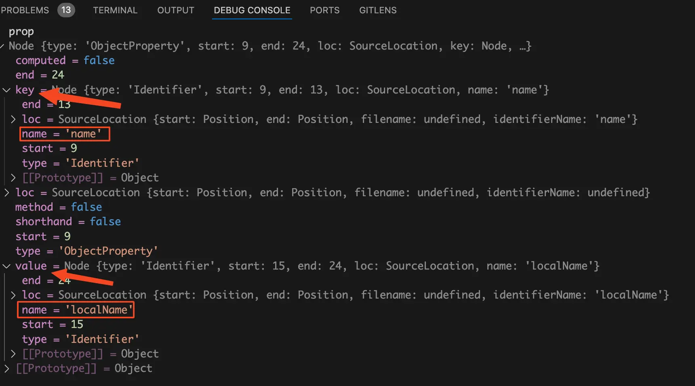{data-zoomable}

从上图可以看到`prop`中有两个属性很显眼，分别是`key`和`value`。

其中`key`属性对应的是解构对象时从对象中要提取出的属性名，因为我们这里是解构的`name`属性，所以上面的值是`name`。

其中`value`属性对应的是解构对象时要赋给的目标变量名称。我们这里是赋值给变量`localName`，所以上面他的值是`localName`。

接着来看for循环中的代码。

执行`const propKey = resolveObjectKey(prop.key)`拿到要从`props`对象中解构出的属性名称。

将断点走进`resolveObjectKey`函数，代码如下：
```javascript
function resolveObjectKey(node: Node) {
  switch (node.type) {
    case "Identifier":
      return node.name;
  }
  return undefined;
}
```
如果当前是标识符节点，也就是有name属性。那么就返回name属性。

最后就是执行`registerBinding`函数。
```javascript
registerBinding(propKey, prop.value.name)
```
第一个参数为传入解构对象时要提取出的属性名称，也就是`name`。第二个参数为解构对象时要赋给的目标变量名称，也就是`localName`。

接着将断点走进`registerBinding`函数，他就在`processPropsDestructure`函数里面。
```javascript
function processPropsDestructure(ctx, declId) {
  const registerBinding = (
    key: string,
    local: string,
    defaultValue?: Expression
  ) => {
    ctx.propsDestructuredBindings[key] = { local, default: defaultValue };
  };
  // ...省略
}
```
`ctx.propsDestructuredBindings`是存在ctx上下文中的一个属性对象，这个对象里面存的是需要解构的多个props。

对象的key就是需要解构的props。

key对应的value也是一个对象，这个对象中有两个字段。其中的`local`属性是解构props后要赋给的变量名称。`default`属性是props的默认值。

在debug终端来看看此时的`ctx.propsDestructuredBindings`对象是什么样的，如下图：
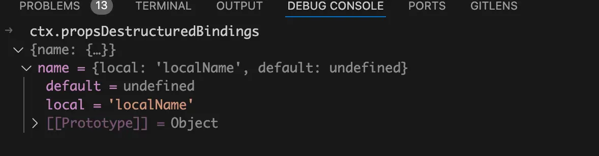{data-zoomable}

从上图中就有看到此时里面已经存了一个`name`属性，表示`props`中的`name`需要解构，解构出来的变量名为`localName`，并且默认值为`undefined`。

经过这里的处理后在ctx上下文对象中的`ctx.propsDestructuredBindings`中就已经存了有哪些props需要解构，以及解构后要赋值给哪个变量。

有了这个后，后续只需要将script模块中的所有代码遍历一次，然后找出哪些在使用的变量是props解构的变量，比如这里的`localName`变量将其替换成`__props.name`即可。
# transformDestructuredProps函数
接着将断点层层返回，走到最外面的`compileScript`函数中。再来回忆一下`compileScript`函数的代码，如下：
```javascript
function compileScript(sfc, options) {
  const ctx = new ScriptCompileContext(sfc, options);
  const scriptSetupAst = ctx.scriptSetupAst;

  // 2.2 process <script setup> body
  for (const node of scriptSetupAst.body) {
    if (node.type === "VariableDeclaration" && !node.declare) {
      const total = node.declarations.length;
      for (let i = 0; i < total; i++) {
        const decl = node.declarations[i];
        const init = decl.init;
        if (init) {
          // defineProps
          const isDefineProps = processDefineProps(ctx, init, decl.id);
        }
      }
    }
  }

  // 3 props destructure transform
  if (ctx.propsDestructureDecl) {
    transformDestructuredProps(ctx);
  }

  return {
    //....
    content: ctx.s.toString(),
  };
}
```
经过`processDefineProps`函数的处理后，`ctx.propsDestructureDecl`对象中已经存了有哪些变量是由props解构出来的。

这里的`if (ctx.propsDestructureDecl)`条件当然满足，所以代码会走到`transformDestructuredProps`函数中。

接着将断点走进`transformDestructuredProps`函数中，在我们这个场景中简化后的`transformDestructuredProps`函数代码如下：
```javascript
import { walk } from 'estree-walker'

function transformDestructuredProps(ctx) {
  const rootScope = {};
  let currentScope = rootScope;
  const propsLocalToPublicMap: Record<string, string> = Object.create(null);

  const ast = ctx.scriptSetupAst;

  for (const key in ctx.propsDestructuredBindings) {
    const { local } = ctx.propsDestructuredBindings[key];
    rootScope[local] = true;
    propsLocalToPublicMap[local] = key;
  }

  walk(ast, {
    enter(node: Node) {
      if (node.type === "Identifier") {
        if (currentScope[node.name]) {
          rewriteId(node);
        }
      }
    },
  });

  function rewriteId(id: Identifier) {
    // x --> __props.x
    ctx.s.overwrite(
      id.start! + ctx.startOffset!,
      id.end! + ctx.startOffset!,
      genPropsAccessExp(propsLocalToPublicMap[id.name])
    );
  }
}
```
在`transformDestructuredProps`函数中主要分为三块代码，分别是for循环、执行`walk`函数、定义`rewriteId`函数。

我们先来看第一个for循环，他是遍历`ctx.propsDestructuredBindings`对象。前面我们讲过了这个对象中存的属性key是解构了哪些props，比如这里就是解构了`name`这个props。

接着就是使用`const { local } = ctx.propsDestructuredBindings[key]`拿到解构的props在子组件中赋值给了哪个变量，我们这里是解构出来后赋给了`localName`变量，所以这里的`local`的值为字符串"localName"。

由于在我们这个demo中只有两行代码，分别是解构props和`console.log`。没有其他的函数，所以这里的作用域只有一个。也就是说`rootScope`始终等于`currentScope`。

所以这里执行`rootScope[local] = true`后，`currentScope`对象中的`localName`属性也会被赋值true。如下图：
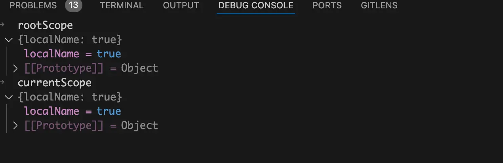{data-zoomable}


接着就是执行`propsLocalToPublicMap[local] = key`，这里的`local`存的是解构props后赋值给子组件中的变量名称，`key`为解构了哪个props。经过这行代码的处理后我们就形成了一个映射，后续根据这个映射就能轻松的将script模块中使用解构后的`localName`的地方替换为`__props.name`。

`propsLocalToPublicMap`对象如下图：
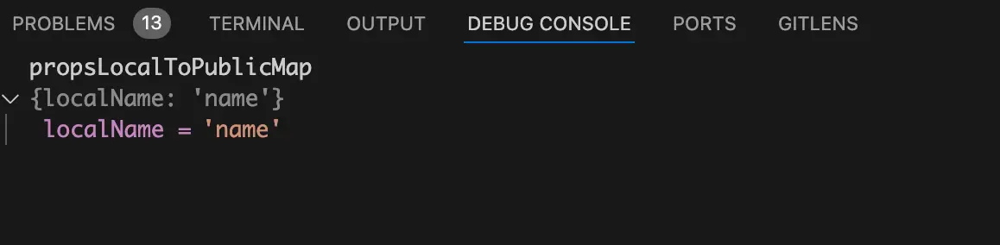{data-zoomable}


经过这个for循环的处理后，我们已经知道了有哪些变量其实是经过props解构来的，以及这些解构得到的变量和props的映射关系。

接下来就是使用`walk`函数去递归遍历script模块中的所有代码，这个递归遍历就是遍历script模块对应的AST抽象语法树。

在这里是使用的`walk`函数来自于第三方库`estree-walker`。

在遍历语法树中的某个节点时，进入的时候会触发一次`enter`回调，出去的时候会触发一次`leave`回调。

`walk`函数的执行代码如下：
```javascript
walk(ast, {
  enter(node: Node) {
    if (node.type === "Identifier") {
      if (currentScope[node.name]) {
        rewriteId(node);
      }
    }
  },
});
```
我们这个场景中只需要`enter`进入的回调就行了。

在`enter`回调中使用外层if判断当前节点的类型是不是`Identifier`，`Identifier`类型可能是变量名、函数名等。

我们源代码中的`console.log(localName)`中的`localName`就是一个变量名，当递归遍历AST抽象语法树遍历到这里的`localName`对应的节点时就会满足外层的if条件。

在debug终端来看看此时满足外层if条件的node节点，如下图：
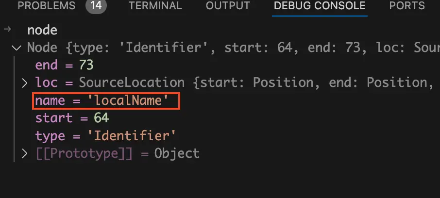{data-zoomable}

从上面的代码可以看到此时的node节点中对应的变量名为`localName`。其中`start`和`end`分别表示`localName`变量的开始位置和结束位置。

我们回忆一下前面讲过了`currentScope`对象中就是存的是有哪些本地的变量是通过props解构得到的，这里的`localName`变量当然是通过props解构得到的，满足里层的if条件判断。

最后代码会走进`rewriteId`函数中，将断点走进`rewriteId`函数中，简化后的代码如下：
```javascript
function rewriteId(id: Identifier) {
  // x --> __props.x
  ctx.s.overwrite(
    id.start + ctx.startOffset,
    id.end + ctx.startOffset,
    genPropsAccessExp(propsLocalToPublicMap[id.name])
  );
}
```
这里使用了`ctx.s.overwrite`方法，这个方法接收三个参数。

第一个参数是：开始位置，对应的是变量`localName`在源码中的开始位置。

第二个参数是：结束位置，对应的是变量`localName`在源码中的结束位置。

第三个参数是想要替换成的新内容。

第三个参数是由`genPropsAccessExp`函数返回的，执行这个函数时传入的是`propsLocalToPublicMap[id.name]`。

前面讲过了`propsLocalToPublicMap`存的是props名称和解构到本地的变量名称的映射关系，`id.name`是解构到本地的变量名称。如下图：
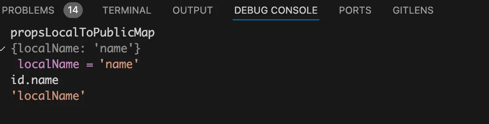{data-zoomable}

所以`propsLocalToPublicMap[id.name]`的执行结果就是`name`，也就是名为`name`的props。

接着将断点走进`genPropsAccessExp`函数，简化后的代码如下：
```javascript
const identRE = /^[_$a-zA-Z\xA0-\uFFFF][_$a-zA-Z0-9\xA0-\uFFFF]*$/;
function genPropsAccessExp(name: string): string {
  return identRE.test(name)
    ? `__props.${name}`
    : `__props[${JSON.stringify(name)}]`;
}
```
使用正则表达式去判断如果满足条件就会返回`__props.${name}`，否则就是返回`__props[${JSON.stringify(name)}]`。

很明显我们这里的`name`当然满足条件，所以`genPropsAccessExp`函数会返回`__props.name`。

那么什么情况下不会满足条件呢？

比如这样的props：
```javascript
const { "first-name": firstName } = defineProps(["first-name"]);
console.log(firstName);
```
这种props在这种情况下就会返回`__props["first-name"]`

执行完`genPropsAccessExp`函数后回到`ctx.s.overwrite`方法的地方，此时我们已经知道了第三个参数的值为`__props.name`。这个方法的执行会将`localName`重写为`__props.name`

在`ctx.s.overwrite`方法执行之前我们来看看此时的script模块中的js代码是什么样的，如下图：
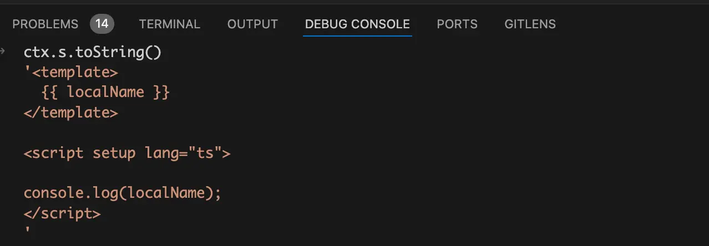{data-zoomable}

从上图中可以看到此时的代码中`console.log`里面还是`localName`。

执行完`ctx.s.overwrite`方法后，我们来看看此时是什么样的，如下图：
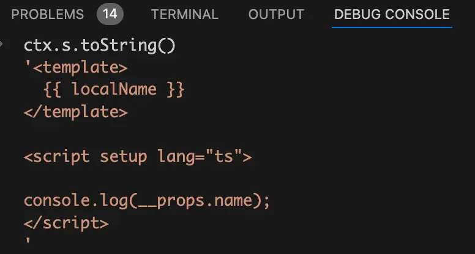{data-zoomable}

从上图中可以看到此时的代码中`console.log`里面已经变成了`__props.name`。

这就是在编译阶段将使用到的解构`localName`变量变成`__props.name`的完整过程。

这会儿我们来看前面那个例子解构后丢失响应式的例子，我想你就很容易想通了。
```javascript
<script setup lang="ts">
const props = defineProps(["name"]);
const { name: localName } = props;
console.log(localName);
</script>
```
在处理`defineProps`宏函数时，发现是直接解构了返回值才会进行处理。上面这个例子中没有直接进行解构，而是将其赋值给`props`，然后再去解构`props`。这种情况下`ctx.propsDestructuredBindings`对象中什么都没有。

后续在递归遍历script模块中的所有代码，发现`ctx.propsDestructuredBindings`对象中什么都没有。自然也不会将`localName`替换为`__props.name`，这样他当然就会丢失响应式了。
# 总结
在编译阶段首先会处理宏函数`defineProps`，在处理的过程中如果发现解构了`defineProps`的返回值，那么就会将解构的`name`属性，以及`name`解构到本地的`localName`变量，都全部一起存到`ctx.propsDestructuredBindings`对象中。

接下来就会去递归遍历script模块中的所有代码，如果发现使用的`localName`变量能够在`ctx.propsDestructuredBindings`对象中找的到。那么就说明这个`localName`变量是由props解构得到的，就会将其替换为`__props.name`，所以使用解构后的props依然不会丢失响应式。

[加入本书对应的「源码交流群」](/guide/contact)
