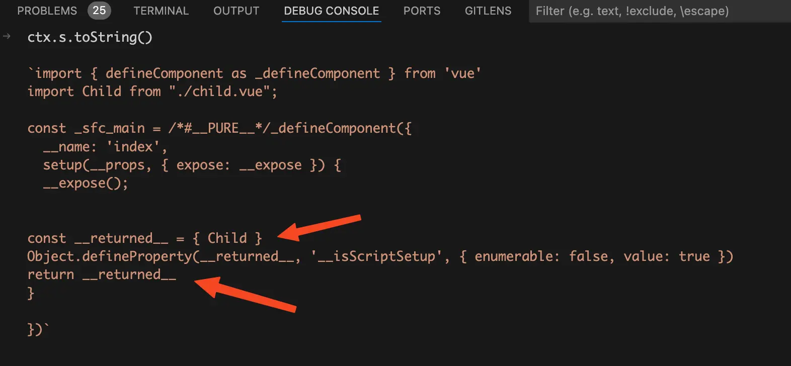
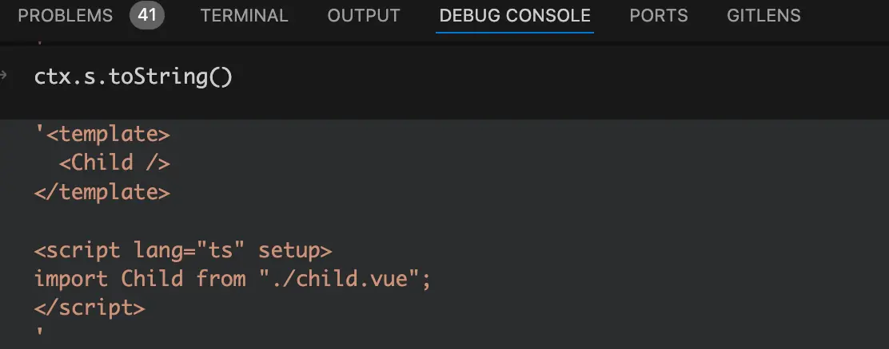
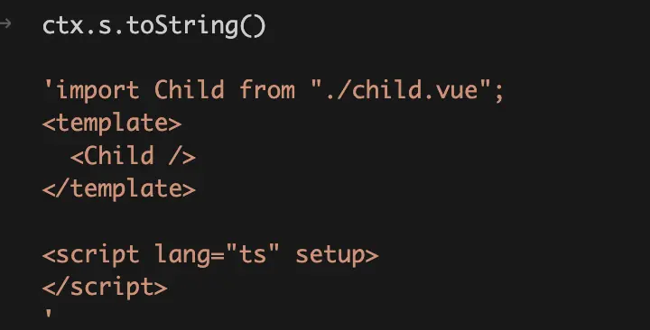
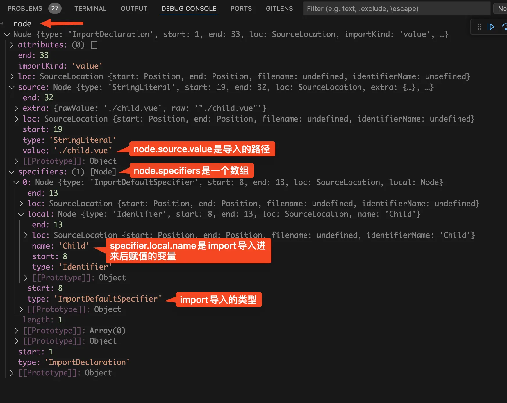
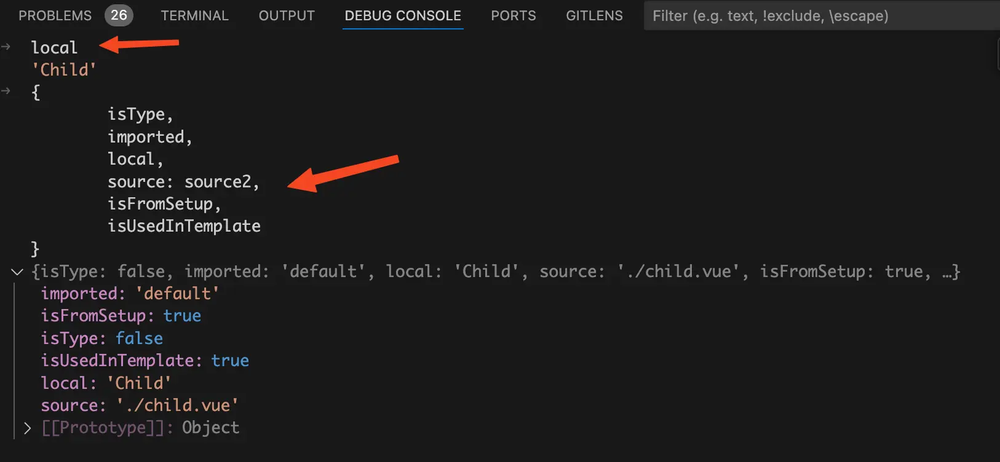

# 前言
众所周知，在vue2的时候使用一个vue组件要么全局注册，要么局部注册。但是在setup语法糖中直接将组件import导入无需注册就可以使用，你知道这是为什么呢？

# 看个demo
我们先来看个简单的demo，代码如下：
```vue
<template>
  <Child />
</template>

<script lang="ts" setup>
import Child from "./child.vue";
</script>
```
上面这个demo在setup语法糖中import导入了`Child`子组件，然后在template中就可以直接使用了。

我们先来看看上面的代码编译后的样子，在之前的文章中已经讲过很多次如何在浏览器中查看编译后的vue文件，这篇文章就不赘述了。编译后的代码如下：
```js
import {
  createBlock as _createBlock,
  defineComponent as _defineComponent,
  openBlock as _openBlock,
} from "/node_modules/.vite/deps/vue.js?v=23bfe016";
import Child from "/src/components/setupComponentsDemo/child.vue";

const _sfc_main = _defineComponent({
  __name: "index",
  setup(__props, { expose: __expose }) {
    __expose();
    const __returned__ = { Child };
    return __returned__;
  },
});

function _sfc_render(_ctx, _cache, $props, $setup, $data, $options) {
  return _openBlock(), _createBlock($setup["Child"]);
}

_sfc_main.render = _sfc_render;
export default _sfc_main;
```
从上面的代码可以看到，编译后setup语法糖已经没有了，取而代之的是一个setup函数。在setup函数中会return一个对象，对象中就包含了`Child`子组件。

有一点需要注意的是，我们原本是在setup语法糖中import导入的`Child`子组件，但是经过编译后import导入的代码已经被提升到setup函数外面去了。

在render函数中使用`$setup["Child"]`就可以拿到`Child`子组件，并且通过`_createBlock($setup["Child"]);`就可以将子组件渲染到页面上去。从命名上我想你应该猜到了`$setup`对象和上面的setup函数的return对象有关，其实这里的`$setup["Child"]`就是setup函数的return对象中的`Child`组件。至于在render函数中是怎么拿到`setup`函数返回的对象可以看我的另外一篇文章： [setup函数](/script/what-setup)

接下来我将通过debug的方式带你了解编译时是如何将`Child`塞到setup函数的return对象中，以及怎么将import导入`Child`子组件的语句提升到setup函数外面去的。
# `compileScript`函数
在上一篇 [setup函数导出变量](/script/setup-vars) 文章中我们已经详细讲过了setup语法糖是如何编译成setup函数，以及如何根据将顶层绑定生成setup函数的return对象。**所以这篇文章的重点是setup语法糖如何处理里面的import导入语句。**

还是一样的套路启动一个debug终端。这里以`vscode`举例，打开终端然后点击终端中的`+`号旁边的下拉箭头，在下拉中点击`Javascript Debug Terminal`就可以启动一个`debug`终端。
{data-zoomable}

然后在`node_modules`中找到`vue/compiler-sfc`包的`compileScript`函数打上断点，`compileScript`函数位置在`/node_modules/@vue/compiler-sfc/dist/compiler-sfc.cjs.js`。接下来我们来看看简化后的`compileScript`函数源码，代码如下：
```js
function compileScript(sfc, options) {
  const ctx = new ScriptCompileContext(sfc, options);
  const setupBindings = Object.create(null);
  const scriptSetupAst = ctx.scriptSetupAst;

  for (const node of scriptSetupAst.body) {
    if (node.type === "ImportDeclaration") {
      // 。。。省略
    }
  }

  for (const node of scriptSetupAst.body) {
    // 。。。省略
  }

  let returned;
  const allBindings = {
    ...setupBindings,
  };
  for (const key in ctx.userImports) {
    if (!ctx.userImports[key].isType && ctx.userImports[key].isUsedInTemplate) {
      allBindings[key] = true;
    }
  }
  returned = `{ `;
  for (const key in allBindings) {
    // ...遍历allBindings对象生成setup函数的返回对象
  }

  return {
    // ...省略
    content: ctx.s.toString(),
  };
}
```
我们先来看看简化后的`compileScript`函数。

在`compileScript`函数中首先使用`ScriptCompileContext`类new了一个`ctx`上下文对象，在new的过程中将`compileScript`函数的入参`sfc`传了过去，`sfc`中包含了`<script setup>`模块的位置信息以及源代码。

`ctx.scriptSetupAst`是`<script setup>`模块中的code代码字符串对应的AST抽象语法树。

接着就是遍历AST抽象语法树的内容，如果发现当前节点是一个import语句，就会将该import收集起来放到`ctx.userImports`对象中（具体如何收集接下来会讲）。

然后会再次遍历AST抽象语法树的内容，如果发现当前节点上顶层声明的变量、函数、类、枚举声明，就将其收集到`setupBindings`对象中。

最后就是使用扩展运算符`...setupBindings`将`setupBindings`对象中的属性合并到`allBindings`对象中。

对于`ctx.userImports`的处理就不一样了，不会将其全部合并到`allBindings`对象中。而是遍历`ctx.userImports`对象，如果当前import导入不是ts的类型导入，并且导入的东西在template模版中使用了，才会将其合并到`allBindings`对象中。

经过前面的处理`allBindings`对象中已经收集了setup语法糖中的所有顶层绑定，然后遍历`allBindings`对象生成setup函数中的return对象。

我们在debug终端来看看生成的return对象，如下图：
{data-zoomable}

从上图中可以看到setup函数中已经有了一个return对象了，return对象的`Child`属性值就是`Child`子组件的引用。
# 收集`import`导入
接下来我们来详细看看如何将setup语法糖中的全部import导入收集到`ctx.userImports`对象中，代码如下：
```js
function compileScript(sfc, options) {
  // 。。。省略
  for (const node of scriptSetupAst.body) {
    if (node.type === "ImportDeclaration") {
      hoistNode(node);
      for (let i = 0; i < node.specifiers.length; i++) {
        // 。。。省略
      }
    }
  }
  // 。。。省略
}
```
遍历`scriptSetupAst.body`也就是`<script setup>`模块中的code代码字符串对应的AST抽象语法树，如果当前节点类型是import导入，就会执行`hoistNode`函数将当前import导入提升到setup函数外面去。
## `hoistNode`函数
将断点走进`hoistNode`函数，代码如下：
```js
function hoistNode(node) {
  const start = node.start + startOffset;
  let end = node.end + startOffset;
  while (end <= source.length) {
    if (!/\s/.test(source.charAt(end))) {
      break;
    }
    end++;
  }
  ctx.s.move(start, end, 0);
}
```
编译阶段生成新的code字符串是基于整个vue源代码去生成的，而不是仅仅基于`<script setup>`模块中的js代码去生成的。我们来看看此时的code代码字符串是什么样的，如下图：
{data-zoomable}

从上图中可以看到此时的code代码字符串还是和初始的源代码差不多，没什么变化。

首先要找到当前import语句在整个vue源代码中开始位置和结束位置在哪里。`node.start`为当前import语句在`<script setup>`模块中的开始位置，`startOffset`为`<script setup>`模块中的内容在整个vue源码中的开始位置。所以`node.start + startOffset`就是当前import语句在整个vue源代码中开始位置，将其赋值给`start`变量。

同理`node.end + startOffset`就是当前import语句在整个vue源代码中结束位置，将其赋值给`end`变量。由于import语句后面可能会有空格，所以需要使用while循环将`end`指向import语句后面非空格前的位置，下一步move的时候将空格一起给move过去。

最后就是调用`ctx.s.move`方法，这个方法接收三个参数。第一个参数是要移动的字符串开始位置，第二个参数是要移动的字符串结束位置，第三个参数为将字符串移动到的位置。

所以这里的`ctx.s.move(start, end, 0)`就是将import语句移动到最前面的位置，执行完`ctx.s.move`方法后，我们在debug终端来看看此时的code代码字符串，如下图：
{data-zoomable}

从上图中可以看到import语句已经被提升到了最前面去了。
## 遍历import导入说明符
我们接着来看前面省略的遍历`node.specifiers`的代码，如下：
```js
function compileScript(sfc, options) {
  // 。。。省略

  for (const node of scriptSetupAst.body) {
    if (node.type === "ImportDeclaration") {
      hoistNode(node);
      for (let i = 0; i < node.specifiers.length; i++) {
        const specifier = node.specifiers[i];
        const local = specifier.local.name;
        const imported = getImportedName(specifier);
        const source2 = node.source.value;
        registerUserImport(
          source2,
          local,
          imported,
          node.importKind === "type" ||
            (specifier.type === "ImportSpecifier" &&
              specifier.importKind === "type"),
          true,
          !options.inlineTemplate
        );
      }
    }
  }

  // 。。。省略
}
```
我们先在debug终端看看`node.specifiers`数组是什么样的，如下图：
{data-zoomable}

从上图中可以看到`node.specifiers`数组是一个导入说明符，那么为什么他是一个数组呢？原因是import导入的时候可以一次导入 多个变量进来，比如`import {format, parse} from "./util.js"`

`node.source.value`是当前import导入的路径，在我们这里是`./child.vue`。

`specifier.local.name`是将import导入进来后赋值的变量，这里是赋值为`Child`变量。

`specifier.type`是导入的类型，这里是`ImportDefaultSpecifier`，说明是default导入。

接着调用`getImportedName`函数，根据导入说明符获取当前导入的name。代码如下：
```js
function getImportedName(specifier) {
  if (specifier.type === "ImportSpecifier")
    return specifier.imported.type === "Identifier"
      ? specifier.imported.name
      : specifier.imported.value;
  else if (specifier.type === "ImportNamespaceSpecifier") return "*";
  return "default";
}
```
大家都知道import导入有三种写法，分别对应的就是`getImportedName`函数中的三种情况。如下：
```js
import { format } from "./util.js";	// 命名导入
import * as foo from 'module';	// 命名空间导入
import Child from "./child.vue";	// default导入的方式
```
如果是命名导入，也就是`specifier.type === "ImportSpecifier"`，就会返回导入的名称。

如果是命名空间导入，也就是`specifier.type === "ImportNamespaceSpecifier"`，就会返回字符串`*`。

否则就是default导入，返回字符串`default`。

最后就是拿着这些import导入相关的信息去调用`registerUserImport`函数。
## `registerUserImport`函数
将断点走进`registerUserImport`函数，代码如下：
```js
function registerUserImport(
  source2,
  local,
  imported,
  isType,
  isFromSetup,
  needTemplateUsageCheck
) {
  let isUsedInTemplate = needTemplateUsageCheck;
  if (
    needTemplateUsageCheck &&
    ctx.isTS &&
    sfc.template &&
    !sfc.template.src &&
    !sfc.template.lang
  ) {
    isUsedInTemplate = isImportUsed(local, sfc);
  }
  ctx.userImports[local] = {
    isType,
    imported,
    local,
    source: source2,
    isFromSetup,
    isUsedInTemplate,
  };
}
```
`registerUserImport`函数就是将当前import导入收集到`ctx.userImports`对象中的地方，我们先不看里面的那块if语句，先来在debug终端中来看看`ctx.userImports`对象中收集了哪些import导入的信息。如下图：
{data-zoomable}

从上图中可以看到收集到`ctx.userImports`对象中的key就是import导入进来的变量名称，在这里就是`Child`变量。

- `imported: 'default'`：表示当前import导入是个default导入的方式。

- `isFromSetup: true`：表示当前import导入是从setup函数中导入的。

- `isType: false`：表示当前import导入不是一个ts的类型导入，后面生成return对象时判断是否要将当前import导入加到return对象中，会去读取`ctx.userImports[key].isType`属性，其实就是这里的`isType`。

- `local: 'Child'`：表示当前import导入进来的变量名称。

- `source: './child.vue'`：表示当前import导入进来的路径。

- `isUsedInTemplate: true`：表示当前import导入的变量是不是在template中使用。

上面的一堆变量大部分都是在上一步"遍历import导入说明符"时拿到的，除了`isUsedInTemplate`以外。这个变量是调用`isImportUsed`函数返回的。

## `isImportUsed`函数
将断点走进`isImportUsed`函数，代码如下：
```js
function isImportUsed(local, sfc) {
  return resolveTemplateUsedIdentifiers(sfc).has(local);
}
```
这个`local`你应该还记得，他的值是`Child`变量。`resolveTemplateUsedIdentifiers(sfc)`函数会返回一个set集合，所以`has(local)`就是返回的set集合中是否有`Child`变量，也就是template中是否有使用`Child`组件。
## `resolveTemplateUsedIdentifiers`函数
接着将断点走进`resolveTemplateUsedIdentifiers`函数，代码如下：
```js
function resolveTemplateUsedIdentifiers(sfc): Set<string> {
  const { ast } = sfc.template!;
  const ids = new Set<string>();
  ast.children.forEach(walk);

  function walk(node) {
    switch (node.type) {
      case NodeTypes.ELEMENT:
        let tag = node.tag;
        if (
          !CompilerDOM.parserOptions.isNativeTag(tag) &&
          !CompilerDOM.parserOptions.isBuiltInComponent(tag)
        ) {
          ids.add(camelize(tag));
          ids.add(capitalize(camelize(tag)));
        }
        node.children.forEach(walk);
        break;
      case NodeTypes.INTERPOLATION:
      // ...省略
    }
  }
  return ids;
}
```
`sfc.template.ast`就是vue文件中的template模块对应的AST抽象语法树。遍历AST抽象语法树，如果当前节点类型是一个element元素节点，比如div节点、又或者`<Child />`这种节点。

`node.tag`就是当前节点的名称，如果是普通div节点，他的值就是`div`。如果是`<Child />`节点，他的值就是`Child`。

然后调用`isNativeTag`方法和`isBuiltInComponent`方法，如果当前节点标签既不是原生html标签，也不是vue内置的组件，那么就会执行两行`ids.add`方法，将当前自定义组件变量收集到名为`ids`的set集合中。

我们先来看第一个`ids.add(camelize(tag))`方法，`camelize`代码如下：
```js
const camelizeRE = /-(\w)/g;
const camelize = (str) => {
  return str.replace(camelizeRE, (_, c) => (c ? c.toUpperCase() : ""));
};
```
`camelize`函数使用正则表达式将kebab-case命名法，转换为首字母为小写的驼峰命名法。比如`my-component`经过`camelize`函数的处理后就变成了`myComponent`。这也就是为什么以 `myComponent` 为名注册的组件，在模板中可以通过 `<myComponent>` 或 `<my-component>` 引用。

再来看第二个`ids.add(capitalize(camelize(tag)))`方法，经过`camelize`函数的处理后已经变成了首字母为小写的小驼峰命名法，然后执行`capitalize`函数。代码如下：
```js
const capitalize = (str) => {
  return str.charAt(0).toUpperCase() + str.slice(1);
};
```
`capitalize`函数的作用就是将首字母为小写的驼峰命名法转换成首字母为大写的驼峰命名法。这也就是为什么以 `MyComponent` 为名注册的组件，在模板中可以通过 `<myComponent>`、`<my-component>`或者是 `<myComponent>` 引用。

我们这个场景中是使用`<Child />`引用子组件，所以set集合中就会收集`Child`。再回到`isImportUsed`函数，代码如下：
```js
function isImportUsed(local, sfc) {
  return resolveTemplateUsedIdentifiers(sfc).has(local);
}
```
前面讲过了`local`变量的值是`Child`，`resolveTemplateUsedIdentifiers(sfc)`返回的是包含`Child`的set集合，所以`resolveTemplateUsedIdentifiers(sfc).has(local)`的值是true。也就是`isUsedInTemplate`变量的值是true，表示当前import导入变量是在template中使用。后面生成return对象时判断是否要将当前import导入加到return对象中，会去读取`ctx.userImports[key].isUsedInTemplate`属性，其实就是这个`isUsedInTemplate`变量。
# 总结
执行`compileScript`函数会将setup语法糖编译成setup函数，在`compileScript`函数中会去遍历`<script setup>`对应的AST抽象语法树。

如果是顶层变量、函数、类、枚举声明，就会将其收集到`setupBindings`对象中。

如果是import语句，就会将其收集到`ctx.userImports`对象中。还会根据import导入的信息判断当前import导入是否是ts的类型导入，并且赋值给`isType`属性。然后再去递归遍历template模块对应的AST抽象语法树，看import导入的变量是否在template中使用，并且赋值给`isUsedInTemplate`属性。

遍历`setupBindings`对象和`ctx.userImports`对象中收集的所有顶层绑定，生成setup函数中的return对象。在遍历`ctx.userImports`对象的时候有点不同，会去判断当前import导入不是ts的类型导入并且在还在template中使用了，才会将其加到setup函数的return对象中。在我们这个场景中setup函数会返回`{ Child }`对象。

在render函数中使用`$setup["Child"]`将子组件渲染到页面上去，而这个`$setup["Child"]`就是在setup函数中返回的`Child`属性，也就是`Child`子组件的引用。


[加入本书对应的「源码交流群」](/guide/contact)
