# 前言
我们每天写vue3代码的时候都会使用到setup语法糖，那你知道为什么setup语法糖中的顶层绑定可以在template中直接使用的呢？setup语法糖是如何编译成setup函数的呢？本文将围绕这些问题带你揭开setup语法糖的神秘面纱。

# 看个demo
看个简单的demo，代码如下：
```vue
<template>
  <h1>{{ msg }}</h1>
  <h2>{{ format(msg) }}</h2>
  <h3>{{ title }}</h3>
  <Child />
</template>

<script lang="ts" setup>
import { ref } from "vue";
import Child from "./child.vue";
import { format } from "./util.js";

const msg = ref("Hello World!");

let title;

if (msg.value) {
  const innerContent = "xxx";
  console.log(innerContent);
  title = "111";
} else {
  title = "222";
}
</script>

```
在上面的demo中定义了四个顶层绑定：`Child`子组件、从`util.js`文件中导入的`format`方法、使用ref定义的`msg`只读常量、使用let定义的`title`变量。并且在template中直接使用了这四个顶层绑定。

由于`innerContent`是在if语句里面的变量，不是`<script setup>`中的顶层绑定，所以在template中是不能使用`innerContent`的。

**但是你有没有想过为什么`<script setup>`中的顶层绑定就能在template中使用，而像`innerContent`这种非顶层绑定就不能在template中使用呢？**

我们先来看看上面的代码编译后的样子，在之前的文章中已经讲过很多次如何在浏览器中查看编译后的vue文件，这篇文章就不赘述了。编译后的代码如下：
```js
import { defineComponent as _defineComponent } from "/node_modules/.vite/deps/vue.js?v=23bfe016";
import { ref } from "/node_modules/.vite/deps/vue.js?v=23bfe016";
import Child from "/src/components/setupDemo2/child.vue";
import { format } from "/src/components/setupDemo2/util.js";

const _sfc_main = _defineComponent({
  __name: "index",
  setup(__props, { expose: __expose }) {
    __expose();
    const msg = ref("Hello World!");
    let title;
    if (msg.value) {
      const innerContent = "xxx";
      console.log(innerContent);
      title = "111";
    } else {
      title = "222";
    }
    const __returned__ = {
      msg,
      get title() {
        return title;
      },
      set title(v) {
        title = v;
      },
      Child,
      get format() {
        return format;
      },
    };
    return __returned__;
  },
});

function _sfc_render(_ctx, _cache, $props, $setup, $data, $options) {
  // ...省略
}
_sfc_main.render = _sfc_render;
export default _sfc_main;
```
从上面的代码中可以看到编译后已经没有了`<script setup>`，取而代之的是一个setup函数，这也就证明了为什么说setup是一个编译时语法糖。

setup函数的参数有两个，第一个参数为组件的 `props`。第二个参数为**Setup 上下文**对象，上下文对象暴露了其他一些在 `setup` 中可能会用到的值，比如：`expose`等。

再来看看setup函数中的内容，其实和我们的源代码差不多，只是多了一个return。**使用return会将组件中的那四个顶层绑定暴露出去，所以在template中就可以直接使用`<script setup>`中的顶层绑定。**

值的一提的是在return对象中`title`变量和`format`函数有点特别。`title`、`format`这两个都是属于**访问器属性**，其他两个`msg`、`Child`属于常见的数据属性。

`title`是一个**访问器属性**，同时拥有`get` 和 `set`，读取`title`变量时会走进`get`中，当给`title`变量赋值时会走进`set`中。

`format`也是一个**访问器属性**，他只拥有`get` ，调用`format`函数时会走进`get`中。由于他没有`set`，所以不能给`format`函数重新赋值。其实这个也很容易理解，因为`format`函数是从`util.js`文件中import导入的，当然不能给他重新赋值。

至于在template中是怎么拿到`setup`函数返回的对象可以看我的另外一篇文章： [setup函数](/script/what-setup)

**看到这里有的小伙伴会有疑问了，不是还有一句`import { ref } from "vue"`也是顶层绑定，为什么里面的`ref`没有在setup函数中使用return暴露出去呢？还有在return对象中是如何将`title`、`format`识别为访问器属性呢？**

在接下来的文章中我会逐一解答这些问题。
# `compileScript`函数
在之前的 [vue文件编译成js文件](/guide/vue-to-js)文章中已经讲过了vue的script模块中的内容是由`@vue/compiler-sfc`包中的`compileScript`函数处理的。

首先我们需要启动一个debug终端。这里以`vscode`举例，打开终端然后点击终端中的`+`号旁边的下拉箭头，在下拉中点击`Javascript Debug Terminal`就可以启动一个`debug`终端。
{data-zoomable}

然后在`node_modules`中找到`vue/compiler-sfc`包的`compileScript`函数打上断点，`compileScript`函数位置在`/node_modules/@vue/compiler-sfc/dist/compiler-sfc.cjs.js`。接下来我们先看看简化后的`compileScript`函数源码。
## 简化后的`compileScript`函数
在`debug`终端上面执行`yarn dev`后在浏览器中打开对应的页面，比如：[http://localhost:5173/](http://localhost:5173/) 。此时断点就会走到`compileScript`函数中，在我们这个场景中简化后的`compileScript`函数代码如下：
```js
function compileScript(sfc, options) {
  // ---- 第一部分 ----
  // 根据<script setup>中的内容生成一个ctx上下文对象
  // 在ctx上下文对象中拥有一些属性和方法
  const ctx = new ScriptCompileContext(sfc, options);
  const { source, filename } = sfc;
  // 顶层声明的变量、函数组成的对象
  const setupBindings = Object.create(null);
  // script标签中的内容开始位置和结束位置
  const startOffset = ctx.startOffset;
  const endOffset = ctx.endOffset;
  // script setup中的内容编译成的AST抽象语法树
  const scriptSetupAst = ctx.scriptSetupAst;

  // ---- 第二部分 ----
  // 遍历<script setup>中的内容，处理里面的import语句、顶层变量、函数、类、枚举声明还有宏函数
  for (const node of scriptSetupAst.body) {
    if (node.type === "ImportDeclaration") {
      // ...省略
    }
  }
  for (const node of scriptSetupAst.body) {
    if (
      (node.type === "VariableDeclaration" ||
        node.type === "FunctionDeclaration" ||
        node.type === "ClassDeclaration" ||
        node.type === "TSEnumDeclaration") &&
      !node.declare
    ) {
      // 顶层声明的变量、函数、类、枚举声明组成的setupBindings对象
      // 给setupBindings对象赋值，{msg: 'setup-ref'}
      // 顶层声明的变量组成的setupBindings对象
      walkDeclaration(
        "scriptSetup",
        node,
        setupBindings,
        vueImportAliases,
        hoistStatic
      );
    }
  }

  // ---- 第三部分 ----
  // 移除template中的内容和script的开始标签
  ctx.s.remove(0, startOffset);
  // 移除style中的内容和script的结束标签
  ctx.s.remove(endOffset, source.length);

  // ---- 第四部分 ----
  // 将<script setup>中的顶层绑定的元数据存储到ctx.bindingMetadata对象中
  // 为什么要多此一举存储一个bindingMetadata对象呢？答案是setup的return的对象有时会直接返回顶层变量，有时会返回变量的get方法，有时会返回变量的get和set方法，
  // 所以才需要一个bindingMetadata对象来存储这些顶层绑定的元数据。
  for (const [key, { isType, imported, source: source2 }] of Object.entries(
    ctx.userImports
  )) {
    if (isType) continue;
    ctx.bindingMetadata[key] =
      imported === "*" ||
      (imported === "default" && source2.endsWith(".vue")) ||
      source2 === "vue"
        ? "setup-const"
        : "setup-maybe-ref";
  }
  for (const key in setupBindings) {
    ctx.bindingMetadata[key] = setupBindings[key];
  }
  // 生成setup方法的args参数;
  let args = `__props`;
  const destructureElements =
    ctx.hasDefineExposeCall || !options.inlineTemplate
      ? [`expose: __expose`]
      : [];
  if (destructureElements.length) {
    args += `, { ${destructureElements.join(", ")} }`;
  }

  // ---- 第五部分 ----
  // 根据<script setup>中的顶层绑定生成return对象中的内容
  let returned;
  const allBindings = {
    ...setupBindings,
  };
  for (const key in ctx.userImports) {
    // 不是引入ts中的类型并且import导入的变量还需要在template中使用
    if (!ctx.userImports[key].isType && ctx.userImports[key].isUsedInTemplate) {
      allBindings[key] = true;
    }
  }
  returned = `{ `;
  for (const key in allBindings) {
    if (
      allBindings[key] === true &&
      ctx.userImports[key].source !== "vue" &&
      !ctx.userImports[key].source.endsWith(".vue")
    ) {
      returned += `get ${key}() { return ${key} }, `;
    } else if (ctx.bindingMetadata[key] === "setup-let") {
      const setArg = key === "v" ? `_v` : `v`;
      returned += `get ${key}() { return ${key} }, set ${key}(${setArg}) { ${key} = ${setArg} }, `;
    } else {
      returned += `${key}, `;
    }
  }
  returned = returned.replace(/, $/, "") + ` }`;
  ctx.s.appendRight(
    endOffset,
    `
const __returned__ = ${returned}
Object.defineProperty(__returned__, '__isScriptSetup', { enumerable: false, value: true })
return __returned__
}
`
  );

  // ---- 第六部分 ----
  // 生成setup函数
  ctx.s.prependLeft(
    startOffset,
    `
${genDefaultAs} /*#__PURE__*/${ctx.helper(
      `defineComponent`
    )}({${def}${runtimeOptions}
${hasAwait ? `async ` : ``}setup(${args}) {
${exposeCall}`
  );
  ctx.s.appendRight(endOffset, `})`);

  // ---- 第七部分 ----
  // 插入import vue语句
  if (ctx.helperImports.size > 0) {
    ctx.s.prepend(
      `import { ${[...ctx.helperImports]
        .map((h) => `${h} as _${h}`)
        .join(", ")} } from 'vue'
`
    );
  }

  return {
    // ...省略
    bindings: ctx.bindingMetadata,
    imports: ctx.userImports,
    content: ctx.s.toString(),
  };
}

```
首先我们来看看`compileScript`函数的第一个参数`sfc`对象，在之前的文章 [vue文件编译成js文件](/guide/vue-to-js) 中我们已经讲过了`sfc`是一个`descriptor`对象，`descriptor`对象是由vue文件编译来的。

`descriptor`对象拥有template属性、scriptSetup属性、style属性，分别对应vue文件的`<template>`模块、`<script setup>`模块、`<style>`模块。

在我们这个场景只关注`scriptSetup`属性，`sfc.scriptSetup.content`的值就是`<script setup>`模块中`code`代码字符串，

`sfc.source`的值就是`vue`文件中的源代码code字符串。`sfc.scriptSetup.loc.start.offset`为`<script setup>`中内容开始位置，`sfc.scriptSetup.loc.end.offset`为`<script setup>`中内容结束位置。详情查看下图：
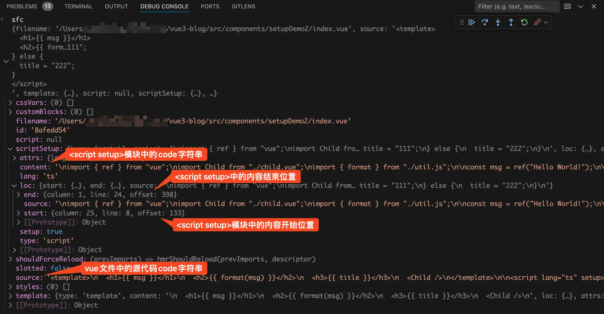{data-zoomable}


我们再来看`compileScript`函数中的内容，在`compileScript`函数中包含了从`<script setup>`语法糖到setup函数的完整流程。乍一看可能比较难以理解，所以我将其分为七块。

- 根据`<script setup>`中的内容生成一个ctx上下文对象。

- 遍历`<script setup>`中的内容，处理里面的import语句、顶层变量、顶层函数、顶层类、顶层枚举声明等。

- 移除template和style中的内容，以及script的开始标签和结束标签。

- 将`<script setup>`中的顶层绑定的元数据存储到`ctx.bindingMetadata`对象中。

- 根据`<script setup>`中的顶层绑定生成return对象。

- 生成setup函数定义

- 插入import vue语句

在接下来的文章中我将逐个分析这七块的内容。
## 生成ctx上下文对象
我们来看第一块的代码，如下：
```js
// 根据<script setup>中的内容生成一个ctx上下文对象
// 在ctx上下文对象中拥有一些属性和方法
const ctx = new ScriptCompileContext(sfc, options);
const { source, filename } = sfc;
// 顶层声明的变量、函数组成的对象
const setupBindings = Object.create(null);
// script标签中的内容开始位置和结束位置
const startOffset = ctx.startOffset;
const endOffset = ctx.endOffset;
// script setup中的内容编译成的AST抽象语法树
const scriptSetupAst = ctx.scriptSetupAst;
```
在这一块的代码中主要做了一件事，使用`ScriptCompileContext`构造函数new了一个ctx上下文对象。在之前的 [defineProps](/script/defineProps)文章中我们已经讲过了`ScriptCompileContext`构造函数里面的具体代码，这篇文章就不赘述了。

本文只会讲用到的`ScriptCompileContext`类中的`startOffset`、`endOffset`、`scriptSetupAst`、`userImports`、`helperImports`、`bindingMetadata`、`s`等属性。

- `startOffset`、`endOffset`属性是在`ScriptCompileContext`类的`constructor`构造函数中赋值的。其实就是`sfc.scriptSetup.loc.start.offset`和`sfc.scriptSetup.loc.end.offset`，`<script setup>`中内容开始位置和`<script setup>`中内容结束位置，只是将这两个字段塞到ctx上下文中。

- `scriptSetupAst`是在`ScriptCompileContext`类的`constructor`构造函数中赋值的，他是`<script setup>`模块的代码转换成的AST抽象语法树。在`ScriptCompileContext`类的`constructor`构造函数中会调用`@babel/parser`包的`parse`函数，以`<script setup>`中的code代码字符串为参数生成AST抽象语法树。

- `userImports`在new一个ctx上下文对象时是一个空对象，用于存储import导入的顶层绑定内容。

- `helperImports`同样在new一个ctx上下文对象时是一个空对象，用于存储需要从vue中import导入的函数。

- `bindingMetadata`同样在new一个ctx上下文对象时是一个空对象，用于存储所有的import顶层绑定和变量顶层绑定的元数据。

- `s`属性是在`ScriptCompileContext`类的`constructor`构造函数中赋值的，以`vue`文件中的源代码code字符串为参数`new`了一个`MagicString`对象赋值给`s`属性。

`magic-string`是由[svelte](https://github.com/sveltejs/svelte)的作者写的一个库，用于处理字符串的`JavaScript`库。它可以让你在字符串中进行插入、删除、替换等操作，并且能够生成准确的`sourcemap`。

`MagicString`对象中拥有`toString`、`remove`、`prependLeft`、`appendRight`等方法。`s.toString`用于生成返回的字符串，我们来举几个例子看看这几个方法你就明白了。

`s.remove( start, end )`用于删除从开始到结束的字符串：
```js
const s = new MagicString('hello word');
s.remove(0, 6);
s.toString(); // 'word'
```
`s.prependLeft( index, content )`用于在指定`index`的前面插入字符串：
```js
const s = new MagicString('hello word');
s.prependLeft(5, 'xx');
s.toString(); // 'helloxx word'
```
`s.appendRight( index, content )`用于在指定`index`的后面插入字符串：
```js
const s = new MagicString('hello word');
s.appendRight(5, 'xx');
s.toString(); // 'helloxx word'
```
除了上面说的那几个属性，在这里定义了一个`setupBindings`变量。初始值是一个空对象，用于存储顶层声明的变量、函数等。
## 遍历`<script setup>`body中的内容
将断点走到第二部分，代码如下：
```js
for (const node of scriptSetupAst.body) {
  if (node.type === "ImportDeclaration") {
    // ...省略
  }
}

for (const node of scriptSetupAst.body) {
  if (
    (node.type === "VariableDeclaration" ||
      node.type === "FunctionDeclaration" ||
      node.type === "ClassDeclaration" ||
      node.type === "TSEnumDeclaration") &&
    !node.declare
  ) {
    // 顶层声明的变量、函数、类、枚举声明组成的setupBindings对象
    // 给setupBindings对象赋值，{msg: 'setup-ref'}
    // 顶层声明的变量组成的setupBindings对象
    walkDeclaration(
      "scriptSetup",
      node,
      setupBindings,
      vueImportAliases,
      hoistStatic
    );
  }
}
```
在这一部分的代码中使用for循环遍历了两次`scriptSetupAst.body`，`scriptSetupAst.body`为script中的代码对应的AST抽象语法树中body的内容，如下图：
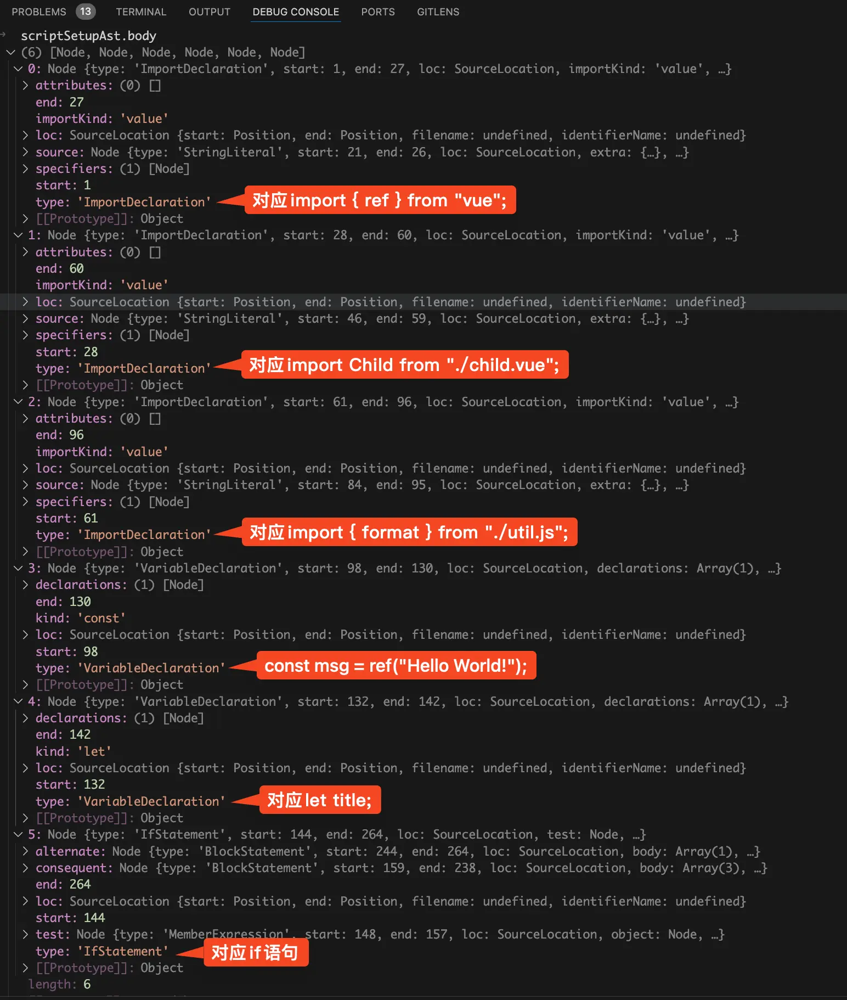{data-zoomable}

从上图中可以看到`scriptSetupAst.body`数组有6项，分别对应的是script模块中的6块代码。

第一个for循环中使用if判断`node.type === "ImportDeclaration"`，也就是判断是不是import语句。如果是import语句，那么import的内容肯定是顶层绑定，需要将import导入的内容存储到`ctx.userImports`对象中。注：后面会专门写一篇文章来讲如何收集所有的import导入。

通过这个for循环已经将所有的import导入收集到了`ctx.userImports`对象中了，在debug终端看看此时的`ctx.userImports`，如下图：
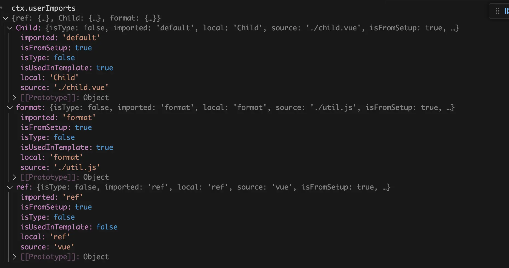{data-zoomable}

从上图中可以看到在`ctx.userImports`中收集了三个import导入，分别是`Child`组件、`format`函数、`ref`函数。

在里面有几个字段需要注意，`isUsedInTemplate`表示当前import导入的东西是不是在template中使用，如果为true那么就需要将这个import导入塞到return对象中。

`isType`表示当前import导入的是不是type类型，因为在ts中是可以使用import导入type类型，很明显type类型也不需要塞到return对象中。

我们再来看第二个for循环，同样也是遍历`scriptSetupAst.body`。如果当前是变量定义、函数定义、类定义、ts枚举定义，这四种类型都属于顶层绑定（除了import导入以外就只有这四种顶层绑定了）。需要调用`walkDeclaration`函数将这四种顶层绑定收集到`setupBindings`对象中。

从前面的`scriptSetupAst.body`图中可以看到if模块的type为`IfStatement`，明显不属于上面的这四种类型，所以不会执行`walkDeclaration`函数将里面的`innerContent`变量收集起来后面再塞到return对象中。**这也就解释了为什么非顶层绑定不能在template中直接使用。**

我们在debug终端来看看执行完第二个for循环后`setupBindings`对象是什么样的，如下图：
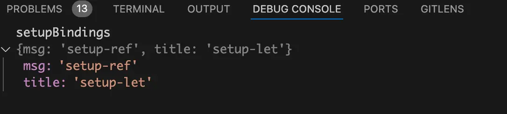{data-zoomable}

从上图中可以看到在`setupBindings`对象中收集`msg`和`title`这两个顶层变量。其中的`setup-ref`表示当前变量是一个ref定义的变量，`setup-let`表示当前变量是一个let定义的变量。
## 移除template模块和style模块
接着将断点走到第三部分，代码如下：
```js
ctx.s.remove(0, startOffset);
ctx.s.remove(endOffset, source.length);
```
这块代码很简单，`startOffset`为`<script setup>`中的内容开始位置，`endOffset`为`<script setup>`中的内容结束位置，`ctx.s.remove`方法为删除字符串。

所以`ctx.s.remove(0, startOffset)`的作用是：移除template中的内容和script的开始标签。

`ctx.s.remove(endOffset, source.length)`的作用是：移除style中的内容和script的结束标签。

我们在debug终端看看执行这两个`remove`方法之前的code代码字符串是什么样的，如下图：
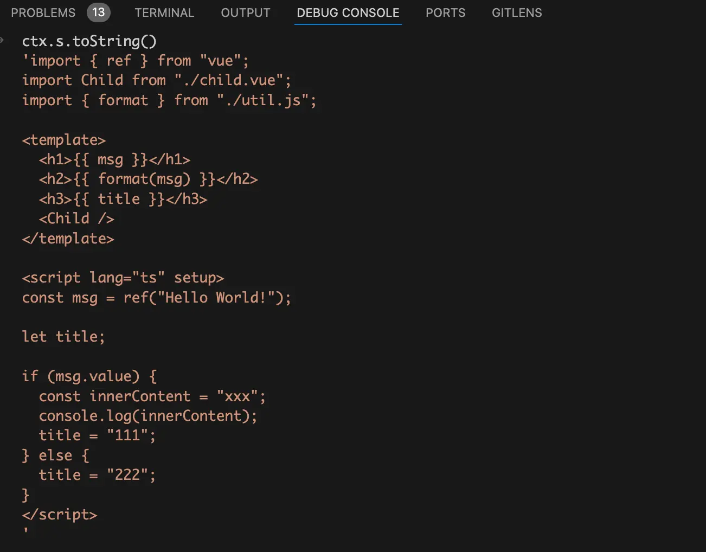{data-zoomable}

从上图中可以看到此时的code代码字符串和我们源代码差不多，唯一的区别就是那几个import导入已经被提取到script标签外面去了（这个是在前面第一个for循环处理import导入的时候处理的）。

将断点走到执行完这两个remove方法之后，在debug终端看看此时的code代码字符串，如下图：
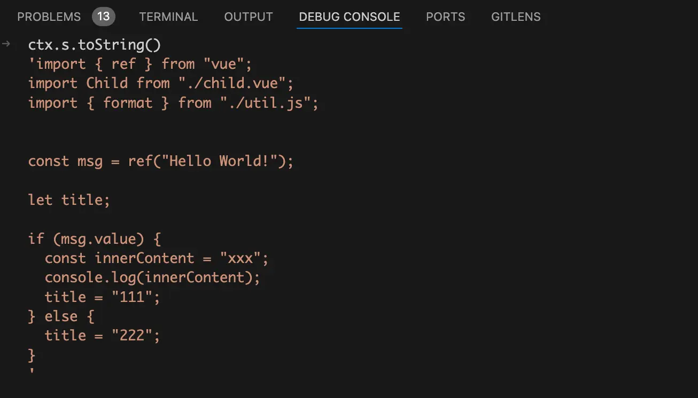{data-zoomable}

从上图中可以看到执行这两个`remove`方法后template模块、style模块（虽然本文demo中没有写style模块）、script开始标签、script结束标签都已经被删除了。唯一剩下的就是script模块中的内容，还有之前提出去的那几个import导入。
## 将顶层绑定的元数据存储到`ctx.bindingMetadata`
接着将断点走到第四部分，代码如下：
```js
for (const [key, { isType, imported, source: source2 }] of Object.entries(
  ctx.userImports
)) {
  if (isType) continue;
  ctx.bindingMetadata[key] =
    imported === "*" ||
    (imported === "default" && source2.endsWith(".vue")) ||
    source2 === "vue"
      ? "setup-const"
      : "setup-maybe-ref";
}

for (const key in setupBindings) {
  ctx.bindingMetadata[key] = setupBindings[key];
}

// 生成setup函数的args参数;
let args = `__props`;
const destructureElements =
  ctx.hasDefineExposeCall || !options.inlineTemplate
    ? [`expose: __expose`]
    : [];
if (destructureElements.length) {
  args += `, { ${destructureElements.join(", ")} }`;
}
```
上面的代码主要分为三块，第一块为for循环遍历前面收集到的`ctx.userImports`对象。这个对象里面收集的是所有的import导入，将所有import导入塞到`ctx.bindingMetadata`对象中。

第二块也是for循环遍历前面收集的`setupBindings`对象，这个对象里面收集的是顶层声明的变量、函数、类、枚举，同样的将这些顶层绑定塞到`ctx.bindingMetadata`对象中。

为什么要多此一举存储一个`ctx.bindingMetadata`对象呢？

答案是setup的return的对象有时会直接返回顶层变量（比如demo中的`msg`常量）。有时只会返回变量的访问器属性 get（比如demo中的`format`函数）。有时会返回变量的访问器属性 get和set（比如demo中的`title`变量）。所以才需要一个`ctx.bindingMetadata`对象来存储这些顶层绑定的元数据。

将断点走到执行完这两个for循环的地方，在debug终端来看看此时收集的`ctx.bindingMetadata`对象是什么样的，如下图：
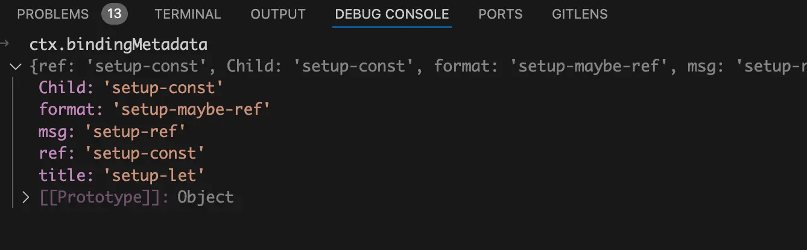{data-zoomable}


最后一块代码也很简单进行字符串拼接生成setup函数的参数，第一个参数为组件的props、第二个参数为`expose`方法组成的对象。如下图：
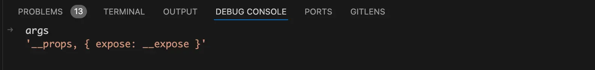{data-zoomable}

## 生成return对象
接着将断点走到第五部分，代码如下：
```js
let returned;
const allBindings = {
  ...setupBindings,
};
for (const key in ctx.userImports) {
  // 不是引入ts中的类型并且import导入的变量还需要在template中使用
  if (!ctx.userImports[key].isType && ctx.userImports[key].isUsedInTemplate) {
    allBindings[key] = true;
  }
}

returned = `{ `;
for (const key in allBindings) {
  if (
    allBindings[key] === true &&
    ctx.userImports[key].source !== "vue" &&
    !ctx.userImports[key].source.endsWith(".vue")
  ) {
    returned += `get ${key}() { return ${key} }, `;
  } else if (ctx.bindingMetadata[key] === "setup-let") {
    const setArg = key === "v" ? `_v` : `v`;
    returned += `get ${key}() { return ${key} }, set ${key}(${setArg}) { ${key} = ${setArg} }, `;
  } else {
    returned += `${key}, `;
  }
}
returned = returned.replace(/, $/, "") + ` }`;

ctx.s.appendRight(
  endOffset,
  `
  const __returned__ = ${returned}
  Object.defineProperty(__returned__, '__isScriptSetup', { enumerable: false, value: true })
  return __returned__
  }
  `
);
```
这部分的代码看着很多，其实逻辑也非常清晰，我也将其分为三块。

在第一块中首先使用扩展运算符`...setupBindings`将`setupBindings`对象中的属性合并到`allBindings`对象中，因为`setupBindings`对象中存的顶层声明的变量、函数、类、枚举都需要被return出去。

然后遍历`ctx.userImports`对象，前面讲过了`ctx.userImports`对象中存的是所有的import导入（包括从vue中import导入ref函数）。在循环里面执行了if判断`!ctx.userImports[key].isType && ctx.userImports[key].isUsedInTemplate`，这个判断的意思是如果当前import导入的不是ts的type类型并且import导入的内容在template模版中使用了。才会去执行`allBindings[key] = true`，执行后就会将满足条件的import导入塞到`allBindings`对象中。

后面生成setup函数的return对象就是通过遍历这个`allBindings`对象实现的。这也就解释了为什么从vue中import导入的ref函数也是顶层绑定，为什么他没有被setup函数返回。因为只有在template中使用的import导入顶层绑定才会被setup函数返回。

将断点走到遍历`ctx.userImports`对象之后，在debug终端来看看此时的`allBindings`对象是什么样的，如下图：
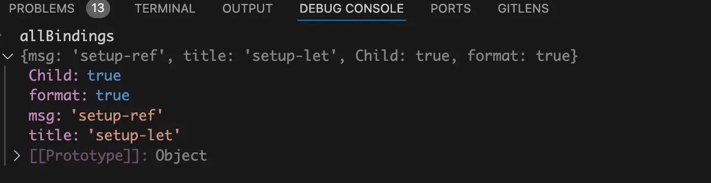{data-zoomable}

从上图中可以看到此时的`allBindings`对象中存了四个需要return的顶层绑定。

接着就是执行for循环遍历`allBindings`对象生成return对象的字符串，这循环中有三个if判断条件。我们先来看第一个，代码如下：
```js
if (
  allBindings[key] === true &&
  ctx.userImports[key].source !== "vue" &&
  !ctx.userImports[key].source.endsWith(".vue")
) {
  returned += `get ${key}() { return ${key} }, `;
}
```
if条件判断是：如果当前import导入不是从vue中，并且也不是import导入一个vue组件。那么就给return一个只拥有get的访问器属性，对应我们demo中的就是`import { format } from "./util.js"`中的`format`函数。

我们再来看第二个else if判断，代码如下：
```js
else if (ctx.bindingMetadata[key] === "setup-let") {
  const setArg = key === "v" ? `_v` : `v`;
  returned += `get ${key}() { return ${key} }, set ${key}(${setArg}) { ${key} = ${setArg} }, `;
}
```
这个else if条件判断是：如果当前顶层绑定是一个let定义的变量。那么就给return一个同时拥有get和set的访问器属性，对应我们demo中的就是`let title"`变量。

最后就是else，代码如下：
```js
else {
  returned += `${key}, `;
}
```
这个else中就是普通的数据属性了，对应我们demo中的就是`msg`变量和`Child`组件。

将断点走到生成return对象之后，在debug终端来看看此时生成的return对象是什么样的，如下图：
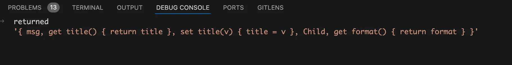{data-zoomable}

从上图中可以看到此时已经生成了return对象啦。

前面我们只生成了return对象，但是还没将其插入到要生成的code字符串中，所以需要执行`ctx.s.appendRight`方法在末尾插入return的代码。

将断点走到执行完`ctx.s.appendRight`方法后，在debug终端来看看此时的code代码字符串是什么样的，如下图：
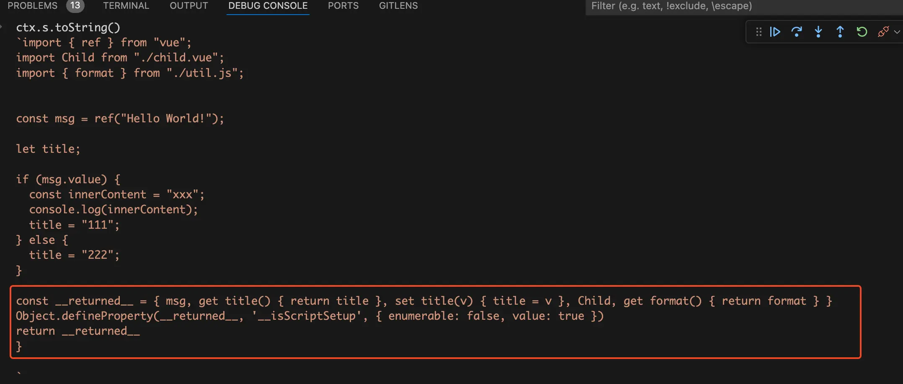{data-zoomable}

从上图中可以看到此时的code代码字符串中多了一块return的代码。
## 生成setup函数定义
接着将断点走到第六部分，代码如下：
```js
ctx.s.prependLeft(
  startOffset,
  `
${genDefaultAs} /*#__PURE__*/${ctx.helper(
    `defineComponent`
  )}({${def}${runtimeOptions}
${hasAwait ? `async ` : ``}setup(${args}) {
${exposeCall}`
);
ctx.s.appendRight(endOffset, `})`);
```
这部分的代码很简单，调用`ctx.s.prependLeft`方法从左边插入一串代码。插入的这串代码就是简单的字符串拼接，我们在debug终端来看看要插入的代码是什么样的，如下图：
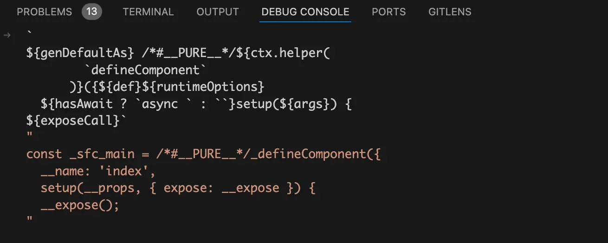{data-zoomable}

是不是觉得上面这块需要插入的代码看着很熟悉，他就是编译后的`_sfc_main`对象除去setup函数内容的部分。将断点走到`ctx.s.appendRight`方法执行之后，再来看看此时的code代码字符串是什么样的，如下图：
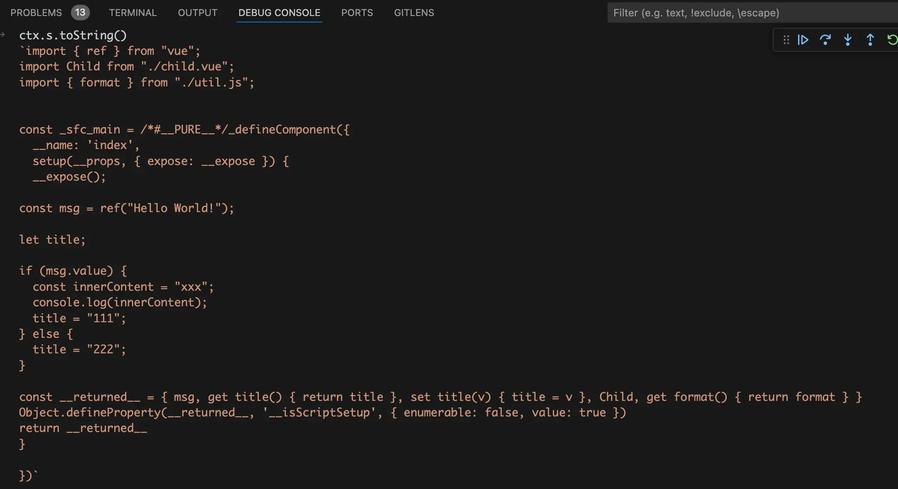{data-zoomable}

从上图中可以看到此时的setup函数基本已经生成完了。
## 插入import vue语句
上一步生成的code代码字符串其实还有一个问题，在代码中使用了`_defineComponent`函数，但是没有从任何地方去import导入。

第七块的代码就会生成缺少的import导入，代码如下：
```js
if (ctx.helperImports.size > 0) {
  ctx.s.prepend(
    `import { ${[...ctx.helperImports]
      .map((h) => `${h} as _${h}`)
      .join(", ")} } from 'vue'
`
  );
}
```
将断点走到`ctx.s.prepend`函数执行后，再来看看此时的code代码字符串，如下图：
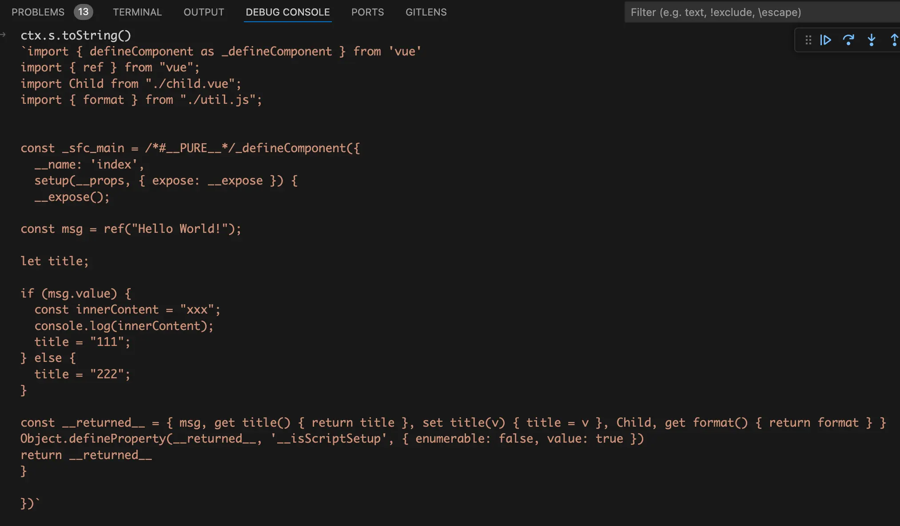{data-zoomable}

从上图中可以看到已经生成了完整的setup函数啦。
# 总结
整个流程图如下：
{data-zoomable}


- 遍历`<script setup>`中的代码将所有的import导入收集到`ctx.userImports`对象中。

- 遍历`<script setup>`中的代码将所有的顶层变量、函数、类、枚举收集到`setupBindings`对象中。

- 调用`ctx.s.remove`方法移除template、style模块以及script开始标签和结束标签。

- 遍历前面收集的`ctx.userImports`和`setupBindings`对象，将所有的顶层绑定元数据存储到`bindingMetadata`对象中。

- 遍历前面收集的`ctx.userImports`和`setupBindings`对象，生成return对象中的内容。在这一步的时候会将没有在template中使用的import导入给过滤掉，这也就解释了为什么从vue中导入的ref函数不包含在return对象中。

- 调用`ctx.s.prependLeft`方法生成setup的函数定义。

- 调用`ctx.s.prepend`方法生成完整的setup函数。


[加入本书对应的「源码交流群」](/guide/contact)
