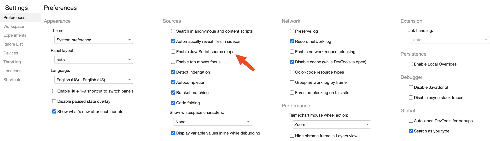
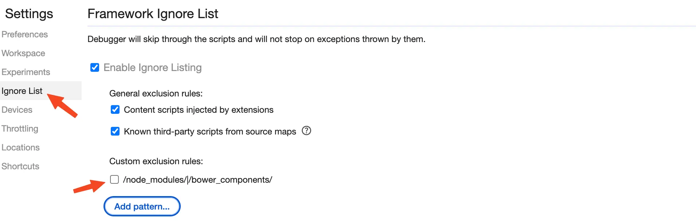
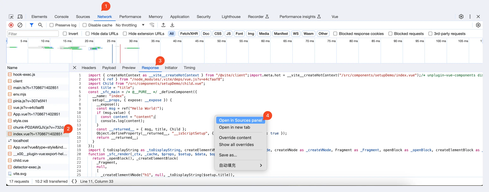
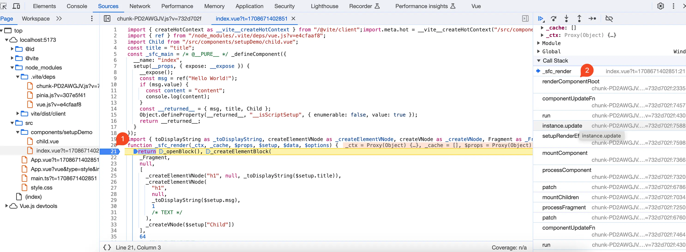
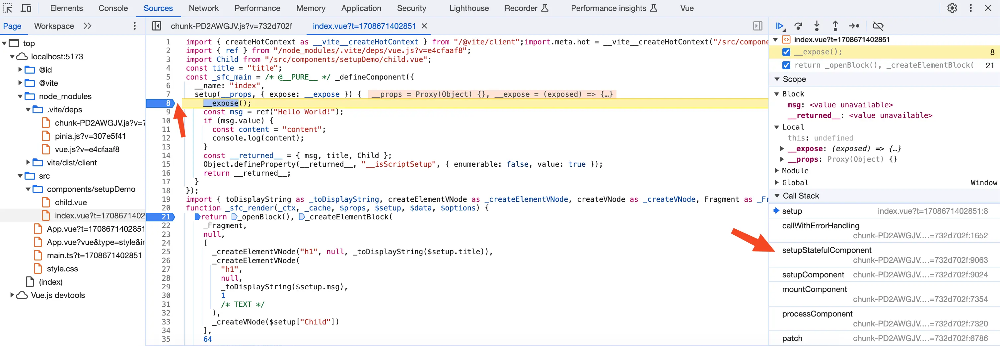
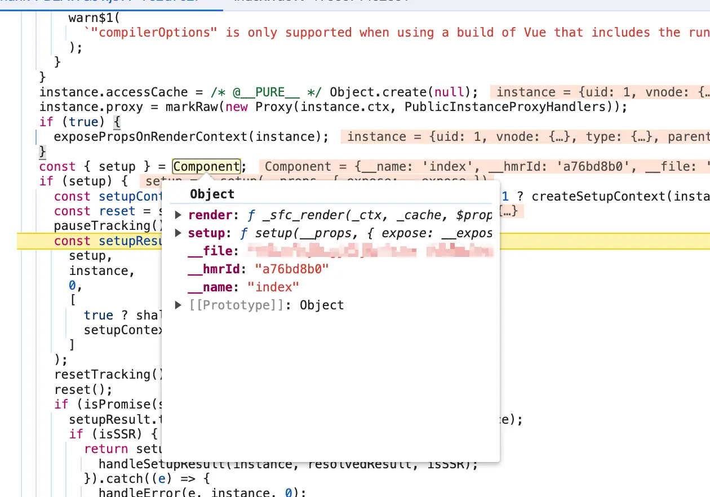
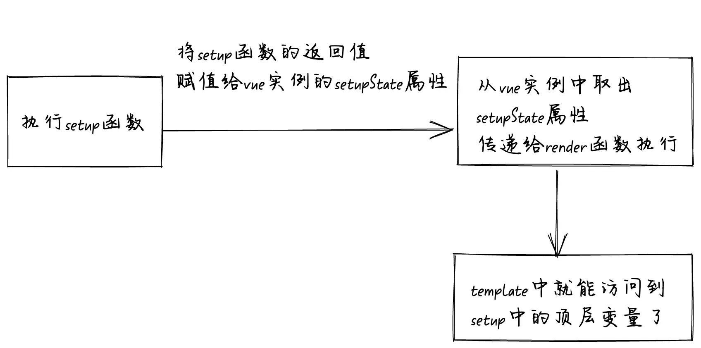

# 前言

我们每天写`vue3`项目的时候都会使用`setup`语法糖，但是你有没有思考过下面几个问题。`setup`语法糖经过编译后是什么样子的？为什么在`setup`顶层定义的变量可以在`template`中可以直接使用？为什么`import`一个组件后就可以直接使用，无需使用`components` 选项来显式注册组件？

# vue 文件如何渲染到浏览器上

要回答上面的问题，我们先来了解一下从一个`vue`文件到渲染到浏览器这一过程经历了什么？

我们的`vue`代码一般都是写在后缀名为vue的文件上，显然浏览器是不认识vue文件的，浏览器只认识html、css、jss等文件。所以第一步就是通过`webpack`或者`vite`将一个vue文件编译为一个包含`render`函数的`js`文件。然后执行`render`函数生成虚拟DOM，再调用浏览器的`DOM API`根据虚拟DOM生成真实DOM挂载到浏览器上。

{data-zoomable}


# `setup`编译后的样子

在`javascript`标准中`script`标签是不支持`setup`属性的，浏览器根本就不认识`setup`属性。所以很明显`setup`是作用于编译时阶段，也就是从vue文件编译为js文件这一过程。

我们来看一个简单的demo，这个是`index.vue`源代码：
```vue
    <template>
      <h1>{{ title }}</h1>
      <h1>{{ msg }}</h1>
      <Child />
    </template>

    <script lang="ts" setup>
    import { ref } from "vue";
    import Child from "./child.vue";

    const msg = ref("Hello World!");
    const title = "title";
    if (msg.value) {
      const content = "content";
      console.log(content);
    }
    </script>
```
这里我们定义了一个名为`msg`的`ref`响应式变量和非响应式的`title`变量，还有`import`了`child.vue`组件。

这个是`child.vue`的源代码
```vue
    <template>
      <div>i am child</div>
    </template>
```
我们接下来看`index.vue`编译后的样子，代码我已经做过了简化：
```js
    import { ref } from "vue";
    import Child from "./Child.vue";

    const title = "title";

    const __sfc__ = {
      __name: "index",
      setup() {
        const msg = ref("Hello World!");
        if (msg.value) {
          const content = "content";
          console.log(content);
        }
        const __returned__ = { title, msg, Child };
        return __returned__;
      },
    };

    import {
      toDisplayString as _toDisplayString,
      createElementVNode as _createElementVNode,
      createVNode as _createVNode,
      Fragment as _Fragment,
      openBlock as _openBlock,
      createElementBlock as _createElementBlock,
    } from "vue";
    function render(_ctx, _cache, $props, $setup, $data, $options) {
      return (
        _openBlock(),
        _createElementBlock(
          _Fragment,
          null,
          [
            _createElementVNode("h1", null, _toDisplayString($setup.title)),
            _createElementVNode(
              "h1",
              null,
              _toDisplayString($setup.msg),
              1 /* TEXT */
            ),
            _createVNode($setup["Child"]),
          ],
          64 /* STABLE_FRAGMENT */
        )
      );
    }
    __sfc__.render = render;
    export default __sfc__;
```
我们可以看到`index.vue`编译后的代码中已经没有了`template`标签和`script`标签，取而代之是`render`函数和`__sfc__`对象。并且使用`__sfc__.render = render`将`render`函数挂到`__sfc__`对象上，然后将`__sfc__`对象`export default`出去。

看到这里你应该知道了其实一个`vue`组件就是一个普通的js对象，`import`一个`vue`组件，实际就是`import`这个`js`对象。这个js对象中包含`render`方法和`setup`方法。

## 编译后的`setup`方法

我们先来看看这个`setup`方法，是不是觉得和我们源代码中的`setup`语法糖中的代码很相似？没错，这个`setup`方法内的代码就是由`setup`语法糖中的代码编译后来的。

`setup`语法糖原始代码
```vue
    <script lang="ts" setup>
    import { ref } from "vue";
    import Child from "./child.vue";

    const msg = ref("Hello World!");
    const title = "title";
    if (msg.value) {
      const content = "content";
      console.log(content);
    }
    </script>
```
`setup`编译后的代码
```js
    import { ref } from "vue";
    import Child from "./Child.vue";

    const title = "title";

    const __sfc__ = {
      __name: "index",
      setup() {
        const msg = ref("Hello World!");
        if (msg.value) {
          const content = "content";
          console.log(content);
        }
        const __returned__ = { title, msg, Child };
        return __returned__;
      },
    };
```
经过分析我们发现`title`变量由于不是响应式变量，所以编译后`title`变量被提到了`js`文件的全局变量上面去了。而`msg`变量是响应式变量，所以依然还是在`setup`方法中。我们再来看看`setup`的返回值，返回值是一个对象，对象中包含`title`、`msg`、`Child`属性，非`setup`顶层中定义的`content`变量就不在返回值对象中。

看到这里，可以回答我们前面提的第一个问题。

**`setup`语法糖经过编译后是什么样子的？**

`setup`语法糖编译后会变成一个`setup`方法，编译后`setup`方法中的代码和`script`标签中的源代码很相似。方法会返回一个对象，对象由`setup`中定义的顶层变量和`import`导入的内容组成。

## 由`template`编译后的`render`函数

我们先来看看原本`template`中的代码：
```vue
    <template>
      <h1>{{ title }}</h1>
      <h1>{{ msg }}</h1>
      <Child />
    </template>
```
我们再来看看由`template`编译成的`render`函数：
```js
    import {
      toDisplayString as _toDisplayString,
      createElementVNode as _createElementVNode,
      createVNode as _createVNode,
      Fragment as _Fragment,
      openBlock as _openBlock,
      createElementBlock as _createElementBlock,
    } from "vue";
    function render(_ctx, _cache, $props, $setup, $data, $options) {
      return (
        _openBlock(),
        _createElementBlock(
          _Fragment,
          null,
          [
            _createElementVNode("h1", null, _toDisplayString($setup.title)),
            _createElementVNode(
              "h1",
              null,
              _toDisplayString($setup.msg),
              1 /* TEXT */
            ),
            _createVNode($setup["Child"]),
          ],
          64 /* STABLE_FRAGMENT */
        )
      );
    }
```
我们这次主要看在`render`函数中如何访问`setup`中定义的顶层变量`title`、`msg`，`createElementBlock`和`createElementVNode`等创建虚拟DOM的函数不在这篇文章的讨论范围内。你只需要知道`createElementVNode("h1", null, _toDisplayString($setup.title))`为创建一个`h1`标签的虚拟DOM就行了。

在`render`函数中我们发现读取`title`变量的值是通过`$setup.title`读取到的，读取`msg`变量的值是通过`$setup.msg`读取到的。这个`$setup`对象就是调用`render`函数时传入的第四个变量，我想你应该猜出来了，这个`$setup`对象和前面的`setup`方法返回的对象有关系。

那么问题来了，在执行`render`函数的时候是如何将`setup`方法的返回值作为第四个变量传递给`render`函数的呢？我在下一节会一步一步的带你通过`debug`源码的方式去搞清楚这个问题，我们带着问题去`debug`源码其实非常简单。

# `debug`源码搞清楚是如何调用`render`函数

首先我们将`Enable JavaScript source maps`给取消勾选了，不然在debug源码的时候断点就会走到`vue`文件中，而不是走到编译会的js文件中。

{data-zoomable}

然后我们需要在设置里面的Ignore List看看`node_modules`文件夹是否被忽略。新版谷歌浏览器中会默认排除掉`node_modules`文件夹，所以我们需要将这个取消勾选。如果忽略了`node_modules`文件夹，那么`debug`的时候断点就不会走到`node_modules`中`vue`的源码中去了。

{data-zoomable}

接下来我们需要在浏览器中找到vue文件编译后的js代码，我们只需要在`network`面板中找到这个`vue`文件的`http`请求，然后在`Response`下右键选择`Open in Sources panel`，就会自动在`sources`面板自动打开对应编译后的js文件代码。

{data-zoomable}

找到编译后的js文件，我们想`debug`看看是如何调用`render`函数的，所以我们给render函数加一个断点。然后刷新页面，发现代码已经走到了断点的地方。我们再来看看右边的Call Stack调用栈，发现`render`函数是由一个`vue`源码中的`renderComponentRoot`函数调用的。

{data-zoomable}

点击Call Stack中的`renderComponentRoot`函数就可以跳转到`renderComponentRoot`函数的源码，我们发现`renderComponentRoot`函数中调用`render`函数的代码主要是下面这样的：
```js
    function renderComponentRoot(instance) {
      const {
        props,
        data,
        setupState,
        // 省略...
      } = instance;

      render2.call(
        thisProxy,
        proxyToUse,
        renderCache,
        props,
        setupState,
        data,
        ctx
      )
    }
```
这里我们可以看到前面的`$setup`实际就是由`setupState`赋值的，而`setupState`是当前vue实例上面的一个属性。那么`setupState`属性是如何被赋值到`vue`实例上面的呢？

我们需要给`setup`函数加一个断点，然后刷新页面进入断点。通过分析Call Stack调用栈，我们发现`setup`函数是由`vue`中的一个`setupStatefulComponent`函数调用执行的。

{data-zoomable}

点击Call Stack调用栈中的`setupStatefulComponent`，进入到`setupStatefulComponent`的源码。我们看到`setupStatefulComponent`中的代码主要是这样的：
```js
    function setupStatefulComponent(instance) {
      const { setup } = Component;
      // 省略
      const setupResult = callWithErrorHandling(
        setup,
        instance
      );
      handleSetupResult(instance, setupResult);
    }
```
`setup`函数是`Component`上面的一个属性，我们将鼠标放到`Component`上面，看看这个`Component`是什么东西？

{data-zoomable}

看到这个`Component`对象中既有`render`方法也有`setup`方法是不是感觉很熟悉，没错这个`Component`对象实际就是我们的`vue`文件编译后的js对象。
```js
    const __sfc__ = {
      __name: "index",
      setup() {
        const msg = ref("Hello World!");
        if (msg.value) {
          const content = "content";
          console.log(content);
        }
        const __returned__ = { title, msg, Child };
        return __returned__;
      },
    };

    __sfc__.render = render;
```
从Component对象中拿到`setup`函数，然后执行`setup`函数得到`setupResult`对象。然后再调用`handleSetupResult(instance, setupResult);`

我们再来看看`handleSetupResult`函数是什么样的，下面是我简化后的代码：
```js
    function handleSetupResult(instance, setupResult) {
      if (isFunction(setupResult)) {
        // 省略
      } else if (isObject(setupResult)) {
        instance.setupState = proxyRefs(setupResult);
      }
    }
```
我们的`setup`的返回值是一个对象，所以这里会执行`instance.setupState = proxyRefs(setupResult)`，将setup执行后的返回值经过`new Proxy`处理后赋值到vue实例的setupState属性上，而`new Proxy`中的`get`就是用于处理在`template`中使用`ref`不需要使用`.value`的写法。

看到这里我们整个流程已经可以串起来了，首先会执行由`setup`语法糖编译后的`setup`函数。然后将`setup`函数中由顶层变量和`import`导入组成的返回值对象经过`Proxy`处理后赋值给`vue`实例的`setupState`属性，然后执行`render`函数的时候从`vue`实例中取出`setupState`属性也就是`setup`的返回值。这样在`render`函数也就是`template`模版就可以访问到`setup`中的顶层变量和`import`导入。

{data-zoomable}

现在我们可以回答前面提的另外两个问题了：

**为什么在`setup`顶层定义的变量可以在`template`中可以直接使用？**

因为在`setup`语法糖顶层定义的变量经过编译后会被加入到`setup`函数返回值对象`__returned__`中，而非`setup`顶层定义的变量不会加入到`__returned__`对象中。

`setup`函数返回值经过`Proxy`处理后会被塞到`vue`实例的`setupState`属性上，执行`render`函数的时候会将`vue`实例上的`setupState`属性传递给`render`函数，所以在`render`函数中就可以访问到`setup`顶层定义的变量和`import`导入。

而`render`函数实际就是由`template`编译得来的，所以说在`template`中可以访问到`setup`顶层定义的变量和`import`导入。。

**为什么`import`一个组件后就可以直接使用，无需使用`components` 选项来显式注册组件？**

因为在`setup`语法糖中`import`导入的组件对象经过编译后同样也会被加入到`setup`函数返回值对象`__returned__`中，同理在`template`中也可以访问到`setup`的返回值对象，也就可以直接使用这个导入的组件了。

# 总结

`setup`语法糖经过编译后就变成了`setup`函数，而`setup`函数的返回值是一个对象，这个对象就是由在`setup`顶层定义的变量和`import`导入组成的。`vue`在初始化的时候会执行`setup`函数，然后将`setup`函数返回值经过`Proxy`处理后塞到`vue`实例的`setupState`属性上。

执行`render`函数的时候会将`vue`实例上的`setupState`属性（也就是`setup`函数的返回值）传递给`render`函数，所以在`render`函数中就可以访问到`setup`顶层定义的变量和`import`导入。而`render`函数实际就是由`template`编译得来的，所以说在`template`中就可以访问到`setup`顶层定义的变量和`import`导入。


[加入本书对应的「源码交流群」](/guide/contact)
