# 前言
众所周知，在vue中使用scoped可以避免父组件的样式渗透到子组件中。使用了scoped后会给html增加自定义属性`data-v-x`，同时会给组件内CSS选择器添加对应的属性选择器`[data-v-x]`。这篇我们来讲讲vue是如何给CSS选择器添加对应的属性选择器`[data-v-x]`。

# 看个demo
我们先来看个demo，代码如下：
```vue
<template>
  <div class="block">hello world</div>
</template>

<style scoped>
.block {
  color: red;
}
</style>
```
经过编译后，上面的demo代码就会变成下面这样：
```vue
<template>
  <div data-v-c1c19b25 class="block">hello world</div>
</template>

<style>
.block[data-v-c1c19b25] {
  color: red;
}
</style>
```
从上面的代码可以看到在div上多了一个`data-v-c1c19b25`自定义属性，并且css的属性选择器上面也多了一个`[data-v-c1c19b25]`。

可能有的小伙伴有疑问，为什么生成这样的代码就可以避免样式污染呢？

`.block[data-v-c1c19b25]`：这里面包含两个选择器。`.block`是一个类选择器，表示class的值包含`block`。`[data-v-c1c19b25]`是一个属性选择器，表示存在`data-v-c1c19b25`自定义属性的元素。

所以只有class包含`block`，并且存在`data-v-c1c19b25`自定义属性的元素才能命中这个样式，这样就能避免样式污染。

并且由于在同一个组件里面生成的`data-v-x`值是一样的，所以在同一组件内多个html元素只要class的值包含`block`，就可以命中`color: red`的样式。

接下来我将通过debug的方式带你了解，vue是如何在css中生成`.block[data-v-c1c19b25]`这样的属性选择器。
# @vitejs/plugin-vue
还是一样的套路启动一个debug终端。这里以`vscode`举例，打开终端然后点击终端中的`+`号旁边的下拉箭头，在下拉中点击`Javascript Debug Terminal`就可以启动一个`debug`终端。
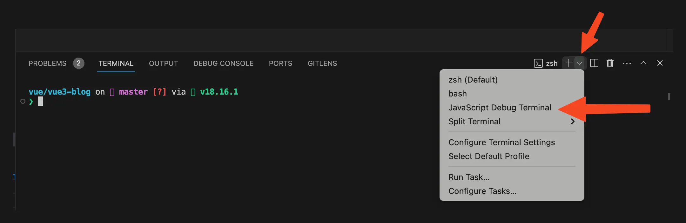{data-zoomable}

假如`vue`文件编译为`js`文件是一个毛线团，那么他的线头一定是`vite.config.ts`文件中使用`@vitejs/plugin-vue`的地方。通过这个线头开始`debug`我们就能够梳理清楚完整的工作流程。
{data-zoomable}
## vuePlugin函数
我们给上方图片的`vue`函数打了一个断点，然后在`debug`终端上面执行`yarn dev`，我们看到断点已经停留在了`vue`函数这里。然后点击`step into`，断点走到了`@vitejs/plugin-vue`库中的一个`vuePlugin`函数中。我们看到简化后的`vuePlugin`函数代码如下：
```js
function vuePlugin(rawOptions = {}) {
  return {
    name: "vite:vue",
    // ...省略其他插件钩子函数
    transform(code, id, opt) {
      // ..
    }
  };
}
```
`@vitejs/plugin-vue`是作为一个`plugins`插件在vite中使用，`vuePlugin`函数返回的对象中的`transform`方法就是对应的插件钩子函数。vite会在对应的时候调用这些插件的钩子函数，vite每解析一个模块都会执行一次`transform`钩子函数。更多vite钩子相关内容[查看官网](https://cn.vitejs.dev/guide/api-plugin#universal-hooks)。

我们这里只需要看`transform`钩子函数，解析每个模块时调用。

由于解析每个文件都会走到`transform`钩子函数中，但是我们只关注`index.vue`文件是如何解析的，所以我们给`transform`钩子函数打一个条件断点。如下图：
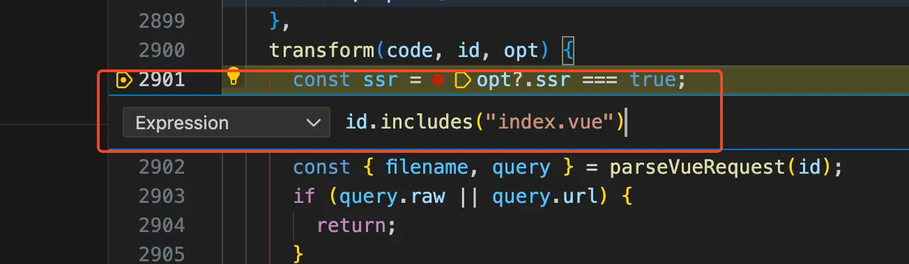{data-zoomable}


然后点击Continue(F5)，`vite`服务启动后就会走到`transform`钩子函数中打的断点。我们可以看到简化后的`transform`钩子函数代码如下：
```js
function transform(code, id, opt) {
  const { filename, query } = parseVueRequest(id);
  if (!query.vue) {
    return transformMain(
      code,
      filename,
      options.value,
      this,
      ssr,
      customElementFilter.value(filename)
    );
  } else {
    const descriptor = getDescriptor(filename);
    if (query.type === "style") {
      return transformStyle(
        code,
        descriptor,
        Number(query.index || 0),
        options.value
      );
    }
  }
}
```
首先调用`parseVueRequest`函数解析出当前要处理的文件的`filename`和`query`，在debug终端来看看此时这两个的值。如下图：
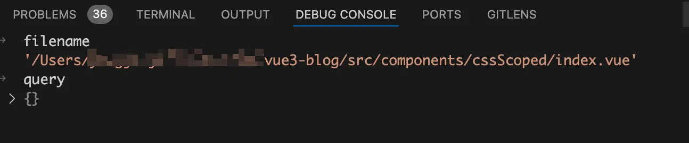{data-zoomable}

从上图中可以看到`filename`为当前处理的vue文件路径，`query`的值为空数组。所以此时代码会走到`transformMain`函数中。
## `transformMain`函数
将断点走进`transformMain`函数，在我们这个场景中简化后的`transformMain`函数代码如下：
```js
async function transformMain(code, filename, options) {
  const { descriptor } = createDescriptor(filename, code, options);

  const { code: templateCode } = await genTemplateCode(
    descriptor
    // ...省略
  );

  const { code: scriptCode } = await genScriptCode(
    descriptor
    // ...省略
  );

  const stylesCode = await genStyleCode(
    descriptor
    // ...省略
  );

  const output = [scriptCode, templateCode, stylesCode];
  let resolvedCode = output.join("\n");
  return {
    code: resolvedCode,
  };
}
```
我们在 [vue文件编译成js文件](/guide/vue-to-js)文章中已经深入讲解过`transformMain`函数了，所以这篇文章我们不会深入到`transformMain`函数中使用到的每个函数中。

首先调用`createDescriptor`函数根据当前vue文件的code代码字符串生成一个`descriptor`对象，简化后的`createDescriptor`函数代码如下：
```js
const cache = new Map();

function createDescriptor(
  filename,
  source,
  { root, isProduction, sourceMap, compiler, template }
) {
  const { descriptor, errors } = compiler.parse(source, {
    filename,
    sourceMap,
    templateParseOptions: template?.compilerOptions,
  });
  const normalizedPath = slash(path.normalize(path.relative(root, filename)));
  descriptor.id = getHash(normalizedPath + (isProduction ? source : ""));
  cache.set(filename, descriptor);
  return { descriptor, errors };
}
```
首先调用`compiler.parse`方法根据当前vue文件的code代码字符串生成一个`descriptor`对象，此时的`descriptor`对象主要有三个属性`template`、`scriptSetup`、`style`，分别对应的是vue文件中的`<template>`模块、`<template setup>`模块、`<style>`模块。

然后调用`getHash`函数给`descriptor`对象生成一个`id`属性，`getHash`函数代码如下：
```js
import { createHash } from "node:crypto";
function getHash(text) {
  return createHash("sha256").update(text).digest("hex").substring(0, 8);
}
```
从上面的代码可以看出id是根据vue文件的路径调用node的`createHash`加密函数生成的，这里生成的id就是scoped生成的自定义属性`data-v-x`中的`x`部分。

然后在`createDescriptor`函数中将生成的`descriptor`对象缓存起来，关于`descriptor`对象的处理就这么多了。

接着在`transformMain`函数中会分别以`descriptor`对象为参数执行`genTemplateCode`、`genScriptCode`、`genStyleCode`函数，分别得到编译后的render函数、编译后的js代码、编译后的style代码。

编译后的render函数如下图：
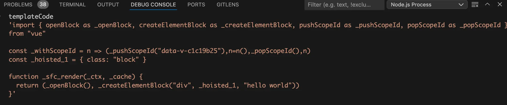{data-zoomable}

从上图中可以看到template模块已经编译成了render函数

编译后的js代码如下图：
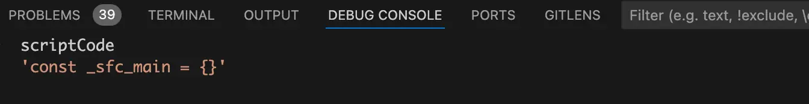{data-zoomable}

从上图中可以看到script模块已经编译成了一个名为`_sfc_main`的对象，因为我们这个demo中script模块没有代码，所以这个对象是一个空对象。

编译后的style代码如下图：
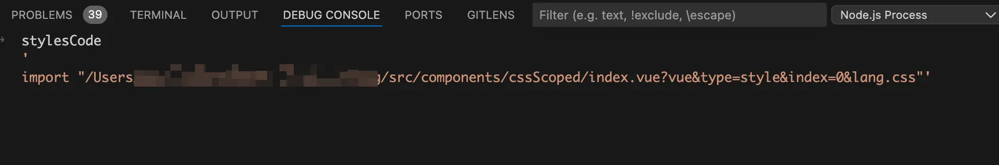{data-zoomable}

从上图中可以看到style模块已经编译成了一个import语句。

最后就是使用换行符`\n`将`templateCode`、`scriptCode`、`stylesCode`拼接起来就是vue文件编译后的js文件啦，如下图：
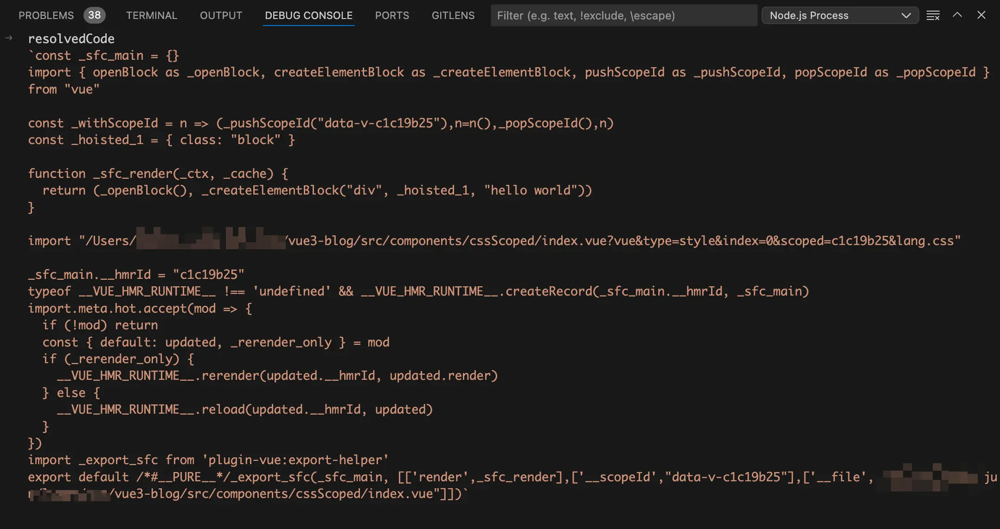{data-zoomable}


想必细心的同学已经发现有地方不对啦，这里的style模块编译后是一条import语句，并不是真正的css代码。这条import语句依然还是import导入的`index.vue`文件，只是加了一些额外的query参数。

`?vue&type=style&index=0&lang.css`：这个query参数表明当前import导入的是vue文件的css部分。

还记得我们前面讲过的`transform`钩子函数吗？vite每解析一个模块都会执行一次`transform`钩子函数，这个import导入vue文件的css部分，当然也会触发`transform`钩子函数的执行。
## 第二次执行`transform`钩子函数
当在浏览器中执行vue文件编译后的js文件时会触发`import "/Users/xxx/index.vue?vue&type=style&index=0&lang.css"`语句的执行，导致再次执行`transform`钩子函数。

`transform`钩子函数代码如下：
```js
function transform(code, id, opt) {
  const { filename, query } = parseVueRequest(id);
  if (!query.vue) {
    return transformMain(
      code,
      filename,
      options.value,
      this,
      ssr,
      customElementFilter.value(filename)
    );
  } else {
    const descriptor = getDescriptor(filename);
    if (query.type === "style") {
      return transformStyle(
        code,
        descriptor,
        Number(query.index || 0),
        options.value
      );
    }
  }
}
```
由于此时的`query`中是有`vue`字段，所以`!query.vue`的值为false，这次代码就不会走进`transformMain`函数中了。在`else`代码在先执行`getDescriptor`函数拿到`descriptor`对象，`getDescriptor`函数代码如下：
```js
function getDescriptor(filename) {
  const _cache = cache;
  if (_cache.has(filename)) {
    return _cache.get(filename);
  }
}
```
我们在第一次执行`transformMain`函数的时候会去执行`createDescriptor`函数，他的作用是根据当前vue文件的code代码字符串生成一个`descriptor`对象，并且将这个`descriptor`对象缓存起来了。在`getDescriptor`函数中就是将缓存的`descriptor`对象取出来。

由于`query`中有`type=style`，所以代码会走到`transformStyle`函数中。
## `transformStyle`函数
接着将断点走进`transformStyle`函数，代码如下：
```js
async function transformStyle(code, descriptor, index, options) {
  const block = descriptor.styles[index];
  const result = await options.compiler.compileStyleAsync({
    ...options.style,
    filename: descriptor.filename,
    id: `data-v-${descriptor.id}`,
    source: code,
    scoped: block.scoped,
  });

  return {
    code: result.code,
  };
}
```
从上面的代码可以看到`transformStyle`函数依然不是干活的地方，而是调用的`@vue/compiler-sfc`包暴露出的`compileStyleAsync`函数。

在调用`compileStyleAsync`函数的时候有三个参数需要注意：`source`、`id`和`scoped`。

`source`字段的值为`code`，值是当前css代码字符串。

`id`字段的值为`data-v-${descriptor.id}`，是不是觉得看着很熟悉？没错他就是使用`scoped`后vue帮我们自动生成的html自定义属性`data-v-x`和css选择属性选择器`[data-v-x]`。

其中的`descriptor.id`就是在生成`descriptor`对象时根据vue文件路径加密生成的id。

`scoped`字段的值为`block.scoped`，而`block`的值为`descriptor.styles[index]`。由于一个vue文件可以写多个style标签，所以`descriptor`对象的`styles`属性是一个数组，分包对应多个style标签。我们这里只有一个`style`标签，所以此时的`index`值为0。`block.scoped`的值为style标签上面是否有使用`scoped`。

直到进入`compileStyleAsync`函数之前代码其实一直都还在`@vitejs/plugin-vue`包中执行，真正干活的地方是在`@vue/compiler-sfc`包中。
# `@vue/compiler-sfc`
接着将断点走进`compileStyleAsync`函数，代码如下：
```js
function compileStyleAsync(options) {
  return doCompileStyle({
    ...options,
    isAsync: true,
  });
}
```
从上面的代码可以看到实际干活的是`doCompileStyle`函数。
## `doCompileStyle`函数
接着将断点走进`doCompileStyle`函数，在我们这个场景中简化后的`doCompileStyle`函数代码如下：
```js
import postcss from "postcss";

function doCompileStyle(options) {
  const {
    filename,
    id,
    scoped = false,
    postcssOptions,
    postcssPlugins,
  } = options;
  const source = options.source;
  const shortId = id.replace(/^data-v-/, "");
  const longId = `data-v-${shortId}`;
  const plugins = (postcssPlugins || []).slice();

  if (scoped) {
    plugins.push(scopedPlugin(longId));
  }

  const postCSSOptions = {
    ...postcssOptions,
    to: filename,
    from: filename,
  };
  let result;
  try {
    result = postcss(plugins).process(source, postCSSOptions);
    return result.then((result) => ({
      code: result.css || "",
      // ...省略
    }));
  } catch (e: any) {
    errors.push(e);
  }
}
```
在`doCompileStyle`函数中首先使用`const`定义了一堆变量，我们主要关注`source`和`longId`。

其中的`source`为当前css代码字符串，`longId`为根据vue文件路径加密生成的id，值的格式为`data-v-x`。他就是使用`scoped`后vue帮我们自动生成的html自定义属性`data-v-x`和css选择属性选择器`[data-v-x]`。

接着就是判断`scoped`是否为true，也就是style中使用有使用scoped。如果为true，就将`scopedPlugin`插件push到`plugins`数组中。从名字你应该猜到了这个plugin插件就是用于处理css scoped的。

最后就是执行`result = postcss(plugins).process(source, postCSSOptions)`拿到经过`postcss`转换编译器处理后的css。

可能有的小伙伴对`postcss`不够熟悉，我们这里来简单介绍一下。

`postcss` 是 css 的 transpiler（转换编译器，简称转译器），它对于 css 就像 babel 对于 js 一样，能够做 css 代码的分析和转换。同时，它也提供了插件机制来做自定义的转换。

在我们这里主要就是用到了`postcss`提供的插件机制来完成css scoped的自定义转换，调用`postcss`的时候我们传入了`source`，他的值是style模块中的css代码。并且传入的`plugins`插件数组中有个`scopedPlugin`插件，这个自定义插件就是vue写的用于处理css scoped的插件。

在执行`postcss`对css代码进行转换之前我们在debug终端来看看此时的css代码是什么样的，如下图：
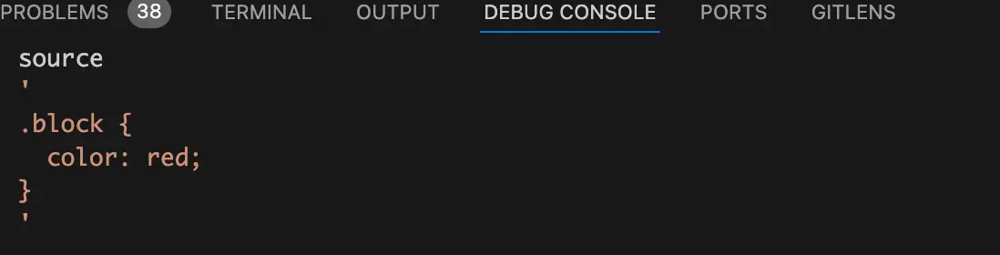{data-zoomable}

从上图可以看到此时的css代码还是和我们源代码是一样的，并没有css选择属性选择器`[data-v-x]`
## `scopedPlugin`插件
`scopedPlugin`插件在我们这个场景中简化后的代码如下：
```js
const scopedPlugin = (id = "") => {
  return {
    postcssPlugin: "vue-sfc-scoped",
    Rule(rule) {
      processRule(id, rule);
    },
    // ...省略
  };
};
```
这里的id就是我们在`doCompileStyle`函数中传过来的`longId`，也就是生成的css选择属性选择器`[data-v-x]`中的`data-v-x`。

在我们这个场景中只需要关注`Rule`钩子函数，当`postcss`处理到选择器开头的规则就会走到`Rule`钩子函数。

我们这里需要在使用了scoped后给css选择器添加对应的属性选择器`[data-v-x]`，所以我们需要在插件中使用`Rule`钩子函数，在处理css选择器时手动给选择器后面塞一个属性选择器`[data-v-x]`。

给`Rule`钩子函数打个断点，当`postcss`处理到我们代码中的`.block`时就会走到断点中。在debug终端看看`rule`的值，如下图：
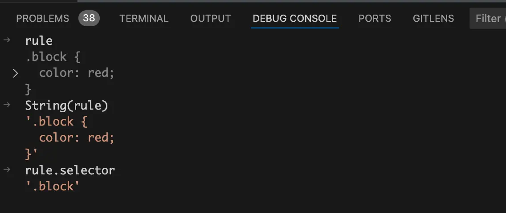{data-zoomable}

从上图中可以看到此时`rule.selector`的值为`.block`，是一个class值为`block`的类选择器。
## `processRule`函数
将断点走进`processRule`函数中，在我们这个场景中简化后的`processRule`函数代码如下：
```js
import selectorParser from "postcss-selector-parser";

function processRule(id: string, rule: Rule) {
  rule.selector = selectorParser((selectorRoot) => {
    selectorRoot.each((selector) => {
      rewriteSelector(id, selector, selectorRoot);
    });
  }).processSync(rule.selector);
}
```
前面我们讲过`rule.selector`的值为`.block`，通过重写`rule.selector`的值可以将当前css选择器替换为一个新的选择器。在`processRule`函数中就是使用`postcss-selector-parser`来解析一个选择器，进行处理后返回一个新的选择器。

`processSync`方法的作用为接收一个选择器，然后在回调中对解析出来的选择器进行处理，最后将处理后的选择器以字符串的方式进行返回。

在我们这里`processSync`方法接收的选择器是字符串`.block`，经过回调函数处理后返回的选择器字符串就变成了`.block[data-v-c1c19b25]`。

我们接下来看`selectorParser`回调函数中的代码，在回调函数中会使用`selectorRoot.each`去遍历解析出来的选择器。

为什么这里需要去遍历呢？

答案是css选择器可以这样写：`.block.demo`，如果是这样的选择器经过解析后，就会被解析成两个选择器，分别是`.block`和`.demo`。

在each遍历中会调用`rewriteSelector`函数对当前选取器进行重写。
## `rewriteSelector`函数
将断点走进`rewriteSelector`函数，在我们这个场景中简化后的代码如下：
```js
function rewriteSelector(id, selector) {
  let node;
  const idToAdd = id;

  selector.each((n) => {
    node = n;
  });

  selector.insertAfter(
    node,
    selectorParser.attribute({
      attribute: idToAdd,
      value: idToAdd,
      raws: {},
      quoteMark: `"`,
    })
  );
}
```
在`rewriteSelector`函数中each遍历当前`selector`选择器，给`node`赋值。将断点走到each遍历之后，我们在debug终端来看看`selector`选择器和`node`变量。如下图：
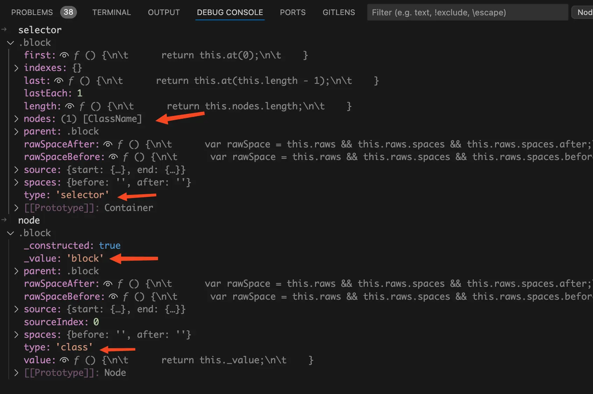{data-zoomable}

在这里`selector`是container容器，`node`才是具体要操作的选择器节点。

比如我们这里要执行的`selector.insertAfter`方法就是在`selector`容器中在一个指定节点后面去插入一个新的节点。这个和操作浏览器DOM API很相似。

我们再来看看要插入的节点，`selectorParser.attribute`函数的作用是创建一个attribute属性选择器。在我们这里就是创建一个`[data-v-x]`的属性选择器，如下图：
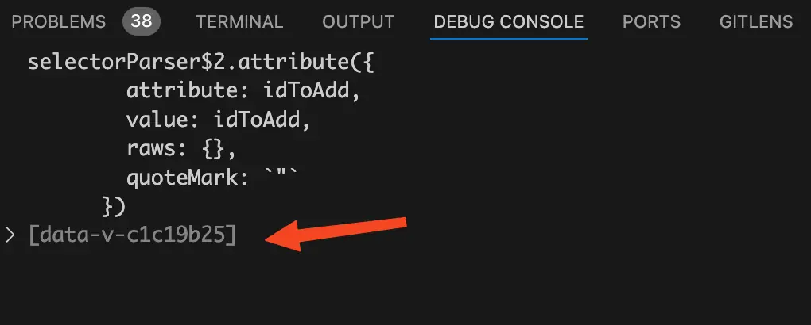{data-zoomable}


所以这里就是在`.block`类选择器后面插入一个`[data-v-c1c19b25]`的属性选择器。

我们在debug终端来看看执行`insertAfter`函数后的`selector`选择器，如下图：
{data-zoomable}


将断点逐层走出，直到`processRule`函数中。我们在debug终端来看看此时被重写后的`rule.selector`字符串的值是什么样的，如下图
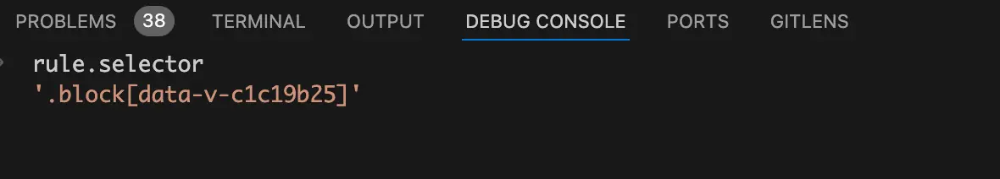{data-zoomable}

原来`rule.selector`的值为`.block`，通过重写`rule.selector`的值可以将`.block`类选择器替换为一个新的选择器，而这个新的选择器是在原来的`.block`类选择器后面再塞一个`[data-v-c1c19b25]`属性选择器。
# 总结
这篇文章我们讲了当使用scoped后，vue是如何给组件内CSS选择器添加对应的属性选择器`[data-v-x]`。主要分为两部分，分别在两个包里面执行。

- 第一部分为在`@vitejs/plugin-vue`包内执行。

  - 首先会根据当前vue文件的路径进行加密算法生成一个id，这个id就是添加的属性选择器`[data-v-x]`中的`x`。

  - 然后就是执行`transformStyle`函数，这个`transformStyle`并不是实际干活的地方，他调用了`@vue/compiler-sfc`包的`compileStyleAsync`函数。并且传入了`id`、`code`（css代码字符串）、`scoped`（是否在style中使用`scoped`）。

- 第二部分在`@vue/compiler-sfc`包执行。

  - `compileStyleAsync`函数依然不是实际干活的地方，而是调用了`doCompileStyle`函数。

  - 在`doCompileStyle`函数中，如果`scoped`为true就向`plugins`数组中插入一个`scopedPlugin`插件，这个是vue写的`postcss`插件，用于处理css scoped。然后使用`postcss`转换编译器对css代码进行转换。

  - 当`postcss`处理到选择器开头的规则就会走到`scopedPlugin`插件中的`Rule`钩子函数中。在`Rule`钩子函数中会执行`processRule`函数。

  - 在`processRule`函数中会使用`postcss-selector-parser`包将当前选择器替换为一个新的选择器，新的选择器和原来的选择器的区别是在后面会添加一个属性选择器`[data-v-x]`。其中的`x`就是根据当前vue文件的路径进行加密算法生成的`id`。

在下一篇文章中我们会讲vue是如何给html元素增加自定义属性`data-v-x`。


[加入本书对应的「源码交流群」](/guide/contact)
