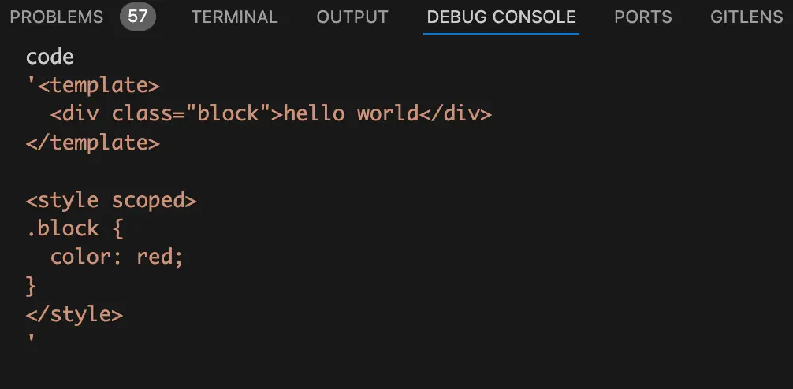
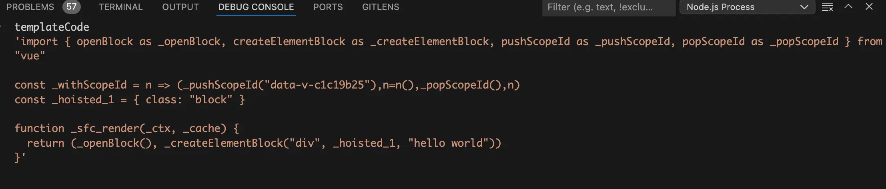
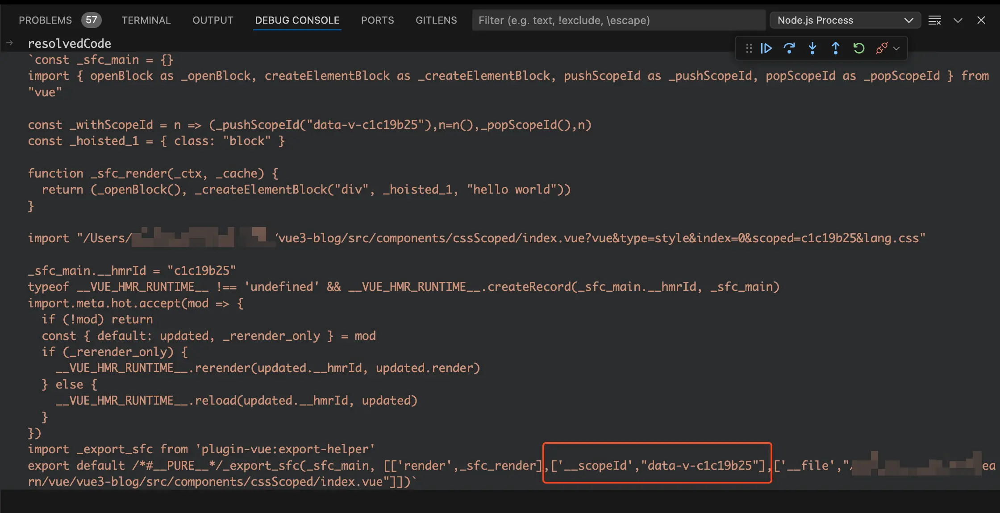
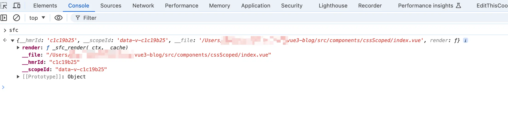
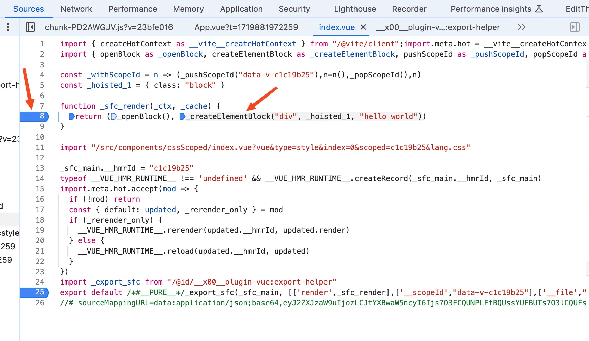
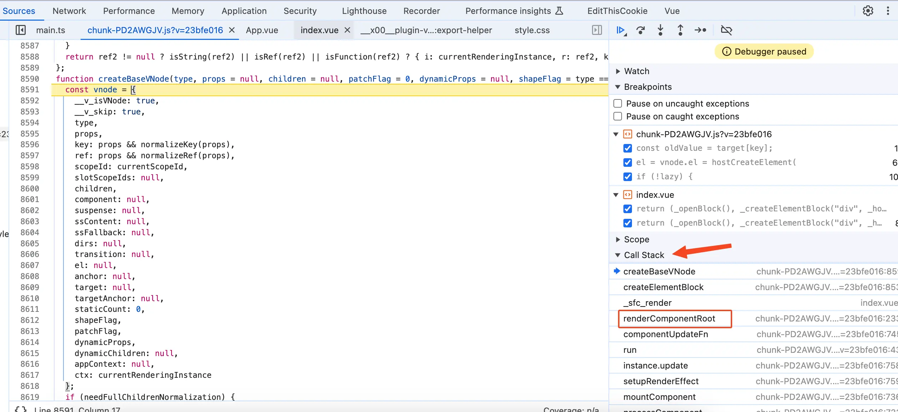
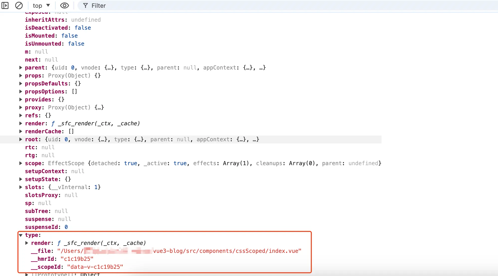

# 前言
在上一篇 [css上面的data-v-xxx](/style/scoped-style) 文章中我们讲了使用scoped后，vue是如何给CSS选择器添加对应的属性选择器`[data-v-x]`。这篇文章我们来接着讲使用了scoped后，vue是如何给html增加自定义属性`data-v-x`。

# 看个demo
我们先来看个demo，代码如下：

```vue
<template>
<div class="block">hello world</div>
</template>

<style scoped>
.block {
color: red;
}
</style>
```
经过编译后，上面的demo代码就会变成下面这样：

```vue
<template>
<div data-v-c1c19b25 class="block">hello world</div>
</template>

<style>
.block[data-v-c1c19b25] {
color: red;
}
</style>
```
从上面的代码可以看到在div上多了一个`data-v-c1c19b25`自定义属性，并且css的属性选择器上面也多了一个`[data-v-c1c19b25]`。

接下来我将通过debug的方式带你了解，vue使用了scoped后是如何给html增加自定义属性`data-v-x`。
# `transformMain` 函数
在 [vue文件编译成js文件](/guide/vue-to-js)文章中我们讲过了`transformMain` 函数的作用是将vue文件转换成js文件。

首先我们需要启动一个debug终端。这里以`vscode`举例，打开终端然后点击终端中的`+`号旁边的下拉箭头，在下拉中点击`Javascript Debug Terminal`就可以启动一个`debug`终端。
{data-zoomable}

接着我们需要给`transformMain` 函数打个断点，`transformMain` 函数的位置在`node_modules/@vitejs/plugin-vue/dist/index.mjs`。

在debug终端执行`yarn dev`，在浏览器中打开对应的页面，比如：[http://localhost:5173/](http://localhost:5173/) 。此时断点将会停留在`transformMain` 函数中，在我们这个场景中简化后的`transformMain` 函数代码如下：
```js
async function transformMain(code, filename, options) {
  const { descriptor } = createDescriptor(filename, code, options);

  const { code: templateCode } = await genTemplateCode(
    descriptor
    // ...省略
  );

  const { code: scriptCode } = await genScriptCode(
    descriptor
    // ...省略
  );

  const stylesCode = await genStyleCode(
    descriptor
    // ...省略
  );

  const output = [scriptCode, templateCode, stylesCode];

  const attachedProps = [];
  attachedProps.push([`__scopeId`, JSON.stringify(`data-v-${descriptor.id}`)]);

  output.push(
    `import _export_sfc from '${EXPORT_HELPER_ID}'`,
    `export default /*#__PURE__*/_export_sfc(_sfc_main, [${attachedProps
      .map(([key, val]) => `['${key}',${val}]`)
      .join(",")}])`
  );

  let resolvedCode = output.join("\n");

  return {
    code: resolvedCode,
  };
}
```
在debug终端来看看`transformMain`函数的入参code，如下图：
{data-zoomable}

从上图中可以看到入参code为vue文件的code代码字符串。

在上一篇 [css上面的data-v-xxx](/style/scoped-style) 文章中我们讲过了`createDescriptor`函数会生成一个`descriptor`对象。而`descriptor`对象的id属性`descriptor.id`，就是根据vue文件的路径调用node的`createHash`加密函数生成的，也就是html标签上的自定义属性`data-v-x`中的`x`。

`genTemplateCode`函数会生成编译后的render函数，如下图：
{data-zoomable}

从上图中可以看到在生成的render函数中，div标签对应的是`createElementBlock`方法，而在执行`createElementBlock`方法时并没有将`descriptor.id`传入进去。

将`genTemplateCode`函数、`genScriptCode`函数、`genStyleCode`函数执行完了后，得到`templateCode`、`scriptCode`、`stylesCode`，分别对应的是编译后的render函数、编译后的js代码、编译后的style样式。

然后将这三个变量`const output = [scriptCode, templateCode, stylesCode];`收集到`output`数组中。

接着会执行`attachedProps.push`方法将一组键值对push到`attachedProps`数组中，key为`__scopeId`，值为`data-v-${descriptor.id}`。看到这里我想你应该已经猜到了，这里的`data-v-${descriptor.id}`就是给html标签上添加的自定义属性`data-v-x`。

接着就是遍历`attachedProps`数组将里面存的键值对拼接到`output`数组中，代码如下：
```js
output.push(
  `import _export_sfc from '${EXPORT_HELPER_ID}'`,
  `export default /*#__PURE__*/_export_sfc(_sfc_main, [${attachedProps
    .map(([key, val]) => `['${key}',${val}]`)
    .join(",")}])`
);
```
最后就是执行`output.join("\n")`，使用换行符将`output`数组中的内容拼接起来就能得到vue文件编译后的js文件，如下图：
{data-zoomable}

从上图中可以看到编译后的js文件`export default`导出的是`_export_sfc`函数的执行结果，该函数接收两个参数。第一个参数为当前vue组件对象`_sfc_main`，第二个参数是由很多组键值对组成的数组。

第一组键值对的key为`render`，值是名为`_sfc_render`的render函数。

第二组键值对的key为`__scopeId`，值为`data-v-c1c19b2`。

第三组键值对的key为`__file`，值为当前vue文件的路径。
# 编译后的js文件
从前面我们知道编译后的js文件`export default`导出的是`_export_sfc`函数的执行结果，我们在浏览器中给`_export_sfc`函数打个断点。刷新页面，代码会走到断点中，`_export_sfc`函数代码如下：
```js
function export_sfc(sfc, props) {
  const target = sfc.__vccOpts || sfc;
  for (const [key, val] of props) {
    target[key] = val;
  }
  return target;
}
```
`export_sfc`函数的第一个参数为当前vue组件对象`sfc`，第二个参数为多组键值对组成的数组`props`。

由于我们这里的vue组件对象上没有`__vccOpts`属性，所以`target`的值还是`sfc`。

接着就是遍历传入的多组键值对，使用`target[key] = val`给vue组件对象上面额外添加三个属性，分别是`render`、`__scopeId`和`__file`。

在控制台中来看看经过`export_sfc`函数处理后的vue组件对象是什么样的，如下图：
{data-zoomable}

从上图中可以看到此时的vue组件对象中增加了很多属性，其中我们需要关注的是`__scopeId`属性，他的值就是给html增加自定义属性`data-v-x`。
# 给render函数打断点
前面我们讲过了在render函数中渲染div标签时是使用`_createElementBlock("div", _hoisted_1, "hello world")`，并且传入的参数中也并没有`data-v-x`。

所以我们需要搞清楚到底是在哪里使用到`__scopeId`的呢？我们给render函数打一个断点，如下图：
{data-zoomable}

刷新页面代码会走到render函数的断点中，将断点走进`_createElementBlock`函数中，在我们这个场景中简化后的`_createElementBlock`函数代码如下：
```js
function createElementBlock(
  type,
  props,
  children,
  patchFlag,
  dynamicProps,
  shapeFlag
) {
  return setupBlock(
    createBaseVNode(
      type,
      props,
      children,
      patchFlag,
      dynamicProps,
      shapeFlag,
      true
    )
  );
}
```
从上面的代码可以看到`createElementBlock`并不是干活的地方，而是在里层先调用`createBaseVNode`函数，然后使用其结果再去调用`setupBlock`函数。

将断点走进`createBaseVNode`函数，在我们这个场景中简化后的代码如下：
```js
function createBaseVNode(type, props, children) {
  const vnode = {
    type,
    props,
    scopeId: currentScopeId,
    children,
    // ...省略
  };
  return vnode;
}
```
此时传入的`type`值为`div`，`props`值为对象`{class: 'block'}`，`children`值为字符串`hello world`。

`createBaseVNode`函数的作用就是创建div标签对应的`vnode`虚拟DOM，在虚拟DOM中有个`scopeId`属性。后续将虚拟DOM转换成真实DOM时就会读取这个`scopeId`属性给html标签增加自定义属性`data-v-x`。

`scopeId`属性的值是由一个全局变量`currentScopeId`赋值的，接下来我们需要搞清楚全局变量`currentScopeId`是如何被赋值的。
# `renderComponentRoot`函数
从Call Stack中可以看到render函数是由一个名为`renderComponentRoot`的函数调用的，如下图：
{data-zoomable}

将断点走进`renderComponentRoot`函数，在我们这个场景中简化后的代码如下：
```js
function renderComponentRoot(instance) {
  const { props, render, renderCache, data, setupState, ctx } = instance;

  let result;
  const prev = setCurrentRenderingInstance(instance);

  result = normalizeVNode(
    render.call(
      thisProxy,
      proxyToUse!,
      renderCache,
      props,
      setupState,
      data,
      ctx
    )
  );
  setCurrentRenderingInstance(prev);
  return result;
}
```
从上面的代码可以看到`renderComponentRoot`函数的入参是一个vue实例`instance`，我们在控制台来看看`instance`是什么样的，如下图：
{data-zoomable}

从上图可以看到vue实例`instance`对象上有很多我们熟悉的属性，比如`props`、`refs`等。

`instance`对象上的type属性对象有没有觉得看着很熟悉？

这个type属性对象就是由vue文件编译成js文件后`export default`导出的vue组件对象。前面我们讲过了里面的`__scopeId`属性就是根据vue文件的路径调用node的`createHash`加密函数生成的。

在生成vue实例的时候会将“vue文件编译成js文件后`export default`导出的vue组件对象”塞到vue实例对象`instance`的type属性中，生成vue实例是在`createComponentInstance`函数中完成的，感兴趣的小伙伴可以打断点调试一下。

我们接着来看`renderComponentRoot`函数，首先会从`instance`实例中解构出`render`函数。

然后就是执行`setCurrentRenderingInstance`将全局维护的vue实例对象变量设置为当前的vue实例对象。

接着就是执行`render`函数，拿到生成的虚拟DOM赋值给result变量。

最后就是再次执行`setCurrentRenderingInstance`函数将全局维护的vue实例对象变量重置为上一次的vue实例对象。
# `setCurrentRenderingInstance`函数
接着将断点走进`setCurrentRenderingInstance`函数，代码如下：
```js
let currentScopeId = null;
let currentRenderingInstance = null;
function setCurrentRenderingInstance(instance) {
  const prev = currentRenderingInstance;
  currentRenderingInstance = instance;
  currentScopeId = (instance && instance.type.__scopeId) || null;
  return prev;
}
```
在`setCurrentRenderingInstance`函数中会将当前的vue实例赋值给全局变量`currentRenderingInstance`，并且会将`instance.type.__scopeId`赋值给全局变量`currentScopeId`。

在整个render函数执行期间全局变量`currentScopeId`的值都是`instance.type.__scopeId`。而`instance.type.__scopeId`我们前面已经讲过了，他的值是根据vue文件的路径调用node的`createHash`加密函数生成的，也是给html标签增加自定义属性`data-v-x`。
# `componentUpdateFn`函数
前面讲过了在`renderComponentRoot`函数中会执行render函数，render函数会返回对应的虚拟DOM，然后将虚拟DOM赋值给变量`result`，最后`renderComponentRoot`函数会将变量`result`进行return返回。

将断点走出`renderComponentRoot`函数，此时断点走到了执行`renderComponentRoot`函数的地方，也就是`componentUpdateFn`函数。在我们这个场景中简化后的`componentUpdateFn`函数代码如下：
```js
const componentUpdateFn = () => {
  const subTree = (instance.subTree = renderComponentRoot(instance));

  patch(null, subTree, container, anchor, instance, parentSuspense, namespace);
};
```
从上面的代码可以看到会将`renderComponentRoot`函数的返回结果（也就是组件的render函数生成的虚拟DOM）赋值给`subTree`变量，然后去执行大名鼎鼎的`patch`函数。

这个`patch`函数相比你多多少少听过，他接收的前两个参数分别是：旧的虚拟DOM、新的虚拟DOM。由于我们这里是初次加载没有旧的虚拟DOM，所以调用`patch`函数传入的第一个参数是null。第二个参数是render函数生成的新的虚拟DOM。
# `patch`函数
将断点走进`patch`函数，在我们这个场景中简化后的`patch`函数代码如下：
```js
const patch = (
  n1,
  n2,
  container,
  anchor = null,
  parentComponent = null,
  parentSuspense = null,
  namespace = undefined,
  slotScopeIds = null,
  optimized = !!n2.dynamicChildren
) => {
  processElement(
    n1,
    n2,
    container,
    anchor,
    parentComponent,
    parentSuspense,
    namespace,
    slotScopeIds,
    optimized
  );
};
```
从上面的代码可以看到在`patch`函数中主要是执行了`processElement`函数，参数也是透传给了`processElement`函数。

接着将断点走进`processElement`函数，在我们这个场景中简化后的`processElement`函数代码如下：
```js
const processElement = (
  n1,
  n2,
  container,
  anchor,
  parentComponent,
  parentSuspense,
  namespace,
  slotScopeIds,
  optimized
) => {
  if (n1 == null) {
    mountElement(
      n2,
      container,
      anchor,
      parentComponent,
      parentSuspense,
      namespace,
      slotScopeIds,
      optimized
    );
  }
};
```
从上面的代码可以看到如果`n1 == null`也就是当前没有旧的虚拟DOM，就会去执行`mountElement`函数将新的虚拟DOM挂载到真实DOM上。很明显我们这里`n1`的值确实是`null`，所以代码会走到`mountElement`函数中。
# `mountElement`函数
接着将断点走进`mountElement`函数，在我们这个场景中简化后的`mountElement`函数代码如下：
```js
const mountElement = (
  vnode,
  container,
  anchor,
  parentComponent,
  parentSuspense,
  namespace,
  slotScopeIds,
  optimized
) => {
  let el;
  el = vnode.el = hostCreateElement(vnode.type);
  hostSetElementText(el, vnode.children);
  setScopeId(el, vnode, vnode.scopeId, slotScopeIds, parentComponent);
};
```
从上面的代码可以看到在`mountElement`函数中首先会执行`hostCreateElement`函数生成真实DOM，并且将真实DOM赋值给变量`el`和`vnode.el`，所以虚拟DOM的`el`属性是指向对应的真实DOM。这里的`vnode.type`的值为`div`，所以这里就是生成一个div标签。

然后执行`hostSetElementText`函数给当前真实DOM的文本节点赋值，当前`vnode.children`的值为文本`hello world`。所以这里就是给div标签设置文本节点`hello world`。

最后就是调用`setScopeId`函数传入`el`和`vnode.scopeId`，给div标签增加自定义属性`data-v-x`。

接下来我们来看看上面这三个函数。

先将断点走进`hostCreateElement`函数，在我们这个场景中简化后的代码如下：
```js
function hostCreateElement(tag) {
  const el = document.createElement(tag, undefined);
  return el;
}
```
由于传入的`tag`变量的值是`div`，所以此时`hostCreateElement`函数就是调用了`document.createElement`方法生成一个`div`标签，并且将其return返回。

经过`hostCreateElement`函数的处理后，已经生成了一个`div`标签，并且将其赋值给变量`el`。接着将断点走进`hostSetElementText`函数，代码如下：
```js
function hostSetElementText(el, text) {
  el.textContent = text;
}
```
`hostSetElementText`函数接收的第一个参数为`el`，也就是生成的`div`标签。第二个参数为`text`，也就是要向div标签填充的文本节点，在我们这里是字符串`hello world`。

这里的`textContent`属性你可能用的比较少，他的作用和`innerText`差不多。给`textContent`属性赋值就是设置元素的文字内容，在这里就是将div标签的文本设置为`hello world`。

经过`hostSetElementText`函数的处理后生成的div标签已经有了文本节点`hello world`。接着将断点走进`setScopeId`函数，在我们这个场景中简化后的代码如下：
```js
const setScopeId = (el, vnode, scopeId) => {
  if (scopeId) {
    hostSetScopeId(el, scopeId);
  }
};

function hostSetScopeId(el, id) {
  el.setAttribute(id, "");
}
```
在`setScopeId`函数中如果传入了`scopeId`，就会执行`hostSetScopeId`函数。而这个`scopeId`就是我们前面讲过的`data-v-x`。

在`hostSetScopeId`函数中会调用DOM的`setAttribute`方法，给div标签增加`data-v-x`属性，由于调用`setAttribute`方法的时候传入的第二个参数为空字符串，所以div上面的`data-v-x`属性是没有属性值的。所以最终生成的div标签就是这样的：`<div data-v-c1c19b25 class="block">hello world</div>`
# 总结
这篇文章讲了当使用了scoped后，vue是如何给html增加自定义属性`data-v-x`。

首先在编译时会根据当前vue文件的路径进行加密算法生成一个id，这个id就是自定义属性`data-v-x`中的`x`。

然后给编译后的vue组件对象增加一个属性`__scopeId`，属性值就是`data-v-x`。

在运行时的`renderComponentRoot`函数中，这个函数接收的参数是vue实例`instance`对象，`instance.type`的值就是编译后的vue组件对象。

在`renderComponentRoot`函数中会执行`setCurrentRenderingInstance`函数，将全局变量`currentScopeId`的值赋值为`instance.type.__scopeId`，也就是`data-v-x`。

在`renderComponentRoot`函数中接着会执行render函数，在生成虚拟DOM的过程中会去读取全局变量`currentScopeId`，并且将其赋值给虚拟DOM的`scopeId`属性。

接着就是拿到render函数生成的虚拟DOM去执行`patch`函数生成真实DOM，在我们这个场景中最终生成真实DOM的是`mountElement`函数。

在`mountElement`函数中首先会调用`document.createElement`函数去生成一个div标签，然后使用`textContent`属性将div标签的文本节点设置为`hello world`。

最后就是调用`setAttribute`方法给div标签设置自定义属性`data-v-x`。


[加入本书对应的「源码交流群」](/guide/contact)
