# 前言
vue2的时候想必大家有遇到需要在style模块中访问script模块中的响应式变量，为此我们不得不使用css变量去实现。现在vue3已经内置了这个功能啦，可以在style中使用`v-bind`指令绑定script模块中的响应式变量，这篇文章我们来讲讲vue是如何实现在style中使用script模块中的响应式变量。

# 看个demo
我们来看个简单的demo，index.vue文件代码如下：
```vue
<template>
  <div>
    <p>222</p>
    <span class="block">hello world</span>
  </div>
</template>

<script setup lang="ts">
import { ref } from "vue";

const primaryColor = ref("red");
</script>

<style scoped>
.block {
  color: v-bind(primaryColor);
}
</style>
```
我们在script模块中定义了一个响应式变量`primaryColor`，并且在style中使用`v-bind`指令将`primaryColor`变量绑定到color样式上面。

我们在浏览器的network面板中来看看编译后的js文件，如下图：
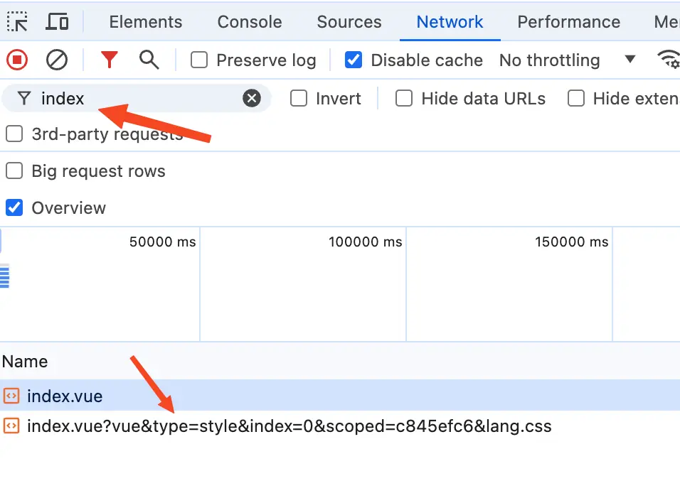{data-zoomable}

从上图中可以看到在network面板中编译后的index.vue文件有两个，并且第二个里面有一些query参数，其中的`type=style`就表示当前文件的内容对应的是style模块。第一个index.vue对应的是template和script模块中的内容。

我们来看看第一个index.vue，如下图：
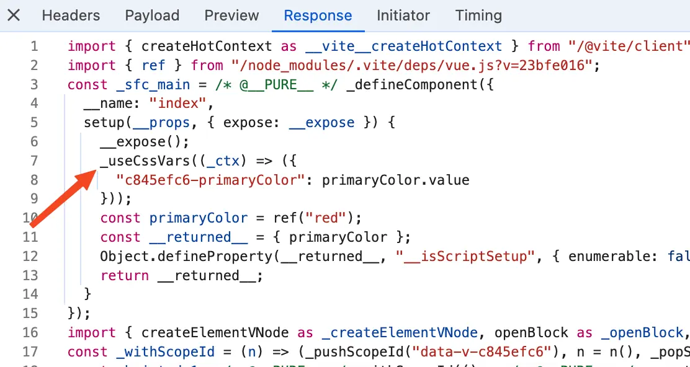{data-zoomable}

从上图中可以看到setup函数是script模块编译后的内容，在`setup`函数中多了一个`_useCssVars`函数，从名字你应该猜到了，这个函数的作用是和css变量有关系。别着急，我们接下来会详细去讲`_useCssVars`函数。

我们再来看看第二个index.vue，如下图：
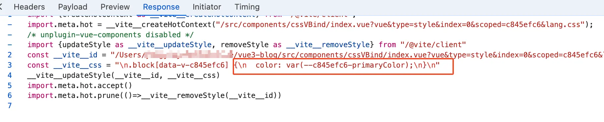{data-zoomable}

从上图中可以看到这个index.vue确实对应的是style模块中的内容，并且原本的`color: v-bind(primaryColor);`已经变成了`color: var(--c845efc6-primaryColor);`。

很明显浏览器是不认识`v-bind(primaryColor);`指令的，所以经过编译后就变成了浏览器认识的css变量`var(--c845efc6-primaryColor);`。

我们接着在elements面板中来看看此时class值为block的span元素，如下图：
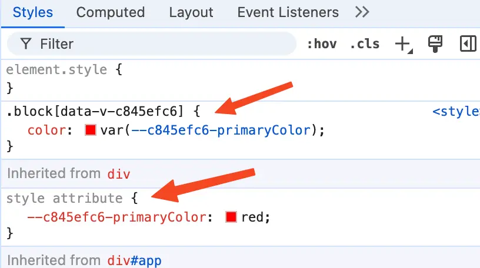{data-zoomable}

从上图中可以看到color的值为css变量`var(--c845efc6-primaryColor)`，这个我们前面讲过。不同的是这里从父级元素div中继承过来一个`--c845efc6-primaryColor: red;`。

这个就是声明一个名为`--c845efc6-primaryColor`的css变量，变量的值为`red`。

还记得我们在script模块中定义的响应式变量`primaryColor`吗？他的值就是`red`。

所以这个span元素最终color渲染出来的值就是`red`。

接下来我们将通过debug的方式带你搞清楚在style中是如何将指令`v-bind(primaryColor)`编译成css变量`var(--c845efc6-primaryColor)`，以及`_useCssVars`函数是如何生成声明值为`red`的css变量`--c845efc6-primaryColor`。
# `doCompileStyle`函数
在前面的文章中我们讲过了style模块实际是由`doCompileStyle`函数函数处理的，具体如何调用到`doCompileStyle`函数可以查看我之前的文章： [css上面的data-v-xxx](/style/scoped-style)。

我们需要给`doCompileStyle`函数打个断点，`doCompileStyle`函数的代码位置在：`node_modules/@vue/compiler-sfc/dist/compiler-sfc.cjs.js`。

还是一样的套路启动一个debug终端。这里以`vscode`举例，打开终端然后点击终端中的`+`号旁边的下拉箭头，在下拉中点击`Javascript Debug Terminal`就可以启动一个`debug`终端。
{data-zoomable}

在debug终端执行`yarn dev`，在浏览器中打开对应的页面，比如：[http://localhost:5173/](http://localhost:5173/) 。

此时断点将停留在`doCompileStyle`函数中，在我们这个场景中`doCompileStyle`函数简化后的代码如下：
```js
import postcss from "postcss";

function doCompileStyle(options) {
  const {
    filename,
    id,
    postcssOptions,
    postcssPlugins,
  } = options;
  const source = options.source;
  const shortId = id.replace(/^data-v-/, "");

  const plugins = (postcssPlugins || []).slice();
  plugins.unshift(cssVarsPlugin({ id: shortId, isProd }));

  const postCSSOptions = {
    ...postcssOptions,
    to: filename,
    from: filename,
  };
  let result;
  try {
    result = postcss(plugins).process(source, postCSSOptions);
    return result.then((result) => ({
      code: result.css || "",
      // ...省略
    }));
  } catch (e: any) {
    errors.push(e);
  }
}
```
在前面的文章[css上面的data-v-xxx](/style/scoped-style)中我们讲过了，这里`id`的值为使用了`scoped`后给html增加的自定义属性`data-v-x`，每个vue文件生成的`x`都是不一样的。在`doCompileStyle`函数中使用`id.replace`方法拿到`x`赋值给变量`shortId`。

接着就是定义一个`plugins`插件数组，并且将`cssVarsPlugin`函数的返回结果push进去。

这里`cssVarsPlugin`函数就是返回了一个自定义的`postcss`插件。

最后就是执行`result = postcss(plugins).process(source, postCSSOptions)`拿到经过`postcss`转换编译器处理后的css。

可能有的小伙伴对`postcss`不够熟悉，我们这里来简单介绍一下。

`postcss` 是 css 的 transpiler（转换编译器，简称转译器），它对于 css 就像 babel 对于 js 一样，能够做 css 代码的分析和转换。同时，它也提供了插件机制来做自定义的转换。

在我们这里主要就是用到了`postcss`提供的插件机制来完成css scoped的自定义转换，调用`postcss`的时候我们传入了`source`，他的值是style模块中的css代码。并且传入的`plugins`插件数组中有个`cssVarsPlugin`插件，这个自定义插件就是vue写的用于处理在css中使用v-bind指令。

在执行`postcss`对css代码进行转换之前我们在debug终端来看看此时的css代码是什么样的，如下图：

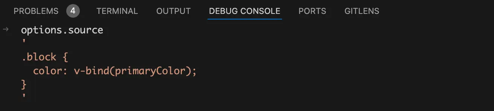{data-zoomable}

从上图中可以看到此时的`options.source`中还是`v-bind(primaryColor)`指令。
## `cssVarsPlugin`插件
`cssVarsPlugin`插件在我们这个场景中简化后的代码如下：
```js
const vBindRE = /v-bind\s*\(/g;
const cssVarsPlugin = (opts) => {
  const { id, isProd } = opts;
  return {
    postcssPlugin: "vue-sfc-vars",
    Declaration(decl) {
      const value = decl.value;
      if (vBindRE.test(value)) {
        vBindRE.lastIndex = 0;
        let transformed = "";
        let lastIndex = 0;
        let match;
        while ((match = vBindRE.exec(value))) {
          const start = match.index + match[0].length;
          const end = lexBinding(value, start);
          if (end !== null) {
            const variable = normalizeExpression(value.slice(start, end));
            transformed +=
              value.slice(lastIndex, match.index) +
              `var(--${genVarName(id, variable, isProd)})`;
            lastIndex = end + 1;
          }
        }
        decl.value = transformed + value.slice(lastIndex);
      }
    },
  };
};
```
这里的id就是我们在`doCompileStyle`函数中传过来的`shortId`，每个vue文件对应的`shortId`值都是不同的。

这里使用到了`Declaration`钩子函数，css中每个具体的样式都会触发这个`Declaration`钩子函数。

给`Declaration`钩子函数打个断点，当`post-css`处理到`color: v-bind(primaryColor);`时就会走到这个断点中。如下图：
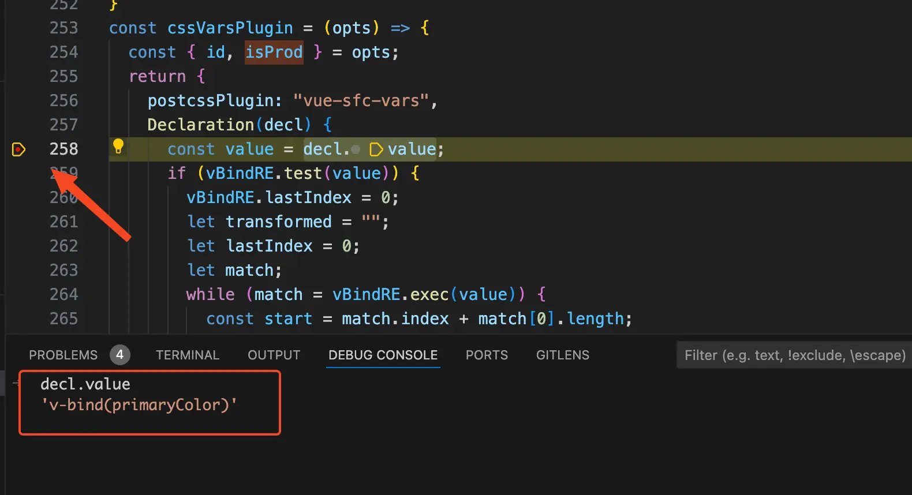{data-zoomable}

将字符串`v-bind(primaryColor)`赋值给变量`value`，接着执行`if (vBindRE.test(value))`。`vBindRE`是一个正则表达式，这里的意思是当前css的值是使用了v-bind指令才走到if语句里面。

接着就是执行`while ((match = vBindRE.exec(value)))`进行正则表达式匹配，如果`value`的值符合`vBindRE`正则表达式，也就是`value`的值是`v-bind`绑定的，那么就走到while循环里面去。

看到这里有的小伙伴会问了，这里使用if就可以了，为什么还要使用`while`循环呢？

答案是css的值可能是多个v-bind指令组成的，比如`border: v-bind(borderWidth) solid v-bind(primaryColor);`。这里的css值就由两个v-bind组成，分别是`v-bind(borderWidth)`和`v-bind(primaryColor);`。

为了处理上面这种多个`v-bind`指令组成的css值，所以就需要使用while循环搭配`exec`方法。正则表达式使用了global标志位的时候，js的[`RegExp`](https://developer.mozilla.org/zh-CN/docs/Web/JavaScript/Reference/Global_Objects/RegExp) 对象是*有状态*的，它们会将上次成功匹配后的位置记录在 [`lastIndex`](https://developer.mozilla.org/zh-CN/docs/Web/JavaScript/Reference/Global_Objects/RegExp/lastIndex) 属性中。使用此特性，`exec()` 可用来对单个字符串中的多次匹配结果进行逐条的遍历。

在debug终端来看看此时的`match`数组是什么样的，如下图：
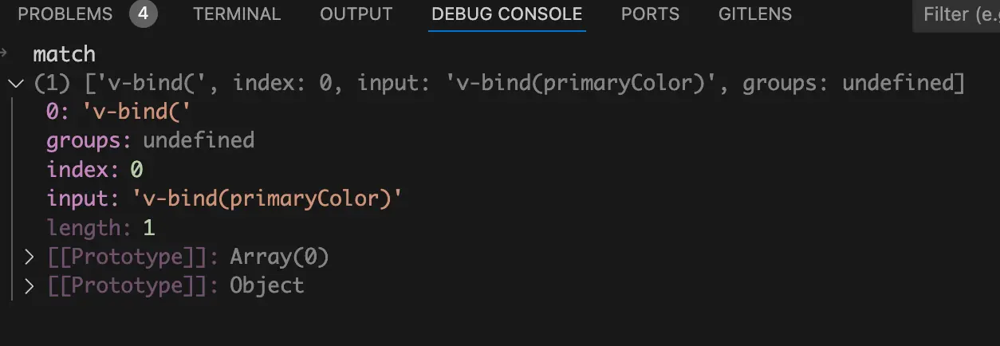{data-zoomable}

从上图中可以看到`match[0]`的值是正则表达式匹配的字符串，在我们这里匹配的字符串是`v-bind(`。`match.index`的值为匹配到的字符位于原始字符串的基于 0 的索引值。

看到这里有的小伙伴可能对`match.index`的值有点不理解，我举个简单的例子你一下就明白了。

还是以`v-bind(borderWidth) solid v-bind(primaryColor)`为例，这个字符串就是原始字符串，第一次在while循环中正则表达式匹配到第一个bind，此时的`match.index`的值为0，也就是第一个`v`在原始字符串的位置。第二次在while循环中会基于第一次的位置接着向后找，会匹配到第二个v-bind指令，此时的`match.index`的值同样也是基于原始字符串的位置，也就是第二个`v-bind`中的`v`的位置，值为26。

在while循环中使用`const start = match.index + match[0].length`给`start`变量赋值，`match.index`的值是`v-bind`中的`v`的位置。`match[0]`是正则匹配到的字符串` v-bind(`。所以这个`start`的位置就是`v-bind(primaryColor)`中`primaryColor`变量的开始位置，也就是`p`所在的位置。

接着就是执行`lexBinding`函数拿到`v-bind(primaryColor)`中`primaryColor`变量的结束位置，赋值给变量`end`。在我们这个场景中简化后的`lexBinding`函数代码如下：
```js
function lexBinding(content: string, start: number) {
  for (let i = start; i < content.length; i++) {
    const char = content.charAt(i);
    if (char === `)`) {
      return i;
    }
  }
  return null;
}
```
简化后的`lexBinding`函数也很简单，使用for循环遍历`v-bind(primaryColor)`字符串，如果发现字符串`)`就说明找到了`primaryColor`变量的结束位置。

接着来看拿到`end`变量后的代码，会执行`const variable = normalizeExpression(value.slice(start, end))`。这里先执行了`value.slice(start, end)`根据`start`开始位置和`end`结束位置提取出`v-bind`指令绑定的变量，接着`normalizeExpression`函数对其进行`trim`去除空格。

在我们这个场景中简化后的`normalizeExpression`函数代码如下：
```js
function normalizeExpression(exp) {
  exp = exp.trim();
  return exp;
}
```
将从`v-bind`指令中提取出来的变量赋值给`variable`变量，接着执行字符串拼接拿到由`v-bind`指令转换成的css变量，代码如下：
```js
transformed +=
  value.slice(lastIndex, match.index) +
  `var(--${genVarName(id, variable, isProd)})`;
```
这里的`value`是css变量值`v-bind(primaryColor)`，在我们这里`lastIndex`的值为0，`match.index`的值也是0，所以`value.slice(lastIndex, match.index)`拿到的值也是空字符串。

接着来看后面这部分，使用字符串拼接得到：`var(--变量)`。这个看着就很熟悉了，他就是一个css变量。变量名是调用`genVarName`函数生成的，`genVarName`函数代码如下：
```js
import hash from "hash-sum";
function genVarName(id, raw, isProd) {
  if (isProd) {
    return hash(id + raw);
  } else {
    return `${id}-${getEscapedCssVarName(raw)}`;
  }
}
```
这个id是根据当前vue组件路径生成的，每个vue组件生成的id都不同。这个`raw`也就是绑定的响应式变量，在这里是`primaryColor`。`isProd`表示当前是不是生产环境。

如果是生产环境就根据id和变量名使用哈希算法生成一个加密的字符串。

如果是开发环境就使用字符串拼接将`id`和变量名`primaryColor`拼接起来得到一个css变量。`getEscapedCssVarName`函数的代码也很简单，是对变量中的特殊字符进行转义,以便在 CSS 变量名中使用。代码如下：
```js
const cssVarNameEscapeSymbolsRE = /[ !"#$%&'()*+,./:;<=>?@[\\\]^`{|}~]/g;
function getEscapedCssVarName(key: string) {
  return key.replace(cssVarNameEscapeSymbolsRE, (s) => `\\${s}`);
}
```
这也就是为什么不同组件的`primaryColor`生成的css变量名称不会冲突的原因了，因为在生成的css变量前面拼接了一个`id`，每个vue组件生成的`id`值都不同。

拿到转换成css变量的css值后，并且将其赋值给变量`transformed`。接着就是执行`lastIndex = end + 1`，在我们这里`lastIndex`就指向了字符串的末尾。

最后就是执行`decl.value = transformed + value.slice(lastIndex);`将`v-bind`指令替换成css变量，由于`lastIndex`是指向了字符串的末尾，所以`value.slice(lastIndex)`的值也是一个空字符串。

所以在我们这里实际是执行了`decl.value = transformed`，执行完这句话后color的值就由`v-bind(primaryColor)`转换成了`var(--c845efc6-primaryColor)`。
# 生成`useCssVars`函数
前面我们讲过了编译后的setup函数中多了一个`useCssVars`函数，实际在我们的源代码中是没有这个`useCssVars`函数的。接下来我们来看看编译时处理script模块时是如何生成`useCssVars`函数的。

在之前的 [defineProps](/script/defineProps)文章中我们讲过了vue的script模块中的代码是由`compileScript`函数处理的。

给`compileScript`函数打个断点，在我们这个场景中简化后的`compileScript`函数代码如下：
```js
function compileScript(sfc, options) {
  const ctx = new ScriptCompileContext(sfc, options);
  const startOffset = ctx.startOffset;

  ctx.s.prependLeft(
    startOffset,
    `
${genCssVarsCode(sfc.cssVars, ctx.bindingMetadata, scopeId, !!options.isProd)}
`
  );
}
```
首先调用`ScriptCompileContext`类new了一个`ctx`上下文对象，我们这里来介绍一下需要使用到的`ctx`上下文对象中的两个方法：`ctx.s.toString`、`ctx.s.prependLeft`。

- `ctx.s.toString`：返回此时由script模块编译成的js代码。

- `ctx.s.prependLeft`：给编译后的js代码在指定`index`的前面插入字符串。

给`ctx.s.prependLeft`方法打个断点，在debug终端使用`ctx.s.toString`方法来看看此时由script模块编译成的js代码是什么样的，如下图：
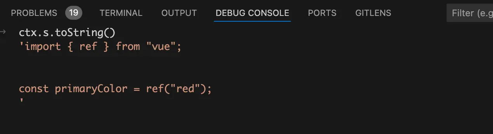{data-zoomable}

从上图中可以看到此时生成的js代码code字符串只有一条`import`语句和定义`primaryColor`变量。

由于篇幅有限我们就不深入到`genCssVarsCode`函数了，这个`genCssVarsCode`函数会生成`useCssVars`函数的调用。我们在debug终端来看看生成的code代码字符串是什么样的，如下图：
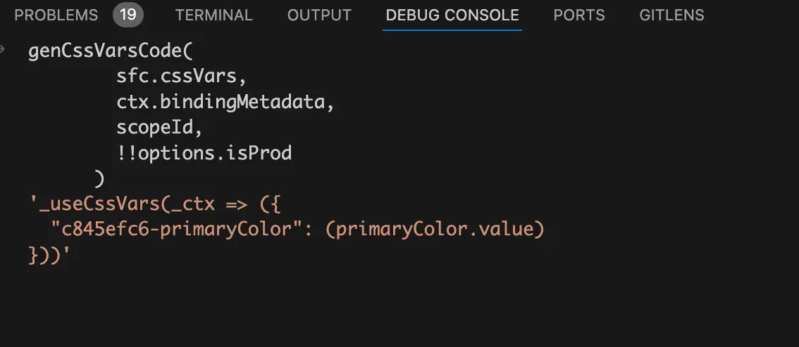{data-zoomable}

从上图中可以看到`genCssVarsCode`函数生成了一个`useCssVars`函数。

执行`ctx.s.prependLeft`函数后会将生成的`useCssVars`函数插入到生成的js code代码字符串的前面，我们在debug终端来看看，如下图：
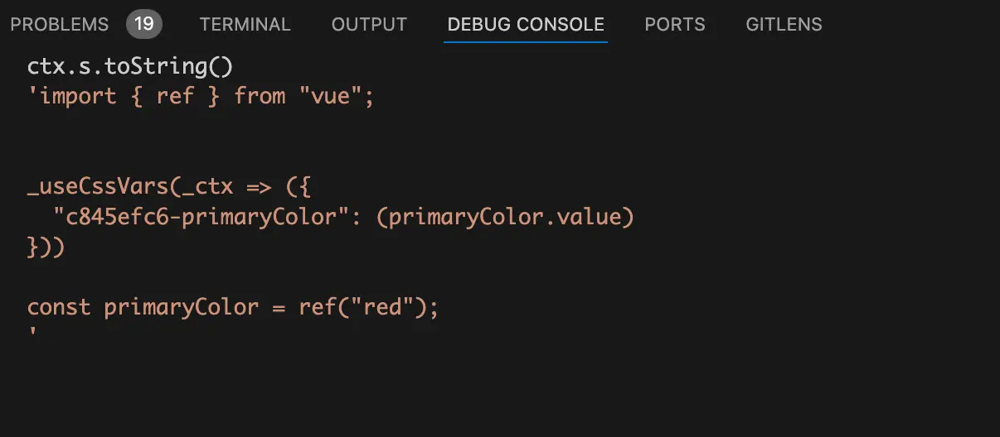{data-zoomable}

从上图中可以看到此时的js code代码字符串中已经有了一个`useCssVars`函数了。
# 执行`useCssVars`函数
前面我们讲过了编译时经过`cssVarsPlugin`这个`post-css`插件处理后，`v-bind(primaryColor)`指令就会编译成了css变量`var(--c845efc6-primaryColor)`。这里只是使用css变量值的地方，那么这个css变量的值又是在哪里定义的呢？答案是在`useCssVars`函数中。

在开始我们讲过了编译后的setup函数中多了一个`useCssVars`函数，所以我们给`useCssVars`函数打个断点，刷新浏览器此时代码就会走到断点中了。如下图：
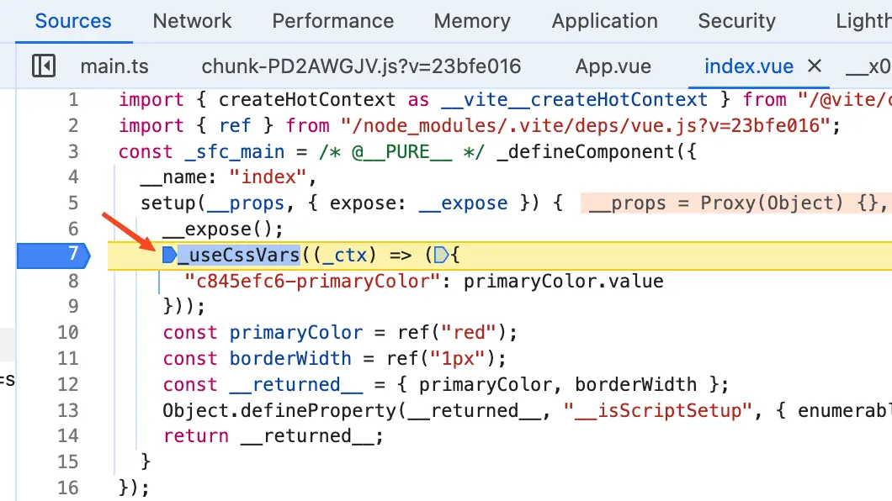{data-zoomable}

从上图中可以看到执行`useCssVars`函数时传入了一个回调函数作为参数，这个回调函数返回了一个对象。

将断点走进`useCssVars`函数，在我们这个场景中简化后的`useCssVars`函数代码如下：
```js
function useCssVars(getter) {
  const instance = getCurrentInstance();

  const setVars = () => {
    const vars = getter(instance.proxy);
    setVarsOnVNode(instance.subTree, vars);
  };

  watchPostEffect(setVars);
}
```
在`useCssVars`函数中先调用`getCurrentInstance`函数拿到当前的vue实例，然后将`setVars`函数作为参数传入去执行`watchPostEffect`函数。

这个`watchPostEffect`函数大家应该知道，他是[`watchEffect()`](https://cn.vuejs.org/api/reactivity-core.html#watcheffect) 使用 `flush: 'post'` 选项时的别名。

为什么需要使用 `flush: 'post'`呢？

答案是需要在`setVars`回调函数中需要去操作DOM，所以才需要使用 `flush: 'post'`让回调函数在组件渲染完成之后去执行。

给`setVars`函数打个断点，组件渲染完成后断点将会走进`setVars`函数中。

首先会执行`getter`函数，将返回值赋值给变量`vars`。前面我们讲过了这个`getter`函数是调用`useCssVars`函数时传入的回调函数，代码如下：
```js
_useCssVars((_ctx) => ({
  "c845efc6-primaryColor": primaryColor.value
}))
```
在这个回调函数中会返回一个对象，对象的key为`c845efc6-primaryColor`，这个key就是css变量`var(--c845efc6-primaryColor)`括号中的内容。

对象的值是ref变量`primaryColor`的值，由于这个代码是在`watchPostEffect`的回调函数中执行的，所以这里的ref变量`primaryColor`也被作为依赖进行收集了。当`primaryColor`变量的值变化时，`setVars`函数也将再次执行。这也就是为什么在style中可以使用v-bind指令绑定一个响应式变量，并且当响应式变量的值变化时样式也会同步更新。

接着就是执行`setVarsOnVNode(instance.subTree, vars)`函数，传入的第一个参数为`instance.subTree`。他的值是当前vue组件根元素的虚拟DOM，也就是根元素div的虚拟DOM。第二个参数为`useCssVars`传入的回调函数返回的对象，这是一个css变量组成的对象。

接着将断点走进`setVarsOnVNode`函数，在我们这个场景中简化后的代码如下：
```js
function setVarsOnVNode(vnode: VNode, vars) {
  setVarsOnNode(vnode.el, vars);
}
```
在`setVarsOnVNode`函数中是调用了`setVarsOnNode`函数，不同的是传入的第一个参数不再是虚拟DOM。而是`vnode.el`虚拟DOM对应的真实DOM，也就是根节点div。

将断点走进`setVarsOnNode`函数，在我们这个场景中简化后的`setVarsOnNode`函数代码如下：
```js
function setVarsOnNode(el: Node, vars) {
  if (el.nodeType === 1) {
    const style = el.style;
    for (const key in vars) {
      style.setProperty(`--${key}`, vars[key]);
    }
  }
}
```
在`setVarsOnNode`函数中先使用if语句判断`el.nodeType === 1`，这个的意思是判断当前节点类型是不是一个元素节点，比如`<p>`和`<div>`。如果是就走进if语句里面，使用`el.style`拿到根节点的style样式。

这里的`vars`是css变量组成的对象，遍历这个对象。对象的key为css变量名称，对象的value为css变量的值。

接着就是遍历css变量组成的对象，使用`style.setProperty`方法给根节点div增加内联样式，也就是`--c845efc6-primaryColor: red;`。`span`元素由于是根节点div的子节点，所以他也继承了样式`--c845efc6-primaryColor: red;`。

由于span元素的color经过编译后已经变成了css变量`var(--c845efc6-primaryColor)`，并且从根节点继承过来css变量`--c845efc6-primaryColor`的值为`red`，所以最终span元素的color值为`red`。
# 总结
下面这个是我总结的流程图，如下（**搭配流程图后面的文字解释一起服用效果最佳**）：
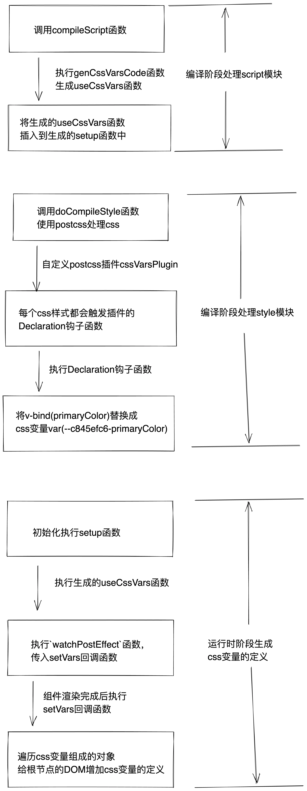{data-zoomable}


编译阶段script模块是由`compileScript`函数处理的，`compileScript`函数会去执行一个`genCssVarsCode`函数。这个函数会返回一个`useCssVars`函数的调用。然后在`compileScript`函数中会调用`ctx.s.prependLeft`方法将生成的`useCssVars`函数插入到编译后的setup函数中。

编译阶段style模块是由`doCompileStyle`函数处理的，在`doCompileStyle`函数中会调用`postcss`对css样式进行处理。vue自定义了一个名为`cssVarsPlugin`的`postcss`插件，插件中有个`Declaration`钩子函数，css中每个具体的样式都会触发这个`Declaration`钩子函数。

在`Declaration`钩子函数中使用正则表达式去匹配当前css值是不是`v-bind`绑定的，如果是就将匹配到的`v-bind`绑定的变量提取出来赋值给变量`variable`。还有一个`id`变量，他是根据当前vue组件的路径生成的加密字符串。使用字符串拼接就可以得到`var(--${id}-${variable})`，他就是由`v-bind`编译后生成的css变量。最终生成的css变量类似这样：`var(--c845efc6-primaryColor)`。

运行时阶段初始化的时候会去执行setup函数，由于在编译阶段setup函数中插入了一个`useCssVars`函数。使用在运行时阶段初始化时`useCssVars`函数会被执行。

在`useCssVars`函数中执行了`watchPostEffect`函数，他是[`watchEffect()`](https://cn.vuejs.org/api/reactivity-core.html#watcheffect) 使用 `flush: 'post'` 选项时的别名。

由于我们需要在回调中操作DOM，所以才需要使用`flush: 'post'`，让回调函数在组件渲染之后去执行。由于在回调函数中会去读取`v-bind`绑定的响应式变量，所以每次绑定的响应式变量值变化后都会再次执行调用`watchPostEffect`传入的回调函数，以此让响应式变量绑定的样式保存更新。

在`watchPostEffect`传入的回调函数中会通过当前vue组件实例拿到真实DOM的根节点，然后遍历css变量组成的对象，将这些css变量逐个在根节点上面定义，类似这样：`--c845efc6-primaryColor: red;`。由于css可以继承，所以子节点都继承了这个css定义。

我们的`<span>`标签在编译阶段由`color: v-bind(primaryColor);`编译成了css变量`color: var(--c845efc6-primaryColor)`。并且在运行时由于`useCssVars`函数的作用在根节点生成了css变量的定义`--c845efc6-primaryColor: red;`。由于css继承，所以span标签也继承了这个css变量的定义，所以span标签渲染到页面上的color值最终为`red`。


[加入本书对应的「源码交流群」](/guide/contact)
