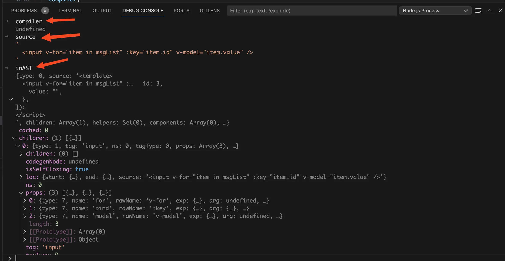
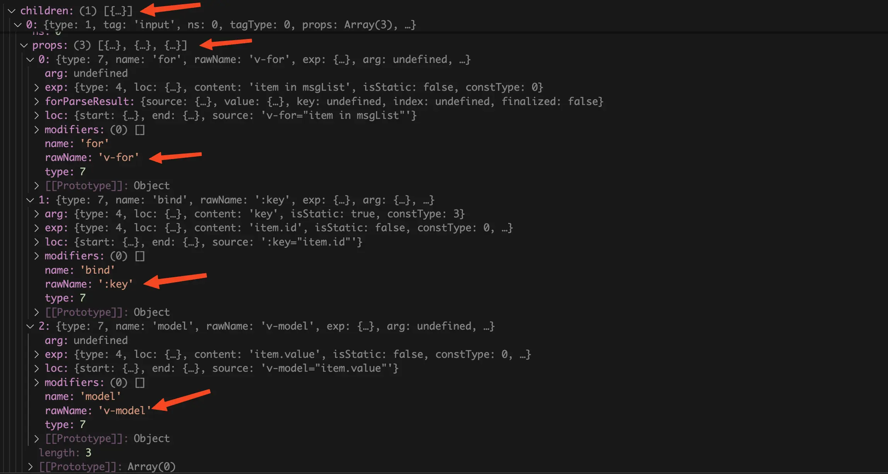
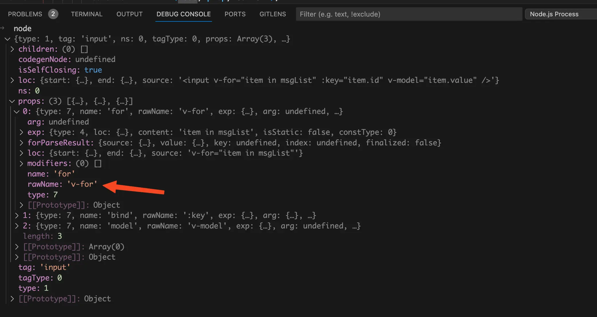
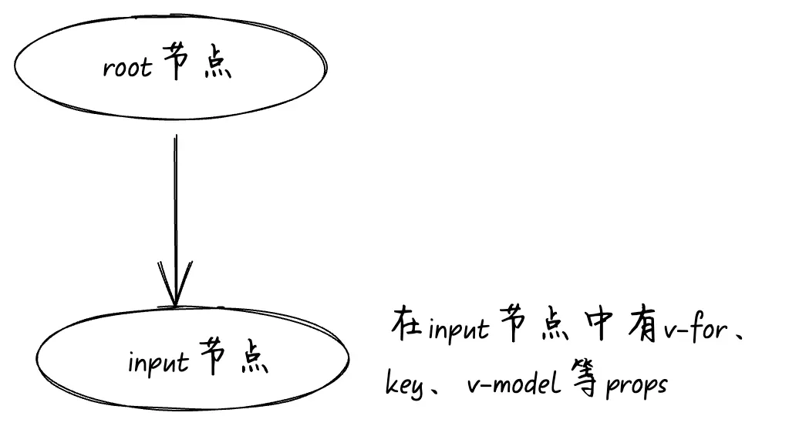
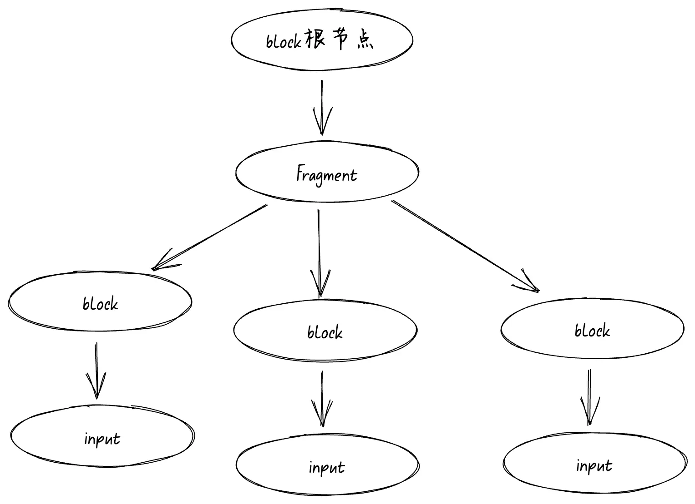
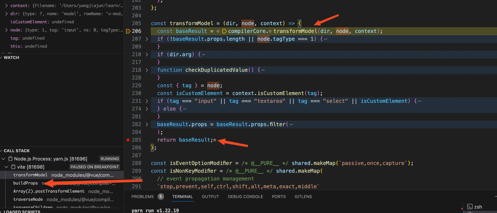
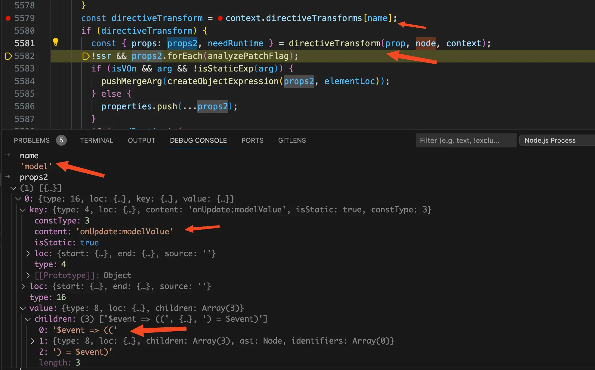
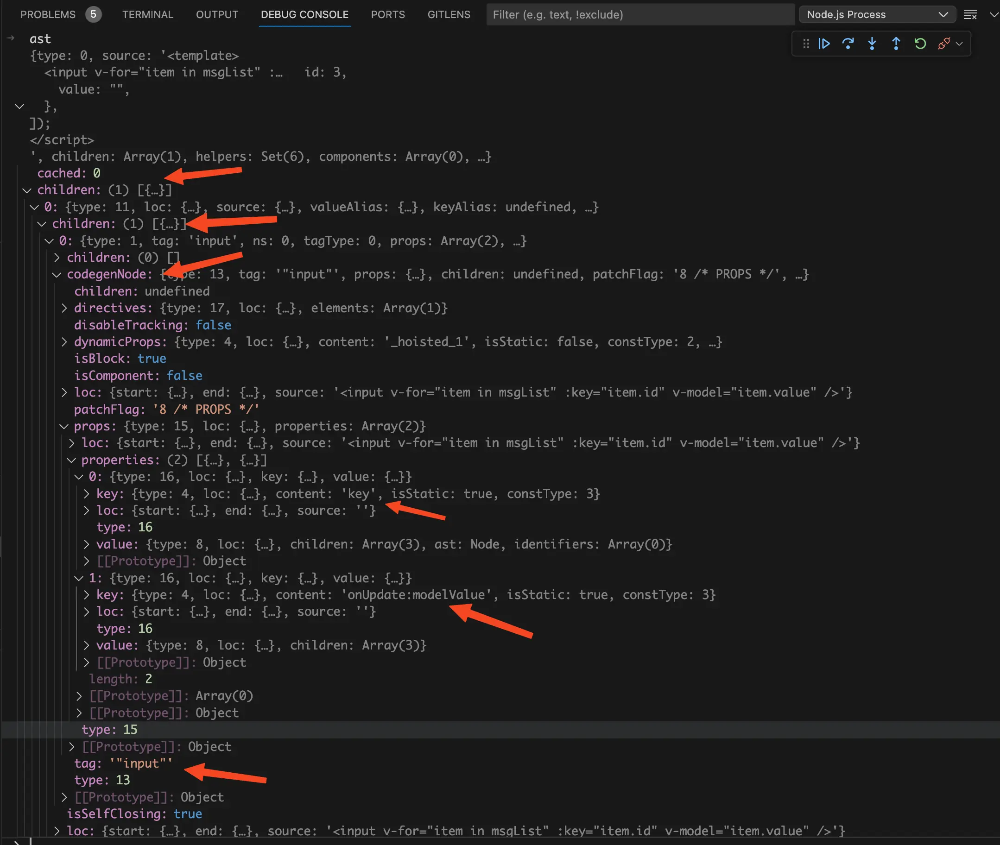
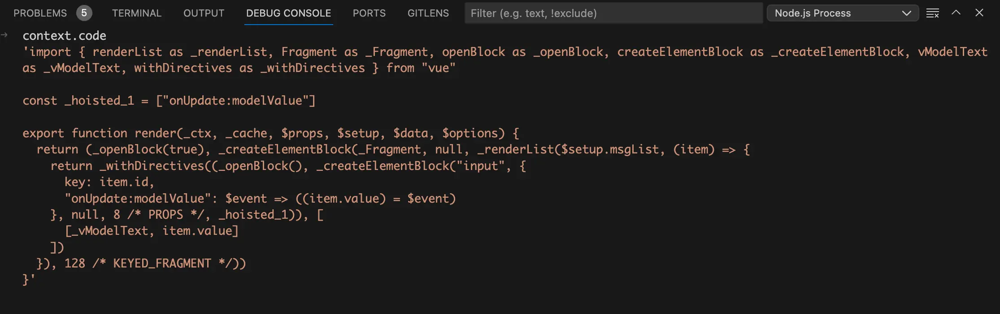
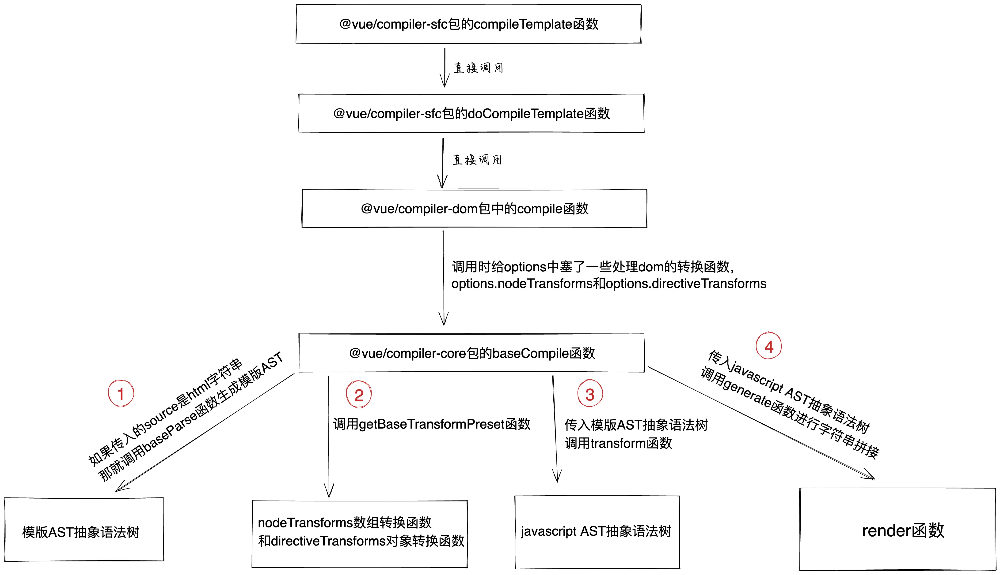

# 前言
在之前的 [vue文件编译成js文件](/guide/vue-to-js) 文章中我们讲过了vue文件是如何编译成js文件，通过那篇文章我们知道了，template编译为render函数底层就是调用了`@vue/compiler-sfc`包暴露出来的`compileTemplate`函数。由于文章篇幅有限，我们没有去深入探索`compileTemplate`函数是如何将template模块编译为`render`函数，在这篇文章中我们来了解一下。
# `@vue`下面的几个包
先来介绍一下本文中涉及到vue下的几个包，分别是：`@vue/compiler-sfc`、`@vue/compiler-dom`、`@vue/compiler-core`。
- `@vue/compiler-sfc`：用于编译vue的SFC文件，这个包依赖vue下的其他包，比如`@vue/compiler-dom`和`@vue/compiler-core`。这个包一般是给[vue-loader](https://github.com/vuejs/vue-loader) 和 [@vitejs/plugin-vue](https://github.com/vitejs/vite-plugin-vue/tree/main/packages/plugin-vue)使用的。

- `@vue/compiler-dom`：这个包专注于浏览器端的编译，处理浏览器dom相关的逻辑都在这里面。

- `@vue/compiler-core`：从名字你也能看出来这个包是vue编译部分的核心，提供了通用的编译逻辑，不管是浏览器端还是服务端编译最终都会走到这个包里面来。


# `@vue/compiler-sfc`包的`compileTemplate`函数
还是同样的套路，我们通过debug一个简单的demo来搞清楚`compileTemplate`函数是如何将template编译成render函数的。demo代码如下：
```vue
<template>
  <input v-for="item in msgList" :key="item.id" v-model="item.value" />
</template>

<script setup lang="ts">
import { ref } from "vue";

const msgList = ref([
  {
    id: 1,
    value: "",
  },
  {
    id: 2,
    value: "",
  },
  {
    id: 3,
    value: "",
  },
]);
</script>

```
[vue文件编译成js文件](/guide/vue-to-js) 文章中我们已经知道了在使用vite的情况下template编译为render函数是在node端完成的。所以我们需要启动一个debug终端，才可以在node端打断点。这里以vscode举例，首先我们需要打开终端，然后点击终端中的`+`号旁边的下拉箭头，在下拉中点击`Javascript Debug Terminal`就可以启动一个debug终端。
{data-zoomable}

`compileTemplate`函数在`node_modules/@vue/compiler-sfc/dist/compiler-sfc.cjs.js`文件中，找到`compileTemplate`函数打上断点，然后在debug终端中执行`yarn dev`（这里是以`vite`举例）。在浏览器中访问 [http://localhost:5173/](http://localhost:5173/)，此时断点就会走到`compileTemplate`函数中了。在我们这个场景中`compileTemplate`函数简化后的代码非常简单，代码如下：
```js
function compileTemplate(options) {
  return doCompileTemplate(options);
}
```
# `@vue/compiler-sfc`包的`doCompileTemplate`函数
我们接着将断点走进`doCompileTemplate`函数中，看看里面的代码是什么样的，简化后的代码如下：
```js
import * as CompilerDOM from '@vue/compiler-dom'

function doCompileTemplate({
  source,
  ast: inAST,
  compiler
}) {
  const defaultCompiler = CompilerDOM;
  compiler = compiler || defaultCompiler;
  let { code, ast, preamble, map } = compiler.compile(inAST || source, {
    // ...省略传入的options
  });
  return { code, ast, preamble, source, errors, tips, map };
}
```
在`doCompileTemplate`函数中代码同样也很简单，我们在debug终端中看看`compiler`、`source`、`inAST`这三个变量的值是长什么样的。如下图：
{data-zoomable}


从上图中我们可以看到此时的`compiler`变量的值为`undefined`，`source`变量的值为template模块中的代码，`inAST`的值为由template模块编译而来的AST抽象语法树。不是说好的要经过`parse`函数处理后才会得到AST抽象语法树，为什么这里就已经有了AST抽象语法树？不要着急接着向下看，后面我会解释。

由于这里的`compiler`变量的值为`undefined`，所以`compiler`会被赋值为`CompilerDOM`。而`CompilerDOM`就是`@vue/compiler-dom`包中暴露的所有内容。执行`compiler.compile`函数，就是执行`@vue/compiler-dom`包中的`compile`函数。

`compile`函数接收的第一个参数为`inAST || source`，从这里我们知道第一个参数既可能是AST抽象语法树，也有可能是template模块中的html代码字符串。`compile`函数的返回值对象中的`code`字段就是编译好的`render`函数，然后return出去。
# `@vue/compiler-dom`包中的`compile`函数
我们接着将断点走进`@vue/compiler-dom`包中的`compile`函数，发现代码同样也很简单，简化后的代码如下：
```js
import {
  baseCompile,
} from '@vue/compiler-core'

function compile(src, options = {}) {
  return baseCompile(
    src,
    Object.assign({}, parserOptions, options, {
      nodeTransforms: [
        ...DOMNodeTransforms,
        ...options.nodeTransforms || []
      ],
      directiveTransforms: shared.extend(
        {},
        DOMDirectiveTransforms,
        options.directiveTransforms || {}
      )
    })
  );
}
```
从上面的代码中可以看到这里的`compile`函数也不是具体实现的地方，在这里调用的是`@vue/compiler-core`包的`baseCompile`函数。看到这里你可能会有疑问，为什么不在上一步的`doCompileTemplate`函数中直接调用`@vue/compiler-core`包的`baseCompile`函数，而是要从`@vue/compiler-dom`包中绕一圈再来调用呢`baseCompile`函数呢？

答案是`baseCompile`函数是一个处于`@vue/compiler-core`包中的API，而`@vue/compiler-core`可以运行在各种 JavaScript 环境下，比如浏览器端、服务端等各个平台。`baseCompile`函数接收这些平台专有的一些options，而我们这里的demo是浏览器平台。

所以才需要从`@vue/compiler-dom`包中绕一圈去调用`@vue/compiler-core`包中的`baseCompile`函数传入一些浏览器中特有的options。在上面的代码中我们看到使用`DOMNodeTransforms`数组对`options`中的`nodeTransforms`属性进行了扩展，使用`DOMDirectiveTransforms`对象对`options`中的`directiveTransforms`属性进行了扩展。

我们先来看看`DOMNodeTransforms`数组：
```js
const DOMNodeTransforms = [
  transformStyle
];
```
`options`对象中的`nodeTransforms`属性是一个数组，里面包含了许多`transform`转换函数用于处理AST抽象语法树。经过`@vue/compiler-dom`的`compile`函数处理后`nodeTransforms`数组中多了一个处理style的`transformStyle`函数。这里的`transformStyle`是一个转换函数用于处理`dom`上面的style，比如`style="color: red"`。

我们再来看看`DOMDirectiveTransforms`对象：
```js
const DOMDirectiveTransforms = {
  cloak: compilerCore.noopDirectiveTransform,
  html: transformVHtml,
  text: transformVText,
  model: transformModel,
  on: transformOn,
  show: transformShow
};
```
`options`对象中的`directiveTransforms`属性是一个对象，经过`@vue/compiler-dom`的`compile`函数处理后`directiveTransforms`对象中增加了处理`v-cloak`、`v-html`、`v-text`、`v-model`、`v-on`、`v-show`等指令的`transform`转换函数。很明显我们这个demo中`input`标签上面的`v-model`指令就是由这里的`transformModel`转换函数处理。

你发现了没，不管是`nodeTransforms`数组还是`directiveTransforms`对象，增加的`transform`转换函数都是处理dom相关的。经过`@vue/compiler-dom`的`compile`函数处理后，再调用`baseCompile`函数就有了处理dom相关的转换函数了。
# `@vue/compiler-core`包的`baseCompile`函数
继续将断点走进`vue/compiler-core`包的`baseCompile`函数，简化后的`baseCompile`函数代码如下：
```js
function baseCompile(
  source: string | RootNode,
  options: CompilerOptions = {},
): CodegenResult {
  const ast = isString(source) ? baseParse(source, options) : source

  const [nodeTransforms, directiveTransforms] = getBaseTransformPreset()

  transform(
    ast,
    Object.assign({}, options, {
      nodeTransforms: [
        ...nodeTransforms,
        ...(options.nodeTransforms || []), // user transforms
      ],
      directiveTransforms: Object.assign(
        {},
        directiveTransforms,
        options.directiveTransforms || {}, // user transforms
      ),
    }),
  )

  return generate(ast, options)
}
```
我们先来看看`baseCompile`函数接收的参数，第一个参数为`source`，类型为`string | RootNode`。这句话的意思是接收的`source`变量可能是html字符串，也有可能是html字符串编译后的AST抽象语法树。再来看看第二个参数`options`，我们这里只关注`options.nodeTransforms`数组属性和`options.directiveTransforms`对象属性，这两个里面都是存了一堆转换函数，区别就是一个是数组，一个是对象。

我们再来看看返回值类型`CodegenResult`，定义如下：
```ts
interface CodegenResult {
  code: string
  preamble: string
  ast: RootNode
  map?: RawSourceMap
}
```
从类型中我们可以看到返回值对象中的`code`属性就是编译好的`render`函数，而这个返回值就是最后调用`generate`函数返回的。

明白了`baseCompile`函数接收的参数和返回值，我们再来看函数内的代码。主要分为四块内容：
- 拿到由html字符串转换成的AST抽象语法树。

- 拿到由一堆转换函数组成的`nodeTransforms`数组，和拿到由一堆转换函数组成的`directiveTransforms`对象。

- 执行`transform`函数，使用合并后的`nodeTransforms`中的所有转换函数处理AST抽象语法树中的所有node节点，使用合并后的`directiveTransforms`中的转换函数对会生成props的指令进行处理，得到处理后的`javascript AST抽象语法树`。

- 调用`generate`函数根据上一步处理后的`javascript AST抽象语法树`进行字符串拼接，拼成`render`函数。

## 获取AST抽象语法树
我们先来看第一块的内容，代码如下：
```js
const ast = isString(source) ? baseParse(source, options) : source
```
如果传入的`source`是html字符串，那就调用`baseParse`函数根据html字符串生成对应的AST抽象语法树，如果传入的就是AST抽象语法树那么就直接赋值给`ast`变量。为什么这里有这两种情况呢？

原因是`baseCompile`函数可以被直接调用，也可以像我们这样由vite的`@vitejs/plugin-vue`包发起，经过层层调用后最终执行`baseCompile`函数。在我们这个场景中，在前面我们就知道了走进`compileTemplate`函数之前就已经有了编译后的AST抽象语法树，所以这里不会再调用`baseParse`函数去生成AST抽象语法树了。那么又是什么时候生成的AST抽象语法树呢？

在之前的 [vue文件编译成js文件](/guide/vue-to-js) 文章中我们讲了调用`createDescriptor`函数会将`vue`代码字符串转换为`descriptor`对象，`descriptor`对象中拥有`template`属性、`scriptSetup`属性、`styles`属性，分别对应vue文件中的`template`模块、`<script setup>`模块、`<style>`模块。如下图：
{data-zoomable}
`createDescriptor`函数在生成`template`属性的时候底层同样也会调用`@vue/compiler-core`包的`baseParse`函数，将template模块中的html字符串编译为AST抽象语法树。

所以在我们这个场景中走到`baseCompile`函数时就已经有了AST抽象语法树了，其实底层都调用的是`@vue/compiler-core`包的`baseParse`函数。
## 获取转换函数
接着将断点走到第二块内容处，代码如下：
```js
const [nodeTransforms, directiveTransforms] = getBaseTransformPreset()
```
从上面的代码可以看到`getBaseTransformPreset`函数的返回值是一个数组，对返回的数组进行解构，数组的第一项赋值给`nodeTransforms`变量，数组的第二项赋值给`directiveTransforms`变量。

将断点走进`getBaseTransformPreset`函数，代码如下：
```js
function getBaseTransformPreset() {
  return [
    [
      transformOnce,
      transformIf,
      transformMemo,
      transformFor,
      transformFilter,
      trackVForSlotScopes,
      transformExpression
      transformSlotOutlet,
      transformElement,
      trackSlotScopes,
      transformText
    ],
    {
      on: transformOn,
      bind: transformBind,
      model: transformModel
    }
  ];
}
```
从上面的代码中不难看出由`getBaseTransformPreset`函数的返回值解构出来的`nodeTransforms`变量是一个数组，数组中包含一堆transform转换函数，比如处理`v-once`、`v-if`、`v-memo`、`v-for`等指令的转换函数。很明显我们这个demo中`input`标签上面的`v-for`指令就是由这里的`transformFor`转换函数处理。

同理由`getBaseTransformPreset`函数的返回值解构出来的`directiveTransforms`变量是一个对象，对象中包含处理`v-on`、`v-bind`、`v-model`指令的转换函数。

经过这一步的处理我们就拿到了由一系列转换函数组成的`nodeTransforms`数组，和由一系列转换函数组成的`directiveTransforms`对象。看到这里我想你可能有一些疑问，为什么`nodeTransforms`是数组，`directiveTransforms`却是对象呢？为什么有的指令转换转换函数是在`nodeTransforms`数组中，有的却是在`directiveTransforms`对象中呢？别着急，我们下面会讲。
## `transform`函数
接着将断点走到第三块内容，`transform`函数处，代码如下：
```js
transform(
  ast,
  Object.assign({}, options, {
    nodeTransforms: [
      ...nodeTransforms,
      ...(options.nodeTransforms || []), // user transforms
    ],
    directiveTransforms: Object.assign(
      {},
      directiveTransforms,
      options.directiveTransforms || {}, // user transforms
    ),
  }),
)
```
调用`transform`函数时传入了两个参数，第一个参数为当前的AST抽象语法树，第二个参数为传入的`options`，在`options`中我们主要看两个属性：`nodeTransforms`数组和`directiveTransforms`对象。

`nodeTransforms`数组由两部分组成，分别是上一步拿到的`nodeTransforms`数组，和之前在`options.nodeTransforms`数组中塞进去的转换函数。

`directiveTransforms`对象就不一样了，如果上一步拿到的`directiveTransforms`对象和`options.directiveTransforms`对象拥有相同的key，那么后者就会覆盖前者。

以我们这个例子举例：在上一步中拿到的`directiveTransforms`对象中有key为`model`的处理`v-model`指令的转换函数，但是我们在`@vue/compiler-dom`包中的`compile`函数同样也给`options.directiveTransforms`对象中塞了一个key为`model`的处理`v-model`指令的转换函数。

那么`@vue/compiler-dom`包中的`v-model`转换函数就会覆盖上一步中定义的`v-model`转换函数，那么`@vue/compiler-core`包中`v-model`转换函数是不是就没用了呢？答案是当然有用，在`@vue/compiler-dom`包中的`v-model`转换函数会手动调用`@vue/compiler-core`包中`v-model`转换函数。

这样设计的目的是对于一些指令的处理支持不同的平台传入不同的转换函数，并且在这些平台中也可以手动调用`@vue/compiler-core`包中提供的指令转换函数，根据手动调用的结果再针对各自平台进行一些特别的处理。

我们先来回忆一下前面demo中的代码：
```vue
<template>
  <input v-for="item in msgList" :key="item.id" v-model="item.value" />
</template>

<script setup lang="ts">
import { ref } from "vue";

const msgList = ref([
  {
    id: 1,
    value: "",
  },
  {
    id: 2,
    value: "",
  },
  {
    id: 3,
    value: "",
  },
]);
</script>

```
接着在debug终端中看看执行`transform`函数前的AST抽象语法树是什么样的，如下图：
{data-zoomable}


从上图中可以看到AST抽象语法树根节点下面只有一个children节点，这个children节点对应的就是input标签。在input标签上面有三个props，分别对应的是input标签上面的`v-for`指令、`:key`属性、`v-model`指令。说明在生成AST抽象语法树的阶段不会对指令进行处理，而是当做普通的属性一样使用正则匹配出来，然后塞到props数组中。

既然在生成AST抽象语法树的过程中没有对`v-model`、`v-for`等指令进行处理，那么又是在什么时候处理的呢？答案是在执行`transform`函数的时候处理的，在`transform`函数中会递归遍历整个AST抽象语法树，在遍历每个node节点时都会将`nodeTransforms`数组中的所有转换函数按照顺序取出来执行一遍，在执行时将当前的node节点和上下文作为参数传入。经过`nodeTransforms`数组中全部的转换函数处理后，vue提供的许多内置指令、语法糖、内置组件等也就被处理了，接下来只需要执行`generate`函数生成`render`函数就行了。
### `nodeTransforms`数组
`nodeTransforms` 主要是对 node节点 进行操作，可能会替换或者移动节点。每个node节点都会将`nodeTransforms`数组中的转换函数按照顺序全部执行一遍，比如处理`v-if`指令的`transformIf`转换函数就要比处理`v-for`指令的`transformFor`函数先执行。所以`nodeTransforms`是一个数组，而且数组中的转换函数的顺序还是有讲究的。

在我们这个demo中input标签上面的`v-for`指令是由`nodeTransforms`数组中的`transformFor`转换函数处理的，很简单就可以找到`transformFor`转换函数。在函数开始的地方打一个断点，代码就会走到这个断点中，在debug终端上面看看此时的`node`节点是什么样的，如下图：
{data-zoomable}


从上图中可以看到在执行`transformFor`转换函数之前的node节点和上一张图打印的node节点是一样的。

我们在执行完`transformFor`转换函数的地方打一个断点，看看执行完`transformFor`转换函数后node节点变成什么样了，如下图：
{data-zoomable}


从上图我们可以看到经过`transformFor`转换函数处理后当前的node节点已经变成了一个新的node节点，而原来的input的node节点变成了这个节点的children子节点。

新节点的`source.content`里存的是`v-for="item in msgList"`中的`msgList`变量。新节点的`valueAlias.content`里存的是`v-for="item in msgList"`中的`item`。我们发现input子节点的props数组现在只有两项了，原本的`v-for`指令的props经过`transformFor`转换函数的处理后已经被消费掉了，所以就只有两项了。

看到这里你可能会有疑问，为什么执行`transform`函数后会将AST抽象语法树的结构都改变了呢？

这样做的目的是在后续的`generate`函数中递归遍历AST抽象语法树时，只想进行字符串拼接就可以拼成render函数。这里涉及到`模版AST抽象语法树`和`Javascript AST抽象语法树`的概念。

我们来回忆一下template模块中的代码：
```vue
<template>
<input v-for="item in msgList" :key="item.id" v-model="item.value" />
</template>
```
template模版经过`parse`函数拿到AST抽象语法树，此时的AST抽象语法树的结构和template模版的结构是一模一样的，所以我们称之为`模版AST抽象语法树`。`模版AST抽象语法树`其实就是描述`template`模版的结构。如下图：
{data-zoomable}


我们再来看看生成的`render`函数的代码：
```js
function _sfc_render(_ctx, _cache, $props, $setup, $data, $options) {
  return _openBlock(true), _createElementBlock(
    _Fragment,
    null,
    _renderList($setup.msgList, (item) => {
      return _withDirectives((_openBlock(), _createElementBlock("input", {
        key: item.id,
        "onUpdate:modelValue": ($event) => item.value = $event
      }, null, 8, _hoisted_1)), [
        [_vModelText, item.value]
      ]);
    }),
    128
    /* KEYED_FRAGMENT */
  );
}
```
很明显`模版AST抽象语法树`无法通过简单的字符串拼接就可以拼成上面的`render`函数，所以我们需要一个结构和上面的render函数一模一样的`Javascript AST抽象语法树`，`Javascript AST抽象语法树`的作用就是描述`render`函数的结构。如下图：
{data-zoomable}

上面这个`Javascript AST抽象语法树`就是执行`transform`函数时根据`模版AST抽象语法树`生成的。有了`Javascript AST抽象语法树`后再来执行`generate`函数时就可以只进行简单的字符串拼接，就能得到`render`函数了。
### `directiveTransforms`对象
`directiveTransforms`对象的作用是对指令进行转换，给`node`节点生成对应的`props`。比如给子组件上面使用了`v-model`指令，经过`directiveTransforms`对象中的`transformModel`转换函数处理后，`v-mode`节点上面就会多两个props属性：`modelValue`和`onUpdate:modelValue`属性。`directiveTransforms`对象中的转换函数不会每次都全部执行，而是要node节点中有对应的指令，才会执行指令的转换函数。所以`directiveTransforms`是对象，而不是数组。

那为什么有的指令转换函数在`directiveTransforms`对象中，有的又在`nodeTransforms`数组中呢？

答案是在`directiveTransforms`对象中的指令全部都是会给node节点生成props属性的，那些不生成props属性的就在`nodeTransforms`数组中。

很容易就可以找到`@vue/compiler-dom`包的`transformModel`函数，然后打一个断点，让断点走进`transformModel`函数中，如下图：
{data-zoomable}

从上面的图中我们可以看到在`@vue/compiler-dom`包的`transformModel`函数中会调用`@vue/compiler-core`包的`transformModel`函数，拿到返回的`baseResult`对象后再一些其他操作后直接`return baseResult`。

从左边的call stack调用栈中我们可以看到`transformModel`函数是由一个`buildProps`函数调用的，看名字你应该猜到了`buildProps`函数的作用是生成props属性的。点击Step Out将断点跳出`transformModel`函数，走进`buildProps`函数中，可以看到`buildProps`函数中调用`transformModel`函数的代码如下图：
{data-zoomable}

从上图中可以看到，`name`变量的值为`model`。`context.directiveTransforms[name]`的返回值就是`transformModel`函数，所以执行`directiveTransform(prop, node, context)`其实就是在执行`transformModel`函数。

在debug终端中可以看到返回的`props2`是一个数组，里面存的是`v-model`指令被处理后生成的props属性。props属性数组中只有一项是`onUpdate:modelValue`属性，看到这里有的小伙伴会疑惑了`v-model`指令不是会生成`modelValue`和`onUpdate:modelValue`两个属性，为什么这里只有一个呢？

答案是只有给自定义组件上面使用`v-model`指令才会生成`modelValue`和`onUpdate:modelValue`两个属性，对于这种原生input标签是不需要生成`modelValue`属性的，因为input标签本身是不接收名为`modelValue`属性，接收的是value属性。

其实`transform`函数中的内容是非常复杂的，里面包含了vue提供的指令、filter、slot等功能的处理逻辑。`transform`函数的设计高明之处就在于插件化，将处理这些功能的transform转换函数以插件的形式插入的，这样逻辑就会非常清晰了。

比如我想看`v-model`指令是如何实现的，我只需要去看对应的`transformModel`转换函数就行了。又比如哪天vue需要实现一个`v-xxx`指令，要实现这个指令只需要增加一个`transformXxx`的转换函数就行了。
## `generate`函数
经过上一步`transform`函数的处理后，已经将描述模版结构的`模版AST抽象语法树`转换为了描述`render`函数结构的`Javascript AST抽象语法树`。在前面我们已经讲过了`Javascript AST抽象语法树`就是描述了最终生成`render`函数的样子。所以在`generate`函数中只需要递归遍历`Javascript AST抽象语法树`，通过字符串拼接的方式就可以生成`render`函数了。

将断点走到执行`generate`函数前，看看这会儿的`Javascript AST抽象语法树`是什么样的，如下图：
{data-zoomable}

从上面的图中可以看到`Javascript AST`和`模版AST`的区别主要有两个：
- node节点中多了一个`codegenNode`属性，这个属性中存了许多node节点信息，比如`codegenNode.props`中就存了`key`和`onUpdate:modelValue`属性的信息。在`generate`函数中遍历每个node节点时就会读取这个`codegenNode`属性生成`render`函数

- `模版AST`中根节点下面的children节点就是input标签，但是在这里`Javascript AST`中却是根节点下面的children节点，再下面的children节点才是input标签。多了一层节点，在前面的`transform`函数中我们已经讲了多的这层节点是由`v-for`指令生成的，用于给`v-for`循环出来的多个节点当父节点。

将断点走到`generate`函数执行之后，可以看到已经生成`render`函数啦，如下图：
{data-zoomable}

# 总结
现在我们再来看看最开始讲的流程图，我想你应该已经能将整个流程串起来了。如下图：
{data-zoomable}

将template编译为render函数可以分为7步：
- 执行`@vue/compiler-sfc`包的`compileTemplate`函数，里面会调用同一个包的`doCompileTemplate`函数。这一步存在的目的是作为一个入口函数给外部调用。

- 执行`@vue/compiler-sfc`包的`doCompileTemplate`函数，里面会调用`@vue/compiler-dom`包中的`compile`函数。这一步存在的目的是入口函数的具体实现。

- 执行`@vue/compiler-dom`包中的`compile`函数，里面会对`options`进行了扩展，塞了一些处理dom的转换函数进去。给`options.nodeTransforms`数组中塞了处理style的转换函数，和给`options.directiveTransforms`对象中塞了处理`v-cloak`、`v-html`、`v-text`、`v-model`、`v-on`、`v-show`等指令的转换函数。然后以扩展后的`options`去调用`@vue/compiler-core`包的`baseCompile`函数。

- 执行`@vue/compiler-core`包的`baseCompile`函数，在这个函数中主要分为4部分。第一部分为检查传入的source是不是html字符串，如果是就调用同一个包下的`baseParse`函数生成`模版AST抽象语法树`。

  否则就直接使用传入的`模版AST抽象语法树`。此时node节点中还有`v-for`、`v-model`等指令，并没有被处理掉。这里的`模版AST抽象语法树`的结构和template中的结构一模一样，`模版AST抽象语法树`是对template中的结构进行描述。

- 第二部分为执行`getBaseTransformPreset`函数拿到`@vue/compiler-core`包中内置的`nodeTransforms`和`directiveTransforms`转换函数。

  `nodeTransforms`数组中的为一堆处理node节点的转换函数，比如处理`v-once`指令的`transformOnce`转换函数、处理`v-if`指令的`transformIf`转换函数。

  `directiveTransforms`对象中存的是对一些“会生成props的指令”进行转换的函数，用于给`node`节点生成对应的`props`。比如处理`v-model`指令的`transformModel`转换函数。

- 第三部分为将传入的`options.nodeTransforms`、`options.directiveTransforms`分别和本地的`nodeTransforms`、`directiveTransforms`进行合并得到一堆新的转换函数。其中由于`nodeTransforms`是数组，所以在合并的过程中会将`options.nodeTransforms`和`nodeTransforms`中的转换函数全部合并进去。

  由于`directiveTransforms`是对象，如果`directiveTransforms`对象和`options.directiveTransforms`对象拥有相同的key，那么后者就会覆盖前者。然后将合并的结果和`模版AST抽象语法树`一起传入到`transform`函数中执行，就可以得到转换后的`javascript AST抽象语法树`。

  在这一过程中`v-for`、`v-model`等指令已经被转换函数给处理了。得到的`javascript AST抽象语法树`的结构和render函数的结构一模一样，`javascript AST抽象语法树`就是对`render`函数的结构进行描述。

- 第四部分为由于已经拿到了和render函数的结构一模一样的`javascript AST抽象语法树`，只需要在`generate`函数中遍历`javascript AST抽象语法树`进行字符串拼接就可以得到`render`函数了。


[加入本书对应的「源码交流群」](/guide/contact)
