# 前言
在之前的 [transform函数](/template/transform) 文章中讲了`transform`阶段处理完v-for、v-model等指令后，会生成一棵javascript AST抽象语法树。这篇文章我们来接着讲`generate`阶段是如何根据这棵javascript AST抽象语法树生成render函数字符串的，
# 看个demo
还是一样的套路，我们通过debug一个demo来搞清楚render函数字符串是如何生成的。demo代码如下：
```vue
<template>
  <p>{{ msg }}</p>
</template>

<script setup lang="ts">
import { ref } from "vue";

const msg = ref("hello world");
</script>
```
上面这个demo很简单，使用p标签渲染一个msg响应式变量，变量的值为"hello world"。我们在浏览器中来看看这个demo生成的render函数是什么样的，代码如下：
```js
import { toDisplayString as _toDisplayString, openBlock as _openBlock, createElementBlock as _createElementBlock } from "/node_modules/.vite/deps/vue.js?v=23bfe016";
function _sfc_render(_ctx, _cache, $props, $setup, $data, $options) {
  return _openBlock(), _createElementBlock(
    "p",
    null,
    _toDisplayString($setup.msg),
    1
    /* TEXT */
  );
}
```
上面的render函数中使用了两个函数：`openBlock`和`createElementBlock`。在之前的 [编译优化之“靶向更新”](/template/patchFlag)文章中我们已经讲过了这两个函数：

- `openBlock`的作用为初始化一个全局变量`currentBlock`数组，用于收集dom树中的所有动态节点。

- `createElementBlock`的作用为生成根节点p标签的虚拟DOM，然后将收集到的动态节点数组`currentBlock`塞到根节点p标签的`dynamicChildren`属性上。

render函数的生成其实很简单，经过`transform`阶段处理后会生成一棵`javascript AST抽象语法树`，这棵树的结构和要生成的render函数结构是一模一样的。所以在`generate`函数中只需要递归遍历这棵树，进行字符串拼接就可以生成render函数啦！

# `generate`函数
首先给`generate`函数打个断点，`generate`函数在**node_modules/@vue/compiler-core/dist/compiler-core.cjs.js**文件中。

然后启动一个debug终端，在终端中执行`yarn dev`（这里是以vite举例）。在浏览器中访问 [ http://localhost:5173/]( http://localhost:5173/) ，此时断点就会走到`generate`函数中了。在我们这个场景中简化后的`generate`函数是下面这样的：
```js
function generate(ast) {
  const context = createCodegenContext();
  const { push, indent, deindent } = context;

  const preambleContext = context;
  genModulePreamble(ast, preambleContext);

  const functionName = `render`;
  const args = ["_ctx", "_cache"];
  args.push("$props", "$setup", "$data", "$options");
  const signature = args.join(", ");
  push(`function ${functionName}(${signature}) {`);

  indent();
  push(`return `);
  genNode(ast.codegenNode, context);

  deindent();
  push(`}`);
  return {
    ast,
    code: context.code,
  };
}
```
`generate`中主要分为四部分：

- 生成`context`上下文对象。

- 执行`genModulePreamble`函数生成：`import { xxx } from "vue";`

- 生成render函数中的函数名称和参数，也就是`function _sfc_render(_ctx, _cache, $props, $setup, $data, $options) {`

- 生成render函数中return的内容

# `context`上下文对象
`context`上下文对象是执行`createCodegenContext`函数生成的，将断点走进`createCodegenContext`函数。简化后的代码如下：
```js
function createCodegenContext() {
  const context = {
    code: ``,
    indentLevel: 0,
    helper(key) {
      return `_${helperNameMap[key]}`;
    },
    push(code) {
      context.code += code;
    },
    indent() {
      newline(++context.indentLevel);
    },
    deindent(withoutNewLine = false) {
      if (withoutNewLine) {
        --context.indentLevel;
      } else {
        newline(--context.indentLevel);
      }
    },
    newline() {
      newline(context.indentLevel);
    },
  };

  function newline(n) {
    context.push("\n" + `  `.repeat(n));
  }

  return context;
}
```
为了代码具有较强的可读性，我们一般都会使用换行和缩进。`context`上下文中的这些属性和方法作用就是为了生成具有较强可读性的render函数。

- `code`属性：当前生成的render函数字符串。

- `indentLevel`属性：当前的缩进级别，每个级别对应两个空格的缩进。

- `helper`方法：返回render函数中使用到的vue包中export导出的函数名称，比如返回`openBlock`、`createElementBlock`等函数

- `push`方法：向当前的render函数字符串后插入字符串code。

- `indent`方法：插入换行符，并且增加一个缩进。

- `deindent`方法：减少一个缩进，或者插入一个换行符并且减少一个缩进。

- `newline`方法：插入换行符。

# 生成`import {xxx} from "vue"`
我们接着来看`generate`函数中的第二部分，生成`import {xxx} from "vue"`。将断点走进`genModulePreamble`函数，在我们这个场景中简化后的`genModulePreamble`函数代码如下：
```js
function genModulePreamble(ast, context) {
  const { push, newline, runtimeModuleName } = context;
  if (ast.helpers.size) {
    const helpers = Array.from(ast.helpers);
    push(
      `import { ${helpers
        .map((s) => `${helperNameMap[s]} as _${helperNameMap[s]}`)
        .join(", ")} } from ${JSON.stringify(runtimeModuleName)}
`,
      -1 /* End */
    );
  }
  genHoists(ast.hoists, context);
  newline();
  push(`export `);
}
```
其中的`ast.helpers`是在`transform`阶段收集的需要从vue中import导入的函数，无需将vue中所有的函数都import导入。在debug终端看看`helpers`数组中的值如下图：
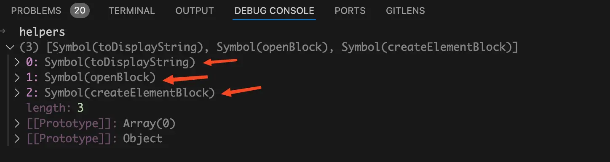{data-zoomable}

从上图中可以看到需要从vue中import导入`toDisplayString`、`openBlock`、`createElementBlock`这三个函数。

在执行`push`方法之前我们先来看看此时的render函数字符串是什么样的，如下图：
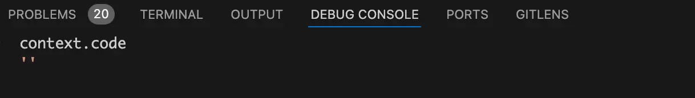{data-zoomable}

从上图中可以看到此时生成的render函数字符串还是一个空字符串，执行完push方法后，我们来看看此时的render函数字符串是什么样的，如下图：
{data-zoomable}

从上图中可以看到此时的render函数中已经有了`import {xxx} from "vue"`了。

这里执行的`genHoists`函数就是前面 [编译优化之“静态提升”](/template/hoistStatic)文章中讲过的**静态提升**的入口。
# 生成render函数中的函数名称和参数
执行完`genModulePreamble`函数后，已经生成了一条`import {xxx} from "vue"`了。我们接着来看`generate`函数中render函数的函数名称和参数是如何生成的，代码如下：
```js
const functionName = `render`;
const args = ["_ctx", "_cache"];
args.push("$props", "$setup", "$data", "$options");
const signature = args.join(", ");
push(`function ${functionName}(${signature}) {`);
```
上面的代码很简单，都是执行`push`方法向render函数中添加code字符串，其中`args`数组就是render函数中的参数。我们在来看看执行完上面这块代码后的render函数字符串是什么样的，如下图：
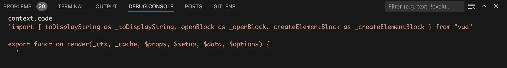{data-zoomable}

从上图中可以看到此时已经生成了render函数中的函数名称和参数了。
# 生成render函数中return的内容
接着来看`generate`函数中最后一块代码，如下：
```js
indent();
push(`return `);
genNode(ast.codegenNode, context);
```
首先调用`indent`方法插入一个换行符并且增加一个缩进，然后执行`push`方法添加一个`return`字符串。

接着以根节点的`codegenNode`属性为参数执行`genNode`函数生成return中的内容，在我们这个场景中`genNode`函数简化后的代码如下：
```js
function genNode(node, context) {
  switch (node.type) {
    case NodeTypes.SIMPLE_EXPRESSION:
      genExpression(node, context)
      break
    case NodeTypes.INTERPOLATION:
      genInterpolation(node, context);
      break;
    case NodeTypes.VNODE_CALL:
      genVNodeCall(node, context);
      break;
  }
}
```
这里涉及到`SIMPLE_EXPRESSION`、`INTERPOLATION`和`VNODE_CALL`三种AST抽象语法树node节点类型：

- `INTERPOLATION`：表示当前节点是双大括号节点，我们这个demo中就是：`{{msg}}`这个文本节点。

- `SIMPLE_EXPRESSION`：表示当前节点是简单表达式节点，在我们这个demo中就是双大括号节点`{{msg}}`中的更里层节点`msg`

- `VNODE_CALL`：表示当前节点是虚拟节点，比如我们这里第一次调用`genNode`函数传入的`ast.codegenNode`（根节点的`codegenNode`属性）就是虚拟节点。

## `genVNodeCall`函数
由于当前节点是虚拟节点，第一次进入`genNode`函数时会执行`genVNodeCall`函数。在我们这个场景中简化后的`genVNodeCall`函数代码如下：
```js
const OPEN_BLOCK = Symbol(`openBlock`);
const CREATE_ELEMENT_BLOCK = Symbol(`createElementBlock`);

function genVNodeCall(node, context) {
  const { push, helper } = context;
  const { tag, props, children, patchFlag, dynamicProps, isBlock } = node;
  if (isBlock) {
    push(`(${helper(OPEN_BLOCK)}(${``}), `);
  }
  const callHelper = CREATE_ELEMENT_BLOCK;
  push(helper(callHelper) + `(`, -2 /* None */, node);

  genNodeList(
    // 将参数中的undefined转换成null
    genNullableArgs([tag, props, children, patchFlag, dynamicProps]),
    context
  );

  push(`)`);
  if (isBlock) {
    push(`)`);
  }
}
```
首先判断当前节点是不是block节点，由于此时的node为根节点，所以`isBlock`为true。将断点走进`helper`方法，我们来看看`helper(OPEN_BLOCK)`返回值是什么。`helper`方法的代码如下：
```js
const helperNameMap = {
  [OPEN_BLOCK]: `openBlock`,
  [CREATE_ELEMENT_BLOCK]: `createElementBlock`,
  [TO_DISPLAY_STRING]: `toDisplayString`,
  // ...省略
};

helper(key) {
  return `_${helperNameMap[key]}`;
}
```
`helper`方法中的代码很简单，这里的`helper(OPEN_BLOCK)`返回的就是`_openBlock`。

将断点走到第一个`push`方法，代码如下：
```js
push(`(${helper(OPEN_BLOCK)}(${``}), `);
```
执行完这个`push`方法后在debug终端看看此时的render函数字符串是什么样的，如下图：
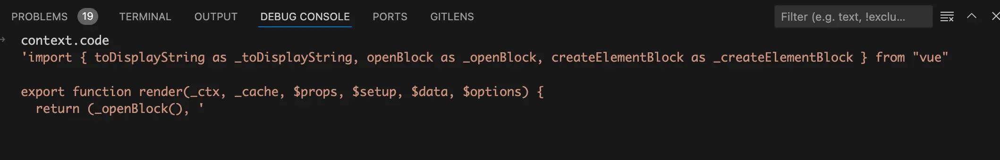{data-zoomable}

从上图中可以看到，此时render函数中增加了一个`_openBlock`函数的调用。

将断点走到第二个`push`方法，代码如下：
```js
const callHelper = CREATE_ELEMENT_BLOCK;
push(helper(callHelper) + `(`, -2 /* None */, node);
```
同理`helper(callHelper)`方法返回的是`_createElementBlock`，执行完这个`push`方法后在debug终端看看此时的render函数字符串是什么样的，如下图：
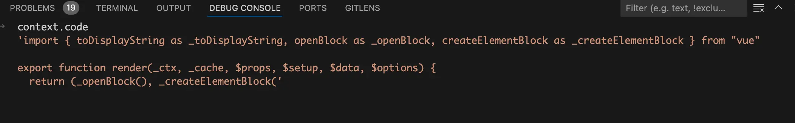{data-zoomable}

从上图中可以看到，此时render函数中增加了一个`_createElementBlock`函数的调用。

继续将断点走到`genNodeList`部分，代码如下：
```js
genNodeList(
  genNullableArgs([tag, props, children, patchFlag, dynamicProps]),
  context
);
```
其中的`genNullableArgs`函数功能很简单，将参数中的`undefined`转换成`null`。比如此时的`props`就是`undefined`，经过`genNullableArgs`函数处理后传给`genNodeList`函数的`props`就是`null`。
## `genNodeList`函数
继续将断点走进`genNodeList`函数，在我们这个场景中简化后的代码如下：
```js
function genNodeList(nodes, context, multilines = false, comma = true) {
  const { push } = context;
  for (let i = 0; i < nodes.length; i++) {
    const node = nodes[i];
    if (shared.isString(node)) {
      push(node);
    } else {
      genNode(node, context);
    }
    if (i < nodes.length - 1) {
      comma && push(", ");
    }
  }
}
```
我们先来看看此时的`nodes`参数，如下图：
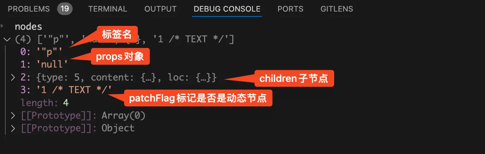{data-zoomable}

这里的`nodes`就是调用`genNodeList`函数时传的数组：`[tag, props, children, patchFlag, dynamicProps]`，只是将数组中的`undefined`转换成了`null`。

- `nodes`数组中的第一项为字符串p，表示当前节点是p标签。

- 由于当前p标签没有props，所以第二项为null的字符串。

- 第三项为p标签子节点：{{msg}}

- 第四项也是一个字符串，标记当前节点是否是动态节点。

在讲`genNodeList`函数之前，我们先来看一下如何使用`h`函数生成一个`<p>{{ msg }}</p>`标签的虚拟DOM节点。根据vue官网的介绍，`h`函数定义如下：
```js
// 完整参数签名
function h(
  type: string | Component,
  props?: object | null,
  children?: Children | Slot | Slots
): VNode
```
`h`函数接收的第一个参数是标签名称或者一个组件，第二个参数是props对象或者null，第三个参数是子节点。

所以我们要使用`h`函数生成demo中的p标签虚拟DOM节点代码如下：
```js
h("p", null, msg)
```
`h`函数生成虚拟DOM实际就是调用的`createBaseVNode`函数，而我们这里的`createElementBlock`函数生成虚拟DOM也是调用的`createBaseVNode`函数。两者的区别是`createElementBlock`函数多接收一些参数，比如`patchFlag`和`dynamicProps`。

现在我想你应该已经反应过来了，为什么调用`genNodeList`函数时传入的第一个参数`nodes`为：`[tag, props, children, patchFlag, dynamicProps]`。这个数组的顺序就是调用`createElementBlock`函数时传入的参数顺序。

所以在`genNodeList`中会遍历`nodes`数组生成调用`createElementBlock`函数需要传入的参数。

先来看第一个参数`tag`，这里`tag`的值为字符串"p"。所以在for循环中会执行`push(node)`，生成调用`createElementBlock`函数的第一个参数"p"。在debug终端看看此时的render函数，如下图：
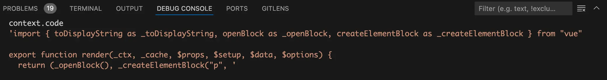{data-zoomable}

从上图中可以看到`createElementBlock`函数的第一个参数"p"

接着来看`nodes`数组中的第二个参数：`props`，由于p标签中没有`props`属性。所以第二个参数`props`的值为字符串"null"，在for循环中同样会执行`push(node)`，生成调用`createElementBlock`函数的第二个参数"null"。在debug终端看看此时的render函数，如下图：
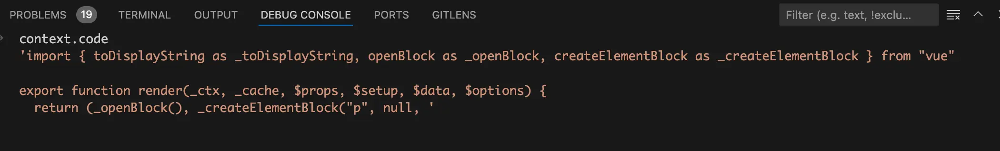{data-zoomable}

从上图中可以看到`createElementBlock`函数的第二个参数`null`

接着来看`nodes`数组中的第三个参数：`children`，由于`children`是一个对象，所以以当前children节点作为参数执行`genNode`函数。

这个`genNode`函数前面已经执行过一次了，当时是以根节点的`codegenNode`属性作为参数执行的。回顾一下`genNode`函数的代码，如下：
```js
function genNode(node, context) {
  switch (node.type) {
    case NodeTypes.SIMPLE_EXPRESSION:
      genExpression(node, context)
      break
    case NodeTypes.INTERPOLATION:
      genInterpolation(node, context);
      break;
    case NodeTypes.VNODE_CALL:
      genVNodeCall(node, context);
      break;
  }
}
```
前面我们讲过了`NodeTypes.INTERPOLATION`类型表示当前节点是双大括号节点，而我们这次执行`genNode`函数传入的p标签children，刚好就是{{msg}}双大括号节点。所以代码会走到`genInterpolation`函数中。
## `genInterpolation`函数
将断点走进`genInterpolation`函数中，`genInterpolation`代码如下：
```js
function genInterpolation(node, context) {
  const { push, helper } = context;
  push(`${helper(TO_DISPLAY_STRING)}(`);
  genNode(node.content, context);
  push(`)`);
}
```
首先会执行`push`方法向render函数中插入一个`_toDisplayString`函数调用，在debug终端看看执行完这个`push`方法后的render函数，如下图：
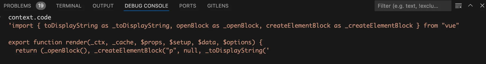{data-zoomable}

从上图中可以看到此时`createElementBlock`函数的第三个参数只生成了一半，调用`_toDisplayString`函数传入的参数还没生成。

接着会以`node.content`作为参数执行`genNode(node.content, context);`生成`_toDisplayString`函数的参数，此时代码又走回了`genNode`函数。

将断点再次走进`genNode`函数，看看此时的node是什么样的，如下图：
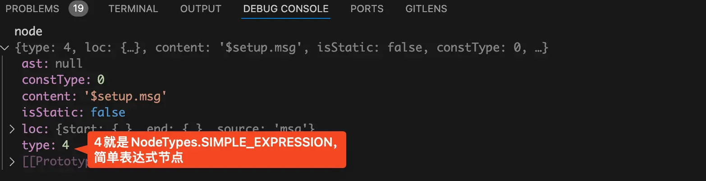{data-zoomable}

从上图中可以看到此时的node节点是一个简单表达式节点，表达式为：`$setup.msg`。所以代码会走进`genExpression`函数。
## `genExpression`函数
接着将断点走进`genExpression`函数中，`genExpression`函数中的代码如下：
```js
function genExpression(node, context) {
  const { content, isStatic } = node;
  context.push(
    isStatic ? JSON.stringify(content) : content,
    -3 /* Unknown */,
    node
  );
}
```
由于当前的`msg`变量是一个`ref`响应式变量，所以`isStatic`为`false`。所以会执行`push`方法，将`$setup.msg`插入到render函数中。

执行完`push`方法后，在debug终端看看此时的render函数字符串是什么样的，如下图：
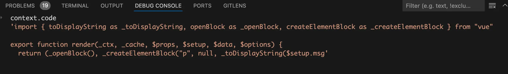{data-zoomable}

从上图中可以看到此时的render函数基本已经生成了，剩下的就是调用`push`方法生成各个函数的右括号")"和右花括号"}"。将断点逐层走出，直到`generate`函数中。代码如下：
```js
function generate(ast) {
  // ...省略
  genNode(ast.codegenNode, context);

  deindent();
  push(`}`);
  return {
    ast,
    code: context.code,
  };
}
```
执行完最后一个  `push`方法后，在debug终端看看此时的render函数字符串是什么样的，如下图：
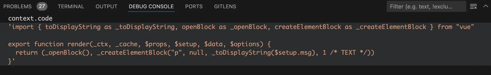{data-zoomable}

从上图中可以看到此时的render函数终于生成啦！
# 总结
这是我画的我们这个场景中`generate`生成render函数的流程图：

{data-zoomable}


- 执行`genModulePreamble`函数生成：`import { xxx } from "vue";`

- 简单字符串拼接生成render函数中的函数名称和参数，也就是`function _sfc_render(_ctx, _cache, $props, $setup, $data, $options) {`

- 以根节点的`codegenNode`属性为参数调用`genNode`函数生成render函数中return的内容。

  - 此时传入的是虚拟节点，执行`genVNodeCall`函数生成`return _openBlock(), _createElementBlock(`和调用`genNodeList`函数，生成`createElementBlock`函数的参数。

  - 处理p标签的`tag`标签名和`props`，生成`createElementBlock`函数的第一个和第二个参数。此时render函数return的内容为：`return _openBlock(), _createElementBlock("p", null`

  - 处理p标签的children也就是`{{msg}}`节点，再次调用`genNode`函数。此时node节点类型为双大括号节点，调用`genInterpolation`函数。

  - 在`genInterpolation`函数中会先调用`push`方法，此时的render函数return的内容为：`return _openBlock(), _createElementBlock("p", null, _toDisplayString(`。然后以`node.content`为参数再次调用`genNode`函数。

  - `node.content`为`$setup.msg`，是一个简单表达式节点，所以在`genNode`函数中会调用`genExpression`函数。执行完`genExpression`函数后，此时的render函数return的内容为：`return _openBlock(), _createElementBlock("p", null, _toDisplayString($setup.msg`

  - 调用push方法生成各个函数的右括号")"和右花括号"}"，生成最终的render函数


[加入本书对应的「源码交流群」](/guide/contact)
