# 前言
在上一篇 [编译优化之“靶向更新”](/template/patchFlag)文章中讲了对于动态节点，vue做的优化是将这些动态节点收集起来，然后当响应式变量修改后进行靶向更新。那么vue对静态节点有没有做什么优化呢？答案是：当然有，对于静态节点会进行“静态提升”。这篇文章我们来看看vue是如何进行静态提升的。
# 什么是静态提升？
我们先来看一个demo，代码如下：
```vue
<template>
  <div>
    <h1>title</h1>
    <p>{{ msg }}</p>
    <button @click="handleChange">change msg</button>
  </div>
</template>

<script setup lang="ts">
import { ref } from "vue";

const msg = ref("hello");

function handleChange() {
  msg.value = "world";
}
</script>
```
这个demo代码很简单，其中的h1标签就是我们说的静态节点，p标签就是动态节点。点击button按钮会将响应式`msg`变量的值更新，然后会执行render函数将`msg`变量的最新值"world"渲染到p标签中。

我们先来看看未开启**静态提升**之前生成的render函数是什么样的：

由于在vite项目中启动的vue都是开启了静态提升，所以我们需要在 [Vue 3 Template Explorer](https://template-explorer.vuejs.org/)网站中看看未开启静态提升的render函数的样子（网站URL为： [https://template-explorer.vuejs.org/](https://template-explorer.vuejs.org/) ），如下图将`hoistStatic`这个选项取消勾选即可：
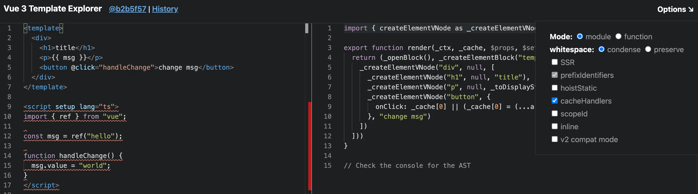{data-zoomable}


未开启静态提升生成的render函数如下：
```js
import { createElementVNode as _createElementVNode, toDisplayString as _toDisplayString, openBlock as _openBlock, createElementBlock as _createElementBlock } from "vue"

export function render(_ctx, _cache, $props, $setup, $data, $options) {
  return (_openBlock(), _createElementBlock("template", null, [
    _createElementVNode("div", null, [
      _createElementVNode("h1", null, "title"),
      _createElementVNode("p", null, _toDisplayString(_ctx.msg), 1 /* TEXT */),
      _createElementVNode("button", { onClick: _ctx.handleChange }, "change msg", 8 /* PROPS */, ["onClick"])
    ])
  ]))
}
```
每次响应式变量更新后都会执行render函数，每次执行render函数都会执行`createElementVNode`方法生成h1标签的虚拟DOM。但是我们这个h1标签明明就是一个静态节点，根本就不需要每次执行render函数都去生成一次h1标签的虚拟DOM。

vue3对此做出的优化就是将“执行`createElementVNode`方法生成h1标签虚拟DOM的代码”提取到render函数外面去，这样就只有初始化的时候才会去生成一次h1标签的虚拟DOM，**也就是我们这篇文章中要讲的“静态提升”**。开启静态提升后生成的render函数如下：
```js
import { createElementVNode as _createElementVNode, toDisplayString as _toDisplayString, openBlock as _openBlock, createElementBlock as _createElementBlock } from "vue"

const _hoisted_1 = /*#__PURE__*/_createElementVNode("h1", null, "title", -1 /* HOISTED */)

export function render(_ctx, _cache, $props, $setup, $data, $options) {
  return (_openBlock(), _createElementBlock("template", null, [
    _createElementVNode("div", null, [
      _hoisted_1,
      _createElementVNode("p", null, _toDisplayString(_ctx.msg), 1 /* TEXT */),
      _createElementVNode("button", {
        onClick: _cache[0] || (_cache[0] = (...args) => (_ctx.handleChange && _ctx.handleChange(...args)))
      }, "change msg")
    ])
  ]))
}
```
从上面可以看到生成h1标签虚拟DOM的`createElementVNode`函数被提取到render函数外面去执行了，只有初始化时才会执行一次将生成的虚拟DOM赋值给`_hoisted_1`变量。在render函数中直接使用`_hoisted_1`变量即可，无需每次执行render函数都去生成h1标签的虚拟DOM，这就是我们这篇文章中要讲的“静态提升”。

我们接下来还是一样的套路通过debug的方式来带你搞清楚vue是如何实现静态提升的，
# 如何实现静态提升
实现静态提升主要分为两个阶段：

- `transform`阶段遍历AST抽象语法树，将静态节点找出来进行标记和处理，然后将这些静态节点塞到根节点的`hoists`数组中。

- `generate`阶段遍历上一步在根节点存的`hoists`数组，在**render函数外**去生成存储静态节点虚拟DOM的`_hoisted_x`变量。然后在render函数中使用这些`_hoisted_x`变量表示这些静态节点。

## transform阶段
在我们这个场景中`transform`函数简化后的代码如下：
```js
function transform(root, options) {
  // ...省略
  if (options.hoistStatic) {
    hoistStatic(root, context);
  }
  root.hoists = context.hoists;
}
```
从上面可以看到实现静态提升是执行了`hoistStatic`函数，我们给`hoistStatic`函数打个断点。让代码走进去看看`hoistStatic`函数是什么样的，在我们这个场景中简化后的代码如下：
```js
function hoistStatic(root, context) {
  walk(root, context, true);
}
```
从上面可以看到这里依然不是具体实现的地方，接着将断点走进`walk`函数。在我们这个场景中简化后的代码如下：
```js
function walk(node, context, doNotHoistNode = false) {
  const { children } = node;
  for (let i = 0; i < children.length; i++) {
    const child = children[i];
    if (
      child.type === NodeTypes.ELEMENT &&
      child.tagType === ElementTypes.ELEMENT
    ) {
      const constantType = doNotHoistNode
        ? ConstantTypes.NOT_CONSTANT
        : getConstantType(child, context);
      if (constantType > ConstantTypes.NOT_CONSTANT) {
        if (constantType >= ConstantTypes.CAN_HOIST) {
          child.codegenNode.patchFlag = PatchFlags.HOISTED + ` /* HOISTED */`;
          child.codegenNode = context.hoist(child.codegenNode);
          continue;
        }
      }
    }

    if (child.type === NodeTypes.ELEMENT) {
      walk(child, context);
    }
  }
}
```
我们先在debug终端上面看看传入的第一个参数`node`是什么样的，如下图：
{data-zoomable}

从上面可以看到此时的`node`为AST抽象语法树的根节点，树的结构和`template`中的代码刚好对上。外层是div标签，div标签下面有h1、p、button三个标签。

我们接着来看`walk`函数，简化后的`walk`函数只剩下一个for循环遍历`node.children`。在for循环里面主要有两块if语句：

- 第一块if语句的作用是实现静态提升

- 第二块if语句的作用是递归遍历整颗树。

我们来看第一块if语句中的条件，如下：
```js
if (
  child.type === NodeTypes.ELEMENT &&
  child.tagType === ElementTypes.ELEMENT
)
```
在将这块if语句之前，我们先来了解一下这里的两个枚举。`NodeTypes`和`ElementTypes`
### `NodeTypes`枚举
`NodeTypes`表示AST抽象语法树中的所有node节点类型，枚举值如下：
```ts
enum NodeTypes {
  ROOT, // 根节点
  ELEMENT,  // 元素节点，比如：div元素节点、Child组件节点
  TEXT, // 文本节点
  COMMENT,  // 注释节点
  SIMPLE_EXPRESSION,  // 简单表达式节点，比如v-if="msg !== 'hello'"中的msg!== 'hello'
  INTERPOLATION,  // 双大括号节点，比如{{msg}}
  ATTRIBUTE,  // 属性节点，比如 title="我是title"
  DIRECTIVE,  // 指令节点，比如 v-if=""
  // ...省略
}
```
看到这里有的小伙伴可能有疑问了，为什么AST抽象语法树中有这么多种节点类型呢？

我们来看一个例子你就明白了，如下：
```html
<div v-if="msg !== 'hello'" title="我是title">msg为 {{ msg }}</div>
```
上面这段代码转换成AST抽象语法树后会生成很多node节点：

- `div`对应的是`ELEMENT`元素节点

- `v-if`对应的是`DIRECTIVE`指令节点

- `v-if`中的`msg !== 'hello'`对应的是`SIMPLE_EXPRESSION`简单表达式节点

- `title`对应的是`ATTRIBUTE`属性节点

- `msg为`对应的是`ELEMENT`元素节点

- `{{ msg }}`对应的是`INTERPOLATION`双大括号节点

### `ElementTypes`枚举
div元素节点、Child组件节点都是`NodeTypes.ELEMENT`元素节点，那么如何区分是不是组件节点呢？就需要使用`ElementTypes`枚举来区分了，如下：
```ts
enum ElementTypes {
  ELEMENT,  // html元素
  COMPONENT,  // 组件
  SLOT, // 插槽
  TEMPLATE, // 内置template元素
}
```
现在来看第一块if条件，你应该很容易看得懂了：
```js
if (
  child.type === NodeTypes.ELEMENT &&
  child.tagType === ElementTypes.ELEMENT
)
```
如果当前节点是html元素节点，那么就满足if条件。

当前的node节点是最外层的div节点，当然满足这个if条件。

接着将断点走进if条件内，第一行代码如下：
```js
const constantType = doNotHoistNode
  ? ConstantTypes.NOT_CONSTANT
  : getConstantType(child, context);
```
在搞清楚这行代码之前先来了解一下`ConstantTypes`枚举
### `ConstantTypes`枚举
我们来看看`ConstantTypes`枚举，如下：
```ts
enum ConstantTypes {
  NOT_CONSTANT = 0, // 不是常量
  CAN_SKIP_PATCH, // 跳过patch函数
  CAN_HOIST,  // 可以静态提升
  CAN_STRINGIFY,  // 可以预字符串化
}
```
`ConstantTypes`枚举的作用就是用来标记静态节点的4种等级状态，高等级的状态拥有低等级状态的所有能力。比如：
`NOT_CONSTANT`：表示当前节点不是静态节点。比如下面这个p标签使用了`msg`响应式变量：
```html
<p>{{ msg }}</p>

const msg = ref("hello");
```
`CAN_SKIP_PATCH`：表示当前节点在重新执行render函数时可以跳过`patch`函数。比如下面这个p标签虽然使用了变量`name`，但是`name`是一个常量值。所以这个p标签其实是一个静态节点，但是由于使用了`name`变量，所以不能提升到render函数外面去。
```html
<p>{{ name }}</p>
const name = "name";
```
`CAN_HOIST`：表示当前静态节点可以被静态提升，当然每次执行render函数时也无需执行`patch`函数。demo如下：
```html
<h1>title</h1>
```
`CAN_STRINGIFY`：表示当前静态节点可以被**预字符串化**，下一篇文章会专门讲**预字符串化**。
从debug终端中可以看到此时`doNotHoistNode`变量的值为true，所以`constantType`变量的值为`ConstantTypes.NOT_CONSTANT`。
`getConstantType`函数的作用是根据当前节点以及其子节点拿到静态节点的`constantType`。

我们接着来看后面的代码，如下：
```js
if (constantType > ConstantTypes.NOT_CONSTANT) {
  if (constantType >= ConstantTypes.CAN_HOIST) {
    child.codegenNode.patchFlag = PatchFlags.HOISTED + ` /* HOISTED */`;
    child.codegenNode = context.hoist(child.codegenNode);
    continue;
  }
}
```
前面我们已经讲过了，当前div节点的`constantType`的值为`ConstantTypes.NOT_CONSTANT`，所以这个if语句条件不通过。

我们接着看`walk`函数中的最后一块代码，如下：
```js
if (child.type === NodeTypes.ELEMENT) {
  walk(child, context);
}
```
前面我们已经讲过了，当前child节点是div标签，所以当然满足这个if条件。将子节点div作为参数，递归调用`walk`函数。

我们再次将断点走进`walk`函数，和上一次执行`walk`函数不同的是，上一次`walk`函数的参数为root根节点，这一次参数是div节点。

同样的在`walk`函数内先使用for循环遍历div节点的子节点，我们先来看第一个子节点h1标签，也就是需要静态提升的节点。很明显h1标签是满足第一个if条件语句的：
```js
if (
  child.type === NodeTypes.ELEMENT &&
  child.tagType === ElementTypes.ELEMENT
)
```
在debug终端中来看看h1标签的`constantType`的值，如下：
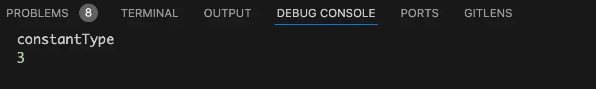{data-zoomable}

从上图中可以看到h1标签的`constantType`值为3，也就是`ConstantTypes.CAN_STRINGIFY`。表明h1标签是最高等级的**预字符串**，当然也能**静态提升**。

h1标签的`constantType`当然就能满足下面这个if条件：
```js
if (constantType > ConstantTypes.NOT_CONSTANT) {
  if (constantType >= ConstantTypes.CAN_HOIST) {
    child.codegenNode.patchFlag = PatchFlags.HOISTED + ` /* HOISTED */`;
    child.codegenNode = context.hoist(child.codegenNode);
    continue;
  }
}
```
值得一提的是上面代码中的`codegenNode`属性就是用于生成对应node节点的render函数。

然后以`codegenNode`属性作为参数执行`context.hoist`函数，将其返回值赋值给节点的`codegenNode`属性。如下：
```js
child.codegenNode = context.hoist(child.codegenNode);
```
上面这行代码的作用其实就是将原本生成render函数的`codegenNode`属性替换成用于静态提升的`codegenNode`属性。
### `context.hoist`方法
将断点走进`context.hoist`方法，简化后的代码如下：
```js
function hoist(exp) {
  context.hoists.push(exp);
  const identifier = createSimpleExpression(
    `_hoisted_${context.hoists.length}`,
    false,
    exp.loc,
    ConstantTypes.CAN_HOIST
  );
  identifier.hoisted = exp;
  return identifier;
}
```
我们先在debug终端看看传入的`codegenNode`属性。如下图：
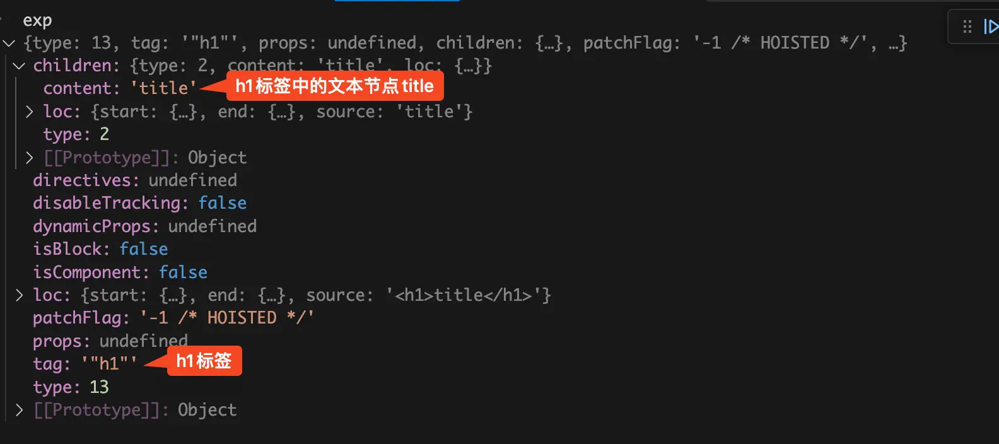{data-zoomable}

从上图中可以看到此时的`codegenNode`属性对应的就是h1标签，`codegenNode.children`对应的就是h1标签的title文本节点。`codegenNode`属性的作用就是用于生成h1标签的render函数。

在`hoist`函数中首先执行 `context.hoists.push(exp)`将h1标签的`codegenNode`属性push到`context.hoists`数组中。`context.hoists`是一个数组，数组中存的是AST抽象语法树中所有需要被**静态提升**的所有node节点的`codegenNode`属性。

接着就是执行`createSimpleExpression`函数生成一个新的`codegenNode`属性，我们来看传入的第一个参数：
```js
`_hoisted_${context.hoists.length}`
```
由于这里处理的是第一个需要**静态提升**的静态节点，所以第一个参数的值`_hoisted_1`。如果处理的是第二个需要**静态提升**的静态节点，其值为`_hoisted_2`，依次类推。

接着将断点走进`createSimpleExpression`函数中，代码如下：
```js
function createSimpleExpression(
  content,
  isStatic = false,
  loc = locStub,
  constType = ConstantTypes.NOT_CONSTANT
) {
  return {
    type: NodeTypes.SIMPLE_EXPRESSION,
    loc,
    content,
    isStatic,
    constType: isStatic ? ConstantTypes.CAN_STRINGIFY : constType,
  };
}
```
这个函数的作用很简单，根据传入的内容生成一个简单表达式节点。我们这里传入的内容就是`_hoisted_1`。

表达式节点我们前面讲过了，比如：`v-if="msg !== 'hello'"`中的`msg!== 'hello'`就是一个简单的表达式。

同理上面的`_hoisted_1`表示的是使用了一个变量名为`_hoisted_1`的表达式。

我们在debug终端上面看看`hoist`函数返回值，也就是h1标签新的`codegenNode`属性。如下图：
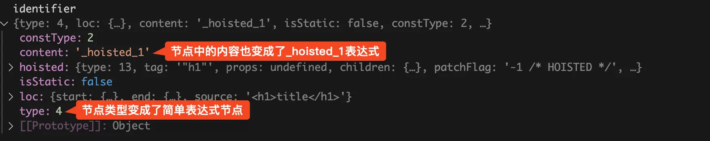{data-zoomable}

此时的`codegenNode`属性已经变成了一个简单表达式节点，表达式的内容为：`_hoisted_1`。后续执行`generate`生成render函数时，在render函数中h1标签就变成了表达式：`_hoisted_1`。

最后再执行`transform`函数中的`root.hoists = context.hoists`，将`context`上下文中存的`hoists`属性数组赋值给根节点的`hoists`属性数组，后面在`generate`生成render函数时会用。

至此`transform`阶段已经完成了，主要做了两件事：

- 将h1静态节点找出来，将该节点生成render函数的`codegenNode`属性push到根节点的`hoists`属性数组中，后面`generate`生成render函数时会用。

- 将上一步h1静态节点的`codegenNode`属性替换为一个简单表达式，表达式为：`_hoisted_1`。

## `generate`阶段
在`generate`阶段主要分为两部分：

- 将原本render函数内调用`createElementVNode`生成h1标签虚拟DOM的代码，提到render函数外面去执行，赋值给全局变量`_hoisted_1`。

- 在render函数内直接使用`_hoisted_1`变量即可。

如下图：
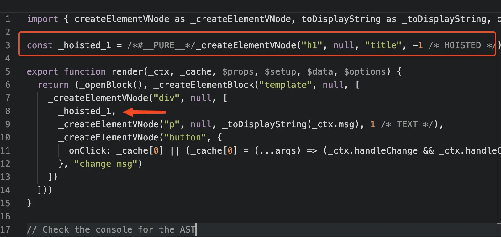{data-zoomable}

### 生成render函数外面的`_hoisted_1`变量
经过`transform`阶段的处理，根节点的`hoists`属性数组中存了所有需要静态提升的静态节点。我们先来看如何处理这些静态节点，生成h1标签对应的`_hoisted_1`变量的。代码如下：
```js
genHoists(ast.hoists, context);
```
将根节点的`hoists`属性数组传入给`genHoists`函数，将断点走进`genHoists`函数，在我们这个场景中简化后的代码如下：
```js
function genHoists(hoists, context) {
  const { push, newline } = context;
  newline();
  for (let i = 0; i < hoists.length; i++) {
    const exp = hoists[i];
    if (exp) {
      push(`const _hoisted_${i + 1} = ${``}`);
      genNode(exp, context);
      newline();
    }
  }
}
```
`generate`部分的代码会在后面文章中逐行分析，这篇文章就不细看到每个函数了。简单解释一下`genHoists`函数中使用到的那些方法的作用。

- `context.code`属性：此时的render函数字符串，可以在debug终端看一下执行每个函数后render函数字符串是什么样的。

- `newline`方法：向当前的render函数字符串中插入换行符。

- `push`方法：向当前的render函数字符串中插入字符串code。

- `genNode`函数：在`transform`阶段给会每个node节点生成`codegenNode`属性，在`genNode`函数中会使用`codegenNode`属性生成对应node节点的render函数代码。

在刚刚进入`genHoists`函数，我们在debug终端使用`context.code`看看此时的render函数字符串是什么样的，如下图：
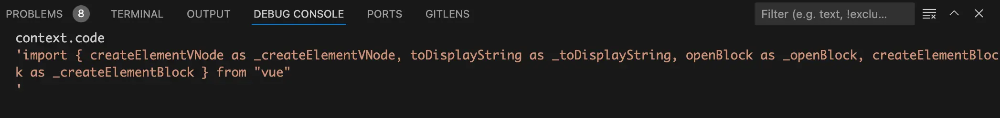{data-zoomable}

从上图中可以看到此时的render函数code字符串只有一行import vue的代码。

然后执行`newline`方法向render函数code字符串中插入一个换行符。

接着遍历在`transform`阶段收集的需要静态提升的节点集合，也就是`hoists`数组。在debug终端来看看这个`hoists`数组，如下图：
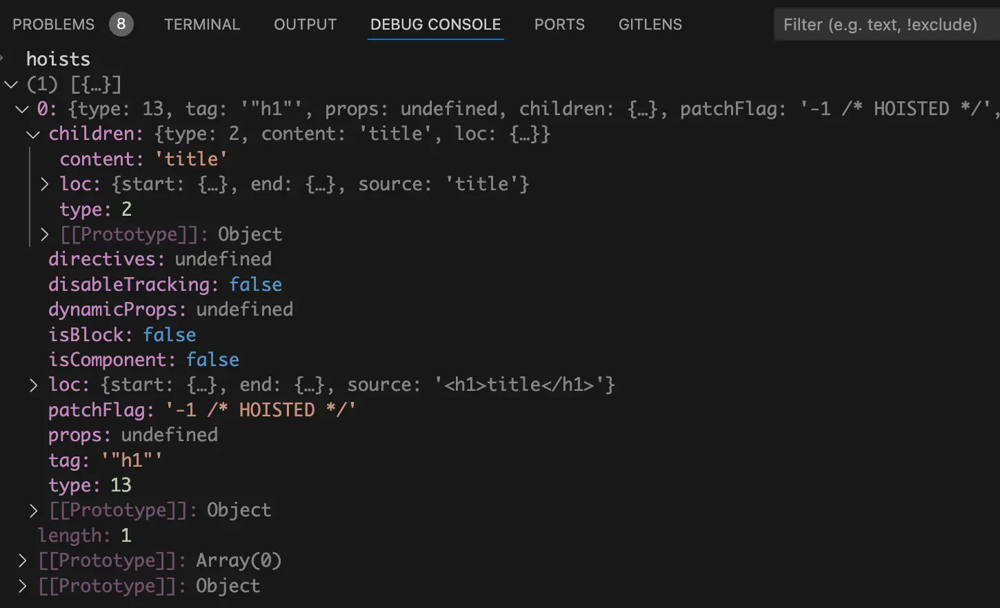{data-zoomable}

从上图中可以看到在`hoists`数组中只有一个h1标签需要静态提升。

在for循环中会先执行一句`push`方法，如下：
```js
push(`const _hoisted_${i + 1} = ${``}`)
```
这行代码的意思是插入一个名为`_hoisted_1`的const变量，此时该变量的值还是空字符串。在debug终端使用`context.code`看看执行`push`方法后的render函数字符串是什么样的，如下图：
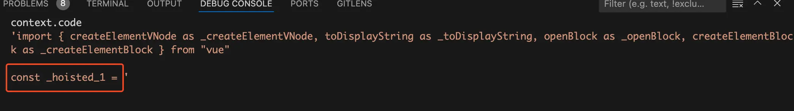{data-zoomable}

从上图中可以看到`_hoisted_1`全局变量的定义已经生成了，值还没生成。

接着就是执行`genNode(exp, context)`函数生成`_hoisted_1`全局变量的值，同理在debug终端看看执行`genNode`函数后的render函数字符串是什么样的，如下图：
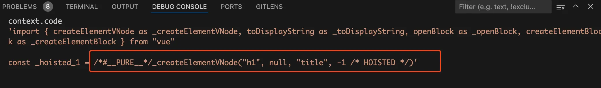{data-zoomable}

从上面可以看到render函数外面已经定义了一个`_hoisted_1`变量，变量的值为调用`createElementVNode`生成h1标签虚拟DOM。
### 生成render函数中return的内容
在`generate`中同样也是调用`genNode`函数生成render函数中return的内容，代码如下：
```js
genNode(ast.codegenNode, context);
```
这里传入的参数`ast.codegenNode`是根节点的`codegenNode`属性，在`genNode`函数中会从根节点开始递归遍历整颗AST抽象语法树，为每个节点生成自己的`createElementVNode`函数，执行`createElementVNode`函数会生成这些节点的虚拟DOM。

我们先来看看传入的第一个参数`ast.codegenNode`，也就是根节点的`codegenNode`属性。如下图：
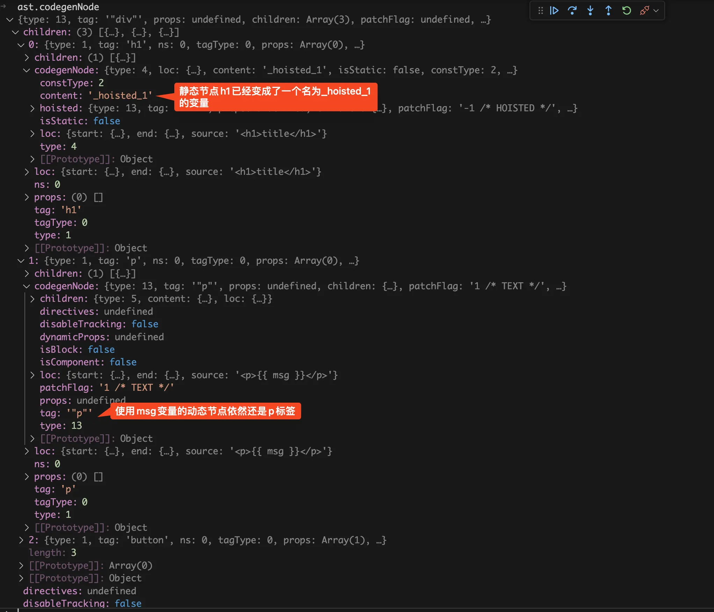{data-zoomable}

从上图中可以看到静态节点h1标签已经变成了一个名为`_hoisted_1`的变量，而使用了`msg`变量的动态节点依然还是p标签。

我们再来看看执行这个`genNode`函数之前render函数字符串是什么样的，如下图：
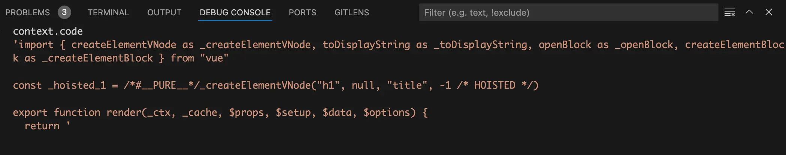{data-zoomable}

从上图中可以看到此时的render函数字符串还没生成return中的内容。

执行`genNode`函数后，来看看此时的render函数字符串是什么样的，如下图：
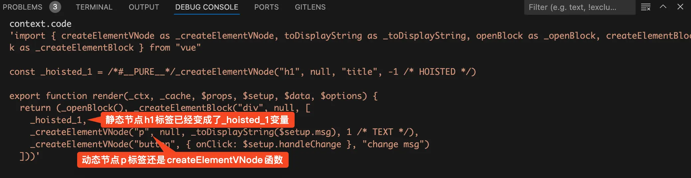{data-zoomable}

从上图中可以看到，在生成的render函数中h1标签静态节点已经变成了`_hoisted_1`变量，`_hoisted_1`变量中存的是静态节点h1的虚拟DOM，所以每次页面更新重新执行render函数时就不会每次都去生成一遍静态节点h1的虚拟DOM。
# 总结
整个静态提升的流程图如下：
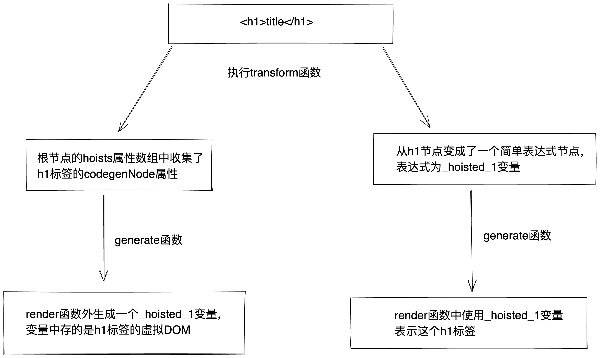{data-zoomable}

整个流程主要分为两个阶段：

- 在`transform`阶段中：

  - 将h1静态节点找出来，将静态节点的`codegenNode`属性push到根节点的`hoists`属性数组中。

  - 将h1静态节点的`codegenNode`属性替换为一个简单表达式节点，表达式为：`_hoisted_1`。

- 在`generate`阶段中：

  - 在render函数外面生成一个名为`_hoisted_1`的全局变量，这个变量中存的是h1标签的虚拟DOM。

  - 在render函数内直接使用`_hoisted_1`变量就可以表示这个h1标签。


[加入本书对应的「源码交流群」](/guide/contact)
