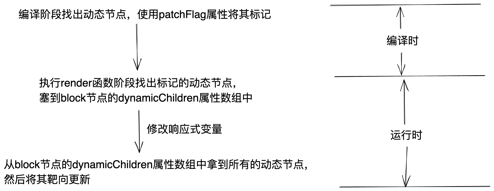
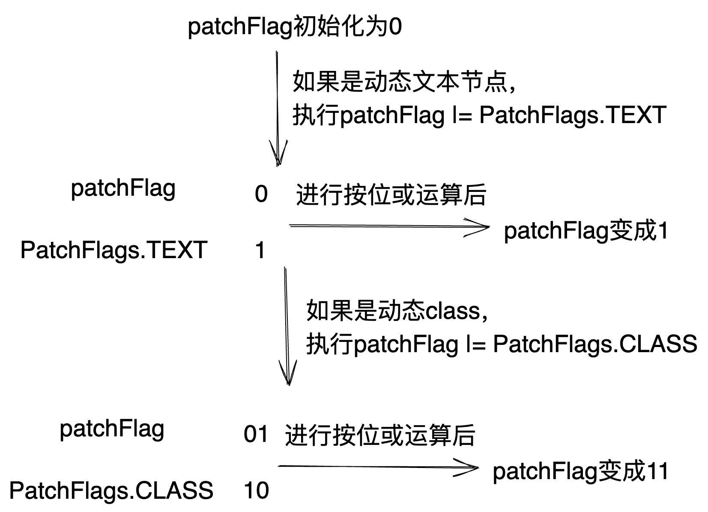
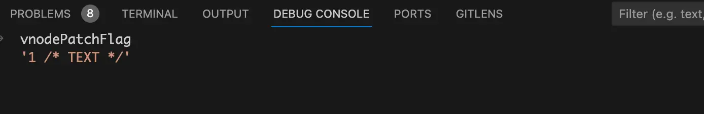
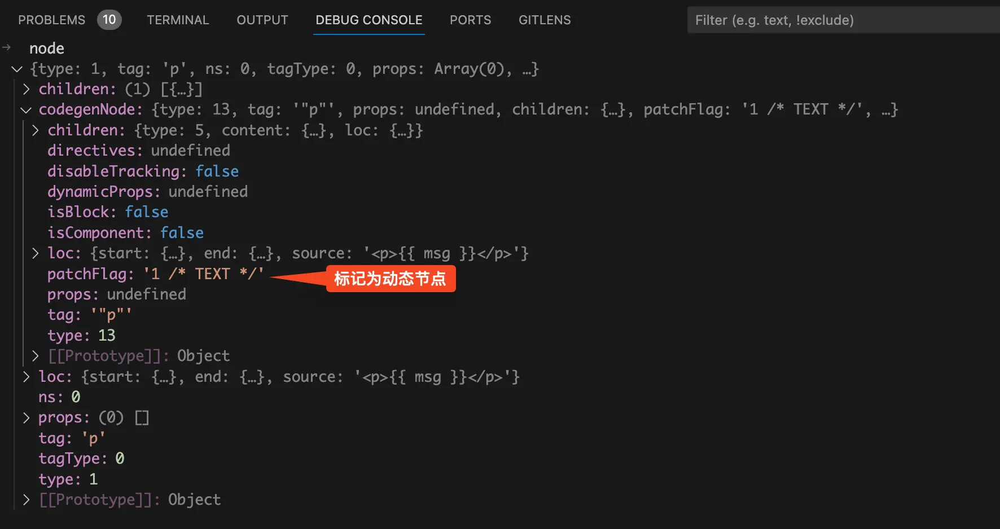
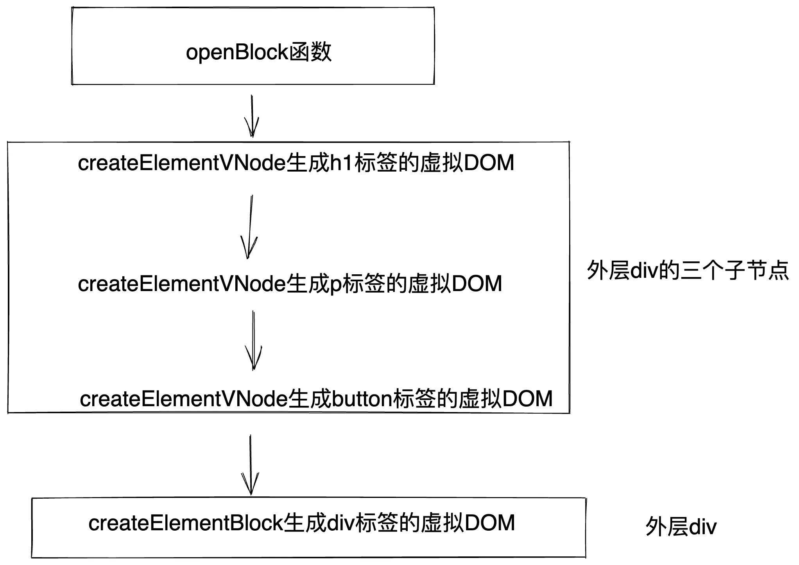
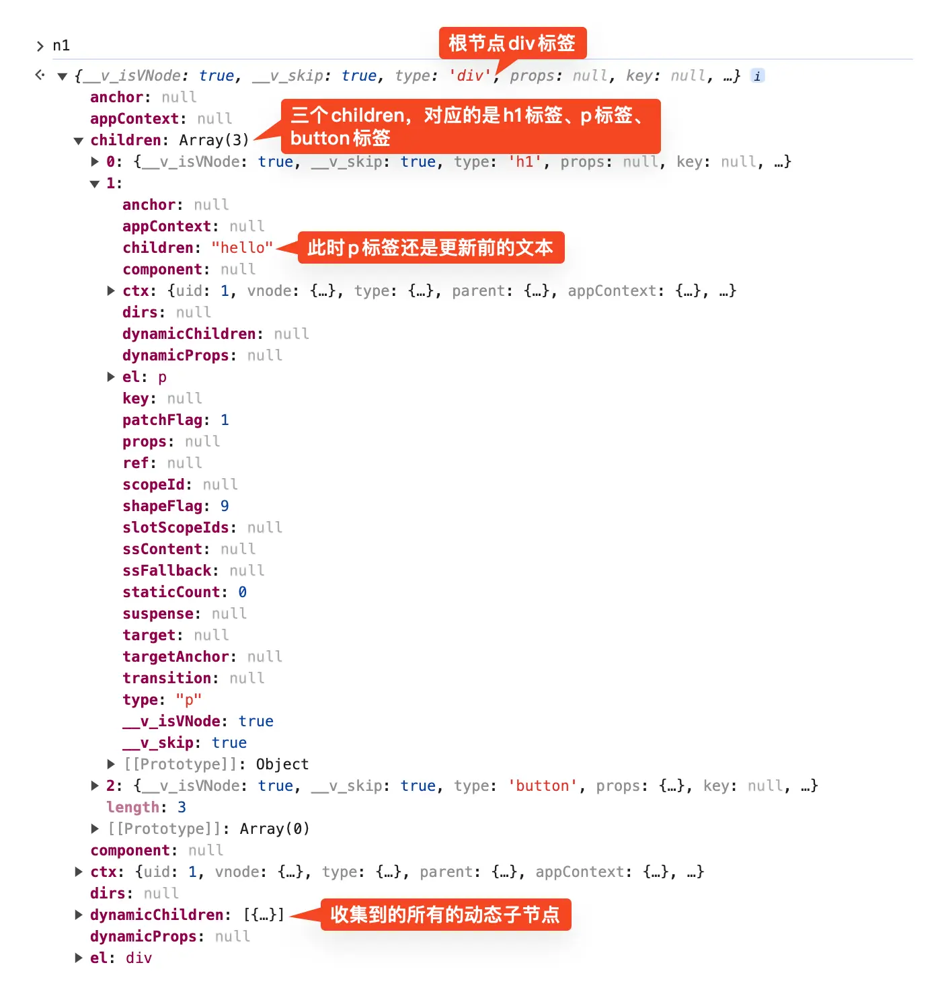
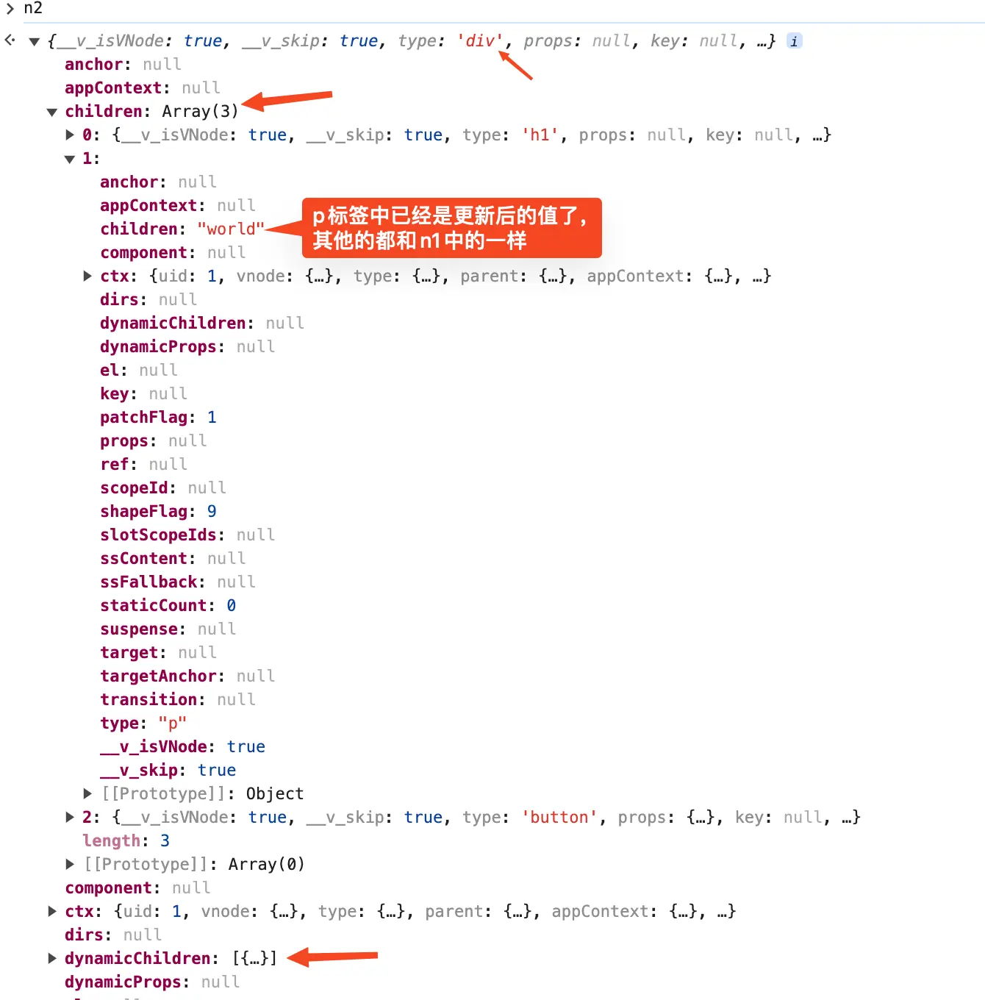
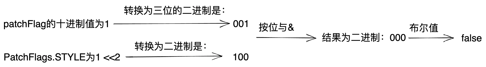
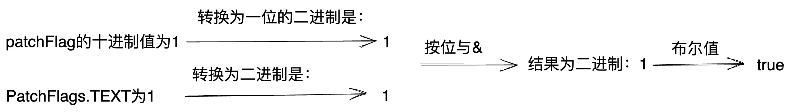

# 前言
jquery时代更新视图是直接对DOM进行操作，缺点是**频繁**操作真实 DOM，性能差。react和vue时代引入了虚拟DOM，更新视图是对新旧虚拟DOM树进行一层层的遍历比较，然后找出需要更新的DOM节点进行更新。这样做的缺点就是如果DOM树很复杂，在进行新旧DOM树比较的时候性能就比较差了。那么有没有一种方法是不需要去遍历新旧DOM树就可以知道哪些DOM需要更新呢？

答案是：在编译时我们就能够知道哪些节点是静态的，哪些是动态的。在更新视图时只需要对这些动态的节点进行靶向更新，就可以省去对比新旧虚拟DOM带来的开销。vue3也是这样做的，甚至都可以抛弃虚拟DOM。但是考虑到渲染函数的灵活性和需要兼容vue2，vue3最终还是保留了虚拟DOM。 **这篇文章我们来讲讲vue3是如何找出动态节点，以及响应式变量修改后如何靶向更新。**
# 靶向更新的流程
先来看看我画的整个靶向更新的流程，如下图：
{data-zoomable}


整个流程主要分为两个大阶段：编译时和运行时。

- 编译时阶段找出动态节点，使用`patchFlag`属性将其标记为动态节点。

- 运行时阶段分为两块：执行render函数阶段和更新视图阶段。

  - 执行render函数阶段会找出所有被标记的动态节点，将其塞到`block`节点的`dynamicChildren`属性数组中。

  - 更新视图阶段会从block节点的`dynamicChildren`属性数组中拿到所有的动态节点，然后遍历这个数组将里面的动态节点进行靶向更新。

# 一个简单的demo
还是同样的套路，我们通过debug一个demo，来搞清楚vue3是如何找出动态节点以及响应式变量修改后如何靶向更新的，demo代码如下：
```vue
<template>
  <div>
    <h1>title</h1>
    <p>{{ msg }}</p>
    <button @click="handleChange">change msg</button>
  </div>
</template>

<script setup lang="ts">
import { ref } from "vue";

const msg = ref("hello");

function handleChange() {
  msg.value = "world";
}
</script>
```
p标签绑定了响应式变量`msg`，点击button按钮时会将`msg`变量的值从hello更新为world。

在之前的文章中我们知道了vue分为编译时和运行时，由于p标签使用了`msg`响应式变量，所以在编译时就会找出p标签。并且将其标记为动态节点，而这里的h1标签由于没有使用响应式变量，所以不会被标记为动态节点。

在运行时阶段点击button按钮修改`msg`变量的值，由于我们在编译阶段已经将p标签标记为了动态节点，所以此时只需要将标记的p标签动态节点中的文本更新为最新的值即可，省去了传统patch函数中的比较新旧虚拟DOM的步骤。
# 编译阶段
在之前的 [transform函数](/template/transform)文章中我们讲过了在编译阶段对vue内置的指令、模版语法是在`transform`函数中处理的。在`transform`函数中实际干活的是一堆转换函数，每种转换函数都有不同的作用。比如v-for标签就是由`transformFor`转换函数处理的，而将节点标记为动态节点就是在`transformElement`转换函数中处理的。

首先我们需要启动一个`debug`终端，才可以在node端打断点。这里以vscode举例，首先我们需要打开终端，然后点击终端中的`+`号旁边的下拉箭头，在下拉中点击`Javascript Debug Terminal`就可以启动一个`debug`终端。
{data-zoomable}
然后给`transformElement`函数打个断点，`transformElement`函数在**node_modules/@vue/compiler-core/dist/compiler-core.cjs.js**文件中。
## `transformElement`转换函数
接着在`debug`终端中执行`yarn dev`（这里是以`vite`举例）。在浏览器中访问 [http://localhost:5173/](http://localhost:5173/)，此时断点就会走到`transformElement`函数中了。我们看到`transformElement`函数中的代码是下面这样的：
```js
const transformElement = (node, context) => {
  return function postTransformElement() {
    // ...
  }
}
```
从上面可以看到`transformElement`函数中没有做任何事情，直接返回了一个名为`postTransformElement`的回调函数，我们接着给这个回调函数打上断点，将`transformElement`函数的断点给移除了。

每处理一个node节点都会走进一次`postTransformElement`函数这个断点，将断点放了，直到断点走进处理到使用响应式变量的p标签node节点时。在我们这个场景中简化后的`postTransformElement`函数代码如下：
```js
const transformElement = (node, context) => {
  return function postTransformElement() {
    // 第一部分
    let vnodePatchFlag;
    let patchFlag = 0;
    const child = node.children[0];
    const type = child.type;

    // 第二部分
    const hasDynamicTextChild =
      type === NodeTypes.INTERPOLATION ||
      type === NodeTypes.COMPOUND_EXPRESSION;
    if (
      hasDynamicTextChild &&
      getConstantType(child, context) === ConstantTypes.NOT_CONSTANT
    ) {
      patchFlag |= PatchFlags.TEXT;
    }
    if (patchFlag !== 0) {
      vnodePatchFlag = String(patchFlag)
    }

    // 第三部分
    node.codegenNode = createVNodeCall(
      vnodePatchFlag
      // ...省略
    );
  };
};
```
从上面可以看到简化后的`postTransformElement`函数主要分为三部分，其实很简单。
### 第一部分
第一部分很简单定义了`vnodePatchFlag`和`patchFlag`这两个变量，`patchFlag`变量的作用是标记节点是否为动态节点，`vnodePatchFlag`变量除了标记节点为动态节点之外还保存了一些额外的动态节点信息。`child`变量中存的是当前节点的子节点，`type`变量中存的是当前子节点的节点类型。
### 第二部分
```js
const hasDynamicTextChild =
  type === NodeTypes.INTERPOLATION ||
  type === NodeTypes.COMPOUND_EXPRESSION;
```
我们接着来看第二部分，其中的`hasDynamicTextChild`变量表示当前子节点是否为动态文本子节点，很明显我们这里的p标签使用了响应式变量`msg`，其文本子节点当然是动态的，所以`hasDynamicTextChild`变量的值为true。

接着我们来看第二部分的这段`if`语句：
```js
if (
  hasDynamicTextChild &&
  getConstantType(child, context) === ConstantTypes.NOT_CONSTANT
) {
  patchFlag |= PatchFlags.TEXT;
}
```
我们先来看这段if语句的条件，如果`hasDynamicTextChild`为true表示当前子节点是动态文本子节点。`getConstantType`函数是判断动态文本节点涉及到的变量是不是不会改变的常量，为什么判断了`hasDynamicTextChild`还要判断`getConstantType`呢？

答案是如果我们给p标签绑定一个不会改变的常量，因为确实绑定了变量，`hasDynamicTextChild`的值还是为true。但是由于我们绑定的是不会改变的常量，所以p标签中的文本节点永远都不会改变。比如下面这个demo：
```vue
<template>
  <div>
    <p>{{ count }}</p>
  </div>
</template>

<script setup lang="ts">
const count = 10;
</script>
```
我们接着来看if语句里面的内容`patchFlag |= PatchFlags.TEXT`，如果if的判断结果为true，那么就使用“按位或”的运算符。由于此时的`patchFlag`变量的值为0，所以经过“按位或”的运算符计算下来`patchFlag`变量的值变成了`PatchFlags.TEXT`变量的值。我们先来看看`PatchFlags`中有哪些值：
```ts
enum PatchFlags {
  TEXT = 1,         // 二进制值为 1
  CLASS = 1 << 1,   // 二进制值为 10
  STYLE = 1 << 2,   // 二进制值为 100
  // ...等等等
}
```
这里涉及到了位运算 `<<`，他的意思是向左移多少位。比如`TEXT`表示向左移0位，二进制表示为1。`CLASS`表示为左移一位，二进制表示为10。`STYLE`表示为左移两位，二进制表示为100。

现在你明白了为什么给`patchFlag`赋值要使用“按位或”的运算符了吧，假如当前p标签除了有动态的文本节点，还有动态的class。那么`patchFlag`就会进行两次赋值，分别是：`patchFlag |= PatchFlags.TEXT`和`patchFlag |= PatchFlags.CLASS`。经过两次“按位或”的运算符进行计算后，`patchFlag`的二进制值就是11，二进制值信息中包含动态文本节点和动态class，从右边数的第一位1表示动态文本节点，从右边数的第二位1表示动态class。如下图：
{data-zoomable}


这样设计其实很精妙，后面拿到动态节点进行更新时，只需要将动态节点的`patchFlag`和`PatchFlags`中的枚举进行`&`"按位与"运算就可以知道当前节点是否是动态文本节点、动态class的节点。上面之所以没有涉及到`PatchFlags.CLASS`相关的代码，是因为当前例子中不存在动态class，所以我省略了。

我们接着来看第二部分的第二个if语句，如下：
```js
if (patchFlag !== 0) {
  vnodePatchFlag = String(patchFlag)
}
```
这段代码很简单，如果`patchFlag !== 0`表示当前节点是动态节点。然后将`patchFlag`转换为字符串赋值给`vnodePatchFlag`变量，在dev环境中`vnodePatchFlag`字符串中还包含节点是哪种动态类型的信息。如下图：
{data-zoomable}

### 第三部分
我们接着将断点走到第三部分，这一块也很简单。将`createVNodeCall`方法的返回值赋值给`codegenNode`属性，`codegenNode`属性中存的就是节点经过`transform`转换函数处理后的信息。
```js
node.codegenNode = createVNodeCall(
  vnodePatchFlag
  // ...省略
);
```
我们将断点走到执行完`createVNodeCall`函数后，看看当前的p标签节点是什么样的。如下图：
{data-zoomable}


从上图中可以看到此时的p标签的node节点中有了一个`patchFlag`属性，经过编译处理后p标签已经被标记成了动态节点。
# 执行`render`函数阶段
经过编译阶段的处理p标签已经被标记成了动态节点，并且生成了`render`函数。此时编译阶段的任务已经完了，该到浏览器中执行的运行时阶段了。首先我们要在浏览器中找到编译后的js文件。

其实很简单直接在network上面找到你的那个vue文件就行了，比如我这里的文件是`index.vue`，那我只需要在network上面找叫`index.vue`的文件就行了。但是需要注意一下network上面有两个`index.vue`的js请求，分别是template模块+script模块编译后的js文件，和style模块编译后的js文件。

那怎么区分这两个`index.vue`文件呢？很简单，通过query就可以区分。由style模块编译后的js文件的URL中有type=style的query，如下图所示：
{data-zoomable}

接下来我们来看看编译后的`index.vue`，简化的代码如下：
```js
import {
  createElementBlock as _createElementBlock,
  createElementVNode as _createElementVNode,
  defineComponent as _defineComponent,
  openBlock as _openBlock,
  toDisplayString as _toDisplayString,
} from "/node_modules/.vite/deps/vue.js?v=23bfe016";

const _sfc_main = _defineComponent({
  __name: "index",
  setup(__props, { expose: __expose }) {
    // ...省略
  },
});

function _sfc_render(_ctx, _cache, $props, $setup, $data, $options) {
  return (
    _openBlock(),
    _createElementBlock("div", null, [
      _createElementVNode("h1", null, "title", -1),
      _createElementVNode(
        "p",
        null,
        _toDisplayString($setup.msg),
        1
        /* TEXT */
      ),
      _createElementVNode(
        "button",
        { onClick: $setup.handleChange },
        "change msg"
      ),
    ])
  );
}
_sfc_main.render = _sfc_render;
export default _sfc_main;
```
从上面的代码可以看到经过编译后生成了一个`render`函数，执行这个render函数就会生成虚拟DOM。仔细来看这个`render`函数的返回值结构，这里使用return返回了一个括号。在括号中有两项，分别是`openBlock`函数的返回值和`createElementBlock`函数的返回值。那么这里的return返回的到底是什么呢？

答案是会先执行`openBlock`函数，然后将`createElementBlock`函数执行后的值返回。

现在我们思考一个问题，在编译阶段我们只是将p标签标记成了动态节点，如果还有其他标签也是动态节点那么也会将其标记成动态节点。这些动态节点的标记还是在DOM树中的每个标签中，如果响应式变量的值改变，那么岂不还是需要去遍历DOM树？

答案是在执行render函数生成虚拟DOM的时候会生成一个block节点作为根节点，并且将这些标记的动态节点收集起来塞到block根节点的`dynamicChildren`属性数组中。在`dynamicChildren`属性数组中存的是平铺的DOM树中的所有动态节点，和动态节点在DOM树中的位置无关。

那么根block节点又是怎么收集到所有的动态子节点的呢？

我们先来搞清楚render函数中的那一堆嵌套函数的执行顺序，我们前面已经讲过了首先会执行返回的括号中的第一项`openBlock`函数，然后再执行括号中的第二项`createElementBlock`函数。`createElementBlock`函数是一个层层嵌套的结构，执行顺序是`内层先执行，外层再执行`。所以接下来会先执行里层`createElementVNode`生成h1标签的虚拟DOM，然后执行`createElementVNode`生成p标签的虚拟DOM，最后执行`createElementVNode`生成button标签的虚拟DOM。内层的函数执行完了后再去执行外层的`createElementBlock`生成div标签的虚拟DOM。如下图：
{data-zoomable}


从上图中可以看到render函数中主要就执行了这三个函数：

- `openBlock`函数

- `createElementVNode`函数

- `createElementBlock`函数

## `openBlock`函数
我们先来看最先执行的`openBlock`函数，在我们这个场景中简化后的代码如下：
```js
let currentBlock;

function openBlock() {
  currentBlock = [];
}
```
首先会定义一个全局变量`currentBlock`，里面会存DOM树中的所有的动态节点。在`openBlock`函数中会将其初始化为一个空数组，所以`openBlock`函数需要第一个执行。
## `createElementVNode`函数
我们接着来看`createElementVNode`函数，在我们这个场景中简化后的代码如下：
```js
export { createBaseVNode as createElementVNode };

function createBaseVNode() {
  const vnode = {
    // ...省略
  };
  if (vnode.patchFlag > 0) {
    currentBlock.push(vnode);
  }
  return vnode;
}
```
`createElementVNode`函数在内部其实叫`createBaseVNode`函数，从上面的代码中可以看到他除了会生成虚拟DOM之外，还会去判断当前节点是否为动态节点。如果是动态节点，那么就将其push到全局的`currentBlock`数组中。比如我们这里的p标签绑定了`msg`变量，当执行`createElementVNode`函数生成p标签的虚拟DOM时就会将p标签的node节点收集起来push到`currentBlock`数组中。
## `createElementBlock`函数
我们来看最后执行的`createElementBlock`函数，在我们这个场景中简化后的代码如下：
```js
function createElementBlock() {
  return setupBlock(
    createBaseVNode()
    // ...省略
  );
}
```
`createElementBlock`函数会先执行`createBaseVNode`也就是上一步说的`createElementVNode`函数生成最外层div标签对应的虚拟DOM。由于外层div标签没有被标记为动态节点，所以执行`createElementVNode`函数也就只生成div标签的虚拟DOM。

然后将div标签的虚拟DOM作为参数去执行`setupBlock`函数，`setupBlock`函数的代码如下：
```js
function setupBlock(vnode) {
  vnode.dynamicChildren = currentBlock;
  return vnode;
}
```
此时子节点生成虚拟DOM的`createElementVNode`函数全部都已经执行完了，这个div标签也就是我们的根节点，

我们前面讲过了执行顺序是`内层先执行，外层再执行`，所以执行到最外层的div标签时，子节点已经全部都执行完成了。此时`currentBlock`数组中已经存了所有的动态子节点，将`currentBlock`数组赋值给根block节点（这里是div节点）的`dynamicChildren`属性。

现在你知道我们前面提的那个问题，根block节点是怎么收集到所有的动态子节点的呢？

后续更新视图执行`patch`函数时只需要拿到根节点的`dynamicChildren`属性，就可以拿到DOM树中的所有动态子节点。
# 更新视图阶段
当响应式变量改变后，对应的视图就需要更新。对应我们这个场景中就是，点击button按钮后，p标签中的内容从原来的hello，更新为world。

按照传统的`patch`函数此时需要去遍历比较老的虚拟DOM和新的虚拟DOM，然后找出来p标签是需要修改的node节点，然后将其文本节点更新为最新值"world"。

但是我们在上一步生成虚拟DOM阶段已经将DOM树中所有的动态节点收集起来，存在了根block节点的`dynamicChildren`属性中。我们接着来看在新的`patch`函数中是如何读取`dynamicChildren`属性，以及如何将p标签的文本节点更新为最新值"world"。
## 处理div根节点
在source面板中找到vue源码中的`patch`函数，给`patch`函数打上断点。然后点击button按钮修改`msg`变量的值，导致render函数重新执行，接着会走进了`patch`函数进行视图更新。此时代码已经走到了`patch`函数的断点，在我们这个场景中简化后的`patch`函数代码如下：
```js
const patch = (n1, n2) => {
  processElement(n1, n2);
};
```
从上面可以看到简化后的`patch`函数中实际是调用了`processElement`函数，接着将断点走进`processElement`函数，在我们这个场景中简化后的`processElement`函数代码如下：
```js
const processElement = (n1, n2) => {
  patchElement(n1, n2);
};
```
从上面可以看到在`processElement`函数中依然不是具体实现视图更新的地方，在里面调用了`patchElement`函数。接着将断点走进`patchElement`函数，在我们这个场景中简化后的`patchElement`函数代码如下：
```js
const patchElement = (n1, n2) => {
  const el = (n2.el = n1.el);
  let { patchFlag, dynamicChildren } = n2;
  patchFlag = n1.patchFlag;

  if (dynamicChildren) {
    patchBlockChildren(n1.dynamicChildren, dynamicChildren);
  }

  if (patchFlag > 0) {
    if (patchFlag & PatchFlags.CLASS) {
      // 处理动态class
    }
    if (patchFlag & PatchFlags.STYLE) {
      // 处理动态style
    }
    if (patchFlag & PatchFlags.TEXT) {
      if (n1.children !== n2.children) {
        hostSetElementText(el, n2.children);
      }
    }
  }
};
```
从上面可以看到`patchElement`函数是实际干活的地方了，我们在控制台中来看看接收n1、n2这两个参数是什么样的。

先来看看n1旧虚拟DOM ，如下图：
{data-zoomable}

从上面可以看到此时的n1为根block节点，此时p标签中的文本还是更新前的文本"hello"，`dynamicChildren`属性为收集到的所有动态子节点。

接着来看n2新虚拟DOM，如下图：
{data-zoomable}

从上面可以看到新虚拟DOM中p标签中的文本节点已经是更新后的文本"world"了。

我们接着来看`patchElement`函数中的代码，第一次处理div根节点时`patchElement`函数中只会执行部分代码。后面处理p标签时还会走进`patchElement`函数才会执行剩下的代码，当前执行的代码如下：
```js
const patchElement = (n1, n2) => {
  let { patchFlag, dynamicChildren } = n2;
  if (dynamicChildren) {
    patchBlockChildren(n1.dynamicChildren, dynamicChildren);
  }
};
```
从根block节点（也就是n2新虚拟DOM）中拿到`dynamicChildren`。这个`dynamicChildren`数组我们前面讲过了，里面存的是DOM树中所有的动态节点。然后调用`patchBlockChildren`函数去处理所有的动态节点，我们将断点走进`patchBlockChildren`函数中，在我们这个场景中简化后的`patchBlockChildren`函数代码如下：
```js
const patchBlockChildren = (oldChildren, newChildren) => {
  for (let i = 0; i < newChildren.length; i++) {
    const oldVNode = oldChildren[i];
    const newVNode = newChildren[i];
    patch(oldVNode, newVNode);
  }
};
```
在`patchBlockChildren`函数中会去遍历所有的动态子节点，在我们这个场景中，`oldVNode`也就是旧的p标签的node节点，`newVNode`是新的p标签的node节点。然后再去调用`patch`函数将这个p标签动态节点更新为最新的文本节点。

如果按照vue2传统的`patch`函数的流程，应该是进行遍历旧的`n1`虚拟DOM和新的`n2`虚拟DOM。然后才能找出p标签是需要更新的节点，接着执行上面的`patch(oldVNode, newVNode)`将p标签更新为最新的文本节点。

而在vue3中由于我们在编译阶段就找出来p标签是动态节点，然后将其收集到根block节点的`dynamicChildren`属性中。在更新阶段执行`patch`函数时，就省去了遍历比较新旧虚拟DOM的过程，直接从`dynamicChildren`属性中就可以将p标签取出来将其更新为最新的文本节点。
## 处理p标签节点
我们接着来看此时执行`patch(oldVNode, newVNode)`是如何处理p标签的。前面已经讲过了`patch`函数进行层层调用后实际干活的是`patchElement`函数，将断点走进`patchElement`函数。再来回忆一下前面讲的`patchElement`函数代码：
```js
const patchElement = (n1, n2) => {
  const el = (n2.el = n1.el);
  let { patchFlag, dynamicChildren } = n2;
  patchFlag = n1.patchFlag;

  if (dynamicChildren) {
    patchBlockChildren(n1.dynamicChildren, dynamicChildren);
  }
  if (patchFlag > 0) {
    if (patchFlag & PatchFlags.CLASS) {
      // 处理动态class
    }
    if (patchFlag & PatchFlags.STYLE) {
      // 处理动态style
    }
    if (patchFlag & PatchFlags.TEXT) {
      if (n1.children !== n2.children) {
        hostSetElementText(el, n2.children);
      }
    }
  }
};
```
此时的n1就是p标签旧的虚拟DOM节点，n2就是p标签新的虚拟DOM节点。我们在编译时通过给p标签添加`patchFlag`属性将其标记为动态节点，并没有给p标签赋值`dynamicChildren`属性。所以此时不会像处理block根节点一样去执行`patchBlockChildren`函数了，而是会走后面的逻辑。

还记得我们前面讲的是如何给p标签设置`patchFlag`属性吗？

定义了一个`PatchFlags`枚举：
```ts
enum PatchFlags {
  TEXT = 1,         // 二进制值为 1
  CLASS = 1 << 1,   // 二进制值为 10
  STYLE = 1 << 2,   // 二进制值为 100
  // ...等等等
}
```
由于一个节点可能同时是：动态文本节点、动态class节点、动态style节点。所以`patchFlag`中需要包含这些信息。

如果是动态文本节点，那就执行“按位或”运算符：`patchFlag |= PatchFlags.TEXT`。执行后`patchFlag`的二进制值为`1`

如果也是动态class节点，在前一步的执行结果基础上再次执行“按位或”运算符：`patchFlag |= PatchFlags.CLASS`。执行后`patchFlag`的二进制值为`11`

如果也是动态style节点，同样在前一步的执行结果基础上再次执行“按位或”运算符：`patchFlag |= PatchFlags.STYLE`。执行后`patchFlag`的二进制值为`111`

我们前面给p标签标记为动态节点时给c。在`patchElement`函数中使用`patchFlag`属性进行"按位与"运算，判断当前节点是否是动态文本节点、动态class节点、动态style节点。

`patchFlag`的值是1，转换为两位的二进制后是01。`PatchFlags.CLASS`为`1 << 1`，转换为二进制值为10。01和10进行&(按位与)操作，计算下来的值为00。所以`patchFlag & PatchFlags.CLASS`转换为布尔值后为false，说明当前p标签不是动态class标签。如下图：
{data-zoomable}


同理将`patchFlag`转换为三位的二进制后是001。`PatchFlags.STYLE`为`1 << 2`，转换为二进制值为100。001和100进行&(按位与)操作，计算下来的值为000。所以`patchFlag & PatchFlags.CLASS`转换为布尔值后为false，说明当前p标签不是动态style标签。如下图：
{data-zoomable}


同理将`patchFlag`转换为一位的二进制后还是1。`PatchFlags.TEXT`为1，转换为二进制值还是1。1和1进行&(按位与)操作，计算下来的值为1。所以`patchFlag & PatchFlags.TEXT`转换为布尔值后为true，说明当前p标签是动态文本标签。如下图：
{data-zoomable}


判断到当前节点是动态文本节点，然后使用`n1.children !== n2.children`判断新旧文本是否相等。如果不相等就传入`el`和`n2.children`执行`hostSetElementText`函数，其中的`el`为当前p标签，`n2.children`为新的文本。我们来看看`hostSetElementText`函数的代码，如下：
```js
function setElementText(el, text) {
  el.textContent = text;
}
```
`setElementText`函数中的`textContent`属性你可能用的比较少，他的作用和`innerText`差不多。给`textContent`属性赋值就是设置元素的文字内容，在这里就是将p标签的文本设置为最新值"world"。

至此也就实现了当响应式变量`msg`修改后，**靶向更新**p标签中的节点。
# 总结
现在来看我们最开始讲的整个靶向更新的流程图你应该很容易理解了，如下图：
{data-zoomable}


整个流程主要分为两个大阶段：编译时和运行时。

- 编译时阶段找出动态节点，使用`patchFlag`属性将其标记为动态节点。

- 运行时阶段分为两块：执行render函数阶段和更新视图阶段。

  - 执行render函数阶段会找出所有被标记的动态节点，将其塞到`block`节点的`dynamicChildren`属性数组中。

  - 更新视图阶段会从block节点的`dynamicChildren`属性数组中拿到所有的动态节点，然后遍历这个数组将里面的动态节点进行靶向更新。

如果使用了`v-for`或者`v-if`这种会改变html结构的指令，那么就不只有根节点是block节点了。`v-for`和`v-if`的节点都会生成block节点，此时的这些block节点就组成了一棵block节点树。如果小伙伴们对使用了`v-for`或者`v-if`是如何实现靶向更新感兴趣，可以参考本文的debug方式去探索。又或者在评论区留言，我会在后面的文章中安排上。

在实验阶段的`Vue Vapor`中已经抛弃了虚拟DOM，更多关于`Vue Vapor`的内容可以查看我之前的文章： [没有虚拟DOM版本的vue（Vue Vapor）](https://mp.weixin.qq.com/s/SAWApng__kZOxsBvvjK0aQ)。根据vue团队成员[三咲智子](https://github.com/sxzz) 所透露未来将使用`<script vapor>`的方式去区分Vapor组件和目前的组件。
{data-zoomable}


[加入本书对应的「源码交流群」](/guide/contact)
