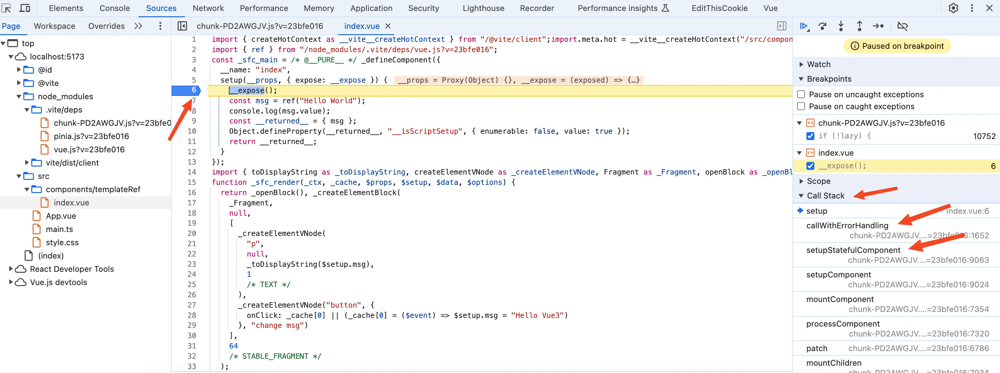

# 前言
众所周知，vue3的template中使用ref变量无需使用`.value`。还可以在事件处理器中进行赋值操作时，无需使用`.value`就可以直接修改ref变量的值，比如：`<button @click="msg = 'Hello Vue3'">change msg</button>`。你猜vue是在编译时就已经在代码中生成了`.value`，还是运行时使用Proxy拦截的方式去实现的呢？

# 看个demo
看个简单的demo，代码如下：
```vue
<template>
  <p>{{ msg }}</p>
  <button @click="msg = 'Hello Vue3'">change msg</button>
</template>

<script setup lang="ts">
import { ref } from "vue";

const msg = ref("Hello World");

console.log(msg.value);
</script>
```
上面的代码很简单，在script中想要访问`msg`变量的值需要使用`msg.value`。但是在template中将`msg`变量渲染到p标签上面时就是直接使用`{{ msg }}`，在`click`的事件处理器中给`msg`变量赋新的值时也没有使用到`.value`。

然后在浏览器中找到上面这个vue文件编译后的样子，在之前的文章中已经讲过很多次如何在浏览器中查看编译后的vue文件，这篇文章就不赘述了。编译后的代码如下：
```js
import {
  Fragment as _Fragment,
  createElementBlock as _createElementBlock,
  createElementVNode as _createElementVNode,
  defineComponent as _defineComponent,
  openBlock as _openBlock,
  toDisplayString as _toDisplayString,
  ref,
} from "/node_modules/.vite/deps/vue.js?v=23bfe016";

const _sfc_main = _defineComponent({
  __name: "index",
  setup() {
    const msg = ref("Hello World");
    console.log(msg.value);
    const __returned__ = { msg };
    return __returned__;
  },
});

function _sfc_render(_ctx, _cache, $props, $setup, $data, $options) {
  return (
    _openBlock(),
    _createElementBlock(
      _Fragment,
      null,
      [
        _createElementVNode("p", null, _toDisplayString($setup.msg), 1),
        _createElementVNode(
          "button",
          {
            onClick:
              _cache[0] ||
              (_cache[0] = ($event) => ($setup.msg = "Hello Vue3")),
          },
          "change msg"
        ),
      ],
      64
    )
  );
}
_sfc_main.render = _sfc_render;
export default _sfc_main;
```
vue文件编译后的代码主要分为两块：`_sfc_main`和`_sfc_render`。

- `_sfc_main`中主要是setup方法，这个是vue的`<script setup lang="ts">`部分编译后的样子。从上面可以看到在编译后的setup方法中，访问`msg`变量时依然使用了`msg.value`，并且在setup方法中return了`{ msg }`对象。

- `_sfc_render`就是我们熟悉的render函数，在render函数中渲染p标签部分的内容是：`_toDisplayString($setup.msg)`。很明显这个`toDisplayString`就是一个将输入值转换为字符串的函数，并没有处理`.value`。

  `$setup.msg`中的`$setup.`，我想你猜到了应该和前面这个`setup`方法中return的`{ msg }`对象有关，但是又不是直接使用`setup`方法中return的`{ msg }`对象，因为使用setup中的`msg`变量需要使用`.value`，在编译后的render函数中并**没有**帮我们自动生成一个`.value`，比如这样的代码：`$setup.msg.value`。

  同样的在render函数中，button的click事件给`msg`变量赋值时**也没有**帮我们生成一个类似于这样的代码：`$setup.msg.value = "Hello Vue3"`，而是`$setup.msg = "Hello Vue3"`。

  从render函数中可以看出在template中使用ref变量无需使用`.value`，并不是编译时就已经在代码中生成了`.value`，比如`$setup.msg.value`，而是通过Proxy的方式去实现的。
# render函数
在render函数中读和写`msg`变量都变成了`$setup.msg`，而这个`$setup`对象又是调用render函数时传入的第四个参数。现在我们需要搞清楚调用render函数时传入的第四个参数到底是什么？给render函数打一个断点，刷新页面，此时代码走到了断点里面，如下图：
{data-zoomable}

右边的Call Stack表示当前函数的调用链，从调用链中可以看到render函数是由一个名为`renderComponentRoot`的函数调用的。

点击Call Stack中的`renderComponentRoot`，代码会跳转到`renderComponentRoot`函数中，在我们这个场景中简化后的`renderComponentRoot`函数代码如下：
```js
function renderComponentRoot(instance) {
  const {
    props,
    data,
    setupState,
    render: render2,
    // 省略...
  } = instance;

  render2.call(
    thisProxy,
    proxyToUse,
    renderCache,
    props,
    setupState,
    data,
    ctx
  );
}
```
这里的`render2`也就是我们的render函数，由于使用了`.call`，所以调用render函数时传入的第四个参数为`setupState`对象。而`setupState`对象的值又是从`instance.setupState`而来的。

**通过debug调试render函数我们发现，在render函数中渲染`msg`变量是使用`$setup.msg`，而`$setup`对象的值是从`instance.setupState`对象上面来的。**

前面讲过了编译后的`setup`方法会返回一个包含`msg`属性的对象，而这个`$setup`对象也就是`instance.setupState`肯定是和`setup`方法返回的对象有关系的。所以接下来我们需要去debug调试setup方法搞清楚他们到底是什么关系。
# setup方法
将render函数中的断点去掉，然后给setup方法打一个断点。刷新页面，此时代码会走到断点中，如下图：
{data-zoomable}


同理在Call Stack中可以看到调用setup方法的是`callWithErrorHandling`函数，点击Call Stack中的`callWithErrorHandling`，代码会跳转到`callWithErrorHandling`函数中。代码如下：
```js
function callWithErrorHandling(fn, instance, type, args) {
  try {
    return args ? fn(...args) : fn();
  } catch (err) {
    handleError(err, instance, type);
  }
}
```
从上面可以看到在`callWithErrorHandling`函数中只是进行了错误处理，并不是我们想要找的。
## `setupStatefulComponent`函数
从Call Stack中可以看到调用`callWithErrorHandling`函数的是`setupStatefulComponent`函数，点击Call Stack中的`setupStatefulComponent`，代码会跳转到`setupStatefulComponent`函数中。在我们这个场景中简化后的`setupStatefulComponent`函数代码如下：
```js
function setupStatefulComponent(instance) {
  const Component = instance.type;
  const { setup } = Component;
  const setupResult = callWithErrorHandling(setup, instance);
  handleSetupResult(instance, setupResult);
}
```
从上面的代码可以看到确实是使用`callWithErrorHandling`函数执行了setup方法，并且还将setup方法的返回值对象赋值给了`setupResult`变量。然后以`instance`（vue实例）和`setupResult`（setup方法的返回值）为参数，调用了`handleSetupResult`函数。
## `handleSetupResult`函数
将断点走进`handleSetupResult`函数，在我们这个场景中简化后的`handleSetupResult`函数代码如下：
```js
function handleSetupResult(instance, setupResult) {
  instance.setupState = proxyRefs(setupResult);
}
```
我们在render函数中渲染`msg`变量是使用`$setup.msg`，而`$setup`对象的值是从`instance.setupState`对象上面来的。

现在我们已经找到了`instance.setupState`是在这里赋值的，它的值是`proxyRefs`函数的返回结果。
## `proxyRefs`函数
将断点走进`proxyRefs`函数，代码如下：
```js
function proxyRefs(objectWithRefs) {
  return isReactive(objectWithRefs)
    ? objectWithRefs
    : new Proxy(objectWithRefs, shallowUnwrapHandlers);
}
```
这个`isReactive`函数是vue暴露出来的一个API，它的作用是检查一个对象是否是由 reactive() 或 shallowReactive() 创建的代理。

这里的`objectWithRefs`对象就是`setup`方法的返回值对象，通过前面我们知道`setup`方法的返回值对象就是一个普通的js对象，并不是reactive的。所以`proxyRefs`函数会返回三目运算符冒号（`:`）后面的表达式，也就是使用`Proxy`创建的`setup`方法返回值对象代理。

我们接着来看`shallowUnwrapHandlers`里面做了哪些事情，代码如下：
```js
const shallowUnwrapHandlers = {
  get: (target, key, receiver) => unref(Reflect.get(target, key, receiver)),
  set: (target, key, value, receiver) => {
    const oldValue = target[key];
    if (isRef(oldValue) && !isRef(value)) {
      oldValue.value = value;
      return true;
    } else {
      return Reflect.set(target, key, value, receiver);
    }
  },
};
```
这个handler包含get和set方法，会对setup的返回值对象进行拦截。

当在render函数中渲染p标签时会去读`$setup.msg`，就会走到get的拦截中。在get方法中使用到了`Reflect.get`方法和`unref`函数。
- `Reflect.get(target, key, receiver)`的作用是获取`target`对象的`key`属性，在我们这里就是获取setup返回值对象的`msg`属性，也就是我们定义的`msg`变量。并且这个`msg`变量是一个ref。

- 将`Reflect.get`方法拿到的`msg`变量传给`unref`函数，这个`unref`函数同样是暴露出来的一个API。如果参数是 ref，则返回内部值，否则返回参数本身。这是 `val = isRef(val) ? val.value : val` 计算的一个语法糖。

  经过`unref`函数的处理后，在get拦截中return的就是`.value`后的内容，也就是`msg.value`。

  **所以在template中使用ref变量无需使用`.value`，是因为在Proxy的get拦截中已经帮我们自动处理了.value。**
当在render函数中去对ref变量进行赋值，比如：`<button @click="msg = 'Hello Vue3'">change msg</button>`。
就会走到set拦截中，首先会执行`const oldValue = target[key]`。这里的key就是"msg"，target就是setup函数返回值对象。使用`oldValue`就是`msg`变量，是一个ref。

由于我们在click事件中要将`msg`赋值成'Hello Vue3'字符串，所以在set拦截中拿到的新value为'Hello Vue3'字符串。

接着执行`if (isRef(oldValue) && !isRef(value))`判断，这里的`oldValue`前面已经讲过了是一个名为`msg`的ref变量，所以`isRef(oldValue) `为true。`value`为'Hello Vue3'字符串，所以!isRef(value)也是为true。

代码就会走进if判断中执行`oldValue.value = value`，也就是在执行`msg.value = 'Hello Vue3'`。

**所以在template中给ref变量赋值无需使用`.value`，是因为在Proxy的set拦截中也帮我们自动处理了`.value`。**
# 总结
整个流程图如下：
{data-zoomable}

在vue3的template中使用ref变量无需使用`.value`，是因为有个Proxy的get拦截，在get拦截中会自动帮我们去取ref变量的`.value`属性。

同样的在template中对ref变量进行赋值也无需使用`.value`，也是有个Proxy的set拦截，在set拦截中会自动帮我们去给ref变量的`.value`属性进行赋值。


[加入本书对应的「源码交流群」](/guide/contact)
