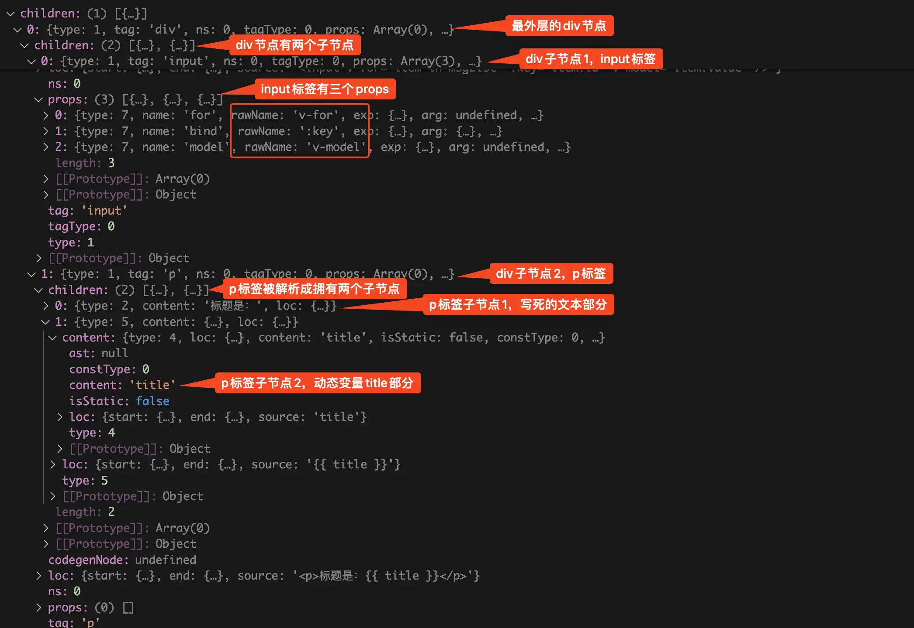
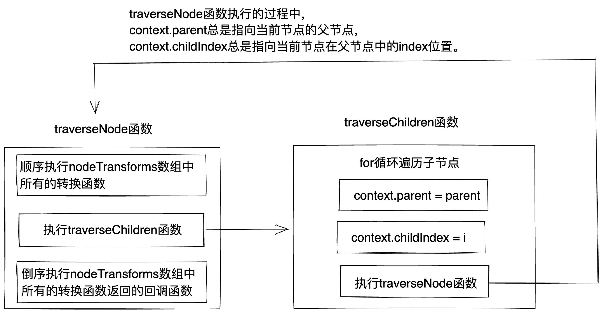
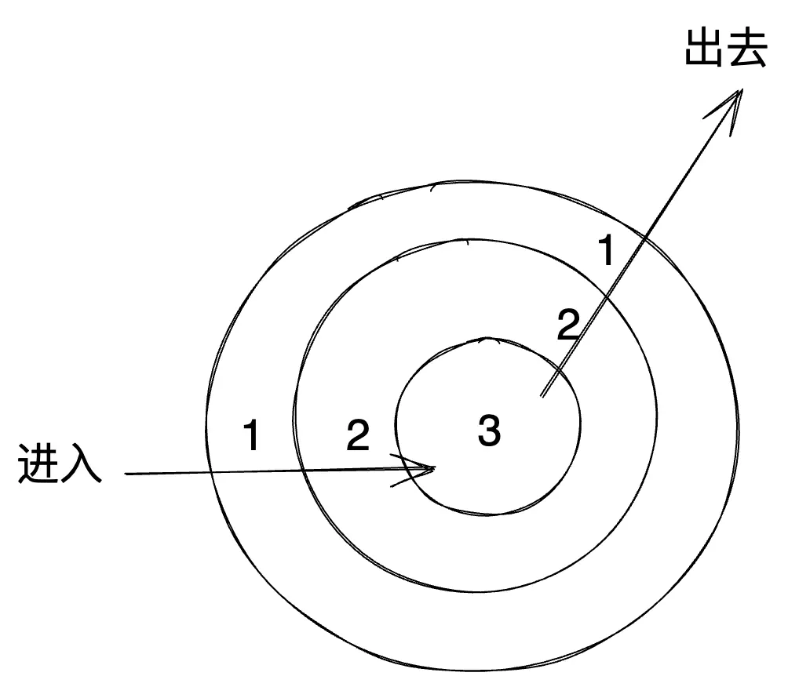
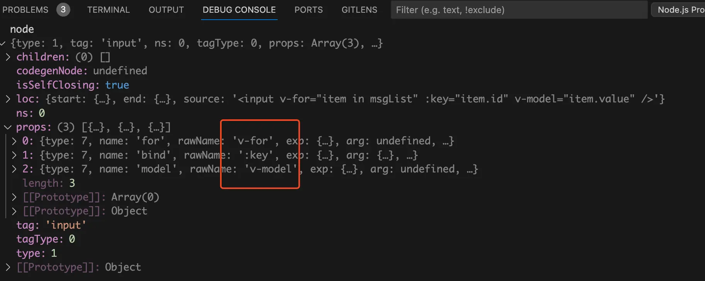
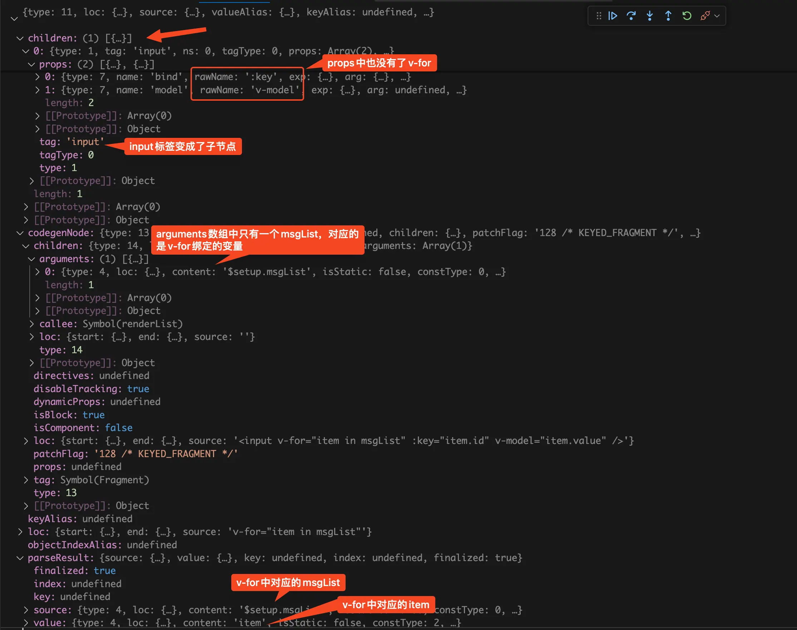
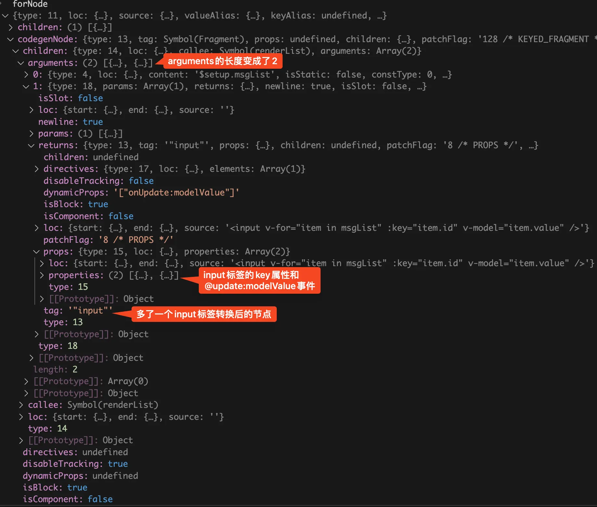
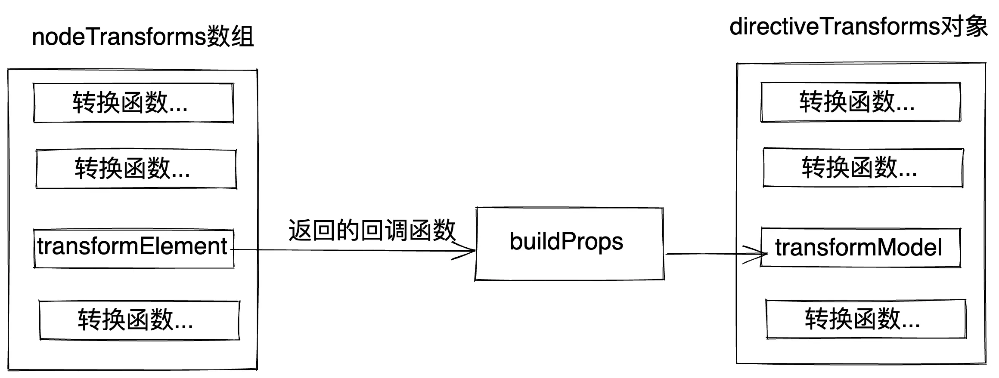
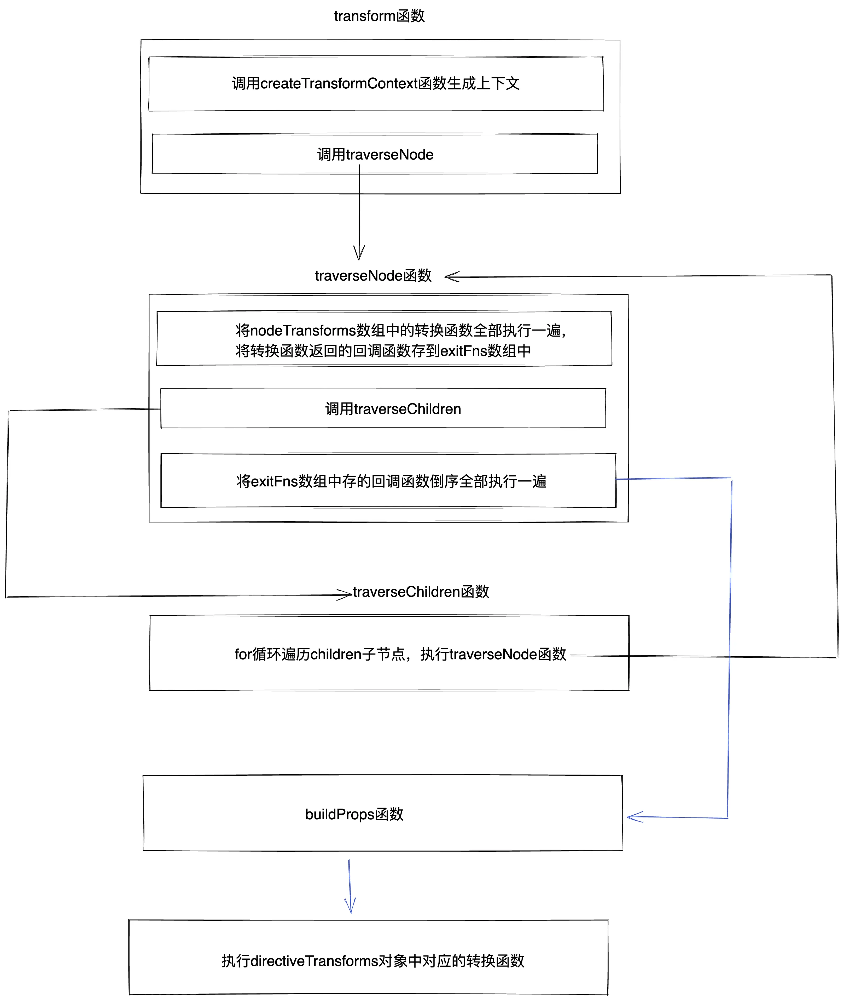

# 前言
在[baseCompile函数](/template/baseCompile) 文章中讲了v-model、v-for等指令是由`transform`函数处理的，但是我们没有深入到`transform`函数内部去看他具体是怎么处理的。这篇文章我们深入到`transform`函数内，来看看具体是如何处理vue内置的v-for、v-model等指令？

# 举个例子
还是同样的套路，我们通过debug一个简单的demo来带你搞清楚`transform`函数内具体是如何处理vue内置的v-for、v-model等指令。demo代码如下：
```vue
<template>
  <div>
    <input v-for="item in msgList" :key="item.id" v-model="item.value" />
    <p>标题是：{{ title }}</p>
  </div>
</template>

<script setup lang="ts">
import { ref } from "vue";

const msgList = ref([
  {
    id: 1,
    value: "",
  },
  {
    id: 2,
    value: "",
  },
  {
    id: 3,
    value: "",
  },
]);
const title = ref("hello word");
</script>
```
在上面的代码中，我们给input标签使用了v-for和v-model指令，还渲染了一个p标签。p标签中的内容由`title`变量渲染而来的。

我们在前面的 [baseCompile函数](/template/baseCompile) 文章中已经讲过了，将template模版编译成**模版AST抽象语法树**的过程中不会处理v-for、v-model等内置指令，而是将其当做普通的props属性处理。

比如我们这个demo，编译成**模版AST抽象语法树**后。input标签对应的node节点中就增加了三个props属性，name分别为for、bind、model，分别对应的是v-for、v-bind、v-model。真正处理这些vue内置指令是在`transform`函数中。
# `transform`函数
`transform`函数在**node_modules/@vue/compiler-core/dist/compiler-core.cjs.js**文件中。找到`transform`函数的代码，打上断点。

从前面的文章我们知道了`transform`函数是在node端执行的，所以我们需要启动一个`debug`终端，才可以在node端打断点。这里以vscode举例，首先我们需要打开终端，然后点击终端中的`+`号旁边的下拉箭头，在下拉中点击`Javascript Debug Terminal`就可以启动一个`debug`终端。
{data-zoomable}

接着在`debug`终端中执行`yarn dev`（这里是以`vite`举例）。在浏览器中访问 [http://localhost:5173/](http://localhost:5173/)，此时断点就会走到`transform`函数中了。我们在debug终端中来看看调用`transform`函数时传入的`root`变量，如下图：
{data-zoomable}


从上图中我们可以看到`transform`函数接收的第一个参数`root`变量是一个**模版AST抽象语法树**，为什么说他是**模版AST抽象语法树**呢？因为这棵树的结构和template模块中的结构一模一样，`root`变量也就是**模版AST抽象语法树**是对template模块进行描述。

根节点的children下面只有一个div子节点，对应的就是最外层的div标签。div节点children下面有两个子节点，分别对应的是input标签和p标签。input标签中有三个props，分别对应input标签上面的v-for指令、key属性、v-model指令。从这里我们可以看出来此时vue内置的指令还没被处理，在执行parse函数生成**模版AST抽象语法树**阶段只是将其当做普通的属性处理后，再塞到props属性中。

p标签中的内容由两部分组成：`<p>标题是：{{ title }}</p>`。此时我们发现p标签的children也是有两个，分别是写死的文本和`title`变量。

我们接着来看`transform`函数，在我们这个场景中简化后的代码如下：
```js
function transform(root, options) {
  const context = createTransformContext(root, options);
  traverseNode(root, context);
}
```
从上面的代码中可以看到`transform`函数内主要有两部分，从名字我想你应该就能猜出他们的作用。传入**模版AST抽象语法树**和`options`，调用`createTransformContext`函数生成`context`上下文对象。传入**模版AST抽象语法树**和`context`上下文对象，调用`traverseNode`函数对树中的node节点进行转换。
# `createTransformContext`函数
在讲`createTransformContext`函数之前我们先来了解一下什么是**context（上下文）**。
## 什么是上下文
上下文其实就是在某个范围内的“全局变量”，在这个范围内的任意地方都可以拿到这个“全局变量”。举两个例子：

在vue中可以通过provied向整颗组件树提供数据，然后在树的任意节点可以通过inject拿到提供的数据。比如：

根组件App.vue，注入上下文。
```js
const count = ref(0)
provide('count', count)
```
业务组件list.vue，读取上下文。
```js
const count = inject('count')
```
在react中，我们可以使用`React.createContext` 函数创建一个上下文对象，然后注入到组件树中。
```js
const ThemeContext = React.createContext('light');

function App() {
  const [theme, setTheme] = useState('light');
  // ...
  return (
    <ThemeContext.Provider value={theme}>
      <Page />
    </ThemeContext.Provider>
  );
}
```
在这颗组件树的任意层级中都能拿到上下文对象中提供的数据：
```js
const theme = useContext(ThemeContext);
```
树中的节点一般可以通过children拿到子节点，但是父节点一般不容易通过子节点拿到。在转换的过程中我们有的时候需要拿到父节点进行一些操作，比如将当前节点替换为一个新的节点，又或者直接删掉当前节点。

所以在这里会维护一个context上下文对象，对象中会维护一些状态和方法。比如当前正在转换的节点是哪个，当前转换的节点的父节点是哪个，当前节点在父节点中是第几个子节点，还有`replaceNode`、`removeNode`等方法。
## 上下文中的一些属性和方法
我们将断点走进`createTransformContext`函数中，简化后的代码如下：
```js
function createTransformContext(
  root,
  {
    nodeTransforms = [],
    directiveTransforms = {},
    // ...省略
  }
) {
  const context = {
    // 所有的node节点都会将nodeTransforms数组中的所有的转换函数全部执行一遍
    nodeTransforms,
    // 只执行node节点的指令在directiveTransforms对象中对应的转换函数
    directiveTransforms,
    // 需要转换的AST抽象语法树
    root,
    // 转换过程中组件内注册的组件
    components: new Set(),
    // 转换过程中组件内注册的指令
    directives: new Set(),
    // 当前正在转换节点的父节点，默认转换的是根节点。根节点没有父节点，所以为null。
    parent: null,
    // 当前正在转换的节点，默认为根节点
    currentNode: root,
    // 当前转换节点在父节点中的index位置
    childIndex: 0,
    replaceNode(node) {
      // 将当前节点替换为新节点
    },
    removeNode(node) {
      // 删除当前节点
    },
    // ...省略
  };
  return context;
}
```
从上面的代码中可以看到`createTransformContext`中的代码其实很简单，第一个参数为需要转换的**模版AST抽象语法树**，第二个参数对传入的`options`进行解构，拿到`options.nodeTransforms`数组和`options.directiveTransforms`对象。

`nodeTransforms`数组中存了一堆转换函数，在树的递归遍历过程中会将`nodeTransforms`数组中的转换函数全部执行一遍。`directiveTransforms`对象中也存了一堆转换函数，和`nodeTransforms`数组的区别是，只会执行node节点的指令在`directiveTransforms`对象中对应的转换函数。比如node节点中只有v-model指令，那就只会执行`directiveTransforms`对象中的`transformModel`转换函数。这里将拿到的`nodeTransforms`数组和`directiveTransforms`对象都存到了`context`上下文中。

在`context`上下文中存了一些状态属性：
- root：需要转换的AST抽象语法树。

- components：转换过程中组件内注册的组件。

- directives：转换过程中组件内注册的指令。

- parent：当前正在转换节点的父节点，默认转换的是根节点。根节点没有父节点，所以为null。

- currentNode：当前正在转换的节点，默认为根节点。

- childIndex：当前转换节点在父节点中的index位置。

在`context`上下文中存了一些方法：
- replaceNode：将当前节点替换为新节点。

- removeNode：删除当前节点。
# `traverseNode`函数
接着将断点走进`traverseNode`函数中，在我们这个场景中简化后的代码如下：
```js
function traverseNode(node, context) {
  context.currentNode = node;
  const { nodeTransforms } = context;
  const exitFns = [];
  for (let i = 0; i < nodeTransforms.length; i++) {
    const onExit = nodeTransforms[i](node, context);
    if (onExit) {
      if (isArray(onExit)) {
        exitFns.push(...onExit);
      } else {
        exitFns.push(onExit);
      }
    }
    if (!context.currentNode) {
      return;
    } else {
      node = context.currentNode;
    }
  }

  traverseChildren(node, context);

  context.currentNode = node;
  let i = exitFns.length;
  while (i--) {
    exitFns[i]();
  }
}
```
从上面的代码中我们可以看到`traverseNode`函数接收两个参数，第一个参数为当前需要处理的node节点，第一次调用时传的就是树的根节点。第二个参数是上下文对象。

我们再来看`traverseNode`函数的内容，内容主要分为三部分。分别是：
- 将`nodeTransforms`数组内的转换函数全部执行一遍，如果转换函数的执行结果是一个回调函数，那么就将回调函数push到`exitFns`数组中。

- 调用`traverseChildren`函数处理子节点。

- 将`exitFns`数组中存的回调函数依次从末尾取出来挨个执行。
## `traverseChildren`函数
我们先来看看第二部分的`traverseChildren`函数，代码很简单，简化后的代码如下：
```js
function traverseChildren(parent, context) {
  let i = 0;
  for (; i < parent.children.length; i++) {
    const child = parent.children[i];
    context.parent = parent;
    context.childIndex = i;
    traverseNode(child, context);
  }
}
```
在`traverseChildren`函数中会去遍历当前节点的子节点，在遍历过程中会将`context.parent`更新为当前的节点，并且将`context.childIndex`也更新为当前子节点所在的位置。然后再调用`traverseNode`函数处理当前的子节点。

所以在`traverseNode`函数执行的过程中，`context.parent`总是指向当前节点的父节点，`context.childIndex`总是指向当前节点在父节点中的index位置。如下图：

{data-zoomable}

## 进入时执行的转换函数
我们现在回过头来看第一部分的代码，代码如下：
```js
function traverseNode(node, context) {
  context.currentNode = node;
  const { nodeTransforms } = context;
  const exitFns = [];
  for (let i = 0; i < nodeTransforms.length; i++) {
    const onExit = nodeTransforms[i](node, context);
    if (onExit) {
      if (isArray(onExit)) {
        exitFns.push(...onExit);
      } else {
        exitFns.push(onExit);
      }
    }
    if (!context.currentNode) {
      return;
    } else {
      node = context.currentNode;
    }
  }
  // ...省略
}
```
首先会将`context.currentNode`更新为当前节点，然后从context上下文中拿到由转换函数组成的`nodeTransforms`数组。

在 [baseCompile函数](/template/baseCompile) 文章中我们已经讲过了`nodeTransforms`数组中主要存了下面这些转换函数，代码如下：
```js
const nodeTransforms = [
  transformOnce,
  transformIf,
  transformMemo,
  transformFor,
  transformFilter,
  trackVForSlotScopes,
  transformExpression
  transformSlotOutlet,
  transformElement,
  trackSlotScopes,
  transformText
]
```
很明显我们这里的v-for指令就会被`nodeTransforms`数组中的`transformFor`转换函数处理。

看到这里有的小伙伴就会问了，怎么没有在`nodeTransforms`数组中看到处理`v-model`指令的转换函数呢？处理`v-model`指令的转换函数是在`directiveTransforms`对象中。在`directiveTransforms`对象中主要存了下面这些转换函数：
```js
const directiveTransforms = {
  bind: transformBind,
  cloak: compilerCore.noopDirectiveTransform,
  html: transformVHtml,
  text: transformVText,
  model: transformModel,
  on: transformOn,
  show: transformShow
}
```
`nodeTransforms`和`directiveTransforms`的区别是，在递归遍历转换node节点时，每次都会将`nodeTransforms`数组中的所有转换函数都全部执行一遍。比如当前转换的node节点中没有使用v-if指令，但是在转换当前node节点时还是会执行`nodeTransforms`数组中的`transformIf`转换函数。

而`directiveTransforms`是在递归遍历转换node节点时，只会执行node节点中存在的指令对应的转换函数。比如当前转换的node节点中有使用v-model指令，所以就会执行`directiveTransforms`对象中的`transformModel`转换函数。由于node节点中没有使用v-html指令，所以就不会执行`directiveTransforms`对象中的`transformVHtml`转换函数。

我们前面讲过了context上下文中存了很多属性和方法。包括当前节点的父节点是谁，当前节点在父节点中的index位置，替换当前节点的方法，删除当前节点的方法。这样在转换函数中就可以通过context上下文对当前节点进行各种操作了。

将转换函数的返回值赋值给`onExit`变量，如果`onExit`不为空，说明转换函数的返回值是一个回调函数或者由回调函数组成的数组。将这些回调函数push进`exitFns`数组中，在退出时会将这些回调函数倒序全部执行一遍。

执行完回调函数后会判断上下文中的`currentNode`是否为空，如果为空那么就return掉整个`traverseNode`函数，后面的`traverseChildren`等函数都不会执行了。如果`context.currentNode`不为空，那么就将本地的`node`变量更新成context上下文中的`currentNode`。

为什么需要判断context上下文中的`currentNode`呢？原因是经过转换函数的处理后当前节点可能会被删除了，也有可能会被替换成一个新的节点，所以在每次执行完转换函数后都会更新本地的node变量，保证在下一个的转换函数执行时传入的是最新的node节点。
## 退出时执行的转换函数回调
我们接着来看`traverseNode`函数中最后一部分，代码如下：
```js
function traverseNode(node, context) {
  // ...省略
  context.currentNode = node;
  let i = exitFns.length;
  while (i--) {
    exitFns[i]();
  }
}
```
由于这段代码是在执行完`traverseChildren`函数再执行的，前面已经讲过了在`traverseChildren`函数中会将当前节点的子节点全部都处理了，所以当代码执行到这里时所有的子节点都已经处理完了。**所以在转换函数返回的回调函数中我们可以根据当前节点转换后的子节点情况来决定如何处理当前节点。**

在处理子节点的时候我们会将`context.currentNode`更新为子节点，所以在处理完子节点后需要将`context.currentNode`更新为当前节点。这样在执行转换函数返回的回调函数时，`context.currentNode`始终就是指向的是当前的node节点。

请注意这里是倒序取出`exitFns`数组中存的回调函数，在进入时会按照顺序去执行`nodeTransforms`数组中的转换函数。在退出时会倒序去执行存下来的回调函数，比如在`nodeTransforms`数组中`transformIf`函数排在`transformFor`函数前面。`transformIf`用于处理v-if指令，`transformFor`用于处理v-for指令。在进入时`transformIf`函数会比`transformFor`函数先执行，所以在组件上面同时使用v-if和v-for指令，会是v-if指令先生效。在退出阶段时`transformIf`函数会比`transformFor`函数后执行，所以在`transformIf`回调函数中可以根据`transformFor`回调函数的执行结果来决定如何处理当前的node节点。

`traverseNode`函数其实就是典型的**洋葱模型**，依次从父组件到子组件挨着调用`nodeTransforms`数组中所有的转换函数，然后从子组件到父组件倒序执行`nodeTransforms`数组中所有的转换函数返回的回调函数。`traverseNode`函数内的设计很高明，如果你还没反应过来，别着急我接下来会讲他高明在哪里。
# 洋葱模型`traverseNode`函数
我们先来看看什么是洋葱模型，如下图：
{data-zoomable}


洋葱模型就是：从外面一层层的进去，再一层层的从里面出来。

第一次进入`traverseNode`函数的时候会进入洋葱模型的第1层，先依次将`nodeTransforms`数组中所有的转换函数全部执行一遍，对当前的node节点进行第一次转换。如果转换函数的返回值是回调函数或者回调函数组成的数组，那就将这些回调函数依次push到第1层定义的`exitFns`数组中。

然后再去处理当前节点的子节点，处理子节点的`traverseChildren`函数其实也是在调用`traverseNode`函数，此时已经进入了洋葱模型的第2层。同理在第2层也会将`nodeTransforms`数组中所有的转换函数全部执行一遍，对第2层的node节点进行第一次转换，并且将返回的回调函数依次push到第2层定义的`exitFns`数组中。

同样的如果第2层节点也有子节点，那么就会进入洋葱模型的第3层。在第3层也会将`nodeTransforms`数组中所有的转换函数全部执行一遍，对第3层的node节点进行第一次转换，并且将返回的回调函数依次push到第3层定义的`exitFns`数组中。

请注意此时的第3层已经没有子节点了，那么现在就要从一层层的进去，变成一层层的出去。首先会将第3层`exitFns`数组中存的回调函数依次从末尾开始全部执行一遍，会对第3层的node节点进行第二次转换，此时第3层中的node节点已经被全部转换完了。

由于第3层的node节点已经被全部转换完了，所以会出去到洋葱模型的第2层。同样将第2层`exitFns`数组中存的回调函数依次从末尾开始全部执行一遍，会对第2层的node节点进行第二次转换。值得一提的是由于第3层的node节点也就是第2层的children节点已经被完全转换了，所以在执行第2层转换函数返回的回调函数时就可以根据子节点的情况来处理父节点。

同理将第2层的node节点全部转换完了后，会出去到洋葱模型的第1层。将第1层`exitFns`数组中存的回调函数依次从末尾开始全部执行一遍，会对第1层的node节点进行第二次转换。

当出去阶段的第1层全部处理完后了，`transform`函数内处理内置的v-for等指令也就处理完了。执行完`transform`函数后，描述template解构的**模版AST抽象语法树**也被处理成了描述render函数结构的**javascript AST抽象语法树**。后续只需要执行`generate`函数，进行普通的字符串拼接就可以得到render函数。
# 继续debug
搞清楚了`traverseNode`函数，接着来debug看看demo中的v-for指令和v-model指令是如何被处理的。
- v-for指令对应的是`transformFor`转换函数。

- v-model指令对应的是`transformModel`转换函数。
## `transformFor`转换函数
通过前面我们知道了用于处理`v-for`指令的`transformFor`转换函数是在`nodeTransforms`数组中，每次处理node节点都会执行。我们给`transformFor`转换函数打3个断点，分别是：
- 进入`transformFor`转换函数之前。

- 调用`transformFor`转换函数，第1次对node节点进行转换之后。

- 调用`transformFor`转换函数返回的回调函数，第2次对node节点进行转换之后。

我们将代码走到第1个断点，看看执行`transformFor`转换函数之前input标签的node节点是什么样的，如下图：
{data-zoomable}

从上图中可以看到input标签的node节点中还是有一个v-for的props属性，说明此时v-for指令还没被处理。

我们接着将代码走到第2个断点，看看调用`transformFor`转换函数第1次对node节点进行转换之后是什么样的，如下图：
{data-zoomable}

从上图中可以看到原本的input的node节点已经被替换成了一个新的node节点，新的node节点的children才是原来的node节点。并且input节点props属性中的v-for指令也被消费了。新节点的`source.content`里存的是`v-for="item in msgList"`中的`msgList`变量。新节点的`valueAlias.content`里存的是`v-for="item in msgList"`中的`item`。请注意此时`arguments`数组中只有一个字段，存的是`msgList`变量。

我们接着将代码走到第3个断点，看看调用`transformFor`转换函数返回的回调函数，第2次对node节点进行转换之后是什么样的，如下图：
{data-zoomable}


从上图可以看到`arguments`数组中多了一个字段，input标签现在是当前节点的子节点。按照我们前面讲的洋葱模型，input子节点现在已经被转换完成了。所以多的这个字段就是input标签经过`transform`函数转换后的node节点，将转换后的input子节点存到父节点上面，后面生成render函数时会用。
## `transformModel`转换函数
通过前面我们知道了用于处理`v-model`指令的`transformModel`转换函数是在`directiveTransforms`对象中，只有当node节点中有对应的指令才会执行对应的转换函数。我们这里input上面有v-model指令，所以就会执行`transformModel`转换函数。

我们在前面的 [baseCompile函数](/template/baseCompile) 文章中已经讲过了处理`v-model`指令是调用的`@vue/compiler-dom`包的`transformModel`函数，很容易就可以找到`@vue/compiler-dom`包的`transformModel`函数，然后打一个断点，让断点走进`transformModel`函数中，如下图：
{data-zoomable}

从上面的图中我们可以看到在`@vue/compiler-dom`包的`transformModel`函数中会调用`@vue/compiler-core`包的`transformModel`函数，拿到返回的`baseResult`对象后再一些其他操作后直接`return baseResult`。

从左边的call stack调用栈中我们可以看到`transformModel`函数是由一个`buildProps`函数调用的，`buildProps`函数是由`postTransformElement`函数调用的。而`postTransformElement`函数则是`transformElement`转换函数返回的回调函数，`transformElement`转换函数是在`nodeTransforms`数组中。

所以`directiveTransforms`对象中的转换函数调用其实是由`nodeTransforms`数组中的`transformElement`转换函数调用的。如下图：
{data-zoomable}


看名字你应该猜到了`buildProps`函数的作用是生成props属性的。点击Step Out将断点跳出`transformModel`函数，走进`buildProps`函数中，可以看到`buildProps`函数中调用`transformModel`函数的代码如下图：
{data-zoomable}

从上图中可以看到执行`directiveTransforms`对象中的转换函数不仅可以对节点进行转换，还会返回一个props数组。比如我们这里处理的是v-model指令，返回的props数组就是由v-model指令编译而来的props属性，这就是所谓的v-model语法糖。

看到这里有的小伙伴会疑惑了`v-model`指令不是会生成`modelValue`和`onUpdate:modelValue`两个属性，为什么这里只有一个`onUpdate:modelValue`属性呢？

答案是只有给自定义组件上面使用`v-model`指令才会生成`modelValue`和`onUpdate:modelValue`两个属性，对于这种原生input标签是不需要生成`modelValue`属性的，而且input标签本身是不接收名为`modelValue`属性，接收的是value属性。
# 总结
现在我们再来看看最开始讲的流程图，我想你应该已经能将整个流程串起来了。如下图：
{data-zoomable}

`transform`函数的执行过程主要分为下面这几步：
- 在`transform`函数中调用`createTransformContext`函数生成上下文对象。在上下文对象中存储了当前正在转换的node节点的信息，后面的`traverseNode`、`traverseChildren`、`nodeTransforms`数组中的转换函数、`directiveTransforms`对象中的转换函数都会依赖这个上下文对象。

- 然后执行`traverseNode`函数，`traverseNode`函数是一个典型的洋葱模型。第一次执行`traverseNode`函数的时候会进入洋葱模型的第一层，先将`nodeTransforms`数组中的转换函数全部执行一遍，对第一层的node节点进行第一次转换，将转换函数返回的回调函数存到第一层的`exitFns`数组中。经过第一次转换后v-for等指令已经被初次处理了。

- 然后执行`traverseChildren`函数，在`traverseChildren`函数中对当前node节点的子节点执行`traverseNode`函数。此时就会进入洋葱模型的第二层，和上一步一样会将`nodeTransforms`数组中的转换函数全部执行一遍，对第二层的node节点进行第一次转换，将转换函数返回的回调函数存到第二层的`exitFns`数组中。

- 假如第二层的node节点已经没有了子节点，洋葱模型就会从“进入阶段”变成“出去阶段”。将第二层的`exitFns`数组中存的回调函数全部执行一遍，对node节点进行第二次转换，然后出去到第一层的洋葱模型。经过第二次转换后v-for等指令已经被完全处理了。

- 同样将第一层中的`exitFns`数组中存的回调函数全部执行一遍，由于此时第二层的node节点已经全部处理完了，所以在`exitFns`数组中存的回调函数中就可以根据子节点的情况来处理父节点。

- 执行`nodeTransforms`数组中的`transformElement`转换函数，会返回一个回调函数。在回调函数中会调用`buildProps`函数，在`buildProps`函数中只有当node节点中有对应的指令才会执行`directiveTransforms`对象中对应的转换函数。比如当前node节点有v-model指令，才会去执行`transformModel`转换函数。v-model等指令也就被处理了。


[加入本书对应的「源码交流群」](/guide/contact)
