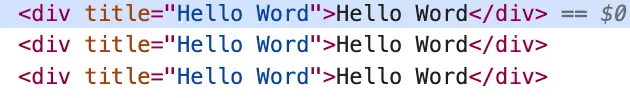
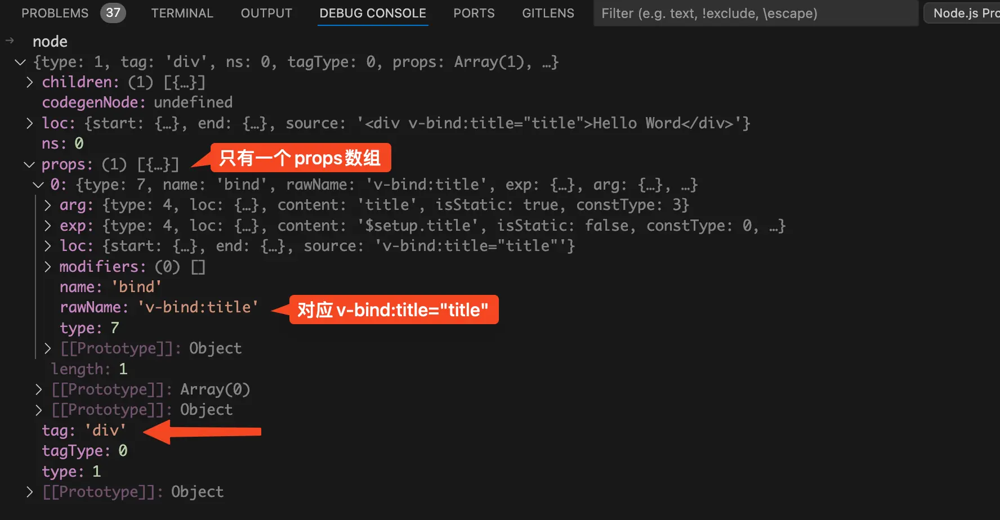
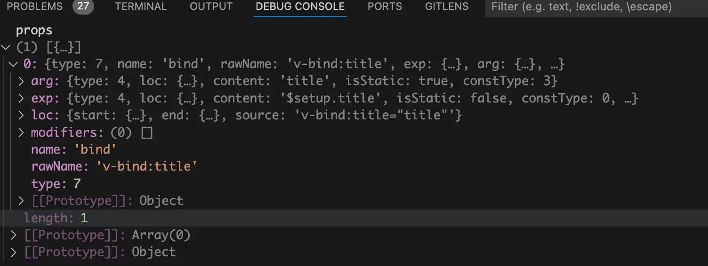
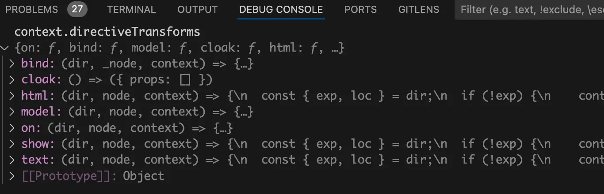
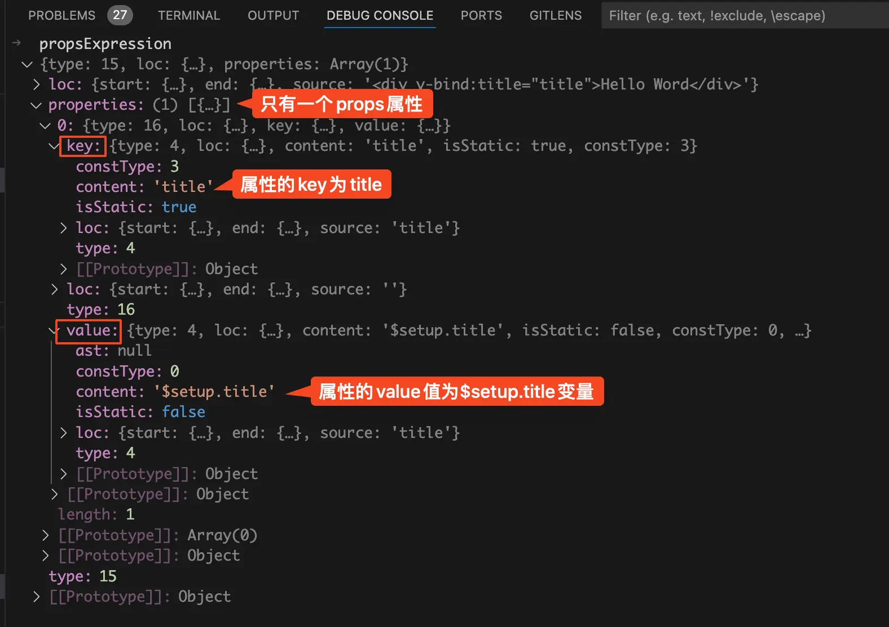
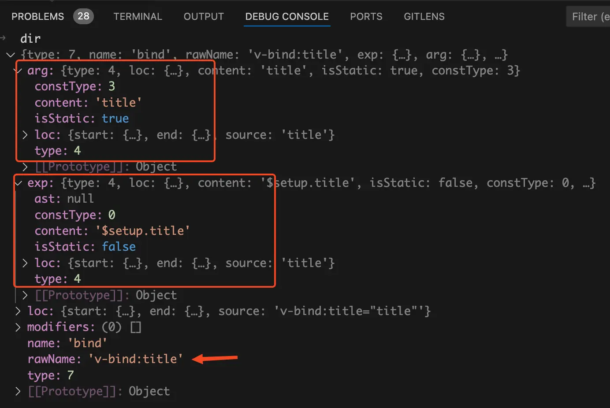
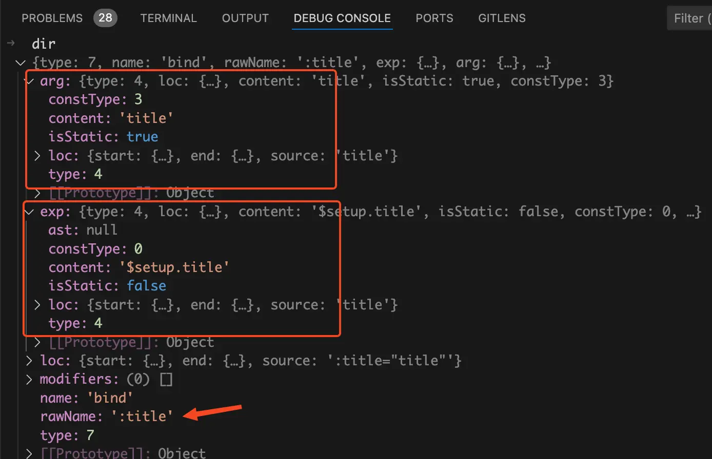
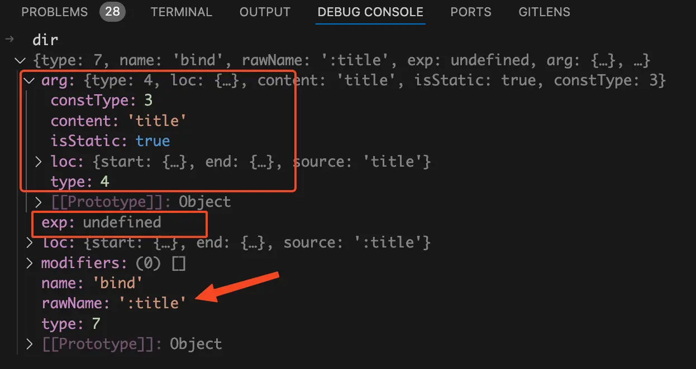
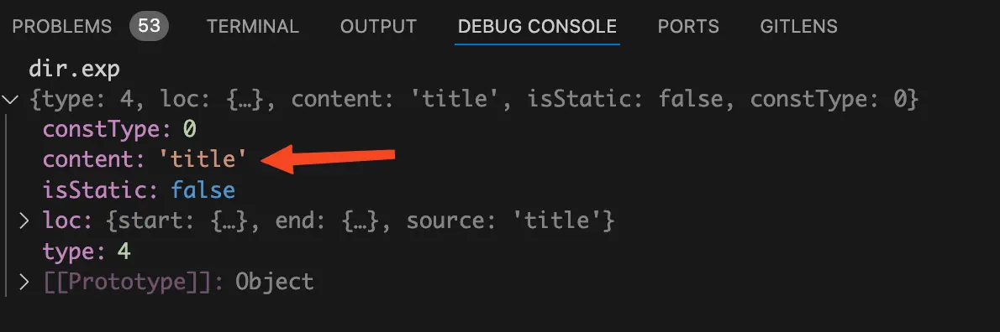
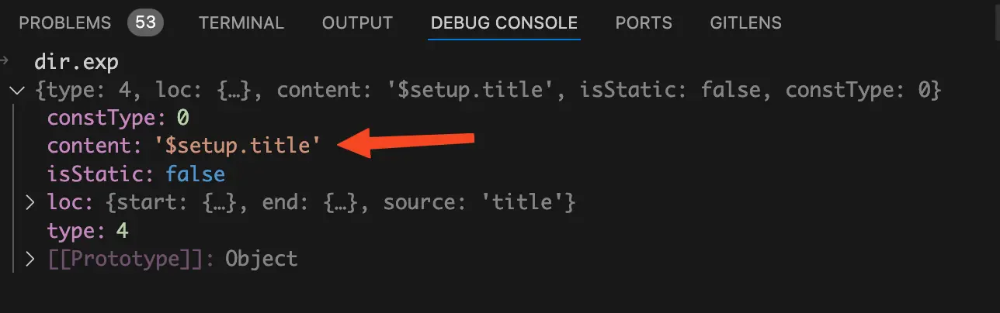

# 前言
v-bind指令想必大家都不陌生，并且都知道他支持各种写法，比如`<div v-bind:title="title">`、`<div :title="title">`、`<div :title>`(vue3.4中引入的新的写法)。这三种写法的作用都是一样的，将`title`变量绑定到div标签的title属性上。本文将通过debug源码的方式带你搞清楚，v-bind指令是如何实现这么多种方式将`title`变量绑定到div标签的title属性上的。

# 看个demo
还是老套路，我们来写个demo。代码如下：
```vue
<template>
  <div v-bind:title="title">Hello Word</div>
  <div :title="title">Hello Word</div>
  <div :title>Hello Word</div>
</template>

<script setup lang="ts">
import { ref } from "vue";
const title = ref("Hello Word");
</script>
```
上面的代码很简单，使用三种写法将title变量绑定到div标签的title属性上。

我们从浏览器中来看看编译后的代码，如下：
```js
const _sfc_main = _defineComponent({
  __name: "index",
  setup(__props, { expose: __expose }) {
    // ...省略
  }
});

function _sfc_render(_ctx, _cache, $props, $setup, $data, $options) {
  return _openBlock(), _createElementBlock(
    _Fragment,
    null,
    [
      _createElementVNode("div", { title: $setup.title }, "Hello Word", 8, _hoisted_1),
      _createElementVNode("div", { title: $setup.title }, "Hello Word", 8, _hoisted_2),
      _createElementVNode("div", { title: $setup.title }, "Hello Word", 8, _hoisted_3)
    ],
    64
    /* STABLE_FRAGMENT */
  );
}
_sfc_main.render = _sfc_render;
export default _sfc_main;
```
从上面的render函数中可以看到三种写法生成的props对象都是一样的：` { title: $setup.title }`。props属性的key为`title`，值为`$setup.title`变量。

再来看看浏览器渲染后的样子，如下图：
{data-zoomable}

从上图中可以看到三个div标签上面都有title属性，并且属性值都是一样的。
# `transformElement`函数
在之前的 [transform函数](/template/transform)文章中我们讲过了在编译阶段会执行一堆transform转换函数，用于处理vue内置的v-for等指令。而v-bind指令就是在这一堆transform转换函数中的`transformElement`函数中处理的。

还是一样的套路启动一个debug终端。这里以`vscode`举例，打开终端然后点击终端中的`+`号旁边的下拉箭头，在下拉中点击`Javascript Debug Terminal`就可以启动一个`debug`终端。
{data-zoomable}

给`transformElement`函数打个断点，`transformElement`函数的代码位置在：`node_modules/@vue/compiler-core/dist/compiler-core.cjs.js`。

在`debug`终端上面执行`yarn dev`后在浏览器中打开对应的页面，比如：[http://localhost:5173/](http://localhost:5173/) 。此时断点就会走到`transformElement`函数中，在我们这个场景中简化后的`transformElement`函数代码如下：
```js
const transformElement = (node, context) => {
  return function postTransformElement() {
    let vnodeProps;
    const propsBuildResult = buildProps(
      node,
      context,
      undefined,
      isComponent,
      isDynamicComponent
    );
    vnodeProps = propsBuildResult.props;

    node.codegenNode = createVNodeCall(
      context,
      vnodeTag,
      vnodeProps,
      vnodeChildren
      // ...省略
    );
  };
};
```
我们先来看看第一个参数`node`，如下图：
{data-zoomable}

从上图中可以看到此时的node节点对应的就是`<div v-bind:title="title">Hello Word</div>`节点，其中的props数组中只有一项，对应的就是div标签中的`v-bind:title="title"`部分。

我们接着来看`transformElement`函数中的代码，可以分为两部分。

第一部分为调用`buildProps`函数拿到当前node节点的props属性赋值给`vnodeProps`变量。

第二部分为根据当前node节点`vnodeTag`也就是节点的标签比如div、`vnodeProps`也就是节点的props属性对象、`vnodeChildren`也就是节点的children子节点、还有一些其他信息生成`codegenNode`属性。在之前的 [generate函数](/template/generate)文章中我们已经讲过了编译阶段最终生成render函数就是读取每个node节点的`codegenNode`属性然后进行字符串拼接。

从`buildProps`函数的名字我们不难猜出他的作用就是生成node节点的props属性对象，所以我们接下来需要将目光聚焦到`buildProps`函数中，看看是如何生成props对象的。
# `buildProps`函数
将断点走进`buildProps`函数，在我们这个场景中简化后的代码如下：
```js
function buildProps(node, context, props = node.props) {
  let propsExpression;
  let properties = [];

  for (let i = 0; i < props.length; i++) {
    const prop = props[i];
    const { name } = prop;
    const directiveTransform = context.directiveTransforms[name];
    if (directiveTransform) {
      const { props } = directiveTransform(prop, node, context);
      properties.push(...props);
    }
  }

  propsExpression = createObjectExpression(
    dedupeProperties(properties),
    elementLoc
  );
  return {
    props: propsExpression,
    // ...省略
  };
}
```
由于我们在调用`buildProps`函数时传的第三个参数为undefined，所以这里的props就是默认值`node.props`。如下图：
{data-zoomable}

从上图中可以看到props数组中只有一项，props中的name字段为`bind`，说明v-bind指令还未被处理掉。

并且由于我们当前node节点是第一个div标签：`<div v-bind:title="title">`，所以props中的`rawName`的值是`v-bind:title`。

我们接着来看上面for循环遍历props的代码：`const directiveTransform = context.directiveTransforms[name]`，现在我们已经知道了这里的name为`bind`。那么这里的`context.directiveTransforms`对象又是什么东西呢？我们在debug终端来看看`context.directiveTransforms`，如下图：
{data-zoomable}

从上图中可以看到`context.directiveTransforms`对象中包含许多指令的转换函数，比如`v-bind`、`v-cloak`、`v-html`、`v-model`等。

我们这里name的值为`bind`，并且`context.directiveTransforms`对象中有name为`bind`的转换函数。所以`const directiveTransform = context.directiveTransforms[name]`就是拿到处理v-bind指令的转换函数，然后赋值给本地的`directiveTransform`函数。

接着就是执行`directiveTransform`转换函数，拿到v-bind指令生成的props数组。然后执行`properties.push(...props)`方法将所有的props数组都收集到`properties`数组中。

由于node节点中有多个props，在for循环遍历props数组时，会将经过transform转换函数处理后拿到的props数组全部push到`properties`数组中。`properties`数组中可能会有重复的prop，所以需要执行`dedupeProperties(properties)`函数对props属性进行去重。

node节点上的props属性本身也是一种node节点，所以最后就是执行`createObjectExpression`函数生成props属性的node节点，代码如下：
```js
propsExpression = createObjectExpression(
  dedupeProperties(properties),
  elementLoc
)
```
其中`createObjectExpression`函数的代码也很简单，代码如下：
```js
function createObjectExpression(properties, loc) {
  return {
    type: NodeTypes.JS_OBJECT_EXPRESSION,
    loc,
    properties,
  };
}
```
上面的代码很简单，`properties`数组就是node节点上的props数组，根据`properties`数组生成props属性对应的node节点。

我们在debug终端来看看最终生成的props对象`propsExpression`是什么样的，如下图：
{data-zoomable}

从上图中可以看到此时`properties`属性数组中已经没有了v-bind指令了，取而代之的是`key`和`value`属性。`key.content`的值为`title`，说明属性名为`title`。`value.content`的值为`$setup.title`，说明属性值为变量`$setup.title`。

到这里v-bind指令已经被完全解析了，生成的props对象中有`key`和`value`字段，分别代表的是属性名和属性值。后续生成render函数时只需要遍历所有的props，根据`key`和`value`字段进行字符串拼接就可以给div标签生成title属性了。

接下来我们继续来看看处理`v-bind`指令的transform转换函数具体是如何处理的。
# `transformBind`函数
将断点走进`transformBind`函数，在我们这个场景中简化后的代码如下：
```js
const transformBind = (dir, _node) => {
  const arg = dir.arg;
  let { exp } = dir;

  if (!exp) {
    const propName = camelize(arg.content);
    exp = dir.exp = createSimpleExpression(propName, false, arg.loc);
    exp = dir.exp = processExpression(exp, context);
  }

  return {
    props: [createObjectProperty(arg, exp)],
  };
};
```
我们先来看看`transformBind`函数接收的第一个参数`dir`，从这个名字我想你应该已经猜到了他里面存储的是指令相关的信息。

在debug终端来看看三种写法的`dir`参数有什么不同。

第一种写法：`<div v-bind:title="title">`的`dir`如下图：
{data-zoomable}

从上图中可以看到`dir.name`的值为`bind`，说明这个是`v-bind`指令。`dir.rawName`的值为`v-bind:title`说明没有使用缩写模式。`dir.arg`表示bind绑定的属性名称，这里绑定的是title属性。`dir.exp`表示bind绑定的属性值，这里绑定的是`$setup.title`变量。

第二种写法：`<div :title="title">`的`dir`如下图：
{data-zoomable}

从上图中可以看到第二种写法的`dir`和第一种写法的`dir`只有一项不一样，那就是`dir.rawName`。在第二种写法中`dir.rawName`的值为`:title`，说明我们这里是采用了缩写模式。

可能有的小伙伴有疑问了，这里的`dir`是怎么来的？vue是怎么区分第一种全写模式和第二种缩写模式呢？

答案是在parse阶段将html编译成AST抽象语法树阶段时遇到`v-bind:title`和`:title`时都会将其当做v-bind指令处理，并且将解析处理的指令绑定的属性名塞到`dir.arg`中，将属性值塞到`dir.exp`中。

第三种写法：`<div :title>`的`dir`如下图：
{data-zoomable}

第三种写法也是缩写模式，并且将属性值也一起给省略了。所以这里的`dir.exp`存储的属性值为undefined。其他的和第二种缩写模式基本一样。

我们再来看`transformBind`中的代码，`if (!exp)`说明将值也一起省略了，是第三种写法。就会执行如下代码：
```js
if (!exp) {
  const propName = camelize(arg.content);
  exp = dir.exp = createSimpleExpression(propName, false, arg.loc);
  exp = dir.exp = processExpression(exp, context);
}
```
这里的`arg.content`就是属性名`title`，执行`camelize`函数将其从kebab-case命名法转换为驼峰命名法。比如我们给div上面绑一个自定义属性`data-type`，采用第三种缩写模式就是这样的：`<div :data-type>`。大家都知道变量名称是不能带短横线的，所以这里的要执行`camelize`函数将其转换为驼峰命名法：改为绑定`dataType`变量。

从前面的那几张dir变量的图我们知道 `dir.exp`变量的值是一个对象，所以这里需要执行`createSimpleExpression`函数将省略的变量值也补全。`createSimpleExpression`的函数代码如下：
```js
function createSimpleExpression(
  content,
  isStatic,
  loc,
  constType
): SimpleExpressionNode {
  return {
    type: NodeTypes.SIMPLE_EXPRESSION,
    loc,
    content,
    isStatic,
    constType: isStatic ? ConstantTypes.CAN_STRINGIFY : constType,
  };
}
```
经过这一步处理后 `dir.exp`变量的值如下图：
{data-zoomable}

还记得前面两种模式的 `dir.exp.content`的值吗？他的值是`$setup.title`，表示属性值为`setup`中定义的`title`变量。而我们这里的`dir.exp.content`的值为`title`变量，很明显是不对的。

所以需要执行`exp = dir.exp = processExpression(exp, context)`将`dir.exp.content`中的值替换为`$setup.title`，执行`processExpression`函数后的`dir.exp`变量的值如下图：
{data-zoomable}


我们来看`transformBind`函数中的最后一块return的代码：
```js
return {
  props: [createObjectProperty(arg, exp)],
}
```
这里的`arg`就是v-bind绑定的属性名，`exp`就是v-bind绑定的属性值。`createObjectProperty`函数代码如下：
```js
function createObjectProperty(key, value) {
  return {
    type: NodeTypes.JS_PROPERTY,
    loc: locStub,
    key: isString(key) ? createSimpleExpression(key, true) : key,
    value,
  };
}
```
经过`createObjectProperty`函数的处理就会生成包含`key`、`value`属性的对象。`key`中存的是绑定的属性名，`value`中存的是绑定的属性值。

其实`transformBind`函数中做的事情很简单，解析出v-bind指令绑定的属性名称和属性值。如果发现v-bind指令没有绑定值，那么就说明当前v-bind将值也给省略掉了，绑定的属性和属性值同名才能这样写。然后根据属性名和属性值生成一个包含`key`、`value`键的props对象。后续生成render函数时只需要遍历所有的props，根据`key`和`value`字段进行字符串拼接就可以给div标签生成title属性了。
# 总结
在transform阶段处理vue内置的v-for、v-model等指令时会去执行一堆transform转换函数，其中有个`transformElement`转换函数中会去执行`buildProps`函数。

`buildProps`函数会去遍历当前node节点的所有props数组，此时的props中还是存的是v-bind指令，每个prop中存的是v-bind指令绑定的属性名和属性值。

在for循环遍历node节点的所有props时，每次都会执行`transformBind`转换函数。如果我们在写v-bind时将值也给省略了，此时v-bind指令绑定的属性值就是undefined。这时就需要将省略的属性值补回来，补回来的属性值的变量名称和属性名是一样的。

在`transformBind`转换函数的最后会根据属性名和属性值生成一个包含`key`、`value`键的props对象。`key`对应的就是属性名，`value`对应的就是属性值。后续生成render函数时只需要遍历所有的props，根据`key`和`value`字段进行字符串拼接就可以给div标签生成title属性了。


[加入本书对应的「源码交流群」](/guide/contact)
